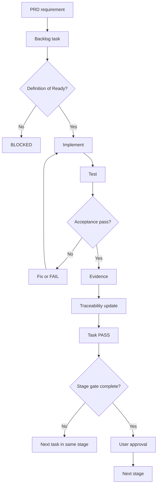
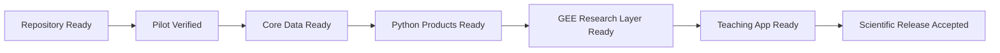
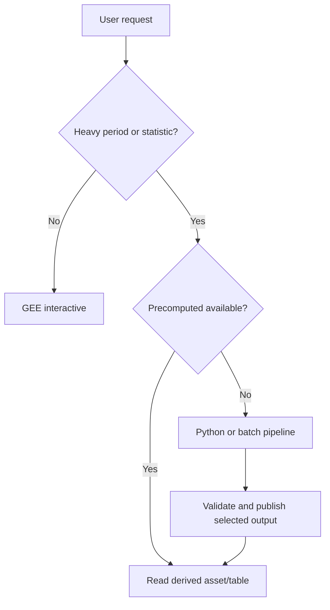
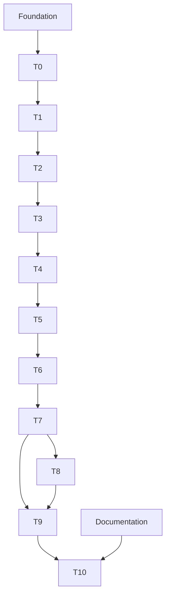

# IMPLEMENTATION_PLAN_AND_BACKLOG.md

# RENCANA IMPLEMENTASI DAN PRODUCT BACKLOG  
## GLORYS12V1 Current Research & Teaching System

**Status:** Rencana kerja normatif untuk Codex  
**Versi:** 1.0  
**Tanggal:** 31 Juli 2026  
**Ruang penggunaan:** Pendidikan dan penelitian nonkomersial  
**Dataset utama:** Copernicus Marine GLORYS12V1  
**Arsitektur:** Hibrida Python/xarray–Google Earth Engine  
**Tahap pembangunan:** Tahap 0–10  
**Dokumen induk:** PRD GLORYS Current Research & Teaching System  
**Instruksi agen:** `AGENTS.md`  
**Dokumen keamanan:** `SETUP_AND_AUTHENTICATION.md` dan `SECURITY_AND_SECRETS.md`  
**Dokumen berikutnya:** `TEST_AND_VALIDATION_PLAN.md`

---

## Daftar isi

1. [Tujuan dokumen](#1-tujuan-dokumen)
2. [Kedudukan dokumen](#2-kedudukan-dokumen)
3. [Sumber kebenaran](#3-sumber-kebenaran)
4. [Interpretasi status](#4-interpretasi-status)
5. [Status baseline saat dokumen dibuat](#5-status-baseline-saat-dokumen-dibuat)
6. [Ruang lingkup implementasi](#6-ruang-lingkup-implementasi)
7. [Non-goals](#7-non-goals)
8. [Prinsip pelaksanaan](#8-prinsip-pelaksanaan)
9. [Strategi delivery](#9-strategi-delivery)
10. [Milestone dan release gate](#10-milestone-dan-release-gate)
11. [Peta dependensi](#11-peta-dependensi)
12. [Peran dan approval](#12-peran-dan-approval)
13. [Definition of Ready](#13-definition-of-ready)
14. [Definition of Done untuk task](#14-definition-of-done-untuk-task)
15. [Definition of Done untuk tahap](#15-definition-of-done-untuk-tahap)
16. [Aturan pengelolaan backlog](#16-aturan-pengelolaan-backlog)
17. [Prioritas](#17-prioritas)
18. [Epic FND — Foundation, governance, dan repository](#18-epic-fnd--foundation-governance-dan-repository)
19. [Epic T0 — Verifikasi sumber data aktif](#19-epic-t0--verifikasi-sumber-data-aktif)
20. [Epic T1 — Konfigurasi metodologi dan arsitektur](#20-epic-t1--konfigurasi-metodologi-dan-arsitektur)
21. [Epic T2 — Pilot end-to-end dan benchmark](#21-epic-t2--pilot-end-to-end-dan-benchmark)
22. [Epic T3 — Otomasi unduhan](#22-epic-t3--otomasi-unduhan)
23. [Epic T4 — Validasi NetCDF skala inti](#23-epic-t4--validasi-netcdf-skala-inti)
24. [Epic T5 — Konversi dan analytics Python](#24-epic-t5--konversi-dan-analytics-python)
25. [Epic T6 — Publikasi aset GEE terpilih](#25-epic-t6--publikasi-aset-gee-terpilih)
26. [Epic T7 — Modul analisis GEE](#26-epic-t7--modul-analisis-gee)
27. [Epic T8 — Visualisasi vektor](#27-epic-t8--visualisasi-vektor)
28. [Epic T9 — GEE App](#28-epic-t9--gee-app)
29. [Epic T10 — Validasi ilmiah dan penerimaan](#29-epic-t10--validasi-ilmiah-dan-penerimaan)
30. [Epic DOC — Dokumentasi pengguna dan pembelajaran](#30-epic-doc--dokumentasi-pengguna-dan-pembelajaran)
31. [Open decisions](#31-open-decisions)
32. [Deferred backlog](#32-deferred-backlog)
33. [Backlog yang dilarang tanpa change control](#33-backlog-yang-dilarang-tanpa-change-control)
34. [Requirement coverage matrix](#34-requirement-coverage-matrix)
35. [Evidence dan struktur laporan](#35-evidence-dan-struktur-laporan)
36. [Workflow Codex per task](#36-workflow-codex-per-task)
37. [Format pembaruan status](#37-format-pembaruan-status)
38. [Change control](#38-change-control)
39. [Risiko delivery](#39-risiko-delivery)
40. [Diagram Mermaid](#40-diagram-mermaid)
41. [Checklist penerimaan dokumen](#41-checklist-penerimaan-dokumen)
42. [Catatan perubahan](#42-catatan-perubahan)

---

## 1. Tujuan dokumen

Dokumen ini menerjemahkan PRD dan panduan Tahap 0–3 menjadi unit pekerjaan yang dapat dikerjakan Codex secara bertahap, diuji, ditelusuri, dan diterima.

Dokumen ini menetapkan:

- epic;
- task ID;
- urutan kerja;
- dependency;
- requirement yang dipenuhi;
- file atau artefak yang dihasilkan;
- test dan bukti;
- acceptance criteria;
- approval gate;
- status awal;
- pekerjaan yang ditunda;
- pekerjaan yang dilarang tanpa perubahan resmi.

Tujuan utamanya adalah mencegah Codex:

- melompati tahap;
- membangun GEE App terlalu awal;
- memproses seluruh data sebelum pilot lulus;
- mengubah keputusan ilmiah tanpa persetujuan;
- menjalankan komputasi berat secara interaktif;
- mengklaim `PASS` hanya berdasarkan keberadaan dokumen atau keberhasilan visual.

---

## 2. Kedudukan dokumen

Hubungan dokumen:

```text
PRD
  ↓
AGENTS.md
  ↓
SETUP_AND_AUTHENTICATION.md
SECURITY_AND_SECRETS.md
  ↓
IMPLEMENTATION_PLAN_AND_BACKLOG.md
  ↓
TEST_AND_VALIDATION_PLAN.md
  ↓
Kode, test, laporan, dan evidence
```

PRD menjelaskan **apa yang harus dibangun**.

`AGENTS.md` menjelaskan **bagaimana Codex harus bekerja**.

Dokumen setup dan security menjelaskan **bagaimana akses dan rahasia dikendalikan**.

Dokumen ini menjelaskan **urutan dan unit pekerjaan yang dikerjakan**.

`TEST_AND_VALIDATION_PLAN.md` akan menjelaskan **bagaimana setiap requirement dibuktikan**.

---

## 3. Sumber kebenaran

Codex wajib membaca:

1. `PRD.md` atau `PRD_GLORYS_Current_Research_Teaching_System.md`;
2. `AGENTS.md`;
3. `SETUP_AND_AUTHENTICATION.md`;
4. `SECURITY_AND_SECRETS.md`;
5. dokumen Tahap 0 v1.1;
6. dokumen Tahap 1 v1.1;
7. dokumen Tahap 2 v1.1;
8. dokumen Tahap 3 v1.1;
9. dokumen ini;
10. `TEST_AND_VALIDATION_PLAN.md` setelah tersedia;
11. ADR terkait;
12. status implementasi dan traceability.

Jika terdapat konflik, gunakan aturan prioritas pada `AGENTS.md`.

---

## 4. Interpretasi status

Status task menggunakan:

```text
NOT_STARTED
IN_PROGRESS
IMPLEMENTED
TESTED
PASS
PASS_WITH_NOTES
BLOCKED
DEFERRED
FAIL
```

### 4.1 Arti status

| Status | Makna |
|---|---|
| `NOT_STARTED` | Belum dikerjakan |
| `IN_PROGRESS` | Sedang dikerjakan |
| `IMPLEMENTED` | Kode/artefak tersedia, test belum lengkap |
| `TESTED` | Test dijalankan, acceptance belum ditutup |
| `PASS` | Semua acceptance criteria dan evidence lengkap |
| `PASS_WITH_NOTES` | Lulus dengan catatan nonkritis |
| `BLOCKED` | Tidak dapat dilanjutkan karena dependency/keputusan |
| `DEFERRED` | Sengaja ditunda dan bukan bagian release aktif |
| `FAIL` | Acceptance criteria kritis gagal |

Untuk komputasi:

```text
PASS_INTERACTIVE
PASS_BATCH
PASS_PYTHON_ONLY
FAIL_REDESIGN_REQUIRED
```

Label komputasi disimpan sebagai evidence tambahan dan tidak menggantikan status task.

### 4.2 Dokumen selesai bukan berarti tahap operasional lulus

Contoh:

- Panduan Tahap 2 tersedia: dokumentasinya dapat `PASS`.
- Pilot GLORYS12V1 asli belum dijalankan: pelaksanaan Tahap 2 tetap `NOT_STARTED`.

Codex dilarang menyamakan dua status tersebut.

---

## 5. Status baseline saat dokumen dibuat

### 5.1 Dokumen baseline

| Artefak | Status dokumen | Status pelaksanaan |
|---|---|---|
| PRD | `PASS` | Tidak berlaku |
| `AGENTS.md` | `PASS` | Harus dipasang di repository |
| `SETUP_AND_AUTHENTICATION.md` | `PASS` | Setup aktual belum dibuktikan |
| `SECURITY_AND_SECRETS.md` | `PASS` | Security audit aktual belum dibuktikan |
| Tahap 0 v1.1 | `PASS` sebagai panduan | Verifikasi aktif belum ditutup |
| Tahap 1 v1.1 | `PASS` sebagai desain | Config implementasi belum dibuat |
| Tahap 2 v1.1 | `PASS` sebagai panduan | Pilot asli belum dijalankan |
| Tahap 3 v1.1 | `PASS` sebagai panduan | Batch unduhan belum dijalankan |
| Dokumen ini | `PASS` setelah review | Backlog belum dieksekusi |
| `TEST_AND_VALIDATION_PLAN.md` | `NOT_STARTED` | `NOT_STARTED` |

### 5.2 Status tahap operasional

| Tahap | Status awal |
|---|---|
| Foundation | `NOT_STARTED` |
| Tahap 0 aktif | `PASS_WITH_NOTES` |
| Tahap 1 implementasi config | `PASS_WITH_NOTES` |
| Tahap 2 pilot data asli | `IN_PROGRESS` |
| Tahap 3 otomasi dan batch | `IN_PROGRESS` |
| Tahap 4 | `NOT_STARTED` |
| Tahap 5 | `NOT_STARTED` |
| Tahap 6 | `NOT_STARTED` |
| Tahap 7 | `NOT_STARTED` |
| Tahap 8 | `NOT_STARTED` |
| Tahap 9 | `NOT_STARTED` |
| Tahap 10 | `NOT_STARTED` |

---

## 6. Ruang lingkup implementasi

Implementasi mencakup:

- repository dan governance;
- konfigurasi ilmiah dan teknis;
- setup dan autentikasi;
- metadata aktif;
- pilot Februari 2020;
- benchmark Python dan GEE;
- unduhan bulanan 2015–2025;
- unduhan harian Januari–Maret 2015–2025;
- validasi NetCDF;
- konversi GeoTIFF;
- analytics Python;
- produk prahitung;
- publikasi aset terpilih;
- modul GEE;
- visualisasi vektor;
- GEE App;
- validasi ilmiah;
- dokumentasi pembelajaran;
- acceptance dan release.

---

## 7. Non-goals

Tidak termasuk release aktif:

- gelombang;
- dataset utama selain GLORYS12V1;
- data harian April–Desember;
- seluruh 50 kedalaman;
- downscaling dinamik;
- model pasang surut;
- backend produksi;
- sistem operasional KKP;
- penggunaan komersial;
- keputusan keselamatan;
- desain struktur;
- automatic public asset sharing;
- service account pada Tahap 0–8;
- Cloud service berbayar yang tidak diperlukan.

---

## 8. Prinsip pelaksanaan

1. Kerjakan satu tahap aktif.
2. Task harus memiliki requirement atau alasan teknis yang disetujui.
3. Kode wajib disertai test.
4. Test sintetis mendahului data asli.
5. Data asli pilot mendahului batch.
6. Validasi mendahului konversi.
7. Konversi tervalidasi mendahului upload.
8. Benchmark mendahului klaim interaktif.
9. Komputasi berat dilakukan di Python atau batch.
10. Produk 11 tahun diprahitungkan.
11. Security gate berlaku pada setiap operasi jaringan dan cloud.
12. `PASS` hanya dengan evidence.
13. Open decision tidak boleh diisi dengan tebakan.
14. Kegagalan kritis memicu fail closed.
15. Dokumentasi dan traceability diperbarui bersama kode.

---

## 9. Strategi delivery

### 9.1 Track A — Governance dan reproducibility

Mencakup:

- repository;
- config;
- security;
- traceability;
- ADR;
- status;
- changelog;
- evidence.

### 9.2 Track B — Data pipeline

Mencakup:

- metadata;
- unduhan;
- validasi;
- konversi;
- checksum;
- inventory;
- provenance.

### 9.3 Track C — Scientific analytics

Mencakup:

- speed;
- mean speed;
- resultan;
- arah;
- persistensi;
- persentil;
- klimatologi;
- anomali;
- current rose;
- tren eksploratif.

### 9.4 Track D — Earth Engine

Mencakup:

- source assets;
- derived assets;
- reader;
- interactive functions;
- exports;
- vector visualization;
- app.

### 9.5 Track E — Teaching dan research documentation

Mencakup:

- installation;
- data guide;
- teaching guide;
- research guide;
- glossary;
- citation;
- limitations.

---

## 10. Milestone dan release gate

### Milestone M0 — Repository Ready

Syarat:

- foundation backlog lulus;
- setup report lulus;
- security review lulus;
- requirement traceability tersedia;
- tests dapat dijalankan.

### Milestone M1 — Pilot Verified

Syarat:

- Tahap 0 aktif lulus;
- Tahap 1 config lulus;
- Tahap 2 pilot asli lulus;
- benchmark classification tersedia.

### Milestone M2 — Core Data Ready

Syarat:

- Tahap 3 lulus;
- 165 NetCDF tersedia;
- 1.125 timestep terhitung;
- Tahap 4 validasi lulus.

### Milestone M3 — Python Products Ready

Syarat:

- Tahap 5 lulus;
- source GeoTIFF tervalidasi;
- produk prahitung tersedia;
- tabel statistik tersedia.

### Milestone M4 — GEE Research Layer Ready

Syarat:

- Tahap 6–8 lulus;
- source/derived assets terpilih;
- fungsi GEE core tervalidasi;
- panah arah lulus.

### Milestone M5 — Teaching App Ready

Syarat:

- Tahap 9 lulus;
- app usability dan accessibility lulus;
- tidak ada komputasi berat pada klik;
- limitations tampil.

### Milestone M6 — Scientific Release Accepted

Syarat:

- Tahap 10 lulus;
- Python–NetCDF–GeoTIFF–GEE konsisten;
- governance lulus;
- dokumentasi lengkap;
- release decision disetujui.

---

## 11. Peta dependensi

```text
FND
 ↓
T0 → T1
      ↓
      T2
      ↓
      T3
      ↓
      T4
      ↓
      T5
      ↓
      T6
      ↓
      T7 → T8
       \   /
        T9
         ↓
        T10

DOC berjalan paralel, tetapi release membutuhkan DOC selesai.
```

Tidak ada tahap data skala penuh yang boleh mendahului T2.

---

## 12. Peran dan approval

| Aktivitas | Pengguna | Codex | Approval |
|---|---:|---:|---|
| Membaca/mengedit kode lokal | Menetapkan | Menjalankan | Sesuai sandbox |
| Login Copernicus | Menjalankan | Tidak | Pengguna |
| OAuth Earth Engine | Menjalankan | Tidak | Pengguna |
| Metadata `describe` | Menyetujui | Menjalankan | Network |
| Subset pilot | Menyetujui | Menjalankan | Network |
| Install dependency | Menyetujui | Menjalankan | Wajib |
| Batch unduhan | Menyetujui | Menjalankan | Wajib |
| Upload aset | Menyetujui | Menjalankan | Wajib |
| Delete aset/data | Menyetujui | Menjalankan | Wajib |
| IAM/billing/API | Menjalankan/review | Tidak otomatis | Wajib |
| Scientific decision | Menyetujui | Menyusun bukti | Wajib |
| Status `PASS` tahap | Menyetujui bukti | Merekomendasikan | Wajib |

---

## 13. Definition of Ready

Task siap dikerjakan jika:

- requirement jelas;
- tahap aktif benar;
- dependency `PASS`;
- input tersedia;
- open decision yang relevan telah ditutup;
- file yang boleh diubah diketahui;
- test plan tersedia;
- acceptance criteria tersedia;
- operasi sensitif telah mendapat approval;
- tidak ada konflik sumber kebenaran;
- tidak ada secret di input;
- rollback atau recovery diketahui jika relevan.

Jika satu syarat kritis tidak terpenuhi, status task menjadi `BLOCKED`.

---

## 14. Definition of Done untuk task

Task selesai jika:

1. implementasi sesuai requirement;
2. perubahan minimum dan terfokus;
3. test relevan ditambahkan;
4. test lulus;
5. lint/type check relevan lulus;
6. security check relevan lulus;
7. dokumentasi diperbarui;
8. traceability diperbarui;
9. changelog diperbarui jika user-facing atau arsitektural;
10. evidence tersimpan;
11. diff direview;
12. tidak ada secret;
13. tidak ada open failure kritis;
14. status dan catatan ditulis;
15. pengguna menyetujui jika task memerlukan acceptance manusia.

---

## 15. Definition of Done untuk tahap

Tahap selesai jika:

- seluruh task P0 dan P1 tahap `PASS`;
- task P2 yang belum selesai berstatus `DEFERRED` dengan alasan;
- acceptance matrix tahap lengkap;
- regression suite lulus;
- security gate lulus;
- evidence index tersedia;
- known limitations tercatat;
- downstream manifest tersedia;
- pengguna menyetujui gate;
- `IMPLEMENTATION_STATUS.md` diperbarui.

---

## 16. Aturan pengelolaan backlog

1. Satu task memiliki satu tujuan utama.
2. Satu task sebaiknya dapat direview secara terpisah.
3. Task yang menyentuh scientific formula harus memiliki test numerik.
4. Task network/cloud tidak digabung dengan refactor tidak terkait.
5. Task delete tidak digabung dengan task create.
6. Bug baru dibuat sebagai task dan regression test.
7. Scope baru membutuhkan PRD change atau ADR.
8. Status tidak diubah menjadi `PASS` oleh Codex tanpa evidence.
9. Blocker tidak boleh disembunyikan dalam notes.
10. Task `DEFERRED` tidak dihitung selesai untuk MVP jika requirement inti.
11. Setiap task harus mencantumkan output dan evidence.
12. WIP maksimum disarankan satu task implementasi utama per sesi Codex.

---

## 17. Prioritas

| Prioritas | Makna |
|---|---|
| P0 | Kritis; tanpa ini tahap tidak dapat lulus |
| P1 | Wajib untuk MVP |
| P2 | Penting tetapi dapat ditunda dengan alasan |
| P3 | Enhancement setelah MVP |

Backlog inti Tahap 0–10 umumnya P0/P1.

---

# 18. Epic FND — Foundation, governance, dan repository

## 18.1 Tujuan

Membuat repository yang aman, reproducible, dapat ditelusuri, dan siap digunakan Codex.

## 18.2 Exit criteria

- M0 lulus;
- setup aktual terbukti;
- security baseline diterapkan;
- tests dapat dijalankan;
- traceability aktif.

## 18.3 Backlog

| Task ID | Pri | Requirement | Pekerjaan | Dependency | Output/evidence | Acceptance | Status |
|---|---:|---|---|---|---|---|---|
| FND-001 | P0 | PRD §19 | Buat struktur repository baseline | — | struktur folder | sesuai PRD; tidak ada data besar di Git | `IMPLEMENTED` |
| FND-002 | P0 | AGENTS | Pasang `AGENTS.md` di root | FND-001 | file root | Codex mendeteksi instruksi | `IMPLEMENTED` |
| FND-003 | P0 | SEC-010 | Buat `.gitignore` aman | FND-001 | `.gitignore` | credential/data patterns terlindungi | `IMPLEMENTED` |
| FND-004 | P0 | FR-CONF-06, SEC-001 | Jalankan baseline secret review | FND-003 | security report | tidak ada secret aktif | `TESTED` |
| FND-005 | P0 | PRD §19 | Buat `pyproject.toml` dan quality tool config | FND-001 | config tooling | command formatter/lint/test terdokumentasi | `IMPLEMENTED` |
| FND-006 | P0 | Reproducibility | Buat `requirements.txt` dan lock | FND-005 | requirements lock | environment dapat direplikasi | `PASS_WITH_NOTES` |
| FND-007 | P0 | Setup | Jalankan setup dan authentication checklist | FND-006 | setup report | status `PASS` | `PASS_WITH_NOTES` |
| FND-008 | P0 | SEC-002–005 | Terapkan user-login, Codex-use | FND-007 | auth evidence aman | Codex tidak menerima secret | `IMPLEMENTED` |
| FND-009 | P0 | GOV-01–03 | Catat tujuan nonkomersial, Project ID, tier | FND-007 | governance record | data aktual tersedia | `PASS_WITH_NOTES` |
| FND-010 | P0 | GOV-04–05 | Siapkan monitoring EECU dan biaya Cloud | FND-009 | monitoring plan | layanan aktif diketahui | `PASS_WITH_NOTES` |
| FND-011 | P0 | PRD §27 | Buat `docs/IMPLEMENTATION_STATUS.md` | FND-001 | status file | seluruh tahap berstatus awal benar | `IMPLEMENTED` |
| FND-012 | P0 | PRD §28 | Buat `docs/REQUIREMENTS_TRACEABILITY.md` | FND-011 | traceability table | semua requirement PRD tercantum | `IMPLEMENTED` |
| FND-013 | P0 | Validation | Buat `TEST_AND_VALIDATION_PLAN.md` | FND-012 | test plan | test ID dan evidence mapping tersedia | `IMPLEMENTED` |
| FND-014 | P1 | ADR-001–010 | Buat ADR baseline dari keputusan PRD | FND-012 | `docs/adr/` | 10 keputusan tercatat | `IMPLEMENTED` |
| FND-015 | P1 | Maintainability | Buat `CHANGELOG.md` | FND-001 | changelog | format perubahan tersedia | `IMPLEMENTED` |
| FND-016 | P1 | Security | Buat script baseline secret check | FND-003 | test/security script | tidak mencetak nilai suspect | `TESTED` |
| FND-017 | P1 | Reproducibility | Buat command runner/Makefile/PowerShell entrypoint | FND-005 | task commands | setup, lint, test dapat dijalankan konsisten | `IMPLEMENTED` |
| FND-018 | P1 | Governance | Buat evidence directory dan naming standard | FND-011 | `outputs/evidence/` spec | bukti dapat ditelusuri | `IMPLEMENTED` |
| FND-019 | P1 | Security | Review GitHub push protection/secret scanning | FND-004 | review record | status fitur dicatat | `PASS_WITH_NOTES` |
| FND-020 | P1 | Documentation | Salin PRD dan Tahap 0–3 versi aktif ke lokasi resmi | FND-001 | docs baseline | versi tidak ambigu | `PASS_WITH_NOTES` |

---

# 19. Epic T0 — Verifikasi sumber data aktif

## 19.1 Tujuan

Menutup Tahap 0 secara operasional menggunakan metadata aktif, bukan hanya dokumentasi.

## 19.2 Requirement utama

```text
FR-META-01 sampai FR-META-05
GOV-01
```

## 19.3 Exit criteria

- metadata snapshot aktif tersedia;
- Product ID dan Dataset ID benar;
- versi/part diketahui;
- seluruh depth dapat diekstrak;
- perubahan material menghasilkan fail closed.

## 19.4 Backlog

| Task ID | Pri | Requirement | Pekerjaan | Dependency | Output/evidence | Acceptance | Status |
|---|---:|---|---|---|---|---|---|
| T0-001 | P0 | FR-META-01 | Implementasi wrapper `describe` produk | FND-007 | product JSON | Product ID cocok | `IMPLEMENTED` |
| T0-002 | P0 | FR-META-01 | Implementasi `describe` dataset harian | T0-001 | daily JSON | Dataset ID dan variabel cocok | `IMPLEMENTED` |
| T0-003 | P0 | FR-META-01 | Implementasi `describe` dataset bulanan | T0-001 | monthly JSON | Dataset ID dan variabel cocok | `IMPLEMENTED` |
| T0-004 | P0 | FR-META-02 | Simpan snapshot metadata versioned | T0-002,T0-003 | snapshot folder | immutable dan timestamped | `PASS_WITH_NOTES` |
| T0-005 | P0 | FR-META-03 | Catat versi Toolbox | FND-006 | environment evidence | versi sesuai lock | `PASS_WITH_NOTES` |
| T0-006 | P0 | FR-META-04 | Ekstrak dataset version dan part | T0-002,T0-003 | metadata summary | nilai tidak kosong atau status eksplisit | `PASS_WITH_NOTES` |
| T0-007 | P0 | Tahap 0 | Ekstrak seluruh 50 depth levels | T0-002 | depth snapshot | count=50; top=0,494025 m dalam toleransi; order positive-down tercatat | `PASS_WITH_NOTES` |
| T0-008 | P0 | FR-META-05 | Implementasi material-change detector | T0-004,T0-006 | comparison report | perubahan kritis menghentikan pipeline | `TESTED` |
| T0-009 | P0 | Tahap 0 | Verifikasi time coverage 2015–2025 | T0-002,T0-003 | coverage report | periode lengkap tersedia | `PASS_WITH_NOTES` |
| T0-010 | P1 | Tahap 0 | Verifikasi unit, grid, format, calendar | T0-002,T0-003 | data dictionary draft | konsisten dengan sumber | `PASS_WITH_NOTES` |
| T0-011 | P1 | GOV-01 | Simpan research-purpose metadata | FND-009 | governance metadata | noncommercial_only=true | `PASS_WITH_NOTES` |
| T0-012 | P0 | Stage gate | Buat laporan Tahap 0 operasional | T0-001..T0-011 | report | keputusan `PASS`/`FAIL` berbukti | `PASS_WITH_NOTES` |

---

# 20. Epic T1 — Konfigurasi metodologi dan arsitektur

## 20.1 Tujuan

Mengubah desain Tahap 1 menjadi konfigurasi terstruktur, tervalidasi, dan dapat digunakan seluruh pipeline.

## 20.2 Requirement utama

```text
FR-CONF-01 sampai FR-CONF-06
```

## 20.3 Exit criteria

- seluruh config terpisah;
- schema tersedia;
- tidak ada secret;
- open scientific parameters tetap eksplisit, bukan ditebak.

## 20.4 Backlog

| Task ID | Pri | Requirement | Pekerjaan | Dependency | Output/evidence | Acceptance | Status |
|---|---:|---|---|---|---|---|---|
| T1-001 | P0 | FR-CONF-01 | Buat schema AOI | FND-005 | JSON schema | validasi west/east/south/north | `PASS_WITH_NOTES` |
| T1-002 | P0 | FR-CONF-02 | Buat schema periode | FND-005 | period config | 2015–2025 dan JFM benar | `PASS_WITH_NOTES` |
| T1-003 | P0 | FR-CONF-03 | Buat config depth | T0-007 | depth config | exact target + tolerance | `PASS_WITH_NOTES` |
| T1-004 | P0 | FR-CONF-04 | Buat config threshold dan speed bins | FND-005 | statistics config, ADR-011 | literal threshold list tetap kosong karena global AOI P90 diturunkan; metode/scope/bin/QC tervalidasi | `PASS_WITH_NOTES` |
| T1-005 | P0 | FR-CONF-05 | Buat config Project ID dan asset root | FND-009 | local example config | tidak memuat credential | `PASS_WITH_NOTES` |
| T1-006 | P0 | FR-CONF-06 | Validasi tidak ada secret pada config | T1-001..T1-005 | security test | pattern secret gagal validation | `TESTED` |
| T1-007 | P0 | Methodology | Implementasi config loader typed | T1-001..T1-005 | Python module | error jelas dan fail closed | `PASS_WITH_NOTES` |
| T1-008 | P0 | Methodology | Implementasi scientific constants | T0-012 | constants, formula, and statistics modules | Product/dataset/formula/statistic semantics tidak tersebar | `TESTED` |
| T1-009 | P1 | Methodology | Buat data dictionary | T0-010,T1-008 | `docs/data_dictionary.md` | unit, dims, labels jelas | `PASS_WITH_NOTES` |
| T1-010 | P1 | Architecture | Buat architecture manifest | T1-007 | manifest | Python/GEE responsibility jelas | `PASS_WITH_NOTES` |
| T1-011 | P1 | Guardrail | Buat interactive limits config | FND-013 | limits config | nilai default konservatif dan benchmarkable | `PASS_WITH_NOTES` |
| T1-012 | P0 | Stage gate | Buat laporan implementasi Tahap 1 | T1-001..T1-011 | report | config dan schema `PASS` | `PASS_WITH_NOTES` |

---

# 21. Epic T2 — Pilot end-to-end dan benchmark

## 21.1 Tujuan

Menguji satu bulan GLORYS12V1 asli dari metadata hingga GEE, sekaligus mengklasifikasikan beban komputasi.

## 21.2 Periode pilot

```text
1–29 Februari 2020
```

## 21.3 Requirement utama

```text
FR-VAL-01 sampai FR-VAL-09
FR-CONV-01 sampai FR-CONV-07
FR-GEE-01 sampai FR-GEE-07
Benchmark B1–B6
```

## 21.4 Exit criteria

- 29 timestep asli;
- NetCDF valid;
- 29 GeoTIFF cocok;
- sampel GEE cocok;
- test arah lulus;
- benchmark classification tersedia;
- AOI dan tolerance terdokumentasi.

## 21.5 Backlog

| Task ID | Pri | Requirement | Pekerjaan | Dependency | Output/evidence | Acceptance | Status |
|---|---:|---|---|---|---|---|---|
| T2-001 | P0 | Setup | Tetapkan AOI pilot terdokumentasi | T1-001 | AOI config | sumber batas dan ID tersedia | `PASS_WITH_NOTES` |
| T2-002 | P0 | FR-META-01 | Jalankan metadata preflight pilot | T0-012,T2-001 | preflight report | metadata konsisten | `PASS_WITH_NOTES` |
| T2-003 | P0 | Pilot | Dry run subset Februari 2020 | T2-002 | request plan | 29 hari dan depth benar | `PASS_WITH_NOTES` |
| T2-004 | P0 | Pilot | Unduh NetCDF pilot asli | T2-003 | raw NetCDF | file dapat dibuka | `PASS_WITH_NOTES` |
| T2-005 | P0 | FR-VAL-01,02 | Validasi `uo`, `vo`, dan unit | T2-004 | validation JSON | band/unit benar | `PASS_WITH_NOTES` |
| T2-006 | P0 | FR-VAL-03 | Validasi depth | T2-004 | depth evidence | 0,494025 m dalam toleransi 1e-6 | `PASS_WITH_NOTES` |
| T2-007 | P0 | FR-VAL-04 | Validasi 29 timestamp | T2-004 | time report | count=29; tanggal benar | `PASS_WITH_NOTES` |
| T2-008 | P0 | FR-VAL-05 | Validasi mask dan valid pixels | T2-004 | mask report | daratan bukan nol buatan | `PASS_WITH_NOTES` |
| T2-009 | P0 | FR-VAL-06 | Validasi orientasi latitude | T2-004 | coordinate report | transform output benar | `PASS_WITH_NOTES` |
| T2-010 | P0 | FR-VAL-07 | Bandingkan raw vs CF-decoded | T2-004 | encoding report | scale/offset tidak ganda | `PASS_WITH_NOTES` |
| T2-011 | P0 | FR-VAL-08 | Pemeriksaan nilai tidak masuk akal | T2-005 | range report | tidak ada sentinel sebagai data valid | `PASS_WITH_NOTES` |
| T2-012 | P0 | FR-CONV-01..06 | Konversi 29 GeoTIFF dua-band | T2-005..T2-010 | 29 TIFF | float32, mask, CRS, metadata benar | `PASS_WITH_NOTES` |
| T2-013 | P0 | FR-CONV-07 | Validasi NetCDF–GeoTIFF | T2-012 | comparison CSV | 29/29 dalam abs tolerance 1e-6 | `PASS_WITH_NOTES` |
| T2-014 | P0 | FR-GEE-01 | Buat/upload/normalisasi 29 aset pilot | T2-013 | asset IDs | band/time/mask terbaca untuk seluruh pilot | `PASS_WITH_NOTES` |
| T2-015 | P0 | FR-GEE-02..06 | Uji filter, statistik AOI ringan, dan reference-point comparison | T2-014 | GEE report | nilai referensi cocok Python dalam toleransi; mask konsisten | `PASS_WITH_NOTES` |
| T2-016 | P0 | FR-VEC-01,02 | Uji arah kardinal Python dan GEE | T2-014 | test result | 0/90/180/270 tepat | `PASS_WITH_NOTES` |
| T2-017 | P0 | B1 | Benchmark 29 hari interaktif | T2-015 | benchmark row | klasifikasi tersedia | `PASS_WITH_NOTES` |
| T2-018 | P0 | B2 | Benchmark satu JFM | T2-017 | benchmark row | interactive/batch/Python-only | `NOT_STARTED` |
| T2-019 | P0 | B3 | Benchmark 993 hari batch/Python | T2-018 | benchmark row | tidak dipaksakan interaktif | `NOT_STARTED` |
| T2-020 | P1 | B4 | Benchmark produk 11 tahun prahitung | T2-019 | benchmark row | tampil tanpa perhitungan ulang | `NOT_STARTED` |
| T2-021 | P1 | B5 | Benchmark combined reducer | T2-017 | comparison | lebih efisien/hasil setara | `NOT_STARTED` |
| T2-022 | P1 | B6 | Benchmark batch table export | T2-018 | task evidence | hasil dapat diekspor | `NOT_STARTED` |
| T2-023 | P1 | Performance | Uji `tileScale` 1,2,4 | T2-017 | benchmark matrix | konfigurasi terbaik tercatat | `NOT_STARTED` |
| T2-024 | P1 | Performance | Uji `parallelScale` jika relevan | T2-018 | benchmark matrix | kebutuhan tercatat | `NOT_STARTED` |
| T2-025 | P0 | FR-VAL-09 | Buat laporan pilot PASS/FAIL | T2-001..T2-024 | Stage 2 report | semua P0 lulus | `NOT_STARTED` |

---

# 22. Epic T3 — Otomasi unduhan

## 22.1 Tujuan

Menghasilkan pipeline unduhan yang resumable dan auditable untuk 165 file NetCDF inti.

## 22.2 Requirement utama

```text
FR-DL-01 sampai FR-DL-09
FR-META-02 sampai FR-META-05
```

## 22.3 Exit criteria

- 132 bulanan;
- 33 paket harian JFM;
- 1.125 timestep;
- inventory, checksum, retry, resume, quarantine lulus;
- daily full tetap nonaktif.

## 22.4 Backlog

| Task ID | Pri | Requirement | Pekerjaan | Dependency | Output/evidence | Acceptance | Status |
|---|---:|---|---|---|---|---|---|
| T3-001 | P0 | FR-DL-08 | Implementasi dry-run plan | T2-025 | plan output | request tanpa download | `PASS_WITH_NOTES` |
| T3-002 | P0 | FR-DL-01 | Builder 132 job bulanan | T1-002 | plan CSV | count=132 | `PASS_WITH_NOTES` |
| T3-003 | P0 | FR-DL-02 | Builder 33 job JFM | T1-002 | plan CSV | count=33; timesteps=993 | `PASS_WITH_NOTES` |
| T3-004 | P0 | FR-DL-05 | Inventory SQLite schema | FND-005 | `python/inventory.py`, unit tests, evidence | transaksi dan status valid | `PASS_WITH_NOTES` |
| T3-005 | P0 | FR-DL-05 | Ekspor inventory CSV | T3-004 | `python/inventory.py`, unit tests, evidence | konsisten dengan SQLite | `PASS_WITH_NOTES` |
| T3-006 | P0 | FR-DL-03 | Retry classifier | T3-004 | `python/retry_classifier.py`, unit tests, evidence | retryable vs permanent benar; unknown fail-closed | `PASS_WITH_NOTES` |
| T3-007 | P0 | FR-DL-03 | Exponential backoff | T3-006 | `python/retry_backoff.py`, unit tests, evidence | delay 10/30/90/270; max attempts dibatasi | `PASS_WITH_NOTES` |
| T3-008 | P0 | FR-DL-04 | Resume dari inventory | T3-004 | `python/resume.py`, unit tests, evidence | job selesai tidak diulang; pending/retry terpilah | `PASS_WITH_NOTES` |
| T3-009 | P0 | FR-DL-06 | SHA-256 generator | FND-005 | `python/checksum.py`, unit tests, evidence | manifest SHA-256 lengkap dan stabil | `PASS_WITH_NOTES` |
| T3-010 | P0 | FR-DL-07 | Quarantine manager | T3-004 | `python/quarantine.py`, unit tests, evidence | file invalid dipindah atomik; reason JSON; no overwrite | `PASS_WITH_NOTES` |
| T3-011 | P0 | FR-DL-09 | Guard daily full disabled | T1-007 | `python/02_build_download_plan.py`, unit tests, evidence | aktivasi tanpa approval gagal; tidak ada plan/output | `PASS_WITH_NOTES` |
| T3-012 | P0 | FR-META-04,05 | Pin version/part pada batch | T0-008 | `python/dataset_pin.py`, manifest, unit tests, evidence | perubahan tengah batch menghentikan proses | `PASS_WITH_NOTES` |
| T3-013 | P0 | Security | Sanitasi log unduhan | FND-016 | `python/log_sanitizer.py`, unit tests, evidence | tidak ada secret | `PASS_WITH_NOTES` |
| T3-014 | P0 | FR-DL-01 | Jalankan batch bulanan | T3-001..T3-013 | 132 NetCDF | seluruh job status valid | `PASS_WITH_NOTES` |
| T3-015 | P0 | FR-DL-02 | Jalankan batch JFM | T3-001..T3-013 | 33 NetCDF | 993 timestep | `PASS_WITH_NOTES` |
| T3-016 | P0 | Pipeline | Rekonsiliasi filesystem–inventory | T3-014,T3-015 | `outputs/evidence/stage_3/T3-016_inventory_reconciliation.result.txt` | 165 file terhitung | `PASS_WITH_NOTES` |
| T3-017 | P0 | Stage gate | Laporan Tahap 3 | T3-014..T3-016 | `outputs/evidence/stage_3/T3-017_stage3_gate.result.txt` | `PASS_WITH_NOTES` berbukti | `PASS_WITH_NOTES` |

---

# 23. Epic T4 — Validasi NetCDF skala inti

## 23.1 Tujuan

Memvalidasi seluruh 165 NetCDF secara mendalam dan menghasilkan dataset yang siap untuk analytics/konversi.

## 23.2 Requirement utama

```text
FR-VAL-01 sampai FR-VAL-09
```

## 23.3 Exit criteria

- seluruh file memperoleh status;
- tidak ada file invalid dalam validated set;
- laporan per file dan summary tersedia;
- queue downstream hanya berisi file `PASS`.

## 23.4 Backlog

| Task ID | Pri | Requirement | Pekerjaan | Dependency | Output/evidence | Acceptance | Status |
|---|---:|---|---|---|---|---|---|
| T4-001 | P0 | FR-VAL-01 | Validator variabel dan dimensi | T3-017 | report per file | `uo`,`vo` dan dims benar | `PASS_WITH_NOTES` |
| T4-002 | P0 | FR-VAL-02 | Validator unit | T3-017 | report | unit m/s | `PASS_WITH_NOTES` |
| T4-003 | P0 | FR-VAL-03 | Validator depth | T3-017 | report | target depth tepat | `PASS_WITH_NOTES` |
| T4-004 | P0 | FR-VAL-04 | Validator waktu dan kalender | T3-017 | report | timestamp/count benar | `PASS_WITH_NOTES` |
| T4-005 | P0 | FR-VAL-05 | Validator mask dan fill | T3-017 | report | fill tidak menjadi nol | `PASS_WITH_NOTES` |
| T4-006 | P0 | FR-VAL-06 | Validator coordinate orientation | T3-017 | report | latitude/longitude konsisten | `PASS_WITH_NOTES` |
| T4-007 | P0 | FR-VAL-07 | Validator raw/decoded encoding | T3-017 | report | tidak ada double scale | `PASS_WITH_NOTES` |
| T4-008 | P0 | FR-VAL-08 | Plausibility checks | T4-001..T4-007 | anomaly list | flag tanpa silent correction | `PASS_WITH_NOTES` |
| T4-009 | P0 | Data quality | Valid pixel count dan coverage | T4-005 | coverage table | count/percentage tercatat | `PASS_WITH_NOTES` |
| T4-010 | P0 | Data quality | Konsistensi `uo`–`vo` mask/time/grid | T4-001..T4-006 | comparison | dimensi/coords identik | `PASS_WITH_NOTES` |
| T4-011 | P1 | Data quality | Distribusi per file dan periode | T4-008 | QC tables | perubahan ekstrem terflag | `PASS_WITH_NOTES` |
| T4-012 | P0 | Pipeline | Buat validated manifest | T4-001..T4-011 | `outputs/manifests/stage_4_validated_manifest.json` | hanya PASS masuk downstream | `PASS_WITH_NOTES` |
| T4-013 | P0 | FR-VAL-09 | Laporan PASS/FAIL per file | T4-012 | `outputs/evidence/stage_4/T4-013_validation_report.result.txt` | semua 165 tercakup | `PASS_WITH_NOTES` |
| T4-014 | P0 | Stage gate | Laporan Tahap 4 | T4-013 | `outputs/evidence/stage_4/T4-014_stage4_gate.result.txt` | tidak ada blocker kritis | `PASS_WITH_NOTES` |

---

# 24. Epic T5 — Konversi dan analytics Python

## 24.1 Tujuan

Menghasilkan source GeoTIFF yang identik secara numerik serta produk analytics berat yang diprahitungkan.

## 24.2 Requirement utama

```text
FR-CONV-01 sampai FR-CONV-07
FR-PY-01 sampai FR-PY-17
```

## 24.3 Exit criteria

- source TIFF valid;
- formula numerik lulus;
- produk prahitung dan tabel tersedia;
- semua output memiliki provenance;
- statistik berat tidak bergantung pada interaksi GEE.

## 24.4 Backlog konversi

| Task ID | Pri | Requirement | Pekerjaan | Dependency | Output/evidence | Acceptance | Status |
|---|---:|---|---|---|---|---|---|
| T5-001 | P0 | FR-CONV-01 | Writer float32 | T4-014 | module/test | dtype float32 | `PASS_WITH_NOTES` |
| T5-002 | P0 | FR-CONV-02 | Writer dua band `uo`,`vo` | T5-001 | sample TIFF | order/name benar | `PASS_WITH_NOTES` |
| T5-003 | P0 | FR-CONV-03 | Preserve mask/NoData | T5-001 | mask test | mask cocok NetCDF | `PASS_WITH_NOTES` |
| T5-004 | P0 | FR-CONV-04 | CRS dan affine transform | T4-006 | metadata test | lokasi/orientasi benar | `PASS_WITH_NOTES` |
| T5-005 | P0 | FR-CONV-05 | Guard tanpa resampling | T5-004 | test | tidak ada resampling diam-diam | `PASS_WITH_NOTES` |
| T5-006 | P0 | FR-CONV-06 | Metadata timestep/provenance | T4-012 | metadata | waktu dan source checksum lengkap | `PASS_WITH_NOTES` |
| T5-007 | P0 | FR-CONV-07 | Comparator NetCDF–GeoTIFF | T5-002..T5-006 | JSON comparison report | seluruh timestep dalam toleransi | `PASS_WITH_NOTES` |
| T5-008 | P0 | Conversion | Konversi source collection inti | T5-007 | `outputs/manifests/stage_5_conversion_manifest.json`, audit, comparator | 165 job dan 1.125 output terinventaris, checksum/provenance lengkap | `PASS_WITH_NOTES` |

## 24.5 Backlog analytics Python

| Task ID | Pri | Requirement | Pekerjaan | Dependency | Output/evidence | Acceptance | Status |
|---|---:|---|---|---|---|---|---|
| T5-009 | P0 | FR-PY-01 | Implementasi speed | T4-014 | `python/analytics.py`, tests | formula hypot(uo,vo), joint mask | `PASS_WITH_NOTES` |
| T5-010 | P0 | FR-PY-02 | Implementasi mean speed | T5-009 | `python/analytics.py`, timestep table | mean scalar speed dipisahkan dari resultant speed | `PASS_WITH_NOTES` |
| T5-011 | P0 | FR-PY-03 | Mean `u` dan `v` | T4-014 | `python/analytics.py`, timestep table | paired valid-count aware | `PASS_WITH_NOTES` |
| T5-012 | P0 | FR-PY-04 | Resultant speed | T5-011 | `python/analytics.py`, tests | hypot(mean_u,mean_v) | `PASS_WITH_NOTES` |
| T5-013 | P0 | FR-PY-05 | Resultant direction | T5-011 | `python/analytics.py`, tests | toward-bearing clockwise from north; cardinal cases | `PASS_WITH_NOTES` |
| T5-014 | P0 | FR-PY-06 | Persistence | T5-010,T5-012 | `python/analytics.py`, timestep table | resultant/mean speed; zero denominator explicit | `PASS_WITH_NOTES` |
| T5-015 | P0 | FR-PY-07 | Min/max/median/SD/variance | T5-009 | `python/common/descriptive_statistics.py`, timestep table | ddof=0 baseline recorded; temporal labels retained | `PASS_WITH_NOTES` |
| T5-016 | P0 | FR-PY-08 | P10–P99 | T5-009 | `python/common/descriptive_statistics.py`, timestep table | linear method recorded explicitly | `PASS_WITH_NOTES` |
| T5-017 | P1 | FR-PY-09 | Threshold exceedance | T1-004,T5-009,T5-011,T5-012,T5-016 | `data/validated/stage5_analytics/tables/threshold_exceedance.csv`, `config/statistics.json` | Global AOI P90 per analysis plan; `>`; valid-area QC 0,95; missing timesteps recorded | `PASS_WITH_NOTES` |
| T5-018 | P0 | FR-PY-10 | Direction sectors 16 arah | T5-013 | `python/analytics.py`, tests | 16 toward sectors with north wrap and zero-vector exclusion | `PASS_WITH_NOTES` |
| T5-019 | P1 | FR-PY-11 | Current rose | T5-017,T5-018 | `data/validated/stage5_analytics/tables/current_rose_long.csv`, `data/validated/stage5_analytics/tables/current_rose_summary.csv`, `data/validated/stage5_analytics/figures/current_rose_*.svg` | AOI output; 16 towards sectors; global P25/P50/P75/P90 bins; zero/missing and sparse classes recorded; zones pending valid geometry | `PASS_WITH_NOTES` |
| T5-020 | P0 | FR-PY-12 | Monthly climatology | T5-009..T5-014 | `data/validated/stage5_analytics/climatology`, analytics manifest, `outputs/manifests/stage_5_wp4_audit.json` | 12 monthly speed climatologies, reference 2015–2025, 11 equal monthly frames per month | `PASS_WITH_NOTES` |
| T5-021 | P0 | FR-PY-13 | JFM climatology | T5-009..T5-014 | `data/validated/stage5_analytics/climatology/jfm_speed.tif`, analytics manifest, `outputs/manifests/stage_5_wp4_audit.json` | 993 daily frames, equal-daily weighting recorded | `PASS_WITH_NOTES` |
| T5-022 | P0 | FR-PY-14 | Anomalies | T5-020,T5-021 | `data/validated/stage5_analytics/anomaly`, analytics manifest, `outputs/manifests/stage_5_wp4_audit.json` | 1,125 speed anomalies, reference period and baseline explicit per plan | `PASS_WITH_NOTES` |
| T5-023 | P2 | FR-PY-15 | Trend exploration | T5-020,T5-021 | `data/validated/stage5_analytics/trend`, analytics manifest, `outputs/manifests/stage_5_wp4_audit.json` | exploratory OLS slope only; no inferential/causal claim | `PASS_WITH_NOTES` |
| T5-024 | P0 | FR-PY-16 | Zonal tables | T2-001,T5-009..T5-016 | `data/validated/stage5_analytics/tables/timestep_speed_statistics.csv` | 1,125 rows with valid count and approximate bbox area | `PASS_WITH_NOTES` |
| T5-025 | P0 | FR-PY-17 | Precomputed raster products | T5-010..T5-024 | analytics manifest/audit | 2,264 derived rasters plus 2 auditable static masks, with metadata/checksums | `PASS_WITH_NOTES` |
| T5-026 | P0 | Provenance | Product manifest dan checksums | T5-008,T5-025 | `outputs/manifests/stage_5_analytics_manifest.json`, `outputs/manifests/stage_5_analytics_audit.json` | all derived products and table traceable | `PASS_WITH_NOTES` |
| T5-027 | P0 | Stage gate | Laporan Tahap 5 | T5-001..T5-026 | `outputs/evidence/stage_5/WP5-3_analytics.result.txt`, `outputs/evidence/stage_5/WP5-4_climatology_anomaly_trend.result.txt` | executable analytics and WP5-4 acceptance audit PASS_WITH_NOTES; AOI products complete; zone products await geometry | `PASS_WITH_NOTES` |

## 24.6 Work package WP5-5 — Rekonsiliasi dan transition gate

WP5-5 adalah pekerjaan administratif dan reproducibility closeout. Work package
ini tidak mengubah rumus, threshold, dataset, AOI, mask, atau keputusan ilmiah.

| Task ID | Pri | Requirement | Pekerjaan | Dependency | Output/evidence | Acceptance | Status |
|---|---:|---|---|---|---|---|---|
| T5-028 | P0 | M0 governance, traceability, Definition of Done | Rekonsiliasi status backlog, evidence, checklist, environment test, dan artefak Graphify; definisikan gate transisi berikutnya | T5-027 | `docs/audits/WP5-5_STATUS_RECONCILIATION.md` | status sumber konsisten, command/exit/evidence/limitations tercatat, blocker tetap fail-closed | `IN_PROGRESS` |

---

# 25. Epic T6 — Publikasi aset GEE terpilih

## 25.1 Tujuan

Mengunggah hanya aset yang dibutuhkan untuk pendidikan, penelitian, dan App, dengan metadata lengkap dan kontrol akses.

## 25.2 Exit criteria

- source sample dan collection tervalidasi;
- derived products terpilih;
- inventory GEE lengkap;
- asset private default;
- tidak ada upload berlebih.

## 25.3 Backlog

| Task ID | Pri | Requirement | Pekerjaan | Dependency | Output/evidence | Acceptance | Status |
|---|---:|---|---|---|---|---|---|
| T6-001 | P0 | Governance | Review Project ID, tier, IAM | FND-009,T5-027 | review | project benar | `NOT_STARTED` |
| T6-002 | P0 | Model data | Finalisasi asset schema source | T5-006 | schema | seluruh properti PRD tersedia | `NOT_STARTED` |
| T6-003 | P0 | Model data | Finalisasi asset schema derived | T5-025 | schema | derivation metadata lengkap | `NOT_STARTED` |
| T6-004 | P0 | Upload | Generate manifest sampel | T6-002 | manifests | valid secara sintaks | `NOT_STARTED` |
| T6-005 | P0 | Upload | Upload sampel terkontrol | T6-001,T6-004 | sample assets | approval dan task success | `NOT_STARTED` |
| T6-006 | P0 | Validation | Validasi band/time/mask/projection sampel | T6-005 | GEE report | cocok sumber | `NOT_STARTED` |
| T6-007 | P0 | Publish-on-demand | Pilih daftar source assets inti | T5-026,T6-006 | publish manifest | alasan setiap aset | `NOT_STARTED` |
| T6-008 | P0 | Publish-on-demand | Pilih derived products untuk GEE | T5-025,T6-006 | publish manifest | hanya produk kebutuhan | `NOT_STARTED` |
| T6-009 | P0 | Upload | Batch upload source terpilih | T6-007 | assets/inventory | task status lengkap | `NOT_STARTED` |
| T6-010 | P0 | Upload | Batch upload derived terpilih | T6-008 | assets/inventory | metadata lengkap | `NOT_STARTED` |
| T6-011 | P0 | Validation | Rekonsiliasi local–GEE checksum/metadata | T6-009,T6-010 | report | jumlah dan metadata cocok | `NOT_STARTED` |
| T6-012 | P0 | Security | Review ACL private default | T6-009,T6-010 | ACL report | tidak public tanpa approval | `NOT_STARTED` |
| T6-013 | P1 | Operations | Retry/resume upload tasks | T6-009 | tests/log | failure recoverable | `NOT_STARTED` |
| T6-014 | P0 | Stage gate | Laporan Tahap 6 | T6-001..T6-013 | final report | asset set `PASS` | `NOT_STARTED` |

---

# 26. Epic T7 — Modul analisis GEE

## 26.1 Tujuan

Membangun modul GEE yang aman memori, modular, dan menggunakan produk prahitung untuk periode berat.

## 26.2 Requirement utama

```text
FR-GEE-01 sampai FR-GEE-11
```

## 26.3 Exit criteria

- fungsi source reader;
- filter;
- statistik ringan;
- precomputed reader;
- exports;
- metadata/limitations;
- benchmark tanpa memory error pada fitur supported.

## 26.4 Backlog

| Task ID | Pri | Requirement | Pekerjaan | Dependency | Output/evidence | Acceptance | Status |
|---|---:|---|---|---|---|---|---|
| T7-001 | P0 | FR-GEE-01 | Source collection reader | T6-014 | JS module | band/property tervalidasi | `NOT_STARTED` |
| T7-002 | P0 | FR-GEE-02 | Filter tanggal/AOI | T7-001 | tests | exclusive end benar | `NOT_STARTED` |
| T7-003 | P0 | FR-GEE-03 | Speed periode terbatas | T7-002 | tests | cocok Python | `NOT_STARTED` |
| T7-004 | P0 | FR-GEE-04 | Mean `u`,`v`,speed | T7-003 | tests | label terpisah | `NOT_STARTED` |
| T7-005 | P0 | FR-GEE-05 | Resultant dan persistence | T7-004 | tests | cocok Python | `NOT_STARTED` |
| T7-006 | P0 | FR-GEE-06 | Statistik AOI ringan | T7-003..T7-005 | tests/benchmark | within supported limits | `NOT_STARTED` |
| T7-007 | P0 | FR-GEE-07 | Derived/precomputed reader | T6-010 | JS module | 11 tahun tanpa recompute | `NOT_STARTED` |
| T7-008 | P0 | FR-GEE-08 | GeoTIFF export helper | T7-002 | task test | metadata/scale benar | `NOT_STARTED` |
| T7-009 | P0 | FR-GEE-09 | CSV export helper | T7-006 | task test | tabel terlabel | `NOT_STARTED` |
| T7-010 | P0 | FR-GEE-10 | Metadata panel data model | T6-002,T6-003 | dictionary | source/derived jelas | `NOT_STARTED` |
| T7-011 | P0 | FR-GEE-11 | Limitations content module | PRD | JS/text | tampil dan konsisten | `NOT_STARTED` |
| T7-012 | P0 | Guardrail | Linter/check pola terlarang | FND-013 | static check | toArray/toBands/list besar terdeteksi | `NOT_STARTED` |
| T7-013 | P1 | Performance | Combined reducer utilities | T2-021 | JS module | hasil sama, kerja lebih sedikit | `NOT_STARTED` |
| T7-014 | P1 | Performance | `tileScale` configurable | T2-023 | config/module | default dari benchmark | `NOT_STARTED` |
| T7-015 | P1 | Performance | `parallelScale` configurable | T2-024 | config/module | hanya jika relevan | `NOT_STARTED` |
| T7-016 | P0 | Stage gate | Laporan Tahap 7 | T7-001..T7-015 | report | supported features tanpa memory error | `NOT_STARTED` |

---

# 27. Epic T8 — Visualisasi vektor

## 27.1 Tujuan

Menampilkan arah arus secara benar, tidak terlalu padat, dan tidak menyesatkan resolusi.

## 27.2 Requirement utama

```text
FR-VEC-01 sampai FR-VEC-07
```

## 27.3 Backlog

| Task ID | Pri | Requirement | Pekerjaan | Dependency | Output/evidence | Acceptance | Status |
|---|---:|---|---|---|---|---|---|
| T8-001 | P0 | FR-VEC-01 | Test kardinal GEE | T7-005 | test | 0/90/180/270 | `NOT_STARTED` |
| T8-002 | P0 | FR-VEC-02 | Implementasi arah menuju | T8-001 | JS module | convention metadata | `NOT_STARTED` |
| T8-003 | P0 | FR-VEC-03 | Sampling grid | T7-002 | module | density configurable | `NOT_STARTED` |
| T8-004 | P0 | FR-VEC-04 | Panah normalized | T8-002,T8-003 | layer | arah terlihat tanpa klaim magnitude | `NOT_STARTED` |
| T8-005 | P0 | FR-VEC-05 | Panah scaled by speed | T8-002,T8-003 | layer | scale/limit terdokumentasi | `NOT_STARTED` |
| T8-006 | P0 | FR-VEC-06 | Legenda arah dan magnitude | T8-004,T8-005 | UI component | unit dan convention jelas | `NOT_STARTED` |
| T8-007 | P0 | FR-VEC-07 | Resolution disclaimer | T8-006 | UI text | native resolution ditampilkan | `NOT_STARTED` |
| T8-008 | P1 | Visual QA | Uji empat kuadran dan zero vector | T8-004,T8-005 | screenshots/test | hasil benar | `NOT_STARTED` |
| T8-009 | P1 | Performance | Benchmark density vektor | T8-003 | benchmark | default tidak timeout | `NOT_STARTED` |
| T8-010 | P0 | Stage gate | Laporan Tahap 8 | T8-001..T8-009 | report | vector visualization `PASS` | `NOT_STARTED` |

---

# 28. Epic T9 — GEE App

## 28.1 Tujuan

Membangun aplikasi sederhana untuk dosen, peneliti, dan mahasiswa tanpa mengorbankan metode ilmiah.

## 28.2 Mode

- Teaching Mode;
- Research Exploration Mode.

Tidak ada mode operasional.

## 28.3 Exit criteria

- UI lengkap;
- aplikasi membaca produk prahitung untuk periode berat;
- interaksi supported tidak memory error;
- accessibility dan limitations lulus;
- export guidance jelas.

## 28.4 Backlog

| Task ID | Pri | Requirement | Pekerjaan | Dependency | Output/evidence | Acceptance | Status |
|---|---:|---|---|---|---|---|---|
| T9-001 | P0 | App | App shell dan layout | T7-016,T8-010 | JS app | panel modular | `NOT_STARTED` |
| T9-002 | P0 | App | Teaching Mode | T9-001 | mode | istilah dijelaskan | `NOT_STARTED` |
| T9-003 | P0 | App | Research Exploration Mode | T9-001 | mode | output lebih rinci | `NOT_STARTED` |
| T9-004 | P0 | App | Mode/period/year/month/JFM selectors | T9-001 | controls | input tervalidasi | `NOT_STARTED` |
| T9-005 | P0 | FR-CONF-01 | AOI draw/select | T9-001 | control | satu AOI aktif | `NOT_STARTED` |
| T9-006 | P0 | App | Layer selector | T7-007,T8-004 | control | source/derived terlabel | `NOT_STARTED` |
| T9-007 | P0 | App | Legend panel | T8-006 | panel | unit/scale jelas | `NOT_STARTED` |
| T9-008 | P0 | App | Statistics panel | T7-006,T7-007 | panel | mean/resultant tidak tercampur | `NOT_STARTED` |
| T9-009 | P0 | App | Chart panel | T5 tables,T7-009 | panel | periode dan unit jelas | `NOT_STARTED` |
| T9-010 | P0 | FR-GEE-10 | Metadata panel | T7-010 | panel | product/dataset/depth/time | `NOT_STARTED` |
| T9-011 | P0 | FR-GEE-11 | Limitations panel | T7-011 | panel | selalu dapat diakses | `NOT_STARTED` |
| T9-012 | P0 | App | Export guidance | T7-008,T7-009 | panel | bedakan interactive/batch | `NOT_STARTED` |
| T9-013 | P1 | App | Reset state | T9-004..T9-012 | control | kembali default aman | `NOT_STARTED` |
| T9-014 | P0 | Performance | Route periode berat ke precomputed | T7-007,T9-004 | logic test | 11 tahun tidak recompute | `NOT_STARTED` |
| T9-015 | P0 | Performance | Enforce interactive limits | T1-011,T9-004 | guard | input di luar batas ditolak/diarahkan | `NOT_STARTED` |
| T9-016 | P0 | Accessibility | Keyboard/text/contrast review | T9-001..T9-013 | review | warna bukan satu-satunya pembeda | `NOT_STARTED` |
| T9-017 | P0 | Usability | Uji dosen pemula berbasis skenario | DOC draft,T9-016 | test report | task utama dapat diselesaikan | `NOT_STARTED` |
| T9-018 | P0 | Governance | Noncommercial/research notice | GOV-01,GOV-06 | app text | tidak ada klaim operasional | `NOT_STARTED` |
| T9-019 | P0 | Security | Review App publishing permissions | T6-012 | IAM review | minimum role | `NOT_STARTED` |
| T9-020 | P0 | Stage gate | Laporan Tahap 9 | T9-001..T9-019 | report | App `PASS` | `NOT_STARTED` |

---

# 29. Epic T10 — Validasi ilmiah dan penerimaan

## 29.1 Tujuan

Membuktikan bahwa sistem benar secara numerik, metodologis, performa, keamanan, governance, dan pembelajaran.

## 29.2 Exit criteria

- acceptance criteria PRD lulus;
- release decision terdokumentasi;
- tidak ada blocker kritis;
- limitations dan residual risk tercatat.

## 29.3 Backlog

| Task ID | Pri | Requirement | Pekerjaan | Dependency | Output/evidence | Acceptance | Status |
|---|---:|---|---|---|---|---|---|
| T10-001 | P0 | Data AC | Audit Product/Dataset/version/part | T9-020 | audit | konsisten seluruh pipeline | `NOT_STARTED` |
| T10-002 | P0 | Data AC | Audit 132+993 timestep | T4-014 | audit | lengkap dan traceable | `NOT_STARTED` |
| T10-003 | P0 | Method AC | Audit speed/mean/resultant/persistence | T5-027,T7-016 | comparison | formula dan label benar | `NOT_STARTED` |
| T10-004 | P0 | Method AC | Audit direction/cardinal/current rose | T5-019,T8-010 | report | convention benar | `BLOCKED` |
| T10-005 | P0 | Pipeline AC | Audit retry/resume/inventory/checksum/quarantine | T3-017 | report | semua mekanisme terbukti | `NOT_STARTED` |
| T10-006 | P0 | Numerical | Multi-point Python–NetCDF–GeoTIFF–GEE comparison | T6-014,T7-016 | comparison | dalam tolerance | `NOT_STARTED` |
| T10-007 | P0 | Mask/time | Audit mask dan timestamp | T6-014 | report | tidak ada perubahan | `NOT_STARTED` |
| T10-008 | P0 | Performance | Re-run benchmark supported features | T9-020 | benchmark | tanpa memory error | `NOT_STARTED` |
| T10-009 | P0 | GOV-01 | Audit tujuan nonkomersial | FND-009,T9-018 | governance report | sesuai penggunaan aktual | `NOT_STARTED` |
| T10-010 | P0 | GOV-02 | Audit Project ID khusus | FND-009 | report | tidak bercampur project lain | `NOT_STARTED` |
| T10-011 | P0 | GOV-03 | Audit tier aktif | FND-009 | report | tier valid | `NOT_STARTED` |
| T10-012 | P0 | GOV-04 | Audit EECU monitoring | FND-010 | report | usage tercatat | `NOT_STARTED` |
| T10-013 | P0 | GOV-05 | Audit layanan Cloud/biaya | FND-010 | report | tidak ada resource tidak disetujui | `NOT_STARTED` |
| T10-014 | P0 | GOV-06 | Audit tidak operasional | T9-018 | report | tidak ada fitur operasional | `NOT_STARTED` |
| T10-015 | P0 | GOV-07 | Review kebijakan saat deployment | T9-020 | policy record | current policy ditinjau | `NOT_STARTED` |
| T10-016 | P0 | Security | Final secret/IAM/ACL review | SEC requirements | security report | tidak ada secret/overprivilege | `NOT_STARTED` |
| T10-017 | P0 | Documentation | Audit dokumentasi dan citation | DOC epic | doc report | seluruh guide tersedia | `NOT_STARTED` |
| T10-018 | P0 | Acceptance | User acceptance Teaching Mode | T9-017 | UAT report | skenario lulus | `NOT_STARTED` |
| T10-019 | P0 | Acceptance | User acceptance Research Mode | T9-017 | UAT report | skenario lulus | `NOT_STARTED` |
| T10-020 | P1 | External validation | Rencana/hasil pembandingan observasi jika tersedia | external data | validation report | keterbatasan jujur | `BLOCKED` |
| T10-021 | P0 | Release | Susun residual risks dan known limitations | T10-001..T10-020 | release note | lengkap | `NOT_STARTED` |
| T10-022 | P0 | Release | Keputusan release MVP | T10-021 | signed decision | `PASS`/`FAIL` eksplisit | `NOT_STARTED` |

---

# 30. Epic DOC — Dokumentasi pengguna dan pembelajaran

## 30.1 Tujuan

Menyediakan dokumentasi yang dapat digunakan dosen, peneliti, mahasiswa, dan pengelola teknis.

## 30.2 Backlog

| Task ID | Pri | Pekerjaan | Dependency | Output | Acceptance | Status |
|---|---:|---|---|---|---|---|
| DOC-001 | P0 | Installation guide | FND-007 | guide | dapat diikuti ulang | `NOT_STARTED` |
| DOC-002 | P0 | Data preparation guide | T4-014 | guide | input/output jelas | `NOT_STARTED` |
| DOC-003 | P0 | Teaching guide | T9 draft | guide | skenario kelas tersedia | `NOT_STARTED` |
| DOC-004 | P0 | Research guide | T5,T9 | guide | metode dan caveat lengkap | `NOT_STARTED` |
| DOC-005 | P0 | GEE App user guide | T9-020 | guide | semua control dijelaskan | `NOT_STARTED` |
| DOC-006 | P0 | Limitations document | PRD,T10 | guide | reanalysis/pasut/resolusi jelas | `NOT_STARTED` |
| DOC-007 | P1 | Troubleshooting guide | T2–T9 | guide | error umum dan tindakan | `NOT_STARTED` |
| DOC-008 | P1 | Glossary | PRD | glossary | istilah pemula jelas | `NOT_STARTED` |
| DOC-009 | P0 | Citation and attribution guide | T0,license review | guide | Copernicus/GEE citation benar | `NOT_STARTED` |
| DOC-010 | P1 | Developer guide | T7–T9 | guide | arsitektur dan extension point | `NOT_STARTED` |
| DOC-011 | P1 | Data dictionary final | T4,T5,T6 | dictionary | source/derived lengkap | `NOT_STARTED` |
| DOC-012 | P1 | Example lesson and notebook | T5,T9 | materials | reproducible dan aman | `NOT_STARTED` |

---

# 31. Open decisions

Open decision tidak boleh diisi oleh Codex tanpa data atau persetujuan.

| Decision ID | Pertanyaan | Dibutuhkan sebelum | Status |
|---|---|---|---|
| OD-001 | AOI pilot dan sumber batas | T2-001 | `RESOLVED_WITH_NOTES` |
| OD-002 | Project ID aktual | FND-009 | `OPEN` |
| OD-003 | Community atau Contributor Tier | FND-009/T2 benchmark | `OPEN` |
| OD-004 | Threshold kecepatan dan sumbernya | T5-017 | `RESOLVED` — global AOI P90 per analysis plan; metodologi relatif, bukan ambang keselamatan |
| OD-005 | Speed bins final | T5-019 | `RESOLVED` — global AOI P25/P50/P75/P90, 16 towards sectors, zero epsilon 1e-6 m s-1 |
| OD-006 | Minimum valid percentage | T4/T5 | `RESOLVED` — minimum valid area fraction 0,95 terhadap static expected-ocean mask |
| OD-007 | Numerical tolerance final setelah float32 | T2/T5/T10 | Baseline 1e-6, perlu konfirmasi pilot |
| OD-008 | Daftar derived assets yang dipublikasikan | T6-008 | `OPEN` |
| OD-009 | Batas AOI interaktif | T1-011/T2 benchmark | `OPEN` |
| OD-010 | Batas periode interaktif final | T1-011/T2 benchmark | `OPEN` |
| OD-011 | External observations untuk validasi | T10-020 | `OPEN` |
| OD-012 | Repository visibility | FND security | `OPEN` |
| OD-013 | License source code/material | sebelum publikasi | `OPEN` |
| OD-014 | Asset public/private release | T6/T9 | default private |
| OD-015 | Need for GCS manifest upload | T6 | `OPEN` |

---

# 32. Deferred backlog

| Item | Alasan | Prasyarat |
|---|---|---|
| Data harian penuh 2015–2025 | beban lebih besar; bukan MVP | core pipeline dan kebutuhan ilmiah |
| Multi-depth | menambah volume dan kompleksitas | surface MVP lulus |
| Partner Tier | belum diperlukan | kebutuhan EECU terbukti |
| Service account | belum ada unattended backend | ADR dan keyless design |
| Backend Python dinamis | infrastruktur tambahan | App MVP dan kebutuhan nyata |
| Public Earth Engine assets | perlu review lisensi dan governance | T10 |
| Model lokal/pasut | bukan GLORYS12V1 core | proyek terpisah |
| Gelombang | scope sengaja dipisahkan | PRD baru |
| Trend climate claims | 11 tahun tidak cukup | periode/metode tambahan |
| Operational deployment | bertentangan klasifikasi | PRD dan kebijakan baru |

---

# 33. Backlog yang dilarang tanpa change control

Codex tidak boleh mengerjakan secara langsung:

- mengganti dataset utama;
- menambah gelombang;
- mengaktifkan `daily_full`;
- menambah semua kedalaman;
- membuat service-account key;
- membuka asset ke publik;
- mengaktifkan API berbayar;
- memindahkan statistik berat ke GEE interaktif;
- mengubah formula;
- mengubah arah menjadi “dari mana”;
- menghapus disclaimer;
- membangun mode operasional;
- melakukan history rewrite;
- menghapus data atau asset;
- mengganti AOI tanpa provenance.

Diperlukan:

- change request;
- dampak;
- ADR;
- test;
- persetujuan.

---

# 34. Requirement coverage matrix

## 34.1 Konfigurasi

| Requirement | Task utama |
|---|---|
| FR-CONF-01 | T1-001, T9-005 |
| FR-CONF-02 | T1-002 |
| FR-CONF-03 | T1-003 |
| FR-CONF-04 | T1-004, T5-017 |
| FR-CONF-05 | T1-005 |
| FR-CONF-06 | FND-004, T1-006 |

## 34.2 Metadata

| Requirement | Task utama |
|---|---|
| FR-META-01 | T0-001–T0-003 |
| FR-META-02 | T0-004 |
| FR-META-03 | T0-005 |
| FR-META-04 | T0-006, T3-012 |
| FR-META-05 | T0-008, T3-012 |

## 34.3 Unduhan

| Requirement | Task utama |
|---|---|
| FR-DL-01 | T3-002, T3-014 |
| FR-DL-02 | T3-003, T3-015 |
| FR-DL-03 | T3-006, T3-007 |
| FR-DL-04 | T3-008 |
| FR-DL-05 | T3-004, T3-005 |
| FR-DL-06 | T3-009 |
| FR-DL-07 | T3-010 |
| FR-DL-08 | T3-001 |
| FR-DL-09 | T3-011 |

## 34.4 Validasi

| Requirement | Task utama |
|---|---|
| FR-VAL-01 | T2-005, T4-001 |
| FR-VAL-02 | T2-005, T4-002 |
| FR-VAL-03 | T2-006, T4-003 |
| FR-VAL-04 | T2-007, T4-004 |
| FR-VAL-05 | T2-008, T4-005 |
| FR-VAL-06 | T2-009, T4-006 |
| FR-VAL-07 | T2-010, T4-007 |
| FR-VAL-08 | T2-011, T4-008 |
| FR-VAL-09 | T2-025, T4-013 |

## 34.5 Konversi

| Requirement | Task utama |
|---|---|
| FR-CONV-01 | T2-012, T5-001 |
| FR-CONV-02 | T2-012, T5-002 |
| FR-CONV-03 | T2-012, T5-003 |
| FR-CONV-04 | T2-012, T5-004 |
| FR-CONV-05 | T2-012, T5-005 |
| FR-CONV-06 | T2-012, T5-006 |
| FR-CONV-07 | T2-013, T5-007 |

## 34.6 Analytics Python

| Requirement | Task utama |
|---|---|
| FR-PY-01 | T5-009 |
| FR-PY-02 | T5-010 |
| FR-PY-03 | T5-011 |
| FR-PY-04 | T5-012 |
| FR-PY-05 | T5-013 |
| FR-PY-06 | T5-014 |
| FR-PY-07 | T5-015 |
| FR-PY-08 | T5-016 |
| FR-PY-09 | T5-017 |
| FR-PY-10 | T5-018 |
| FR-PY-11 | T5-019 |
| FR-PY-12 | T5-020 |
| FR-PY-13 | T5-021 |
| FR-PY-14 | T5-022 |
| FR-PY-15 | T5-023 |
| FR-PY-16 | T5-024 |
| FR-PY-17 | T5-025 |

## 34.7 Earth Engine

| Requirement | Task utama |
|---|---|
| FR-GEE-01 | T7-001 |
| FR-GEE-02 | T7-002 |
| FR-GEE-03 | T7-003 |
| FR-GEE-04 | T7-004 |
| FR-GEE-05 | T7-005 |
| FR-GEE-06 | T7-006 |
| FR-GEE-07 | T7-007 |
| FR-GEE-08 | T7-008 |
| FR-GEE-09 | T7-009 |
| FR-GEE-10 | T7-010, T9-010 |
| FR-GEE-11 | T7-011, T9-011 |

## 34.8 Vektor

| Requirement | Task utama |
|---|---|
| FR-VEC-01 | T2-016, T8-001 |
| FR-VEC-02 | T2-016, T8-002 |
| FR-VEC-03 | T8-003 |
| FR-VEC-04 | T8-004 |
| FR-VEC-05 | T8-005 |
| FR-VEC-06 | T8-006 |
| FR-VEC-07 | T8-007 |

## 34.9 Governance

| Requirement | Task utama |
|---|---|
| GOV-01 | FND-009, T0-011, T10-009 |
| GOV-02 | FND-009, T10-010 |
| GOV-03 | FND-009, T10-011 |
| GOV-04 | FND-010, T10-012 |
| GOV-05 | FND-010, T10-013 |
| GOV-06 | T9-018, T10-014 |
| GOV-07 | T10-015 |

---

# 35. Evidence dan struktur laporan

Struktur minimum:

```text
outputs/evidence/
├── foundation/
├── stage_0/
├── stage_1/
├── stage_2/
├── stage_3/
├── stage_4/
├── stage_5/
├── stage_6/
├── stage_7/
├── stage_8/
├── stage_9/
└── stage_10/
```

Setiap task memiliki:

```text
task_id/
├── command.txt
├── environment.txt
├── result.json
├── summary.md
├── logs/
└── artifacts_manifest.json
```

Jangan menyimpan rahasia.

Evidence harus mencantumkan:

- task ID;
- requirement;
- commit;
- config hash;
- dependency versions;
- date UTC;
- operator;
- test result;
- artifact checksum;
- limitations.

---

# 36. Workflow Codex per task

1. Baca `AGENTS.md`.
2. Baca task backlog.
3. Baca requirement PRD.
4. Periksa dependency dan status.
5. Periksa approval kebutuhan.
6. Tulis rencana perubahan singkat.
7. Implementasi minimum.
8. Tambah test.
9. Jalankan test.
10. Jalankan lint/type/security check.
11. Review diff.
12. Simpan evidence.
13. Update traceability.
14. Update status.
15. Laporkan hasil dan blocker.

Codex tidak boleh memilih task berikutnya secara otomatis jika gate memerlukan approval pengguna.

---

# 37. Format pembaruan status

Contoh `IMPLEMENTATION_STATUS.md`:

```markdown
## Active task

- Task ID: T2-005
- Stage: 2
- Requirement: FR-VAL-01, FR-VAL-02
- Status: IN_PROGRESS
- Owner: Codex under user approval
- Branch:
- Started UTC:

## Evidence

- Implementation:
- Test:
- Report:
- Config hash:
- Commit:

## Findings

- Passed:
- Failed:
- Blockers:
- Scientific notes:
- Security notes:

## Next decision

- Requested approval:
- Recommended status:
```

---

# 38. Change control

Perubahan baseline membutuhkan:

1. change request ID;
2. alasan;
3. scope;
4. requirement terdampak;
5. scientific impact;
6. data impact;
7. performance impact;
8. security/cost impact;
9. migration;
10. test plan;
11. rollback;
12. ADR jika keputusan besar;
13. persetujuan pengguna.

Contoh change request:

```text
CR-001 — Aktivasi data harian penuh
```

Tidak boleh diimplementasikan sebelum diterima.

---

# 39. Risiko delivery

| Risiko | Dampak | Kontrol backlog |
|---|---|---|
| Dokumentasi dianggap eksekusi | tahap dilompati | status baseline ganda |
| AOI belum tersedia | pilot terblokir | OD-001/T2-001 |
| Threshold ditebak | hasil menyesatkan | OD-004 resolved global AOI P90; config/ADR guard dan fail-closed validation |
| Metadata berubah | seri tidak konsisten | T0-008/T3-012 |
| Secret bocor | akun kompromi | FND-004/FND-016 |
| Batch terlalu awal | error skala penuh | T2 gate |
| Memory limit | App gagal | benchmark/T7/T9 |
| EECU habis | throughput turun | FND-010/T10-012 |
| Semua turunan diupload | aset berlebih | T6 publish-on-demand |
| GEE menghitung 11 tahun | timeout | T7-007/T9-014 |
| Arah salah | kesimpulan salah | T2-016/T8-001 |
| Mask berubah nol | statistik bias | T2/T4/T5 |
| Scope creep gelombang | fokus hilang | prohibited backlog |
| Tren dibesar-besarkan | klaim ilmiah lemah | T5-023/T10 |
| App dianggap operasional | governance gagal | T9-018/T10-014 |

---

# 40. Diagram Mermaid

## 40.1 Alur backlog



## 40.2 Milestone



## 40.3 Compute routing



## 40.4 Stage dependency



---

# 41. Checklist penerimaan dokumen

- [x] Seluruh Tahap 0–10 tercakup.
- [x] Foundation tercakup.
- [x] Dokumentasi tercakup.
- [x] Seluruh `FR-CONF` tercakup.
- [x] Seluruh `FR-META` tercakup.
- [x] Seluruh `FR-DL` tercakup.
- [x] Seluruh `FR-VAL` tercakup.
- [x] Seluruh `FR-CONV` tercakup.
- [x] Seluruh `FR-PY` tercakup.
- [x] Seluruh `FR-GEE` tercakup.
- [x] Seluruh `FR-VEC` tercakup.
- [x] Seluruh `GOV` tercakup.
- [x] Status dokumen dan pelaksanaan dibedakan.
- [x] Arsitektur hibrida diterapkan.
- [x] GEE guardrail diterapkan.
- [x] Security dan approval diterapkan.
- [x] Open decisions tidak diisi dengan asumsi.
- [x] Deferred dan prohibited backlog tersedia.
- [x] Definition of Ready dan Done tersedia.
- [x] Evidence dan traceability tersedia.
- [x] Diagram Mermaid tersedia.

---

# 42. Catatan perubahan

| Versi | Tanggal | Perubahan |
|---|---|---|
| 1.0 | 31 Juli 2026 | Rencana implementasi dan backlog lengkap: foundation, Tahap 0–10, dokumentasi, requirement mapping, milestone, dependency, acceptance, open decisions, deferred scope, evidence, Codex workflow, dan Mermaid |
| 1.1 | 6 Agustus 2026 | Menambahkan WP5-5 sebagai gate administratif untuk rekonsiliasi status, evidence, environment, dan Graphify sebelum transisi ke Tahap 6; tidak mengubah keputusan ilmiah |

---

## Pernyataan penutup

Dokumen ini tidak menyatakan bahwa sistem telah dibangun.

Dokumen ini menyatakan urutan yang benar untuk membangunnya.

Keberhasilan proyek bergantung pada disiplin untuk:

- menutup setup dan security lebih dahulu;
- memverifikasi metadata aktif;
- menjalankan pilot data asli;
- menguji benchmark sebelum mengklaim interaktif;
- mengunduh dan memvalidasi secara bertahap;
- menghitung statistik berat di Python;
- mengunggah aset secara selektif;
- membangun App setelah pipeline lulus;
- menerima release hanya berdasarkan bukti.

Codex harus menggunakan task ID dan requirement mapping dalam dokumen ini. Codex tidak boleh memulai dari fitur yang paling terlihat, seperti GEE App, sebelum fondasi data, validasi, performa, dan governance dinyatakan lulus.
