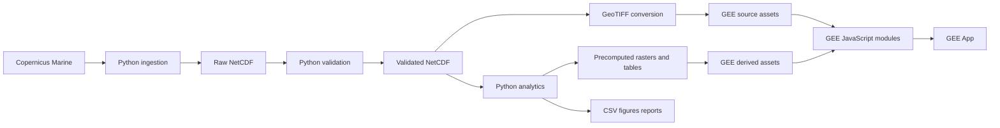
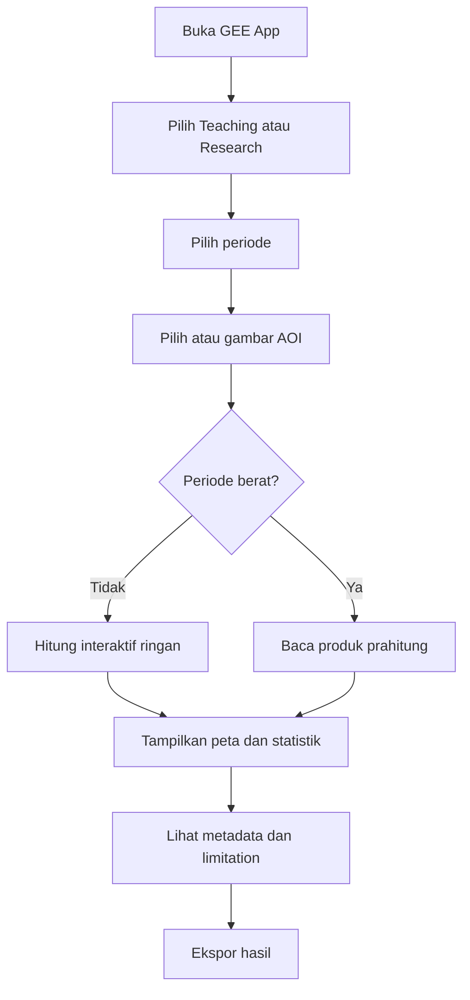

# PRODUCT REQUIREMENTS DOCUMENT (PRD)

# GLORYS CURRENT RESEARCH & TEACHING SYSTEM

**Nama produk kerja:** GLORYS Current Lab  
**Versi PRD:** 1.0  
**Tanggal:** 31 Juli 2026  
**Pemilik kebutuhan:** Proyek GEE Oseanografi  
**Pengguna utama:** Dosen, peneliti, dan mahasiswa Kelautan dan Perikanan  
**Wilayah awal:** Perairan Sorong dan sekitarnya  
**Dataset utama:** Copernicus Marine GLORYS12V1  
**Platform:** Python/xarray dan Google Earth Engine  
**Klasifikasi:** Pendidikan dan penelitian nonkomersial  
**Status:** Siap dijadikan sumber kerja utama Codex

---

## 1. Ringkasan eksekutif

GLORYS Current Lab adalah sistem pendidikan dan penelitian untuk mempelajari arus laut menggunakan Copernicus Marine GLORYS12V1. Sistem menggabungkan:

- pipeline Python untuk mengunduh, memvalidasi, mengonversi, dan menghitung statistik berat;
- Earth Engine Assets untuk menyimpan data sumber dan produk turunan yang telah dipilih;
- GEE JavaScript untuk analisis ringan, peta, grafik, dan ekspor;
- GEE App untuk pembelajaran dan eksplorasi penelitian.

Sistem tidak ditujukan sebagai sistem operasional pemerintah, layanan komersial, sistem keselamatan, atau dasar tunggal desain teknik.

Keputusan arsitektur utama:

> **Python/xarray adalah mesin ilmiah dan komputasi berat. Google Earth Engine adalah mesin penyajian, eksplorasi interaktif terbatas, dan distribusi hasil.**

---

## 2. Latar belakang masalah

GLORYS12V1 menyediakan data arus global yang konsisten untuk kajian historis, tetapi tidak tersedia sebagai koleksi historis lengkap bawaan GEE. Data perlu:

1. diakses dari Copernicus Marine;
2. disubset;
3. divalidasi;
4. dikonversi;
5. diberi metadata waktu;
6. diunggah ke Earth Engine;
7. dianalisis tanpa melanggar keterbatasan ilmiah dan komputasi.

Jika seluruh komputasi dipaksakan ke GEE secara interaktif, sistem berisiko mengalami:

- memory limit;
- timeout;
- terlalu banyak agregasi;
- hasil agregasi terlalu besar;
- konsumsi EECU tidak efisien;
- aplikasi lambat.

Jika seluruh komputasi dilakukan di Python tanpa GEE, pembelajaran spasial dan eksplorasi interaktif menjadi kurang mudah.

PRD ini menetapkan pembagian yang seimbang.

---

## 3. Visi produk

Menyediakan laboratorium digital arus laut yang:

- mudah dipakai dosen dan mahasiswa;
- tetap ilmiah dan dapat direproduksi;
- transparan terhadap keterbatasan model;
- efisien pada Earth Engine nonkomersial;
- dapat diperluas untuk penelitian;
- tidak menciptakan ketelitian semu.

---

## 4. Tujuan produk

### 4.1 Tujuan ilmiah

1. Menghitung besar kecepatan arus dari `uo` dan `vo`.
2. Menghitung komponen rata-rata, resultan, arah resultan, dan persistensi.
3. Menyediakan statistik kecepatan, vektor, temporal, dan spasial.
4. Menyediakan klimatologi dan anomali.
5. Memisahkan mean speed dari resultant speed.
6. Menjaga mask, waktu, satuan, kedalaman, dan metadata.
7. Membandingkan hasil Python dan GEE.
8. Menyatakan ketidakpastian dan batas penggunaan.

### 4.2 Tujuan pendidikan

1. Mengajarkan konsep komponen vektor arus.
2. Mengajarkan statistik skalar dan vektor.
3. Mengajarkan pemrosesan NetCDF.
4. Mengajarkan workflow Python–GEE.
5. Mengajarkan interpretasi reanalisis.
6. Mengajarkan keterbatasan resolusi dan arus pasut.
7. Menyediakan latihan yang dapat direproduksi.

### 4.3 Tujuan teknis

1. Mengotomatiskan unduhan.
2. Menghasilkan aset yang konsisten.
3. Menjaga provenance.
4. Mencegah komputasi interaktif berlebihan.
5. Menggunakan produk prahitung.
6. Memungkinkan ekspor CSV dan GeoTIFF.
7. Memiliki pengujian otomatis dan dokumentasi lengkap.

---

## 5. Non-goals

Produk tidak membangun:

- sistem operasional pemerintah;
- dashboard kondisi arus real-time;
- sistem peringatan dini;
- sistem keselamatan navigasi;
- layanan perizinan;
- sistem komersial;
- model pasang surut;
- model hidrodinamika lokal;
- desain dermaga atau struktur laut;
- downscaling yang diklaim meningkatkan ketelitian;
- analisis gelombang pada versi ini;
- penggabungan HYCOM dan GLORYS sebagai satu seri.

---

## 6. Persona pengguna

### 6.1 Dosen

Kebutuhan:

- menampilkan konsep arus;
- memilih periode;
- menggambar AOI;
- melihat statistik ringkas;
- mengunduh bahan ajar;
- menjelaskan keterbatasan.

### 6.2 Peneliti

Kebutuhan:

- memperoleh data tervalidasi;
- membandingkan tahun;
- menghitung klimatologi dan anomali;
- mengekspor tabel;
- mengakses provenance;
- menjalankan analisis lanjutan di Python.

### 6.3 Mahasiswa

Kebutuhan:

- antarmuka sederhana;
- penjelasan formula;
- contoh latihan;
- peta dan grafik;
- output yang tidak membingungkan.

### 6.4 Pengelola teknis

Kebutuhan:

- konfigurasi terpisah;
- retry dan resume;
- inventory;
- validasi;
- logging;
- pengendalian aset;
- benchmark komputasi;
- dokumentasi deployment.

---

## 7. User stories

| ID | Sebagai | Saya ingin | Agar |
|---|---|---|---|
| US-01 | Dosen | memilih tahun dan bulan | dapat menjelaskan variasi arus |
| US-02 | Dosen | menampilkan panah arus | mahasiswa memahami arah |
| US-03 | Peneliti | menggambar AOI | memperoleh statistik wilayah |
| US-04 | Peneliti | membandingkan JFM antartahun | melihat variasi antartahun |
| US-05 | Peneliti | mengekspor CSV | melakukan analisis lanjutan |
| US-06 | Mahasiswa | melihat mean speed dan resultan terpisah | tidak salah memahami arus |
| US-07 | Pengelola | melanjutkan unduhan yang terputus | tidak mengulang seluruh data |
| US-08 | Pengelola | memvalidasi aset | memastikan nilai sama dengan NetCDF |
| US-09 | Pengelola | memantau benchmark GEE | mencegah memory error |
| US-10 | Peneliti | melihat metadata | mengetahui sumber dan keterbatasan |

---

## 8. Prinsip produk

1. **Scientific-first.**
2. **Reproducible.**
3. **No false precision.**
4. **Source data preserved.**
5. **Heavy compute outside interactive GEE.**
6. **Precompute before publish.**
7. **Explicit metadata.**
8. **Fail closed.**
9. **No silent correction.**
10. **Education-friendly without simplifying away scientific meaning.**

---

## 9. Ruang data

### 9.1 Identitas

```text
Product ID:
GLOBAL_MULTIYEAR_PHY_001_030

Daily dataset:
cmems_mod_glo_phy_my_0.083deg_P1D-m

Monthly dataset:
cmems_mod_glo_phy_my_0.083deg_P1M-m

Variables:
uo
vo

Depth:
0.494025 m

Period:
2015-01-01 through 2025-12-31
```

### 9.2 Arsitektur data inti

| Koleksi | File NetCDF mentah | Timestep GEE |
|---|---:|---:|
| Bulanan 2015–2025 | 132 | 132 |
| Harian JFM 2015–2025 | 33 | 993 |
| Total | 165 | 1.125 |

### 9.3 Ekspansi

Data harian seluruh periode 4.018 timestep tidak termasuk MVP. Aktivasi memerlukan kebutuhan riset tertulis.

---

## 10. Arsitektur sistem



### 10.1 Python layer

Tanggung jawab:

- metadata verification;
- download;
- retry;
- resume;
- validation;
- conversion;
- statistics;
- current rose;
- climatology;
- anomalies;
- trend exploration;
- precomputed products;
- reference outputs.

### 10.2 GEE layer

Tanggung jawab:

- asset storage;
- maps;
- vector visualization;
- date filter;
- AOI interaction;
- basic reducer;
- charts;
- user export;
- display of precomputed results.

### 10.3 GEE App layer

Tidak menghitung ulang seluruh 11 tahun setiap kali pengguna berinteraksi.

---

## 11. Kebutuhan fungsional

### 11.1 Modul konfigurasi

| ID | Requirement |
|---|---|
| FR-CONF-01 | Konfigurasi AOI terpisah dari kode |
| FR-CONF-02 | Konfigurasi tanggal terpisah |
| FR-CONF-03 | Konfigurasi kedalaman |
| FR-CONF-04 | Konfigurasi threshold |
| FR-CONF-05 | Konfigurasi Project ID dan asset root |
| FR-CONF-06 | Tidak ada kredensial dalam repo |

### 11.2 Modul metadata

| ID | Requirement |
|---|---|
| FR-META-01 | Menjalankan `describe` untuk produk dan dataset |
| FR-META-02 | Menyimpan snapshot JSON |
| FR-META-03 | Mencatat versi Toolbox |
| FR-META-04 | Mencatat dataset version dan part |
| FR-META-05 | Menghentikan proses jika metadata berubah material |

### 11.3 Modul unduhan

| ID | Requirement |
|---|---|
| FR-DL-01 | Mengunduh 132 bulanan |
| FR-DL-02 | Mengunduh 33 paket JFM |
| FR-DL-03 | Retry |
| FR-DL-04 | Resume |
| FR-DL-05 | Inventory SQLite dan CSV |
| FR-DL-06 | SHA-256 |
| FR-DL-07 | Karantina file |
| FR-DL-08 | Dry run |
| FR-DL-09 | Tidak mengaktifkan daily full secara default |

### 11.4 Modul validasi

| ID | Requirement |
|---|---|
| FR-VAL-01 | Memeriksa `uo` dan `vo` |
| FR-VAL-02 | Memeriksa satuan |
| FR-VAL-03 | Memeriksa depth |
| FR-VAL-04 | Memeriksa waktu |
| FR-VAL-05 | Memeriksa mask |
| FR-VAL-06 | Memeriksa orientasi lintang |
| FR-VAL-07 | Memeriksa raw dan decoded encoding |
| FR-VAL-08 | Memeriksa nilai tidak masuk akal |
| FR-VAL-09 | Menghasilkan laporan PASS/FAIL |

### 11.5 Modul konversi

| ID | Requirement |
|---|---|
| FR-CONV-01 | Menghasilkan float32 |
| FR-CONV-02 | Dua band `uo`, `vo` |
| FR-CONV-03 | Mempertahankan mask |
| FR-CONV-04 | Menetapkan CRS dan transform |
| FR-CONV-05 | Tidak melakukan resampling tidak perlu |
| FR-CONV-06 | Menulis metadata timestep |
| FR-CONV-07 | Membandingkan nilai dengan NetCDF |

### 11.6 Modul analytics Python

| ID | Requirement |
|---|---|
| FR-PY-01 | Speed |
| FR-PY-02 | Mean speed |
| FR-PY-03 | Mean `u` dan `v` |
| FR-PY-04 | Resultant speed |
| FR-PY-05 | Resultant direction |
| FR-PY-06 | Persistence |
| FR-PY-07 | Min, max, median, SD, variance |
| FR-PY-08 | P10–P99 |
| FR-PY-09 | Threshold exceedance |
| FR-PY-10 | Direction sectors |
| FR-PY-11 | Current rose |
| FR-PY-12 | Monthly climatology |
| FR-PY-13 | JFM climatology |
| FR-PY-14 | Anomalies |
| FR-PY-15 | Trend exploration |
| FR-PY-16 | Zonal tables |
| FR-PY-17 | Precomputed raster products |

### 11.7 Modul Earth Engine core

| ID | Requirement |
|---|---|
| FR-GEE-01 | Membaca source collection |
| FR-GEE-02 | Filter tanggal dan AOI |
| FR-GEE-03 | Menghitung speed untuk periode terbatas |
| FR-GEE-04 | Menghitung mean `u`, `v`, speed |
| FR-GEE-05 | Resultant dan persistence |
| FR-GEE-06 | Statistik AOI ringan |
| FR-GEE-07 | Menampilkan produk prahitung |
| FR-GEE-08 | Ekspor GeoTIFF |
| FR-GEE-09 | Ekspor CSV |
| FR-GEE-10 | Metadata panel |
| FR-GEE-11 | Peringatan keterbatasan |

### 11.8 Modul visualisasi vektor

| ID | Requirement |
|---|---|
| FR-VEC-01 | Uji empat arah kardinal |
| FR-VEC-02 | Arah menuju |
| FR-VEC-03 | Sampling grid |
| FR-VEC-04 | Panah normalisasi |
| FR-VEC-05 | Panah skala kecepatan |
| FR-VEC-06 | Legenda |
| FR-VEC-07 | Tidak memberi kesan resolusi lebih tinggi |

### 11.9 GEE App

Komponen:

- judul dan tujuan;
- pemilih mode;
- pemilih periode;
- pemilih tahun;
- pemilih bulan;
- pilihan JFM;
- pilihan AOI;
- layer selector;
- legend;
- statistics panel;
- chart panel;
- metadata panel;
- limitations panel;
- export guidance;
- reset.

Mode:

1. **Teaching Mode**
2. **Research Exploration Mode**

Tidak ada mode operasional.

---

## 12. Rumus wajib

### 12.1 Speed

\[
S=\sqrt{u^2+v^2}
\]

### 12.2 Mean speed

\[
\overline{S}
=
\frac{1}{n}\sum S_i
\]

### 12.3 Resultant speed

\[
S_R
=
\sqrt{\overline{u}^2+\overline{v}^2}
\]

### 12.4 Persistence

\[
P
=
\frac{S_R}{\overline{S}}
\]

### 12.5 Direction

Arah menuju, searah jarum jam dari utara.

Uji:

| u | v | Arah |
|---:|---:|---:|
| 0 | 1 | 0° |
| 1 | 0 | 90° |
| 0 | -1 | 180° |
| -1 | 0 | 270° |

---

## 13. Produk prahitung

Produk minimum:

```text
derived/
├── monthly_climatology/
├── annual_summary/
├── jfm_summary/
├── jfm_climatology/
├── anomalies/
├── long_term_summary/
└── regional_tables/
```

Band rekomendasi:

```text
mean_speed
mean_u
mean_v
resultant_speed
resultant_direction
persistence
speed_stddev
valid_count
```

Tabel rekomendasi:

- annual statistics;
- monthly statistics;
- JFM statistics;
- direction frequencies;
- speed-class frequencies;
- threshold exceedance;
- data completeness.

---

## 14. Guardrail Earth Engine

### 14.1 Batas interaktif awal

| Parameter | Batas |
|---|---|
| Kedalaman | satu |
| AOI | satu per analisis |
| Harian | maksimum satu tahun atau satu JFM |
| Seluruh 2015–2025 | produk prahitung |
| Skala | native |
| Banyak zona | tabel prahitung atau batch |
| Current rose panjang | Python |
| Persentil panjang | Python/batch |

### 14.2 Pola yang dilarang

Pada seri besar:

```javascript
collection.toArray()
collection.toBands()
collection.toList(collection.size())
```

Dihindari:

- `clip()` tiap citra;
- skala jauh lebih halus;
- banyak `reduceRegion()` terpisah;
- banyak agregasi bersamaan;
- pencetakan tabel besar;
- komputasi 11 tahun pada setiap klik.

### 14.3 Pola yang diwajibkan

- filter sedini mungkin;
- pilih band sebelum `map`;
- combined reducer;
- `sharedInputs`;
- `tileScale` benchmark;
- `parallelScale` benchmark;
- batch export;
- cache melalui aset turunan.

---

## 15. Persyaratan nonfungsional

### 15.1 Akurasi

- nilai GEE harus cocok dengan NetCDF/Python dalam toleransi numerik;
- band tidak boleh tertukar;
- mask tidak boleh berubah menjadi nol;
- arah kardinal harus tepat.

### 15.2 Reproducibility

- config tersimpan;
- dependency terkunci;
- checksum;
- provenance;
- log;
- versioned outputs.

### 15.3 Performance

Target awal yang harus dikalibrasi pada pilot:

- layer prahitung tampil tanpa timeout;
- analisis 29 hari berhasil interaktif;
- satu JFM diuji interaktif;
- 993 hari diproses batch/Python;
- tidak ada memory error pada alur yang dinyatakan didukung.

### 15.4 Accessibility

- istilah dijelaskan;
- legenda jelas;
- warna tidak menjadi satu-satunya pembeda;
- teks keterbatasan dapat dibaca;
- panel tidak terlalu padat.

### 15.5 Security

- kredensial tidak masuk repo;
- asset access dikontrol;
- data pengguna AOI tidak disimpan tanpa kebutuhan;
- Project ID terpisah;
- Cloud services berbayar dikendalikan.

### 15.6 Maintainability

- modular;
- typed Python;
- lint;
- tests;
- changelog;
- dokumentasi setiap fungsi publik;
- konfigurasi terpisah.

---

## 16. Kebijakan penggunaan Earth Engine

Proyek harus didaftarkan sebagai pendidikan dan penelitian nonkomersial sesuai ketentuan yang berlaku.

Requirement:

| ID | Requirement |
|---|---|
| GOV-01 | Tujuan nonkomersial terdokumentasi |
| GOV-02 | Project ID khusus |
| GOV-03 | Tier nonkomersial diverifikasi |
| GOV-04 | EECU dipantau |
| GOV-05 | Layanan Cloud lain diawasi biayanya |
| GOV-06 | Tidak digunakan untuk operasional |
| GOV-07 | Kebijakan diperiksa ulang saat deployment |

Perubahan tujuan menjadi operasional atau komersial memerlukan PRD dan arsitektur baru.

---

## 17. Benchmark

### 17.1 Skenario

| ID | Skenario |
|---|---|
| B1 | 29 hari |
| B2 | satu JFM |
| B3 | 993 hari batch/Python |
| B4 | 11 tahun prahitung |
| B5 | combined reducer |
| B6 | batch table export |

### 17.2 Output

```text
duration
task state
error
tileScale
parallelScale
scale
AOI area
image count
output size
EECU if available
```

### 17.3 Keputusan

Setiap fitur diberi label:

- interactive;
- batch;
- Python-only;
- unsupported.

---

## 18. Model data aset

### 18.1 Source asset properties

```text
system:time_start
system:time_end
product_id
dataset_id
dataset_version
dataset_part
source_model
processing_type
temporal_resolution
period_start
period_end
depth_m
depth_label
uo_units
vo_units
source_crs
conversion_version
source_filename
source_checksum
is_reanalysis
tides_included
data_status
aoi_id
created_utc
research_purpose
noncommercial_only
```

### 18.2 Derived asset properties

Tambahkan:

```text
derivation_method
reference_period
python_pipeline_version
validation_report
source_asset_count
statistic_type
```

---

## 19. Repository

```text
glorys-current-lab/
├── README.md
├── AGENTS.md
├── PRD.md
├── CHANGELOG.md
├── requirements.txt
├── requirements-lock.txt
├── pyproject.toml
├── config/
├── python/
│   ├── common/
│   ├── metadata/
│   ├── download/
│   ├── validation/
│   ├── conversion/
│   ├── analytics/
│   ├── upload/
│   └── reporting/
├── gee/
│   ├── lib/
│   ├── analysis/
│   ├── vector/
│   ├── app/
│   └── tests/
├── docs/
│   ├── stages/
│   ├── methodology/
│   ├── validation/
│   └── teaching/
├── tests/
│   ├── unit/
│   ├── integration/
│   └── synthetic/
├── data/
│   ├── raw/
│   ├── validated/
│   ├── converted/
│   └── quarantine/
└── outputs/
```

---

## 20. Standar kode Codex

Codex wajib:

1. membaca PRD dan Tahap 0–3 sebelum mengubah kode;
2. tidak melewati gerbang tahap;
3. tidak mengarang ID atau metadata;
4. tidak menaruh kredensial;
5. menulis kode runnable;
6. menulis tests;
7. mencatat perubahan;
8. menjaga backward compatibility;
9. tidak mengklaim PASS tanpa bukti;
10. menghentikan pipeline pada error kritis;
11. menggunakan type hints;
12. menggunakan logging;
13. menggunakan config schema;
14. menulis README per modul;
15. memisahkan Python dan GEE;
16. menjaga istilah ilmiah;
17. tidak mengganti dataset utama;
18. tidak menambah gelombang;
19. tidak mengaktifkan daily full;
20. tidak mengoptimalkan dengan mengorbankan validasi.

---

## 21. Strategi pengujian

### 21.1 Unit tests

- date plan;
- leap year;
- direction;
- speed;
- persistence;
- filename;
- inventory transitions;
- checksum;
- config validation.

### 21.2 Synthetic tests

- mask;
- reversed latitude;
- raw encoding;
- fill value;
- cardinal vectors;
- zero speed;
- missing timestep.

### 21.3 Integration tests

- Copernicus pilot;
- NetCDF validation;
- GeoTIFF comparison;
- manifest generation;
- GEE asset sample;
- Python–GEE reference values.

### 21.4 Regression tests

- known points;
- known dates;
- known statistics;
- metadata snapshot.

---

## 22. Acceptance criteria produk

### 22.1 Data

- Product ID benar.
- Dataset ID benar.
- 2015–2025 tersedia.
- `uo`, `vo`, unit, depth benar.
- 132 + 993 timestep lengkap.
- mask benar.
- waktu benar.

### 22.2 Metode

- speed benar.
- mean speed terpisah.
- resultant benar.
- direction benar.
- persistence benar.
- statistik diberi label.

### 22.3 Pipeline

- retry;
- resume;
- inventory;
- checksum;
- quarantine;
- reports.

### 22.4 GEE

- sample assets valid;
- filter waktu valid;
- benchmark selesai;
- produk prahitung tersedia;
- tidak ada pola kode terlarang;
- aplikasi menampilkan keterbatasan.

### 22.5 Governance

- tujuan nonkomersial;
- Project ID;
- tier;
- monitoring;
- tidak operasional.

---

## 23. Tahapan pembangunan

| Tahap | Deliverable |
|---|---|
| 0 | Verifikasi sumber data |
| 1 | Metodologi dan arsitektur |
| 2 | Pilot dan benchmark |
| 3 | Otomasi unduhan |
| 4 | Validasi NetCDF skala penuh |
| 5 | Konversi dan produk Python |
| 6 | Publikasi aset GEE terpilih |
| 7 | Modul analisis GEE |
| 8 | Visualisasi vektor |
| 9 | GEE App |
| 10 | Validasi ilmiah dan penerimaan |

### 23.1 Penyesuaian tahap mendatang

#### Tahap 4

Harus menghasilkan dataset tervalidasi dan queue komputasi Python.

#### Tahap 5

Harus menghasilkan:

- source GeoTIFF;
- produk prahitung;
- tables;
- validation comparison.

#### Tahap 6

Mengunggah hanya aset yang dibutuhkan, bukan seluruh turunan.

#### Tahap 7

Memisahkan:

- interactive functions;
- batch functions;
- precomputed readers.

#### Tahap 9

Aplikasi tidak menjalankan statistik berat pada setiap klik.

---

## 24. Definition of Done

Produk MVP selesai jika:

1. Tahap 0–10 PASS.
2. Data pilot dan skala inti tervalidasi.
3. 1.125 timestep dapat ditelusuri.
4. Produk prahitung tersedia.
5. GEE App dapat digunakan dosen.
6. Analisis ringan berjalan tanpa memory error pada benchmark.
7. Analisis berat dialihkan ke Python/batch.
8. Dokumentasi lengkap.
9. Tests lulus.
10. Tidak ada kredensial.
11. Tujuan nonkomersial terdokumentasi.
12. Keterbatasan tampil pada aplikasi.
13. Hasil Python dan GEE konsisten.
14. Tidak ada klaim ketelitian lokal palsu.

---

## 25. Risiko produk

| Risiko | Dampak | Mitigasi |
|---|---|---|
| Data pesisir tidak realistis | interpretasi salah | warning dan validasi |
| Pasut tidak tersedia | selat tidak terwakili | batas penggunaan |
| Memory limit | fitur gagal | hibrida dan prahitung |
| EECU habis | throughput turun | monitoring |
| Metadata berubah | hasil tidak konsisten | freeze dan snapshot |
| Dataset version campur | seri tidak homogen | pin version |
| Pengguna salah baca direction | kesimpulan salah | legenda |
| Pengguna memakai untuk teknik | risiko tinggi | disclaimer |
| Codex melompati tahap | error sistemik | AGENTS.md dan gates |
| Scope creep gelombang | proyek tidak fokus | out-of-scope |
| Daily full aktif | beban besar | approval gate |
| Project menjadi operasional | kebijakan tidak sesuai | governance review |

---

## 26. Diagram alur pengguna



---

## 27. Instruksi awal untuk Codex

Codex harus memulai dengan:

1. membaca `PRD.md`;
2. membaca Tahap 0 v1.1;
3. membaca Tahap 1 v1.1;
4. membaca Tahap 2 v1.1;
5. membaca Tahap 3 v1.1;
6. membuat `IMPLEMENTATION_STATUS.md`;
7. memetakan requirement ID ke file;
8. mengidentifikasi gap;
9. mengerjakan tahap aktif saja;
10. menjalankan tests;
11. memperbarui status dan changelog.

Codex tidak boleh memulai GEE App sebelum pipeline dan benchmark lulus.

---

## 28. Requirement traceability

Codex harus memelihara:

```text
docs/REQUIREMENTS_TRACEABILITY.md
```

Kolom:

```text
requirement_id
description
stage
implementation_file
test_file
status
evidence
notes
```

Status:

```text
NOT_STARTED
IN_PROGRESS
IMPLEMENTED
TESTED
BLOCKED
DEFERRED
```

---

## 29. Dokumentasi pengguna

Produk harus memiliki:

- installation guide;
- data preparation guide;
- teaching guide;
- research guide;
- GEE App guide;
- limitations;
- troubleshooting;
- glossary;
- citation guidance.

---

## 30. Sumber kebijakan dan teknis

1. Earth Engine Noncommercial Tiers  
   https://developers.google.com/earth-engine/guides/noncommercial_tiers

2. Earth Engine Usage and Quotas  
   https://developers.google.com/earth-engine/guides/usage

3. Earth Engine Coding Best Practices  
   https://developers.google.com/earth-engine/guides/best_practices

4. Transition to Commercial Projects  
   https://developers.google.com/earth-engine/guides/transition_to_commercial

5. Copernicus Marine GLORYS12V1  
   https://data.marine.copernicus.eu/product/GLOBAL_MULTIYEAR_PHY_001_030/description

6. Copernicus Marine Toolbox  
   https://toolbox-docs.marine.copernicus.eu/en/stable/

Ketentuan, kuota, dan sintaks harus diperiksa kembali ketika implementasi dilakukan.

---

## 31. Catatan keputusan

| ID | Keputusan |
|---|---|
| ADR-001 | GLORYS12V1 tetap dataset utama |
| ADR-002 | Hanya arus |
| ADR-003 | Pendidikan dan penelitian nonkomersial |
| ADR-004 | Arsitektur hibrida Python–GEE |
| ADR-005 | Bulanan penuh + harian JFM |
| ADR-006 | Daily full nonaktif |
| ADR-007 | Produk 11 tahun diprahitungkan |
| ADR-008 | GEE interaktif dibatasi |
| ADR-009 | Statistik berat di Python |
| ADR-010 | Tidak ada penggunaan operasional |

---

## 32. Persetujuan PRD

PRD dianggap disetujui ketika:

- ruang lingkup diterima;
- arsitektur hibrida diterima;
- penggunaan nonkomersial diterima;
- tahap 0–3 v1.1 menjadi baseline;
- Codex diperintahkan mengikuti requirement ID dan gerbang.

