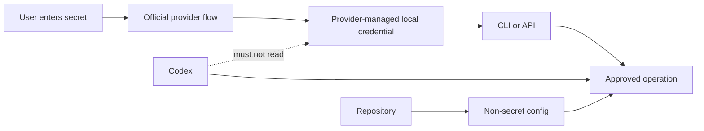
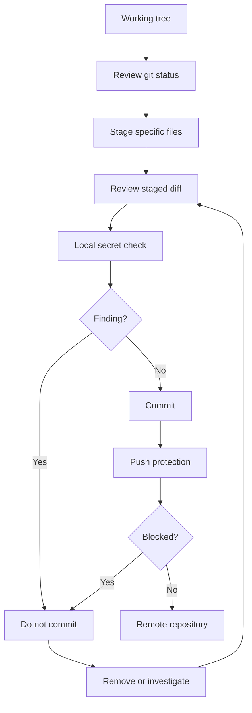
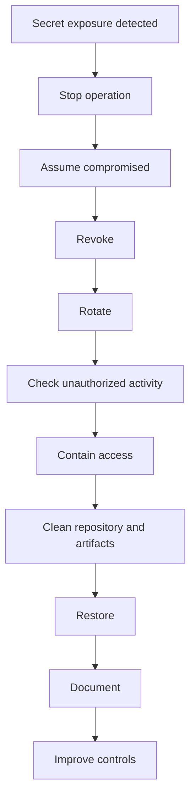
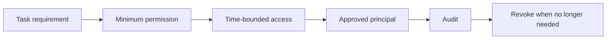

# SECURITY_AND_SECRETS.md

# KEAMANAN, RAHASIA, DAN RESPONS INSIDEN  
## GLORYS12V1 Current Research & Teaching System

**Status:** Kebijakan keamanan wajib repository  
**Ruang penggunaan:** Pendidikan dan penelitian nonkomersial  
**Platform:** Windows 10/11, Python, Copernicus Marine, Google Earth Engine, GitHub, dan Codex  
**Pemilik rahasia:** Pengguna manusia atau institusi pemilik akun  
**Prinsip autentikasi:** User-login, Codex-use  
**Terakhir diperbarui:** 31 Juli 2026  
**Dokumen terkait:** `AGENTS.md`, `SETUP_AND_AUTHENTICATION.md`, PRD, dan dokumen Tahap 0–3  
**Dokumen berikutnya:** `IMPLEMENTATION_PLAN_AND_BACKLOG.md`

---

## Daftar isi

1. [Tujuan dokumen](#1-tujuan-dokumen)
2. [Ruang lingkup keamanan](#2-ruang-lingkup-keamanan)
3. [Prinsip keamanan](#3-prinsip-keamanan)
4. [Model ancaman](#4-model-ancaman)
5. [Klasifikasi informasi](#5-klasifikasi-informasi)
6. [Daftar rahasia proyek](#6-daftar-rahasia-proyek)
7. [Informasi yang bukan rahasia](#7-informasi-yang-bukan-rahasia)
8. [Matriks akses](#8-matriks-akses)
9. [Siklus hidup rahasia](#9-siklus-hidup-rahasia)
10. [Aturan penyimpanan rahasia](#10-aturan-penyimpanan-rahasia)
11. [Copernicus Marine credentials](#11-copernicus-marine-credentials)
12. [Google dan Earth Engine credentials](#12-google-dan-earth-engine-credentials)
13. [Service account dan private key](#13-service-account-dan-private-key)
14. [GitHub credentials](#14-github-credentials)
15. [Codex, sandbox, approval, dan network](#15-codex-sandbox-approval-dan-network)
16. [Codex lokal dan Codex cloud](#16-codex-lokal-dan-codex-cloud)
17. [Prompt, chat, clipboard, dan screenshot](#17-prompt-chat-clipboard-dan-screenshot)
18. [Environment variable dan `.env`](#18-environment-variable-dan-env)
19. [Konfigurasi lokal](#19-konfigurasi-lokal)
20. [`.gitignore` wajib](#20-gitignore-wajib)
21. [Git staging dan commit aman](#21-git-staging-dan-commit-aman)
22. [Secret scanning dan push protection](#22-secret-scanning-dan-push-protection)
23. [Sanitasi log](#23-sanitasi-log)
24. [Sanitasi error dan exception](#24-sanitasi-error-dan-exception)
25. [Sanitasi metadata dan laporan](#25-sanitasi-metadata-dan-laporan)
26. [Keamanan file data](#26-keamanan-file-data)
27. [Checksum, integritas, dan provenance](#27-checksum-integritas-dan-provenance)
28. [IAM dan least privilege](#28-iam-dan-least-privilege)
29. [Pengendalian Earth Engine Assets](#29-pengendalian-earth-engine-assets)
30. [Pengendalian biaya dan layanan Cloud](#30-pengendalian-biaya-dan-layanan-cloud)
31. [Dependency dan supply-chain security](#31-dependency-dan-supply-chain-security)
32. [Keamanan perangkat Windows](#32-keamanan-perangkat-windows)
33. [Backup dan sinkronisasi](#33-backup-dan-sinkronisasi)
34. [Keamanan kolaborasi](#34-keamanan-kolaborasi)
35. [Pemeriksaan sebelum menjalankan Codex](#35-pemeriksaan-sebelum-menjalankan-codex)
36. [Pemeriksaan sebelum commit](#36-pemeriksaan-sebelum-commit)
37. [Pemeriksaan sebelum push](#37-pemeriksaan-sebelum-push)
38. [Pemeriksaan sebelum publikasi](#38-pemeriksaan-sebelum-publikasi)
39. [Script pemeriksaan keamanan lokal](#39-script-pemeriksaan-keamanan-lokal)
40. [Kondisi penghentian wajib](#40-kondisi-penghentian-wajib)
41. [Definisi insiden keamanan](#41-definisi-insiden-keamanan)
42. [Prosedur umum respons insiden](#42-prosedur-umum-respons-insiden)
43. [Insiden password Copernicus Marine](#43-insiden-password-copernicus-marine)
44. [Insiden Google OAuth atau Earth Engine](#44-insiden-google-oauth-atau-earth-engine)
45. [Insiden service-account key](#45-insiden-service-account-key)
46. [Insiden GitHub PAT atau SSH key](#46-insiden-github-pat-atau-ssh-key)
47. [Rahasia masuk commit atau riwayat Git](#47-rahasia-masuk-commit-atau-riwayat-git)
48. [Rahasia masuk prompt, chat, log, atau screenshot](#48-rahasia-masuk-prompt-chat-log-atau-screenshot)
49. [Perangkat hilang atau dicuri](#49-perangkat-hilang-atau-dicuri)
50. [Pembersihan riwayat Git](#50-pembersihan-riwayat-git)
51. [Rotasi dan pencabutan berkala](#51-rotasi-dan-pencabutan-berkala)
52. [Audit keamanan](#52-audit-keamanan)
53. [Security requirements](#53-security-requirements)
54. [Matriks penerimaan keamanan](#54-matriks-penerimaan-keamanan)
55. [Formulir laporan insiden](#55-formulir-laporan-insiden)
56. [Diagram Mermaid](#56-diagram-mermaid)
57. [Sumber resmi](#57-sumber-resmi)
58. [Catatan perubahan](#58-catatan-perubahan)

---

## 1. Tujuan dokumen

Dokumen ini menetapkan aturan untuk:

- mengidentifikasi informasi rahasia;
- mencegah rahasia masuk source code;
- membatasi akses Codex;
- mengamankan autentikasi Copernicus Marine dan Earth Engine;
- menerapkan least privilege;
- menyaring log dan laporan;
- mencegah kebocoran melalui Git;
- mendeteksi potensi secret sebelum push;
- merespons insiden;
- mencabut dan merotasi kredensial;
- menjaga integritas data dan provenance;
- menghasilkan bukti keamanan yang dapat diaudit.

Kebijakan ini berlaku pada:

- repository lokal;
- GitHub;
- PowerShell;
- Python;
- GEE Code Editor;
- Earth Engine Assets;
- Google Cloud Project;
- Codex;
- output dan dokumentasi;
- screenshot dan komunikasi proyek.

---

## 2. Ruang lingkup keamanan

### 2.1 Aset yang dilindungi

- akun Copernicus Marine;
- akun Google;
- Earth Engine Project;
- Earth Engine Assets;
- GitHub repository;
- OAuth credentials;
- service-account credentials jika kelak digunakan;
- source code;
- data mentah;
- data tervalidasi;
- hasil penelitian yang belum dipublikasikan;
- inventory;
- checksum;
- metadata;
- log;
- komputer pengguna;
- reputasi dan integritas ilmiah proyek.

### 2.2 Di luar ruang lingkup

Dokumen ini bukan:

- audit keamanan formal organisasi;
- pengganti kebijakan keamanan institusi;
- pengganti pengelola IAM organisasi;
- panduan keamanan untuk sistem produksi publik;
- pengganti incident response team;
- izin untuk memproses data pribadi atau data rahasia negara.

Jika kebijakan institusi lebih ketat, kebijakan institusi berlaku.

---

## 3. Prinsip keamanan

1. **User-login, Codex-use.**
2. **No secrets in source control.**
3. **Least privilege.**
4. **Fail closed.**
5. **Assume exposed secrets are compromised.**
6. **Revoke before cleanup.**
7. **No silent security bypass.**
8. **Workspace-only by default.**
9. **Network only by approval.**
10. **No long-lived private keys when avoidable.**
11. **Sanitize before sharing.**
12. **Evidence-based security claims.**
13. **Separate authentication from authorization.**
14. **Separate public, internal, confidential, and secret data.**
15. **Security controls must not be weakened for convenience.**

---

## 4. Model ancaman

### 4.1 Ancaman utama

| Ancaman | Contoh |
|---|---|
| Commit tidak sengaja | `.env`, token, credentials JSON masuk Git |
| Prompt leakage | password ditempel ke chat atau Codex |
| Log leakage | environment atau request lengkap dicetak |
| Shell history | password ditulis sebagai argumen CLI |
| Screenshot leakage | terminal menampilkan token atau email |
| Overbroad IAM | kolaborator mendapat Owner/Admin |
| Agent overreach | Codex membaca home directory atau menghapus aset |
| Network exfiltration | command tidak terpercaya mengirim data |
| Malicious dependency | package mencuri credentials |
| Malicious repository | hook/script membaca rahasia |
| Lost device | laptop hilang dalam keadaan login |
| Cloud misconfiguration | API publik, asset public, billing tidak terkendali |
| Git history persistence | secret dihapus dari file tetapi tetap di commit lama |
| Shared account | password dibagi kepada banyak orang |
| Stale credentials | token lama tidak dicabut |
| Insecure backup | credentials ikut tersinkron ke cloud pribadi |

### 4.2 Asumsi kerja

- komputer dikelola pengguna;
- repository berasal dari sumber terpercaya;
- Codex dijalankan dengan sandbox;
- network tidak dibuka tanpa approval;
- akun memakai autentikasi yang kuat;
- data proyek bukan data pribadi sensitif;
- penggunaan hanya pendidikan dan penelitian.

Jika asumsi tidak benar, lakukan review ulang.

---

## 5. Klasifikasi informasi

### 5.1 Tingkat P0 — Publik

Boleh dipublikasikan setelah review:

- Product ID;
- Dataset ID;
- nama variabel;
- formula;
- kode sumber yang telah disanitasi;
- PRD yang tidak memuat data internal;
- dokumentasi metodologi;
- artikel dan bahan ajar;
- URL dokumentasi resmi;
- hasil penelitian yang telah disetujui untuk publikasi.

### 5.2 Tingkat P1 — Internal

Tidak rahasia, tetapi tidak otomatis dipublikasikan:

- Google Cloud Project ID;
- Earth Engine asset root;
- struktur folder internal;
- nama branch;
- AOI penelitian yang belum dipublikasikan;
- benchmark EECU;
- task ID;
- inventory;
- daftar dependency;
- log yang sudah disanitasi;
- rencana penelitian.

### 5.3 Tingkat P2 — Confidential

Akses terbatas:

- email akun;
- username akun;
- daftar anggota IAM;
- path lengkap user profile;
- hasil penelitian belum dipublikasikan;
- catatan review;
- informasi institusi internal;
- laporan insiden;
- audit findings;
- data lokasi khusus yang belum boleh dipublikasikan.

### 5.4 Tingkat P3 — Secret

Tidak boleh masuk repository, chat, log, atau screenshot:

- password;
- OAuth access token;
- OAuth refresh token;
- session cookie;
- Copernicus credentials file;
- GitHub PAT;
- API secret;
- SSH private key;
- service-account private key JSON;
- private key PEM;
- recovery code;
- client secret;
- signed URL yang memberi akses;
- secret manager value;
- credential export.

### 5.5 Tingkat P4 — High-impact secret

Rahasia dengan dampak luas:

- Google Account owner credentials;
- organization admin credentials;
- billing admin credentials;
- cloud owner token;
- root account;
- institutional master key;
- private key dengan akses lintas project.

P4 tidak boleh tersedia bagi Codex dan tidak boleh digunakan untuk pekerjaan rutin.

---

## 6. Daftar rahasia proyek

Rahasia aktual atau potensial:

```text
Copernicus Marine password
.copernicusmarine-credentials
Google OAuth persistent credentials
Google refresh token
Google service-account JSON
Earth Engine service credentials
GitHub personal access token
GitHub deploy key private half
SSH private key
GPG private key
API key yang tidak dimaksudkan publik
Cloud signed URL
Cloud Storage signed credential
billing-related credentials
institutional SSO recovery codes
```

Rahasia tidak boleh disimpan dalam:

```text
*.py
*.js
*.json
*.yaml
*.yml
*.toml
*.md
*.txt
*.csv
*.ipynb
*.log
README
issue
pull request
commit message
prompt
chat
screenshot
```

---

## 7. Informasi yang bukan rahasia

Informasi berikut umumnya bukan credential:

- Project ID;
- Product ID;
- Dataset ID;
- public asset ID;
- public repository URL;
- package version;
- DOI;
- tanggal penelitian;
- formula.

Namun, informasi tersebut dapat tetap diklasifikasikan internal karena:

- mengungkap struktur proyek;
- mengungkap penelitian belum dipublikasikan;
- mempermudah pemetaan aset;
- mengandung nama institusi atau individu.

Bukan rahasia tidak berarti selalu boleh dipublikasikan.

---

## 8. Matriks akses

| Aset | Pemilik pengguna | Codex lokal | Kolaborator | CI | Publik |
|---|---:|---:|---:|---:|---:|
| Password Copernicus | Ya | Tidak | Tidak | Tidak | Tidak |
| Copernicus credentials file | Ya/tool | Tidak dibaca | Tidak | Tidak | Tidak |
| Google OAuth token | Ya/tool | Tidak dibaca | Tidak | Tidak | Tidak |
| Service-account private key | Tidak digunakan | Tidak | Tidak | Tidak | Tidak |
| Project ID | Ya | Ya | Sesuai kebutuhan | Ya | Review |
| Asset root | Ya | Ya | Sesuai IAM | Ya | Review |
| Source code | Ya | Ya | Sesuai repo | Ya | Sesuai lisensi |
| Raw NetCDF | Ya | Dengan approval/path | Terbatas | Tidak default | Tidak |
| Sanitized logs | Ya | Ya | Sesuai kebutuhan | Ya | Tidak default |
| Incident report | Ya | Terbatas | Security owner | Tidak | Tidak |
| Published teaching output | Ya | Ya | Ya | Ya | Ya |

---

## 9. Siklus hidup rahasia

### 9.1 Create

Rahasia dibuat oleh provider melalui flow resmi.

### 9.2 Store

Gunakan:

- credential store resmi;
- user profile;
- OAuth persistent credentials;
- ADC/keyless mechanism untuk unattended environment;
- institusi secret manager jika kelak diperlukan.

### 9.3 Use

Rahasia digunakan oleh tool, bukan dibaca manusia atau Codex.

### 9.4 Rotate

Rotasi jika:

- ada indikasi bocor;
- akun berpindah;
- permission berubah;
- perangkat hilang;
- kebijakan meminta;
- service account tidak lagi diperlukan.

### 9.5 Revoke

Cabut segera jika:

- rahasia masuk Git;
- rahasia masuk prompt;
- screenshot tersebar;
- perangkat hilang;
- principal tidak lagi berwenang;
- aktivitas mencurigakan ditemukan.

### 9.6 Destroy

Hapus salinan yang tidak lagi diperlukan setelah akses dicabut.

### 9.7 Audit

Catat:

- pemilik;
- provider;
- tanggal dibuat;
- scope;
- lokasi penyimpanan resmi;
- tanggal review;
- tanggal rotasi;
- status.

Jangan mencatat nilai rahasia.

---

## 10. Aturan penyimpanan rahasia

### 10.1 Diizinkan

- penyimpanan resmi Copernicus Marine;
- persistent OAuth credentials resmi Earth Engine;
- Application Default Credentials untuk unattended environment yang disetujui;
- secret manager institusi;
- OS credential manager yang disetujui.

### 10.2 Tidak diizinkan

- repository;
- `.env` yang berisi password jangka panjang;
- file konfigurasi proyek;
- desktop plain-text;
- Google Drive/Dropbox pribadi;
- notes app tanpa proteksi;
- email;
- chat;
- issue tracker;
- notebook;
- shell script;
- GitHub Actions variable non-secret;
- hard-coded string;
- test fixture.

### 10.3 Password manager

Password akun sebaiknya disimpan pada password manager terpercaya milik pengguna atau institusi, bukan dalam repository.

---

## 11. Copernicus Marine credentials

### 11.1 Metode yang disetujui

Pengguna menjalankan:

```powershell
copernicusmarine login
```

Tool membuat:

```text
.copernicusmarine-credentials
```

di direktori konfigurasi/user home yang dikelola tool.

### 11.2 Aturan

Codex:

- boleh menjalankan pemeriksaan validitas;
- boleh menjalankan `describe` dan `subset` setelah approval;
- tidak boleh membuka credentials file;
- tidak boleh menyalin credentials file;
- tidak boleh menjalankan `Get-Content` terhadap file tersebut;
- tidak boleh mencatat path detail jika tidak diperlukan;
- tidak boleh mengirim file ke container/cloud.

### 11.3 Pemeriksaan aman

```powershell
copernicusmarine login --check-credentials-valid
```

Simpan hanya:

```text
valid = true/false
exit_code
timestamp
toolbox_version
```

### 11.4 Argumen password

Walaupun tool mendukung username/password sebagai argumen, proyek ini melarang metode tersebut karena berisiko masuk command history dan process metadata.

---

## 12. Google dan Earth Engine credentials

### 12.1 Metode lokal yang disetujui

```powershell
earthengine authenticate
```

atau:

```python
ee.Authenticate()
```

Kemudian:

```python
ee.Initialize(project="PROJECT_ID")
```

### 12.2 Aturan

- token persisten dikelola library;
- Codex tidak membaca file token;
- Codex tidak mencetak credential object;
- Codex tidak mengekspor token;
- Project ID boleh disimpan;
- refresh dilakukan melalui flow resmi;
- akun Google utama tidak dibagikan.

### 12.3 Reauthentication

Jika dibutuhkan:

```powershell
earthengine authenticate --force
```

Pengguna menyelesaikan flow browser sendiri.

### 12.4 Read-only mode

Jika menguji notebook atau kode yang tidak dipercaya, gunakan mode read-only jika tersedia dan relevan.

---

## 13. Service account dan private key

### 13.1 Keputusan proyek

Service account tidak digunakan pada Tahap 0–8.

### 13.2 Unattended environment

Jika kelak diperlukan:

1. buat ADR;
2. gunakan service account khusus;
3. gunakan IAM minimum;
4. utamakan Application Default Credentials;
5. hindari private key file;
6. pisahkan project;
7. audit penggunaan;
8. tetapkan rotasi dan revocation.

### 13.3 Private key

Jika private key benar-benar tidak dapat dihindari:

- jangan commit;
- jangan kirim ke Codex;
- jangan unggah ke chat;
- jangan simpan di folder proyek;
- jangan taruh di image/container;
- jangan taruh di shared drive;
- batasi permission;
- cabut segera jika hilang;
- buat key baru setelah pencabutan.

Private key file memberikan akses atas nama service account dan harus diperlakukan sebagai P4 bila scope luas.

---

## 14. GitHub credentials

### 14.1 PAT

Gunakan:

- fine-grained PAT;
- scope minimum;
- expiration;
- repository terbatas.

Jangan gunakan classic PAT dengan scope luas jika tidak diperlukan.

### 14.2 SSH key

- gunakan key khusus perangkat;
- private key tidak pernah dibagikan;
- public key boleh ditambahkan ke GitHub;
- gunakan passphrase jika sesuai;
- cabut key perangkat hilang.

### 14.3 GitHub CLI

Gunakan flow resmi:

```powershell
gh auth login
```

Jangan memasukkan token dalam source code atau command yang dibagikan.

### 14.4 Codex dan GitHub

Codex boleh menggunakan sesi `gh` lokal setelah approval dan sesuai plugin/connector yang tersedia, tetapi tidak boleh membaca credential storage.

---

## 15. Codex, sandbox, approval, dan network

### 15.1 Sandbox

Pertahankan:

```text
workspace-write
```

atau mode yang lebih ketat.

### 15.2 Approval

Gunakan:

```text
on-request
```

atau kebijakan yang meminta approval untuk operasi sensitif.

### 15.3 Network

Network default harus tetap nonaktif untuk pekerjaan lokal yang tidak memerlukan internet.

Aktifkan hanya untuk:

- dokumentasi resmi;
- `describe`;
- subset pilot;
- Earth Engine API;
- task status;
- upload yang disetujui.

### 15.4 Workspace boundary

Codex tidak boleh membaca:

- user home;
- browser profile;
- credentials directory;
- password manager;
- SSH private key directory;
- cloud credentials directory;

kecuali ada kebutuhan khusus, approval, dan metode aman yang tidak mengekspos isi rahasia.

Untuk autentikasi, pengguna menjalankan command manual jika sandbox perlu keluar workspace.

### 15.5 Perintah sensitif

Approval wajib untuk:

```text
network access
login
credential changes
IAM changes
API activation
package installation
upload
delete
force push
history rewrite
billing configuration
service account creation
private key creation
```

---

## 16. Codex lokal dan Codex cloud

### 16.1 Default proyek

Tahap yang memerlukan Copernicus Marine dan Earth Engine menggunakan:

> Codex lokal atau Codex App yang bekerja pada mesin pengguna.

### 16.2 Alasan

- credentials tetap di user profile;
- tool lokal dapat menggunakan sesi;
- pengguna mengontrol approval;
- data besar tetap lokal;
- tidak perlu mengirim password ke cloud.

### 16.3 Codex cloud

Codex cloud tidak digunakan untuk operasi yang membutuhkan kredensial runtime proyek ini kecuali ada desain keamanan baru dan persetujuan.

Jika digunakan untuk pekerjaan tanpa rahasia:

- review code;
- dokumentasi;
- unit test sintetis;
- refactor murni;
- analisis statis.

Jangan mengunggah credentials ke cloud environment untuk mengatasi batas desain.

---

## 17. Prompt, chat, clipboard, dan screenshot

### 17.1 Prompt

Jangan menulis:

```text
username saya ...
password saya ...
token saya ...
isi JSON key saya ...
```

Gunakan:

```text
Saya sudah login secara lokal.
Gunakan sesi autentikasi yang tersedia.
Jangan membaca credentials file.
```

### 17.2 Chat

Chat diperlakukan sebagai media yang tidak boleh menerima P3/P4.

### 17.3 Clipboard

Setelah menyalin secret untuk flow resmi:

- jangan menempel ke editor;
- jangan menempel ke Codex;
- ganti isi clipboard dengan teks nonrahasia jika diperlukan;
- gunakan password manager autofill jika tersedia.

### 17.4 Screenshot

Sebelum screenshot:

- tutup password manager;
- sembunyikan email;
- sembunyikan token;
- sembunyikan user path jika perlu;
- crop hanya bagian error;
- periksa tab browser;
- periksa terminal history.

Jika screenshot terlanjur memuat secret, anggap secret bocor.

---

## 18. Environment variable dan `.env`

### 18.1 Environment variable

Environment variable dapat dibaca oleh:

- child process;
- debugging tool;
- crash reporter;
- proses dengan hak tertentu;
- log yang mencetak environment.

Karena itu, environment variable bukan tempat ideal untuk password jangka panjang pada proyek lokal ini.

### 18.2 Penggunaan sementara

Jika benar-benar diperlukan:

```powershell
$env:SECRET_NAME = "<entered manually>"
```

Setelah selesai:

```powershell
Remove-Item Env:SECRET_NAME -ErrorAction SilentlyContinue
```

Jangan mencetak:

```powershell
Get-ChildItem Env:
```

dalam log atau prompt jika environment dapat memuat secret.

### 18.3 `.env`

`.env`:

- harus masuk `.gitignore`;
- tidak boleh menjadi metode utama untuk password Copernicus atau OAuth;
- tidak boleh dikirim ke Codex/cloud;
- tidak boleh dibagikan;
- harus menggunakan placeholder pada `.env.example`.

### 18.4 `.env.example`

Hanya nama variabel:

```dotenv
EARTH_ENGINE_PROJECT_ID=PROJECT_ID
COPERNICUS_PRODUCT_ID=GLOBAL_MULTIYEAR_PHY_001_030
```

Jangan menaruh contoh berbentuk secret nyata.

---

## 19. Konfigurasi lokal

### 19.1 Diizinkan

`config/local.json` boleh memuat:

- Project ID;
- asset root;
- AOI;
- path data;
- parameter analisis;
- timezone;
- nama plan.

### 19.2 Dilarang

Tidak boleh memuat:

- password;
- token;
- private key;
- refresh token;
- cookie;
- credentials JSON;
- PAT;
- SSH key.

### 19.3 Contoh aman

```json
{
  "earth_engine_project_id": "PROJECT_ID",
  "earth_engine_asset_root": "projects/PROJECT_ID/assets/glorys12v1",
  "display_timezone": "Asia/Jayapura"
}
```

---

## 20. `.gitignore` wajib

Contoh baseline:

```gitignore
# Python
.venv/
__pycache__/
*.py[cod]
.pytest_cache/
.mypy_cache/
.ruff_cache/

# Local config and environment
.env
.env.*
!.env.example
config/local.json
config/*local*.json
*.local.json

# Credentials and keys
.copernicusmarine-credentials
.copernicusmarine/
*credentials*
*credential*
*secret*
*.key
*.pem
*.p12
*.pfx
service-account*.json
application_default_credentials.json
adc.json
token.json
oauth*.json

# SSH and cloud
.ssh/
.gcloud/
.config/gcloud/

# Data and outputs
data/
outputs/logs/
outputs/setup/private/
*.nc
*.nc4
*.tif
*.tiff
*.zarr/
*.part
*.tmp

# OS/editor
Thumbs.db
.DS_Store
.vscode/settings.local.json
.idea/
```

### 20.1 Catatan

Pattern luas seperti `*credential*` dan `*secret*` dapat mengecualikan dokumentasi yang sah. Review `.gitignore` dan gunakan pengecualian jika diperlukan.

Contoh:

```gitignore
!docs/SECURITY_AND_SECRETS.md
```

### 20.2 `.git/info/exclude`

Untuk path yang hanya berlaku pada satu komputer, gunakan:

```text
.git/info/exclude
```

agar tidak memengaruhi tim.

---

## 21. Git staging dan commit aman

### 21.1 Dilarang sebagai kebiasaan

```powershell
git add .
git add -A
git commit -a
```

Perintah tersebut dapat memasukkan file yang tidak diperiksa.

### 21.2 Disarankan

```powershell
git status --short
git add AGENTS.md
git add docs\SECURITY_AND_SECRETS.md
git diff --cached
git commit -m "docs: add security and secrets policy"
```

### 21.3 Interactive staging

```powershell
git add --interactive
```

atau:

```powershell
git add -p
```

### 21.4 Commit message

Jangan menaruh:

- token;
- password;
- email sensitif;
- signed URL;
- incident detail rahasia.

---

## 22. Secret scanning dan push protection

### 22.1 GitHub push protection

Aktifkan jika tersedia.

Push protection dapat memblokir secret sebelum mencapai repository remote.

### 22.2 Secret scanning

Aktifkan sesuai kemampuan plan/repository.

### 22.3 Bypass

Jangan bypass alert hanya karena:

```text
akan diperbaiki nanti
dipakai untuk test
```

Kecuali sudah dipastikan false positive dan didokumentasikan.

### 22.4 Local scanning

Gunakan pemeriksaan lokal sebelum push.

Secret scanner tidak menggantikan review manusia karena:

- pattern tidak selalu dikenali;
- custom secret dapat lolos;
- data confidential bukan selalu secret pattern;
- false positive dapat terjadi.

---

## 23. Sanitasi log

### 23.1 Log boleh memuat

- timestamp;
- level;
- job ID;
- dataset ID;
- status;
- durasi;
- ukuran file;
- checksum;
- error class;
- retry count.

### 23.2 Log tidak boleh memuat

- password;
- token;
- Authorization header;
- Cookie header;
- credential object;
- environment dump;
- request URL dengan signed credential;
- full user profile path jika tidak diperlukan;
- OAuth response.

### 23.3 Redaction

Gunakan bentuk:

```text
<REDACTED>
<SECRET>
<TOKEN_REDACTED>
<EMAIL_REDACTED>
<USER_PATH_REDACTED>
```

### 23.4 Logging request

Jangan logging objek request mentah jika dapat memuat auth header.

---

## 24. Sanitasi error dan exception

### 24.1 Risiko traceback

Traceback dapat memuat:

- parameter fungsi;
- path user;
- URL;
- response body;
- environment;
- object representation.

### 24.2 Aturan

- log exception class;
- log pesan yang telah disanitasi;
- jangan serialize seluruh credential-bearing object;
- batasi debug log;
- debug log tidak boleh dibagikan tanpa review;
- matikan verbose auth logging setelah troubleshooting.

### 24.3 CLI debug

Jangan menjalankan:

```text
--log-level DEBUG
```

sambil membagikan output secara otomatis.

Review manual diperlukan.

---

## 25. Sanitasi metadata dan laporan

### 25.1 Metadata publik

Sebelum publikasi, review:

- email;
- username;
- local path;
- Project ID;
- asset path;
- organization name;
- unpublished AOI;
- task ID;
- incident detail.

### 25.2 Report

Pisahkan:

```text
public report
internal report
security incident report
```

### 25.3 Notebook

Sebelum commit:

- clear output sensitif;
- hapus token;
- hapus full path;
- hapus data sample confidential;
- gunakan data sintetis.

---

## 26. Keamanan file data

### 26.1 Raw NetCDF

Raw data bukan secret, tetapi:

- besar;
- dapat berubah;
- harus dijaga integritasnya;
- tidak masuk Git;
- tidak diedit;
- akses write dibatasi ke pipeline.

### 26.2 Validated data

Simpan terpisah dari raw.

### 26.3 Quarantine

File bermasalah tidak dihapus sebelum investigasi.

### 26.4 Research output

Jika hasil belum dipublikasikan:

- klasifikasikan P2;
- batasi akses;
- jangan unggah ke asset public;
- jangan bagikan melalui link terbuka.

---

## 27. Checksum, integritas, dan provenance

Checksum bukan secret.

Gunakan SHA-256 untuk:

- raw file;
- converted file;
- config;
- metadata snapshot.

Jangan mengandalkan checksum sebagai autentikasi.

Provenance harus mencatat:

- sumber;
- waktu;
- versi dataset;
- version pipeline;
- config hash;
- operator;
- status validasi.

Jangan memasukkan rahasia ke provenance.

---

## 28. IAM dan least privilege

### 28.1 Prinsip

Berikan permission terkecil sesuai tugas.

### 28.2 Peran umum

- pengguna pengembang: Earth Engine Writer + Service Usage Consumer;
- pembaca: Earth Engine Viewer + Service Usage Consumer;
- Apps Publisher: hanya Tahap 9;
- Admin/Owner: tidak diberikan untuk pekerjaan rutin.

### 28.3 Review

Review IAM:

- saat setup;
- sebelum upload skala penuh;
- sebelum publikasi App;
- setelah anggota keluar;
- setelah insiden;
- minimal berkala.

### 28.4 Shared account

Dilarang berbagi satu akun Google atau Copernicus Marine kepada tim.

Setiap anggota menggunakan akun sendiri jika layanan mendukung.

---

## 29. Pengendalian Earth Engine Assets

### 29.1 Default visibility

Aset penelitian default:

```text
private
```

### 29.2 Public sharing

Hanya setelah:

- data boleh dipublikasikan;
- metadata lengkap;
- lisensi ditinjau;
- hasil tervalidasi;
- tidak ada informasi internal;
- pengguna menyetujui.

### 29.3 Delete

Delete asset membutuhkan:

- approval;
- daftar asset;
- alasan;
- backup/regeneration plan;
- review dependency;
- log.

### 29.4 Naming

Jangan menaruh:

- email;
- username;
- token;
- project secret;
- informasi pribadi;

pada nama aset.

---

## 30. Pengendalian biaya dan layanan Cloud

### 30.1 Risiko

Rahasia billing atau overbroad permission dapat menyebabkan biaya.

### 30.2 Aturan

- Codex tidak memegang billing admin;
- Codex tidak mengaktifkan API;
- layanan baru membutuhkan approval;
- periksa resource sebelum dan sesudah eksperimen;
- hindari key dengan scope lintas project;
- Community Tier digunakan sebagai awal;
- billing account hanya jika keputusan Contributor Tier telah dibuat.

### 30.3 Budget

Jika billing terhubung:

- pasang budget/alert;
- review biaya;
- catat API aktif;
- matikan resource yang tidak digunakan.

---

## 31. Dependency dan supply-chain security

### 31.1 Instalasi

- instal dari source resmi;
- gunakan lock file;
- jangan menjalankan install script acak;
- review package name untuk typosquatting;
- jangan paste command dari sumber tidak terpercaya;
- network install membutuhkan approval.

### 31.2 Upgrade

Upgrade membutuhkan:

- changelog;
- diff lock;
- test;
- rollback plan;
- update dokumentasi.

### 31.3 Repository scripts

Sebelum menjalankan repository baru:

- review `AGENTS.md`;
- review hooks;
- review `.codex/`;
- review `pyproject.toml`;
- review install scripts;
- review CI;
- review binary.

### 31.4 Git hooks

Jangan menjalankan hook yang belum diperiksa pada repository tidak terpercaya.

---

## 32. Keamanan perangkat Windows

### 32.1 Akun user

Gunakan akun Windows pribadi, bukan akun bersama.

### 32.2 Screen lock

Aktifkan auto-lock.

### 32.3 Disk encryption

Gunakan enkripsi disk yang disetujui, misalnya BitLocker jika tersedia dan diizinkan.

### 32.4 Antivirus dan update

- aktifkan proteksi;
- update OS;
- update browser;
- jangan menonaktifkan antivirus secara permanen;
- review false positive secara hati-hati.

### 32.5 Browser

- gunakan profile resmi;
- jangan install extension tidak dikenal;
- logout dari perangkat publik;
- review connected apps.

### 32.6 Administrator

Jalankan pekerjaan rutin tanpa hak Administrator jika memungkinkan.

---

## 33. Backup dan sinkronisasi

### 33.1 Backup kode

Gunakan Git remote.

### 33.2 Backup data

Gunakan storage yang disetujui dan tidak menyertakan credentials.

### 33.3 User profile

Jangan menyalin seluruh user profile untuk backup proyek karena dapat memuat token dan keys.

### 33.4 Cloud sync

Pastikan folder credential tidak tersinkron ke:

- Google Drive;
- OneDrive pribadi;
- Dropbox;
- backup publik.

### 33.5 Recovery

Uji bahwa repository dan data dapat dipulihkan tanpa mengekspor secret.

---

## 34. Keamanan kolaborasi

### 34.1 Onboarding

- akun individual;
- permission minimum;
- baca `SECURITY_AND_SECRETS.md`;
- jangan berbagi password;
- aktifkan MFA jika tersedia.

### 34.2 Offboarding

- hapus IAM;
- hapus repository access;
- cabut key;
- review task;
- review asset sharing;
- rotasi secret bersama jika pernah ada.

### 34.3 Pull request

PR tidak boleh memuat:

- secret;
- raw credential;
- confidential screenshot;
- output auth;
- user profile path yang tidak diperlukan.

---

## 35. Pemeriksaan sebelum menjalankan Codex

```text
[ ] Repository dipercaya.
[ ] AGENTS.md dibaca.
[ ] Sandbox aktif.
[ ] Network default off.
[ ] Tidak ada secret dalam prompt.
[ ] Credentials telah dibuat melalui flow resmi.
[ ] Codex tidak diberi home-directory access.
[ ] Operasi sensitif akan meminta approval.
[ ] Branch benar.
[ ] Data backup tersedia jika ada operasi write besar.
```

---

## 36. Pemeriksaan sebelum commit

```powershell
git status --short
git diff
git diff --cached
```

Cari marker:

```powershell
git grep -n -I -E `
  "password|passwd|token|secret|private[_-]?key|client[_-]?secret|authorization|refresh[_-]?token"
```

Periksa filename:

```powershell
git ls-files | Select-String -Pattern `
  "credential|secret|token|service-account|\.pem$|\.key$|\.p12$|\.pfx$"
```

Catatan:

- hasil keyword bukan bukti secret;
- review manual tetap diperlukan;
- jangan menyalin nilai suspect ke chat.

---

## 37. Pemeriksaan sebelum push

1. review staged diff;
2. jalankan test;
3. jalankan local secret check;
4. pastikan push protection aktif jika tersedia;
5. periksa commit message;
6. periksa notebook output;
7. periksa screenshot;
8. periksa untracked files;
9. periksa `.gitignore`;
10. push hanya branch yang benar.

Jangan bypass push protection tanpa review.

---

## 38. Pemeriksaan sebelum publikasi

Sebelum membuat repository atau aset public:

- lakukan full history secret scan;
- review semua branch dan tag;
- review release artifacts;
- review GitHub Actions artifacts;
- review issues dan PR;
- review commit message;
- review notebook;
- review asset ACL;
- review data license;
- review unpublished research;
- review AOI;
- review log;
- review Project ID dan asset path.

Keputusan public harus eksplisit.

---

## 39. Script pemeriksaan keamanan lokal

Buat:

```text
python/security/check_repository_secrets.py
```

Contoh baseline:

```python
from __future__ import annotations

import re
import subprocess
import sys
from dataclasses import dataclass
from pathlib import Path


SUSPICIOUS_FILE_PATTERNS = (
    re.compile(r"(?i)(credential|secret|token|service[-_]?account)"),
    re.compile(r"(?i)\.(pem|key|p12|pfx)$"),
)

SUSPICIOUS_CONTENT_PATTERNS = (
    re.compile(r"(?i)\bpassword\s*[:=]"),
    re.compile(r"(?i)\bclient[_-]?secret\s*[:=]"),
    re.compile(r"(?i)\brefresh[_-]?token\s*[:=]"),
    re.compile(r"(?i)\bprivate[_-]?key\s*[:=]"),
    re.compile(r"-----BEGIN [A-Z ]*PRIVATE KEY-----"),
)

ALLOWED_DOCUMENTS = {
    "SECURITY_AND_SECRETS.md",
    "SETUP_AND_AUTHENTICATION.md",
}


@dataclass(frozen=True)
class Finding:
    path: str
    reason: str


def git_files() -> list[str]:
    completed = subprocess.run(
        ["git", "ls-files"],
        check=True,
        capture_output=True,
        text=True,
    )
    return [line for line in completed.stdout.splitlines() if line]


def scan_file(path: Path) -> list[Finding]:
    findings: list[Finding] = []

    if path.name in ALLOWED_DOCUMENTS:
        return findings

    for pattern in SUSPICIOUS_FILE_PATTERNS:
        if pattern.search(path.as_posix()):
            findings.append(
                Finding(path.as_posix(), "suspicious filename")
            )

    try:
        text = path.read_text(encoding="utf-8")
    except (UnicodeDecodeError, OSError):
        return findings

    for pattern in SUSPICIOUS_CONTENT_PATTERNS:
        if pattern.search(text):
            findings.append(
                Finding(path.as_posix(), f"pattern: {pattern.pattern}")
            )

    return findings


def main() -> int:
    all_findings: list[Finding] = []

    for relative in git_files():
        path = Path(relative)
        if path.is_file():
            all_findings.extend(scan_file(path))

    if all_findings:
        print("SECURITY CHECK: REVIEW REQUIRED")
        for finding in all_findings:
            print(f"- {finding.path}: {finding.reason}")
        print("Do not paste suspected values into chat.")
        return 1

    print("SECURITY CHECK: NO BASELINE FINDINGS")
    print("This does not prove the repository contains no secrets.")
    return 0


if __name__ == "__main__":
    sys.exit(main())
```

### 39.1 Batas script

Script ini:

- bukan secret scanner lengkap;
- dapat false positive;
- dapat false negative;
- tidak memindai Git history;
- tidak memindai binary;
- tidak menggantikan GitHub secret scanning;
- tidak boleh mencetak nilai secret.

### 39.2 Eksekusi

```powershell
python python\security\check_repository_secrets.py
```

---

## 40. Kondisi penghentian wajib

Hentikan pekerjaan jika:

- secret terlihat dalam prompt;
- credential file masuk workspace;
- private key ditemukan;
- token tercetak;
- push protection memberi alert;
- Codex meminta akses credential directory;
- service account dibuat tanpa ADR;
- IAM berubah tanpa approval;
- asset menjadi public tanpa keputusan;
- repository tidak dipercaya;
- dependency meminta credential secara tidak wajar;
- perangkat menunjukkan kompromi;
- checksum data berubah tanpa penjelasan;
- OAuth account tidak sesuai;
- project yang aktif salah;
- billing project salah.

---

## 41. Definisi insiden keamanan

Insiden mencakup:

- secret terekspos;
- akun digunakan tanpa izin;
- aset berubah tanpa izin;
- IAM berubah tanpa izin;
- data dikirim ke lokasi tidak disetujui;
- repository menjadi public tanpa sengaja;
- device hilang;
- malware;
- dependency compromise;
- network request mencurigakan;
- biaya Cloud tidak sah;
- private research output terpublikasi;
- Codex melewati batas workspace/approval.

---

## 42. Prosedur umum respons insiden

Urutan:

1. **Stop.**
2. **Do not hide.**
3. **Assume compromise.**
4. **Revoke/disable credential.**
5. **Rotate credential.**
6. **Identify scope.**
7. **Check unauthorized activity.**
8. **Contain access.**
9. **Clean repository/artifacts.**
10. **Restore service.**
11. **Document.**
12. **Prevent recurrence.**

### 42.1 Prioritas

Pencabutan lebih penting daripada menghapus string dari file.

Secret yang telah terekspos tetap berisiko walaupun file telah dihapus.

---

## 43. Insiden password Copernicus Marine

Jika password muncul di:

- chat;
- log;
- terminal capture;
- Git;
- screenshot;
- command history;

lakukan:

1. hentikan subset;
2. ubah password melalui portal resmi;
3. login ulang;
4. verifikasi credentials;
5. periksa aktivitas jika tersedia;
6. hapus/sanitasi artefak;
7. review apakah password digunakan di tempat lain;
8. dokumentasikan.

Jangan hanya menghapus file credentials.

---

## 44. Insiden Google OAuth atau Earth Engine

Lakukan:

1. cabut akses aplikasi dari Google Account jika diperlukan;
2. autentikasi ulang;
3. review Cloud IAM;
4. review Earth Engine tasks;
5. review asset ACL;
6. review audit log jika tersedia;
7. review API aktif;
8. review billing;
9. ganti password Google jika akun dicurigai;
10. pastikan MFA.

Jika hanya Project ID terekspos, itu bukan credential; lakukan review sebelum menyebutnya insiden secret.

---

## 45. Insiden service-account key

Jika JSON key terekspos:

1. anggap compromised;
2. disable/delete key pada provider;
3. jangan menunggu repository dibersihkan;
4. review service-account activity;
5. review IAM scope;
6. buat key baru hanya jika tetap diperlukan;
7. pertimbangkan migrasi ke ADC/keyless;
8. bersihkan Git history;
9. dokumentasikan.

Menghapus JSON dari working tree tidak cukup.

---

## 46. Insiden GitHub PAT atau SSH key

### 46.1 PAT

- revoke PAT;
- review scope;
- review repository activity;
- buat fine-grained PAT baru jika perlu;
- gunakan expiration.

### 46.2 SSH private key

- hapus public key dari GitHub;
- review akses;
- buat key pair baru;
- gunakan passphrase;
- jangan menggunakan kembali key lama.

### 46.3 GitHub account

Jika akun dicurigai:

- ubah password;
- review sessions;
- review OAuth apps;
- review deploy keys;
- review organization access;
- aktifkan/review MFA.

---

## 47. Rahasia masuk commit atau riwayat Git

### 47.1 Langkah pertama

Jangan mulai dengan history rewrite.

Lakukan:

1. identifikasi secret;
2. revoke;
3. rotate;
4. review exposure;
5. periksa unauthorized use;
6. kemudian bersihkan repository.

### 47.2 Jika commit belum dipush

- revoke jika secret pernah terlihat oleh tool/chat;
- hapus dari file;
- amend/rewrite commit lokal;
- jalankan scan;
- review diff.

### 47.3 Jika sudah dipush

- revoke segera;
- beri tahu repository admin;
- bersihkan history dengan prosedur resmi;
- koordinasikan force push;
- semua clone harus diremediasi;
- review forks, PR, cache, release, artifact.

Menghapus repository dan membuat ulang tidak otomatis mencabut secret.

---

## 48. Rahasia masuk prompt, chat, log, atau screenshot

### 48.1 Prompt/chat

- jangan mengandalkan penghapusan pesan;
- revoke/rotate;
- hentikan penggunaan secret lama;
- dokumentasikan media dan waktu;
- review scope.

### 48.2 Log

- batasi akses log;
- revoke;
- sanitasi;
- hapus salinan yang tidak perlu;
- review backup/log shipping.

### 48.3 Screenshot

- tarik/hapus jika dapat;
- anggap telah disalin;
- revoke;
- buat screenshot baru yang disanitasi.

---

## 49. Perangkat hilang atau dicuri

1. gunakan remote lock/wipe jika tersedia;
2. ubah password utama;
3. cabut Google sessions;
4. cabut OAuth;
5. cabut GitHub keys/PAT;
6. ubah Copernicus password;
7. review IAM;
8. review Earth Engine tasks;
9. review asset changes;
10. review repository activity;
11. laporkan sesuai kebijakan institusi.

Disk encryption mengurangi risiko tetapi tidak menggantikan revocation.

---

## 50. Pembersihan riwayat Git

### 50.1 Sifat operasi

History rewrite:

- destruktif;
- mengubah commit ID;
- memerlukan force push;
- memengaruhi kolaborator;
- dapat tidak membersihkan fork/cache;
- membutuhkan approval.

### 50.2 Metode

Gunakan panduan GitHub dan tool yang direkomendasikan, misalnya `git-filter-repo`, setelah secret dicabut.

### 50.3 Setelah rewrite

- force push terkoordinasi;
- hapus branch/tag terdampak;
- minta collaborator re-clone;
- review PR;
- review release;
- jalankan secret scan;
- konfirmasi provider secret sudah revoked.

Codex tidak boleh melakukan history rewrite tanpa approval eksplisit.

---

## 51. Rotasi dan pencabutan berkala

### 51.1 Event-based

Rotasi wajib setelah:

- leak;
- kehilangan perangkat;
- perubahan anggota;
- scope berubah;
- aktivitas mencurigakan;
- migration;
- key tidak diketahui pemiliknya.

### 51.2 Periodic review

Minimal review:

- IAM;
- GitHub access;
- OAuth apps;
- active sessions;
- service accounts;
- API keys;
- billing;
- Earth Engine asset ACL.

### 51.3 Tidak ada key permanen tanpa owner

Setiap key harus memiliki:

- owner;
- purpose;
- scope;
- expiration/review date;
- revocation method.

---

## 52. Audit keamanan

### 52.1 Audit ringan setiap sesi

- branch;
- staged diff;
- untracked file;
- active project;
- credentials validity tanpa menampilkan nilai;
- task status;
- secret scan baseline.

### 52.2 Audit milestone

Dilakukan:

- sebelum Tahap 2 data asli;
- sebelum Tahap 3 batch;
- sebelum Tahap 6 upload;
- sebelum Tahap 9 App;
- sebelum public release.

### 52.3 Bukti audit

```text
outputs/security/
├── security_review_<date>.md
├── secret_scan_summary_<date>.txt
├── iam_review_<date>.md
├── asset_acl_review_<date>.md
└── incident/
```

Bukti harus disanitasi.

---

## 53. Security requirements

| ID | Requirement |
|---|---|
| SEC-001 | Tidak ada secret di repository |
| SEC-002 | Password dimasukkan hanya melalui flow resmi |
| SEC-003 | Codex tidak membaca credentials file |
| SEC-004 | Network membutuhkan approval |
| SEC-005 | Upload/delete membutuhkan approval |
| SEC-006 | IAM mengikuti least privilege |
| SEC-007 | Service account tidak digunakan sebelum ADR |
| SEC-008 | ADC diutamakan untuk unattended environment |
| SEC-009 | Log tidak memuat auth material |
| SEC-010 | `.gitignore` melindungi file rahasia |
| SEC-011 | Staged diff diperiksa sebelum commit |
| SEC-012 | Push protection diaktifkan jika tersedia |
| SEC-013 | Secret yang bocor segera dicabut |
| SEC-014 | Cleanup dilakukan setelah revocation |
| SEC-015 | Asset private secara default |
| SEC-016 | Data mentah tidak masuk Git |
| SEC-017 | Dependency dikunci dan direview |
| SEC-018 | Security audit dilakukan pada milestone |
| SEC-019 | Codex cloud tidak digunakan untuk credential runtime |
| SEC-020 | Prompt tidak memuat P3/P4 |
| SEC-021 | Environment dump tidak dicatat |
| SEC-022 | Incident report disimpan confidential |
| SEC-023 | Project dan account aktif diverifikasi |
| SEC-024 | Billing/IAM change membutuhkan approval |
| SEC-025 | History rewrite membutuhkan approval eksplisit |

---

## 54. Matriks penerimaan keamanan

| No. | Kriteria | Bukti | Status awal |
|---:|---|---|---|
| 1 | `SECURITY_AND_SECRETS.md` tersedia | file | PASS |
| 2 | `.gitignore` memenuhi baseline | diff | Belum |
| 3 | Tidak ada secret tracked | scan | Belum |
| 4 | Copernicus login via flow resmi | setup report | Belum |
| 5 | Earth Engine OAuth via flow resmi | setup report | Belum |
| 6 | Codex sandbox aktif | config/screenshot sanitized | Belum |
| 7 | Network approval aktif | config | Belum |
| 8 | IAM least privilege | review | Belum |
| 9 | Service-account key tidak ada | scan | Belum |
| 10 | Push protection ditinjau | GitHub settings | Belum |
| 11 | Log sanitization diuji | test | Belum |
| 12 | Secret checker tersedia | script | Belum |
| 13 | Incident owner ditetapkan | report | Belum |
| 14 | Asset private default | ACL review | Belum |
| 15 | Security gate Tahap 2 lulus | report | Belum |

Keputusan:

```text
PASS
PASS_WITH_NOTES
FAIL
```

`FAIL` jika secret aktif ditemukan, IAM terlalu luas, sandbox dimatikan, atau credential runtime dikirim ke Codex/cloud.

---

## 55. Formulir laporan insiden

```markdown
# SECURITY INCIDENT REPORT

## Classification
- Incident ID:
- Date/time UTC:
- Reporter:
- Severity:
- Secret/data type:
- Provider:

## Exposure
- Location:
- Repository/chat/log/screenshot/device:
- Public or private:
- First known exposure:
- Last known exposure:
- Affected accounts/projects:

## Immediate action
- Process stopped:
- Credential revoked:
- Credential rotated:
- Access contained:
- Owner notified:

## Investigation
- Unauthorized activity found:
- IAM reviewed:
- Tasks reviewed:
- Assets reviewed:
- Billing reviewed:
- Git history reviewed:

## Cleanup
- Working tree cleaned:
- History cleaned:
- Logs sanitized:
- Screenshots removed:
- Collaborators re-cloned:

## Recovery
- New credential created:
- Service restored:
- Tests completed:

## Prevention
- Root cause:
- Control failure:
- New control:
- Documentation updated:
- Tests added:

## Closure
- Closed by:
- Closure date:
- Residual risk:
```

Jangan menaruh nilai secret dalam laporan.

---

## 56. Diagram Mermaid

### 56.1 Alur penggunaan secret



### 56.2 Pencegahan sebelum push



### 56.3 Respons insiden



### 56.4 Least privilege



---

## 57. Sumber resmi

### 57.1 OpenAI Codex

1. Agent approvals and security  
   https://developers.openai.com/codex/agent-approvals-security

2. Sandbox  
   https://developers.openai.com/codex/concepts/sandboxing

3. Permissions  
   https://developers.openai.com/codex/permissions

4. Rules  
   https://developers.openai.com/codex/rules

### 57.2 Copernicus Marine

1. Login command  
   https://toolbox-docs.marine.copernicus.eu/en/stable/usage/login-usage.html

2. Command-line interface  
   https://toolbox-docs.marine.copernicus.eu/en/stable/command-line-interface.html

3. Environment variables  
   https://toolbox-docs.marine.copernicus.eu/en/stable/usage/environment-variables.html

### 57.3 Google Earth Engine

1. Authentication and initialization  
   https://developers.google.com/earth-engine/guides/auth

2. Service accounts  
   https://developers.google.com/earth-engine/guides/service_account

3. Access control and IAM  
   https://developers.google.com/earth-engine/guides/access_control

4. Earth Engine access  
   https://developers.google.com/earth-engine/guides/access

### 57.4 GitHub

1. Push protection  
   https://docs.github.com/en/code-security/concepts/secret-security/push-protection

2. Secret scanning  
   https://docs.github.com/en/code-security/secret-scanning/about-secret-scanning

3. Removing sensitive data  
   https://docs.github.com/en/authentication/keeping-your-account-and-data-secure/removing-sensitive-data-from-a-repository

4. Remediating leaked secrets  
   https://docs.github.com/en/code-security/tutorials/remediate-leaked-secrets/remediating-a-leaked-secret

### 57.5 Aturan pembaruan

Sebelum implementasi, verifikasi kembali:

- behavior sandbox Codex;
- approval dan network configuration;
- lokasi/format Copernicus credentials;
- Earth Engine auth flow;
- IAM role;
- service-account guidance;
- GitHub secret scanning availability;
- repository visibility.

---

## 58. Catatan perubahan

| Versi | Tanggal | Perubahan |
|---|---|---|
| 1.0 | 31 Juli 2026 | Kebijakan awal keamanan: klasifikasi informasi, secret lifecycle, Copernicus/Earth Engine/GitHub/Codex controls, `.gitignore`, log sanitization, least privilege, incident response, security requirements, acceptance matrix, dan Mermaid |

---

## Pernyataan penutup

Keamanan proyek ini tidak bergantung pada kemampuan Codex untuk menjaga password.

Desain yang benar adalah:

- Codex tidak pernah menerima password;
- credential disimpan oleh provider/tool resmi;
- sandbox membatasi akses;
- approval membatasi tindakan;
- IAM membatasi dampak;
- Git controls mencegah commit;
- secret scanning membantu deteksi;
- incident response mencabut akses dengan cepat.

Jika rahasia terlanjur terekspos, tindakan pertama adalah mencabut atau merotasinya. Menghapus teks dari file atau chat tidak cukup untuk memulihkan keamanan.
