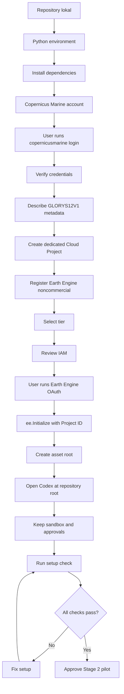
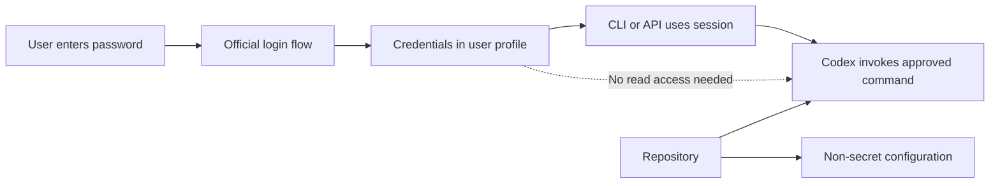
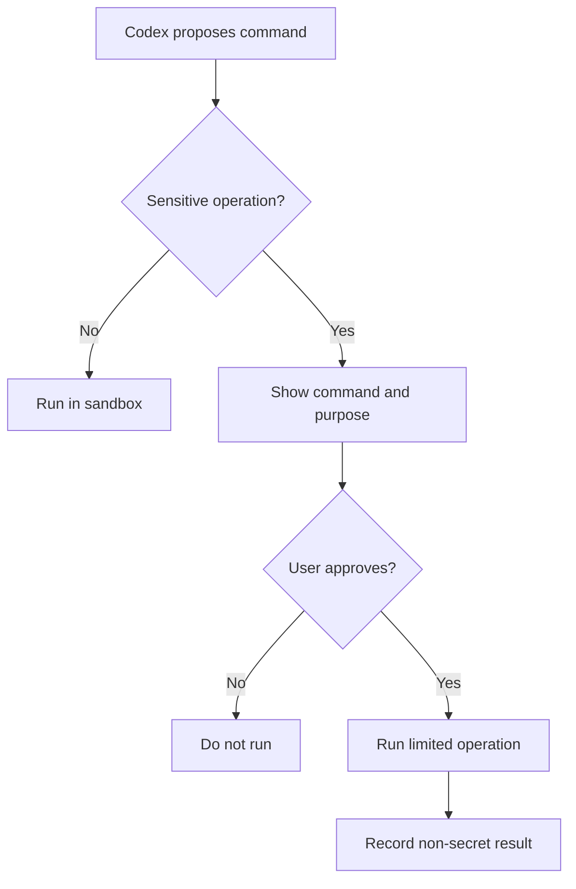

# SETUP_AND_AUTHENTICATION.md

# PENYIAPAN LINGKUNGAN DAN AUTENTIKASI  
## GLORYS12V1 Current Research & Teaching System

**Status:** Panduan operasional wajib  
**Platform utama:** Windows 10/11 dan PowerShell  
**Ruang penggunaan:** Pendidikan dan penelitian nonkomersial  
**Sumber data:** Copernicus Marine GLORYS12V1  
**Platform analisis:** Python dan Google Earth Engine  
**Pelaksana autentikasi:** Pemilik akun/pengguna manusia  
**Pengguna sesi autentikasi:** Skrip proyek dan Codex dalam workspace lokal  
**Terakhir diperbarui:** 31 Juli 2026  
**Dokumen terkait:** `AGENTS.md`, PRD, Tahap 0–3 versi terbaru  
**Dokumen berikutnya:** `SECURITY_AND_SECRETS.md`

---

## Daftar isi

1. [Tujuan dokumen](#1-tujuan-dokumen)
2. [Prinsip utama autentikasi](#2-prinsip-utama-autentikasi)
3. [Batas tanggung jawab pengguna dan Codex](#3-batas-tanggung-jawab-pengguna-dan-codex)
4. [Arsitektur autentikasi](#4-arsitektur-autentikasi)
5. [Prasyarat perangkat dan akun](#5-prasyarat-perangkat-dan-akun)
6. [Penyiapan repository lokal](#6-penyiapan-repository-lokal)
7. [Penyiapan Python](#7-penyiapan-python)
8. [Pembuatan virtual environment](#8-pembuatan-virtual-environment)
9. [Instalasi dependency](#9-instalasi-dependency)
10. [Verifikasi lingkungan Python](#10-verifikasi-lingkungan-python)
11. [Pembuatan akun Copernicus Marine](#11-pembuatan-akun-copernicus-marine)
12. [Login Copernicus Marine](#12-login-copernicus-marine)
13. [Verifikasi akses Copernicus Marine](#13-verifikasi-akses-copernicus-marine)
14. [Pengaturan jaringan Copernicus Marine](#14-pengaturan-jaringan-copernicus-marine)
15. [Uji metadata GLORYS12V1](#15-uji-metadata-glorys12v1)
16. [Pembuatan Google Cloud Project](#16-pembuatan-google-cloud-project)
17. [Registrasi Earth Engine nonkomersial](#17-registrasi-earth-engine-nonkomersial)
18. [Pemilihan tier Earth Engine](#18-pemilihan-tier-earth-engine)
19. [Pengendalian biaya Google Cloud](#19-pengendalian-biaya-google-cloud)
20. [IAM dan prinsip least privilege](#20-iam-dan-prinsip-least-privilege)
21. [Instalasi Earth Engine Python API](#21-instalasi-earth-engine-python-api)
22. [Autentikasi Earth Engine](#22-autentikasi-earth-engine)
23. [Inisialisasi Earth Engine](#23-inisialisasi-earth-engine)
24. [Verifikasi Earth Engine CLI](#24-verifikasi-earth-engine-cli)
25. [Pembuatan folder Earth Engine Assets](#25-pembuatan-folder-earth-engine-assets)
26. [Penyiapan Earth Engine Code Editor](#26-penyiapan-earth-engine-code-editor)
27. [Service account](#27-service-account)
28. [Penyiapan Codex](#28-penyiapan-codex)
29. [Approval yang wajib dipertahankan](#29-approval-yang-wajib-dipertahankan)
30. [File konfigurasi lokal](#30-file-konfigurasi-lokal)
31. [Script pemeriksaan setup](#31-script-pemeriksaan-setup)
32. [Urutan setup pertama kali](#32-urutan-setup-pertama-kali)
33. [Urutan memulai sesi kerja](#33-urutan-memulai-sesi-kerja)
34. [Urutan menutup sesi kerja](#34-urutan-menutup-sesi-kerja)
35. [Rotasi dan pencabutan autentikasi](#35-rotasi-dan-pencabutan-autentikasi)
36. [Troubleshooting Copernicus Marine](#36-troubleshooting-copernicus-marine)
37. [Troubleshooting Earth Engine](#37-troubleshooting-earth-engine)
38. [Troubleshooting Codex dan sandbox](#38-troubleshooting-codex-dan-sandbox)
39. [Larangan](#39-larangan)
40. [Artefak bukti setup](#40-artefak-bukti-setup)
41. [Checklist penerimaan](#41-checklist-penerimaan)
42. [Formulir pencatatan setup](#42-formulir-pencatatan-setup)
43. [Gerbang menuju pelaksanaan Tahap 2](#43-gerbang-menuju-pelaksanaan-tahap-2)
44. [Diagram Mermaid](#44-diagram-mermaid)
45. [Sumber resmi](#45-sumber-resmi)
46. [Catatan perubahan](#46-catatan-perubahan)

---

## 1. Tujuan dokumen

Dokumen ini menetapkan prosedur untuk:

- menyiapkan lingkungan Python;
- memasang dependency;
- membuat akun Copernicus Marine;
- melakukan login Copernicus Marine secara aman;
- membuat Google Cloud Project khusus;
- mendaftarkan proyek Earth Engine sebagai nonkomersial;
- mengautentikasi Earth Engine;
- membuat folder Earth Engine Assets;
- menyiapkan Codex agar bekerja dalam workspace lokal;
- membatasi akses Codex terhadap rahasia;
- memverifikasi bahwa seluruh layanan dapat digunakan;
- menghasilkan bukti setup yang dapat diaudit.

Dokumen ini tidak berisi password, token, private key, atau kredensial pengguna.

---

## 2. Prinsip utama autentikasi

Gunakan prinsip:

> **User-login, Codex-use.**

Artinya:

1. pengguna melakukan login sendiri;
2. password hanya dimasukkan pada halaman atau prompt resmi;
3. sesi autentikasi disimpan oleh tool resmi di profil pengguna;
4. Codex tidak membaca isi file kredensial;
5. Codex hanya menjalankan tool yang menggunakan sesi lokal;
6. operasi jaringan dan perubahan cloud tetap memerlukan approval;
7. seluruh aktivitas dicatat tanpa merekam rahasia.

### 2.1 Tujuan prinsip ini

- mengurangi kebocoran password;
- mencegah rahasia masuk Git;
- menjaga least privilege;
- memisahkan identitas pengguna dan agen;
- memudahkan pencabutan akses;
- menjaga audit trail.

---

## 3. Batas tanggung jawab pengguna dan Codex

### 3.1 Tugas pengguna

Pengguna wajib melakukan sendiri:

- membuat akun Copernicus Marine;
- membuka email verifikasi;
- memasukkan username dan password;
- membuat atau memilih Google Cloud Project;
- mendaftarkan proyek untuk Earth Engine;
- memilih tier nonkomersial;
- menyetujui OAuth;
- memilih Google Account;
- menyetujui perubahan IAM;
- menyetujui billing account jika kelak memilih Contributor Tier;
- menyetujui upload, delete, atau batch skala penuh;
- memeriksa layanan Cloud yang aktif.

### 3.2 Tugas Codex

Codex dapat:

- memeriksa versi tool;
- membuat file konfigurasi contoh;
- membuat script verifikasi;
- menjalankan test lokal;
- memanggil `describe` setelah approval jaringan;
- memanggil Earth Engine API setelah autentikasi tersedia;
- menginisialisasi Earth Engine menggunakan Project ID;
- membuat proposal perintah upload;
- membaca status task;
- membuat laporan setup.

### 3.3 Yang tidak boleh dilakukan Codex

Codex tidak boleh:

- meminta password;
- membaca file kredensial;
- mencetak environment variable rahasia;
- membuka file token;
- membuat service-account key tanpa persetujuan;
- menurunkan approval atau sandbox;
- menambahkan principal IAM sendiri;
- mengaktifkan layanan Cloud berbayar sendiri;
- mengubah tier Earth Engine sendiri;
- menghapus aset tanpa approval.

---

## 4. Arsitektur autentikasi

```text
Pengguna
├── Login Copernicus Marine
│   └── credentials file di user profile
├── OAuth Google/Earth Engine
│   └── credentials lokal
└── Persetujuan operasi sensitif

Codex
├── bekerja di repository
├── tidak membaca credentials
├── memanggil CLI/API terautentikasi
└── meminta approval untuk jaringan/upload/delete
```

Tidak ada password di:

- repository;
- prompt Codex;
- JSON konfigurasi;
- `.env` yang dikomit;
- README;
- screenshot publik;
- log.

---

## 5. Prasyarat perangkat dan akun

### 5.1 Perangkat

Rekomendasi awal:

- Windows 10 atau 11 64-bit;
- RAM minimal 16 GB, rekomendasi 32 GB;
- penyimpanan kosong yang memadai;
- koneksi internet stabil;
- browser modern;
- PowerShell;
- Git;
- Python;
- Codex App/CLI atau integrasi Codex yang bekerja lokal.

### 5.2 Akun

Diperlukan:

1. akun Copernicus Marine;
2. Google Account;
3. Google Cloud Project khusus;
4. akses Earth Engine nonkomersial;
5. akun GitHub jika repository disimpan di GitHub;
6. akun ChatGPT/Codex sesuai metode penggunaan.

### 5.3 Akun yang disarankan

Untuk Earth Engine:

- gunakan akun institusional jika tersedia dan diizinkan;
- gunakan satu proyek khusus penelitian ini;
- jangan menggunakan project produksi lain;
- jangan mencampur penggunaan komersial dan nonkomersial;
- jangan menggunakan project untuk beban kerja Cloud lain tanpa evaluasi biaya.

---

## 6. Penyiapan repository lokal

### 6.1 Nama direktori

Contoh:

```text
E:\project\glorys-current-lab
```

Hindari:

- folder sinkronisasi yang tidak stabil;
- path terlalu panjang;
- folder sistem;
- folder yang membutuhkan hak Administrator;
- repository bercampur dengan data pribadi.

### 6.2 Clone atau buat repository

Clone:

```powershell
git clone <REPOSITORY_URL> E:\project\glorys-current-lab
Set-Location E:\project\glorys-current-lab
```

Repository baru:

```powershell
New-Item -ItemType Directory -Path E:\project\glorys-current-lab
Set-Location E:\project\glorys-current-lab
git init
```

### 6.3 Pemeriksaan awal

```powershell
git status
Get-ChildItem
```

Pastikan root memiliki:

```text
AGENTS.md
PRD.md atau PRD_GLORYS_Current_Research_Teaching_System.md
README.md
docs/
```

### 6.4 Jangan memindahkan kredensial ke repository

File autentikasi harus tetap berada di user profile atau penyimpanan resmi tool.

---

## 7. Penyiapan Python

### 7.1 Versi

Gunakan versi Python yang:

- kompatibel dengan seluruh dependency;
- telah diuji di Tahap 2;
- dicatat di `requirements-lock.txt`;
- tidak berubah selama batch.

Python 3.13 dapat digunakan apabila seluruh dependency lulus instalasi dan test. Jangan menganggap versi terbaru selalu paling stabil untuk seluruh library geospasial.

### 7.2 Pemeriksaan

```powershell
python --version
python -m pip --version
where.exe python
```

Catat interpreter yang digunakan.

### 7.3 Jika terdapat banyak Python

Gunakan:

```powershell
py -0p
```

Pilih interpreter secara eksplisit ketika membuat environment:

```powershell
py -3.13 -m venv .venv
```

Jika versi 3.13 menimbulkan incompatibility, gunakan versi yang telah disetujui dan dokumentasikan perubahan.

---

## 8. Pembuatan virtual environment

### 8.1 Venv sebagai pilihan sederhana

Dari root repository:

```powershell
python -m venv .venv
```

Aktifkan:

```powershell
.\.venv\Scripts\Activate.ps1
```

Verifikasi:

```powershell
python --version
python -m pip --version
```

### 8.2 Jika PowerShell memblokir aktivasi

Periksa:

```powershell
Get-ExecutionPolicy -List
```

Untuk user saat ini, jika kebijakan organisasi mengizinkan:

```powershell
Set-ExecutionPolicy -Scope CurrentUser RemoteSigned
```

Jangan mengubah policy mesin atau organisasi tanpa kewenangan.

### 8.3 Conda sebagai alternatif

Jika repository menetapkan Conda:

```powershell
conda create -n glorys-current python=3.13 -y
conda activate glorys-current
```

Jangan menggunakan venv dan Conda secara bersamaan untuk environment yang sama.

---

## 9. Instalasi dependency

### 9.1 Prioritas

Urutan:

1. gunakan `requirements-lock.txt`;
2. jika belum ada, gunakan `requirements.txt`;
3. jika keduanya belum ada, lakukan bootstrap minimal dan segera freeze.

### 9.2 Instalasi dari lock

```powershell
python -m pip install --upgrade pip
python -m pip install -r requirements-lock.txt
```

### 9.3 Instalasi dari requirements

```powershell
python -m pip install --upgrade pip
python -m pip install -r requirements.txt
```

### 9.4 Bootstrap minimal

Hanya jika file dependency belum tersedia:

```powershell
python -m pip install `
  copernicusmarine `
  earthengine-api `
  xarray `
  netCDF4 `
  h5netcdf `
  numpy `
  pandas `
  rasterio `
  rioxarray `
  pyproj `
  pydantic `
  pytest
```

Setelah lulus:

```powershell
python -m pip freeze > requirements-lock.txt
```

Bootstrap minimal bukan pengganti kurasi dependency.

### 9.5 Larangan upgrade diam-diam

Jangan menjalankan:

```powershell
python -m pip install --upgrade copernicusmarine
python -m pip install --upgrade earthengine-api
```

pada environment tervalidasi tanpa:

- membaca changelog;
- membuat backup lock;
- mengulang test pilot;
- mencatat perubahan.

---

## 10. Verifikasi lingkungan Python

Jalankan:

```powershell
python -c "import sys; print(sys.executable)"
python -c "import copernicusmarine; print(copernicusmarine.__version__)"
python -c "import ee; print(ee.__version__)"
python -c "import xarray, netCDF4, rasterio, rioxarray; print('IMPORT PASS')"
```

Simpan versi:

```powershell
python -m pip freeze > outputs\setup\pip_freeze.txt
```

Jika folder belum tersedia:

```powershell
New-Item -ItemType Directory -Force outputs\setup
```

---

## 11. Pembuatan akun Copernicus Marine

### 11.1 Prosedur

1. buka situs resmi Copernicus Marine;
2. pilih registrasi akun;
3. gunakan email yang dapat diakses;
4. isi data yang diminta;
5. verifikasi email;
6. masuk ke portal;
7. baca syarat penggunaan;
8. jangan membagikan password.

### 11.2 Catatan akun

Simpan hanya informasi nonrahasia dalam catatan proyek:

```text
Account owner:
Account email category: personal/institutional
Registration date:
Access verified: yes/no
```

Jangan menyimpan:

- password;
- recovery code;
- session cookie;
- token;
- isi credentials file.

---

## 12. Login Copernicus Marine

### 12.1 Metode utama

Pengguna menjalankan sendiri:

```powershell
copernicusmarine login
```

Tool akan meminta:

```text
username:
password:
```

Password tidak ditampilkan saat diketik.

Toolbox menyimpan konfigurasi autentikasi pada direktori konfigurasi Copernicus Marine di user profile. Lokasi aktual ditampilkan oleh CLI setelah login.

### 12.2 Pemeriksaan validitas

```powershell
copernicusmarine login --check-credentials-valid
```

Exit code:

- `0`: valid;
- `1`: tidak valid.

PowerShell:

```powershell
copernicusmarine login --check-credentials-valid
$LASTEXITCODE
```

### 12.3 Jangan gunakan password pada command line

Dilarang:

```powershell
copernicusmarine login --username <USERNAME> --password <PASSWORD>
```

karena dapat masuk ke:

- command history;
- process list;
- terminal capture;
- log.

### 12.4 Environment variable

Environment variable hanya dipertimbangkan untuk pipeline headless yang disetujui.

Untuk proyek lokal dengan Codex:

> gunakan credentials file dari perintah `login`, bukan environment variable permanen.

Jangan memasukkan password ke `.env` repository.

---

## 13. Verifikasi akses Copernicus Marine

### 13.1 Versi

```powershell
copernicusmarine --version
```

### 13.2 Login

```powershell
copernicusmarine login --check-credentials-valid
```

### 13.3 Metadata sederhana

```powershell
copernicusmarine describe `
  --product-id GLOBAL_MULTIYEAR_PHY_001_030 `
  --return-fields all `
  > outputs\setup\copernicus_product_metadata.json
```

### 13.4 Dataset harian

```powershell
copernicusmarine describe `
  --dataset-id cmems_mod_glo_phy_my_0.083deg_P1D-m `
  --show-all-versions `
  --return-fields all `
  > outputs\setup\copernicus_daily_metadata.json
```

### 13.5 Dataset bulanan

```powershell
copernicusmarine describe `
  --dataset-id cmems_mod_glo_phy_my_0.083deg_P1M-m `
  --show-all-versions `
  --return-fields all `
  > outputs\setup\copernicus_monthly_metadata.json
```

### 13.6 Kriteria lulus

- command selesai;
- file JSON tidak kosong;
- Product ID benar;
- Dataset ID benar;
- metadata dapat dibaca;
- tidak ada password dalam output.

---

## 14. Pengaturan jaringan Copernicus Marine

### 14.1 Timeout sesi PowerShell

Jika jaringan lambat:

```powershell
$env:COPERNICUSMARINE_HTTPS_TIMEOUT = "120"
$env:COPERNICUSMARINE_HTTPS_RETRIES = "5"
```

Hapus setelah sesi jika tidak diperlukan:

```powershell
Remove-Item Env:COPERNICUSMARINE_HTTPS_TIMEOUT -ErrorAction SilentlyContinue
Remove-Item Env:COPERNICUSMARINE_HTTPS_RETRIES -ErrorAction SilentlyContinue
```

Nilai tersebut bukan rahasia.

### 14.2 Threads

Jika thread menimbulkan masalah:

```powershell
$env:COPERNICUSMARINE_USE_THREADS = "False"
```

Konsekuensi:

- proses dapat lebih lambat;
- gunakan hanya setelah diagnosis.

### 14.3 SSL

Jangan menonaktifkan pemeriksaan SSL untuk mengatasi error.

Jika ada error sertifikat:

- periksa jam sistem;
- periksa antivirus/proxy;
- periksa sertifikat organisasi;
- konsultasikan dengan administrator jaringan;
- jangan menggunakan opsi insecure sebagai solusi permanen.

---

## 15. Uji metadata GLORYS12V1

Uji metadata adalah gerbang sebelum subset pilot.

Periksa:

```text
Product ID
Dataset ID
dataset version
dataset part
uo
vo
units
time coverage
depth coverage
longitude coverage
latitude coverage
```

Jika metadata berbeda dari dokumen Tahap 0:

- jangan lanjut;
- simpan output;
- dokumentasikan perbedaan;
- lakukan review ilmiah.

---

## 16. Pembuatan Google Cloud Project

### 16.1 Gunakan proyek khusus

Contoh nama tampilan:

```text
GLORYS Current Research Education
```

Contoh Project ID:

```text
glorys-current-research-education
```

Project ID harus unik secara global. Jika tidak tersedia, gunakan pola:

```text
glorys-current-research-<identifier>
```

### 16.2 Catat Project ID

Project ID bukan rahasia dan boleh disimpan di konfigurasi:

```json
{
  "earth_engine_project_id": "PROJECT_ID"
}
```

### 16.3 Jangan menggunakan project lain

Hindari menggunakan:

- project produksi;
- project hosting lain;
- project dengan layanan berbayar aktif;
- project milik pihak lain tanpa izin;
- project yang dipakai untuk tujuan operasional pemerintah.

---

## 17. Registrasi Earth Engine nonkomersial

Earth Engine memerlukan Cloud Project yang:

- Earth Engine API-nya aktif;
- terdaftar sebagai komersial atau nonkomersial;
- memiliki IAM yang benar.

Untuk proyek ini:

> daftarkan sebagai **noncommercial** untuk pendidikan dan penelitian.

### 17.1 Langkah konseptual

1. masuk menggunakan Google Account;
2. buka halaman registrasi Earth Engine;
3. pilih membuat project baru atau project yang telah dibuat;
4. pastikan Earth Engine API aktif;
5. pilih penggunaan nonkomersial;
6. isi tujuan pendidikan dan penelitian dengan jujur;
7. pilih tier;
8. simpan bukti registrasi;
9. catat tanggal re-verifikasi tahunan.

### 17.2 Deskripsi tujuan

Contoh yang sesuai:

```text
Development of a noncommercial educational and scientific research
system for regional ocean-current analysis using Copernicus Marine
GLORYS12V1 data. The system is intended for teaching, reproducible
research, methodological demonstrations, and scientific analysis.
It is not used for commercial services, operational government
decision-making, navigation safety, or engineering design.
```

Jangan menulis tujuan yang tidak sesuai penggunaan sebenarnya.

---

## 18. Pemilihan tier Earth Engine

### 18.1 Community Tier

Gunakan sebagai awal jika:

- pilot masih berjalan;
- beban komputasi belum diketahui;
- ingin menghindari billing account;
- analisis berat dialihkan ke Python.

Kuota bulanan yang tercantum pada dokumentasi 2026:

```text
150 EECU-hours
```

### 18.2 Contributor Tier

Pertimbangkan setelah benchmark jika:

- Community Tier tidak cukup;
- penelitian membutuhkan lebih banyak komputasi;
- project tetap nonkomersial;
- pengguna bersedia menghubungkan billing account untuk verifikasi.

Kuota yang tercantum:

```text
1.000 EECU-hours per bulan
```

Earth Engine nonkomersialnya tidak ditagih, tetapi layanan Google Cloud lain dapat menimbulkan biaya.

### 18.3 Partner Tier

Tidak diperlukan pada tahap awal.

Dapat dipertimbangkan hanya jika:

- kelompok penelitian memenuhi kriteria;
- kebutuhan komputasi sangat besar;
- dampak penelitian dapat dibuktikan;
- proses aplikasi disetujui institusi.

### 18.4 Rekomendasi proyek

Mulai dengan:

> **Community Tier**

Lakukan benchmark Tahap 2, kemudian evaluasi apakah Contributor Tier dibutuhkan.

---

## 19. Pengendalian biaya Google Cloud

### 19.1 Prinsip

Earth Engine nonkomersial dapat digunakan tanpa biaya Earth Engine sesuai tier, tetapi API Cloud lain dapat berbiaya.

### 19.2 Jangan aktifkan tanpa kebutuhan

- Cloud Storage;
- BigQuery;
- Vertex AI;
- Cloud Run;
- Compute Engine;
- Cloud SQL;
- layanan berbayar lain.

### 19.3 Jika Contributor Tier memerlukan billing account

Lakukan:

- pastikan project tetap terdaftar nonkomersial;
- periksa layanan aktif;
- pasang budget alert jika tersedia;
- jangan memberikan Codex kewenangan billing;
- jangan mengaktifkan API tambahan tanpa approval;
- audit biaya secara berkala.

### 19.4 GCS

Google Cloud Storage tidak diperlukan untuk autentikasi awal.

Jika kelak dipakai untuk upload manifest:

- buat keputusan terpisah;
- estimasikan biaya;
- atur lifecycle;
- gunakan bucket khusus;
- jangan aktifkan hanya karena lebih mudah.

---

## 20. IAM dan prinsip least privilege

### 20.1 Pengguna utama

Untuk menggunakan API dan membuat aset, pengguna membutuhkan:

- `roles/serviceusage.serviceUsageConsumer`;
- `roles/earthengine.writer`.

Jika pengguna adalah pencipta project dan registrasi berhasil, permission dapat sudah tersedia. Tetap periksa.

### 20.2 Viewer

Untuk pengguna baca saja:

- `roles/serviceusage.serviceUsageConsumer`;
- `roles/earthengine.viewer`.

### 20.3 Admin

Jangan memberikan:

```text
roles/earthengine.admin
roles/owner
```

kepada kolaborator jika tidak diperlukan.

### 20.4 Apps Publisher

Tambahkan hanya pada Tahap 9 jika benar-benar menerbitkan Earth Engine App:

```text
roles/earthengine.appsPublisher
```

### 20.5 Codex bukan principal IAM

Codex tidak membutuhkan akun Google terpisah.

Codex menggunakan sesi akun pengguna pada mesin lokal dan tetap dibatasi approval.

---

## 21. Instalasi Earth Engine Python API

Jika belum dipasang melalui requirements:

```powershell
python -m pip install earthengine-api
```

CLI `earthengine` ikut dipasang bersama Python API.

Verifikasi:

```powershell
earthengine
```

atau:

```powershell
earthengine -h
```

Jangan upgrade pada environment tervalidasi tanpa regression test.

---

## 22. Autentikasi Earth Engine

### 22.1 CLI

Pengguna menjalankan:

```powershell
earthengine authenticate
```

Browser akan membuka flow OAuth.

Pengguna:

1. memilih Google Account;
2. memeriksa Project ID;
3. menyetujui scope yang diperlukan;
4. menyelesaikan flow;
5. kembali ke terminal.

### 22.2 Jika kredensial perlu dibuat ulang

```powershell
earthengine authenticate --force
```

Gunakan hanya jika:

- kredensial rusak;
- akun berubah;
- scope perlu diperbarui;
- troubleshooting memerlukannya.

### 22.3 Python

Alternatif:

```python
import ee

ee.Authenticate()
```

Untuk setup lokal pertama, CLI lebih mudah diaudit.

### 22.4 Penyimpanan token

Kredensial disimpan secara persisten pada profil user oleh library.

Jangan:

- mencari lokasi untuk membacanya;
- menyalinnya ke repository;
- menampilkan isi file;
- mengirim file kepada Codex.

---

## 23. Inisialisasi Earth Engine

### 23.1 Set project CLI

```powershell
earthengine set_project PROJECT_ID
```

Ganti `PROJECT_ID` dengan nilai aktual.

### 23.2 Python

```python
import ee

PROJECT_ID = "PROJECT_ID"

ee.Initialize(project=PROJECT_ID)

message = ee.String("Earth Engine authentication PASS").getInfo()
print(message)
```

### 23.3 Uji komputasi

```python
import ee

PROJECT_ID = "PROJECT_ID"

ee.Initialize(project=PROJECT_ID)

result = ee.Number(1).add(1).getInfo()

if result != 2:
    raise RuntimeError(f"Unexpected Earth Engine result: {result}")

print("EARTH ENGINE COMPUTE PASS")
```

### 23.4 Failure

Jika `ee.Initialize()` gagal:

- periksa Project ID;
- periksa API;
- periksa registrasi;
- periksa IAM;
- periksa Service Usage Consumer;
- autentikasi ulang jika perlu.

---

## 24. Verifikasi Earth Engine CLI

### 24.1 Project

```powershell
earthengine set_project PROJECT_ID
```

### 24.2 List root asset

```powershell
earthengine ls projects/PROJECT_ID/assets
```

### 24.3 Task list

```powershell
earthengine task list
```

### 24.4 Catat output aman

```powershell
earthengine task list > outputs\setup\earthengine_task_list.txt
```

Task ID bukan password, tetapi jangan membagikan data proyek tanpa kebutuhan.

---

## 25. Pembuatan folder Earth Engine Assets

### 25.1 Struktur awal

```text
projects/PROJECT_ID/assets/glorys12v1
```

### 25.2 Perintah

```powershell
earthengine create folder `
  projects/PROJECT_ID/assets/glorys12v1
```

Subfolder:

```powershell
earthengine create folder `
  projects/PROJECT_ID/assets/glorys12v1/boundaries

earthengine create folder `
  projects/PROJECT_ID/assets/glorys12v1/source

earthengine create folder `
  projects/PROJECT_ID/assets/glorys12v1/derived

earthengine create folder `
  projects/PROJECT_ID/assets/glorys12v1/validation
```

### 25.3 Jangan membuat seluruh struktur tanpa kebutuhan

Buat folder minimum dahulu.

Upload data hanya setelah Tahap 5 lulus.

### 25.4 Verifikasi

```powershell
earthengine ls projects/PROJECT_ID/assets/glorys12v1
```

---

## 26. Penyiapan Earth Engine Code Editor

### 26.1 Project aktif

Di Code Editor:

1. masuk menggunakan akun yang sama;
2. buka menu profil;
3. pilih **Change Cloud Project**;
4. pilih Project ID proyek;
5. periksa Assets panel;
6. pastikan project yang aktif benar.

### 26.2 Script test

```javascript
print('Project setup test');
print(ee.Number(1).add(1));
```

### 26.3 Jangan menaruh rahasia

Code Editor tidak boleh berisi:

- password Copernicus Marine;
- token;
- service-account key;
- private URL;
- kredensial Cloud.

---

## 27. Service account

### 27.1 Keputusan awal

> **Service account tidak digunakan pada Tahap 0–8.**

Alasan:

- pengembangan dilakukan oleh pengguna lokal;
- OAuth user sudah cukup;
- menghindari key management;
- mengurangi permukaan serangan;
- belum ada backend tanpa pengawasan.

### 27.2 Kapan dipertimbangkan

- backend server;
- scheduled pipeline;
- CI/CD;
- aplikasi tanpa pengguna;
- Earth Engine App tertentu;
- proses headless resmi.

### 27.3 Jika kelak dibutuhkan

Wajib dibuat ADR yang membahas:

- kebutuhan;
- IAM minimum;
- keyless authentication;
- Application Default Credentials;
- rotasi;
- audit;
- revocation;
- penyimpanan secret.

Jangan membuat JSON key sebagai pilihan pertama.

---

## 28. Penyiapan Codex

### 28.1 Lokasi kerja

Buka Codex pada root repository:

```text
E:\project\glorys-current-lab
```

Codex harus dapat membaca:

```text
AGENTS.md
PRD.md
docs/
```

### 28.2 Workspace trust

Hanya percayai repository yang:

- dibuat sendiri;
- berasal dari sumber terpercaya;
- telah diperiksa;
- tidak memuat script mencurigakan.

### 28.3 Sandbox

Pertahankan sandbox default.

Codex secara lokal dibatasi ke workspace dan jaringan umumnya membutuhkan approval.

### 28.4 Network

Jangan mengaktifkan network global tanpa batas.

Berikan approval per kebutuhan:

- Copernicus `describe`;
- subset pilot;
- Earth Engine initialization;
- task status;
- upload sampel.

### 28.5 Kredensial

Codex tidak perlu mengetahui:

- password Copernicus;
- password Google;
- token OAuth;
- recovery code;
- private key.

### 28.6 Prompt awal Codex

Contoh:

```text
Baca AGENTS.md, PRD, dan dokumen Tahap 0–2.
Jangan menjalankan operasi jaringan sebelum meminta approval.
Gunakan sesi Copernicus Marine dan Earth Engine yang sudah
saya autentikasi secara lokal. Jangan membaca atau mencetak
file kredensial. Saat ini fokus hanya pada preflight setup.
```

---

## 29. Approval yang wajib dipertahankan

### 29.1 Selalu minta approval

- akses internet;
- login;
- instalasi dependency;
- upgrade dependency;
- unduhan nyata;
- upload aset;
- perubahan IAM;
- perubahan tier;
- pengaitan billing;
- aktivasi API;
- membuat bucket;
- delete aset;
- delete data;
- batch skala penuh;
- perubahan sandbox;
- Git destructive operations.

### 29.2 Tidak perlu approval tambahan untuk aktivitas lokal aman

Tergantung kebijakan Codex yang aktif:

- membaca source code;
- mengedit file proyek;
- menjalankan unit test lokal;
- menjalankan linter;
- membuat data sintetis;
- memeriksa diff;
- membuat dokumentasi.

### 29.3 Jangan membuat approval terlalu luas

Hindari approval seperti:

```text
izinkan semua perintah
izinkan semua jaringan
izinkan semua delete
```

Gunakan scope sempit.

---

## 30. File konfigurasi lokal

### 30.1 File contoh yang dikomit

```text
config/local.example.json
```

Contoh:

```json
{
  "earth_engine_project_id": "PROJECT_ID",
  "earth_engine_asset_root": "projects/PROJECT_ID/assets/glorys12v1",
  "copernicus_product_id": "GLOBAL_MULTIYEAR_PHY_001_030",
  "copernicus_daily_dataset_id": "cmems_mod_glo_phy_my_0.083deg_P1D-m",
  "copernicus_monthly_dataset_id": "cmems_mod_glo_phy_my_0.083deg_P1M-m",
  "display_timezone": "Asia/Jayapura"
}
```

Tidak ada rahasia di file tersebut.

### 30.2 File lokal

```text
config/local.json
```

Boleh berisi:

- Project ID;
- path lokal;
- AOI;
- asset root;
- parameter nonrahasia.

Tidak boleh berisi:

- password;
- token;
- credentials path jika tidak diperlukan;
- private key.

### 30.3 `.gitignore`

```gitignore
.venv/
config/local.json
.env
*.credentials
*.key
*.pem
service-account*.json
data/
outputs/logs/
```

`outputs/setup/` dapat dipilih untuk dikomit atau tidak setelah diperiksa agar tidak memuat informasi sensitif.

---

## 31. Script pemeriksaan setup

Buat:

```text
python/00_check_setup.py
```

Contoh:

```python
from __future__ import annotations

import json
import logging
import subprocess
import sys
from pathlib import Path

import ee


LOGGER = logging.getLogger(__name__)


def run_command(command: list[str]) -> dict[str, object]:
    completed = subprocess.run(
        command,
        check=False,
        capture_output=True,
        text=True,
    )
    return {
        "command": command,
        "returncode": completed.returncode,
        "stdout": completed.stdout.strip(),
        "stderr": completed.stderr.strip(),
    }


def main() -> int:
    logging.basicConfig(level=logging.INFO)

    config_path = Path("config/local.json")
    if not config_path.exists():
        LOGGER.error("Missing config/local.json")
        return 1

    config = json.loads(config_path.read_text(encoding="utf-8"))
    project_id = config.get("earth_engine_project_id")

    if not project_id or project_id == "PROJECT_ID":
        LOGGER.error("Earth Engine Project ID is not configured")
        return 1

    copernicus_check = run_command(
        [
            "copernicusmarine",
            "login",
            "--check-credentials-valid",
        ]
    )

    if copernicus_check["returncode"] != 0:
        LOGGER.error("Copernicus Marine authentication failed")
        return 1

    try:
        ee.Initialize(project=project_id)
        result = ee.Number(1).add(1).getInfo()
    except Exception:
        LOGGER.exception("Earth Engine initialization failed")
        return 1

    if result != 2:
        LOGGER.error("Unexpected Earth Engine test result: %s", result)
        return 1

    LOGGER.info("SETUP PASS")
    return 0


if __name__ == "__main__":
    sys.exit(main())
```

### 31.1 Keamanan script

Script tidak boleh:

- membaca credentials file;
- mencetak token;
- mencetak environment;
- mencetak password;
- menyimpan OAuth response;
- melakukan unduhan.

---

## 32. Urutan setup pertama kali

```text
1. Siapkan repository.
2. Baca AGENTS.md.
3. Buat virtual environment.
4. Instal dependency.
5. Freeze dependency.
6. Buat akun Copernicus Marine.
7. Jalankan copernicusmarine login.
8. Periksa credentials.
9. Uji describe GLORYS12V1.
10. Buat Google Cloud Project khusus.
11. Daftarkan Earth Engine noncommercial.
12. Pilih Community Tier.
13. Periksa Earth Engine API.
14. Periksa IAM.
15. Jalankan earthengine authenticate.
16. Set Project ID.
17. Uji ee.Initialize.
18. Buat asset root.
19. Konfigurasi Code Editor.
20. Buat config/local.json.
21. Jalankan 00_check_setup.py.
22. Simpan bukti setup.
23. Putuskan PASS/FAIL.
```

---

## 33. Urutan memulai sesi kerja

```powershell
Set-Location E:\project\glorys-current-lab
.\.venv\Scripts\Activate.ps1

git status
python --version
copernicusmarine --version
earthengine -h

python python\00_check_setup.py
```

Setelah `SETUP PASS`, Codex dapat mulai tugas sesuai tahap aktif.

---

## 34. Urutan menutup sesi kerja

1. hentikan task lokal;
2. periksa task Earth Engine;
3. simpan log nonrahasia;
4. periksa file partial;
5. periksa `git status`;
6. pastikan tidak ada kredensial di diff;
7. hapus environment variable sementara;
8. deactivate environment.

PowerShell:

```powershell
Remove-Item Env:COPERNICUSMARINE_HTTPS_TIMEOUT -ErrorAction SilentlyContinue
Remove-Item Env:COPERNICUSMARINE_HTTPS_RETRIES -ErrorAction SilentlyContinue
Remove-Item Env:COPERNICUSMARINE_USE_THREADS -ErrorAction SilentlyContinue

deactivate
```

Autentikasi tidak perlu dihapus setiap sesi.

---

## 35. Rotasi dan pencabutan autentikasi

### 35.1 Copernicus Marine

Jika password berubah:

1. ubah password melalui portal resmi;
2. jalankan ulang `copernicusmarine login`;
3. izinkan overwrite melalui prompt;
4. periksa validitas;
5. jangan menghapus file secara manual sebelum mengetahui lokasi dan dampaknya.

### 35.2 Earth Engine

Jika akun atau scope perlu diubah:

```powershell
earthengine authenticate --force
```

Untuk pencabutan penuh:

- cabut akses aplikasi pada Google Account;
- periksa OAuth application access;
- hapus IAM user dari project jika diperlukan;
- jangan hanya menghapus file lokal dan menganggap akses tercabut.

### 35.3 Jika perangkat hilang

- ubah password;
- cabut sesi;
- cabut OAuth;
- review IAM;
- review task;
- review asset changes;
- review GitHub access;
- dokumentasikan insiden.

---

## 36. Troubleshooting Copernicus Marine

### 36.1 Command tidak ditemukan

```powershell
python -m pip show copernicusmarine
where.exe copernicusmarine
```

Pastikan environment aktif.

### 36.2 Kredensial tidak valid

```powershell
copernicusmarine login --check-credentials-valid
```

Jika gagal:

- periksa akun melalui portal;
- pastikan username benar;
- login ulang;
- jangan menulis password di command line.

### 36.3 Metadata gagal

Periksa:

- internet;
- proxy;
- firewall;
- status layanan;
- versi Toolbox;
- Product ID;
- Dataset ID.

### 36.4 Timeout

Gunakan timeout sesi:

```powershell
$env:COPERNICUSMARINE_HTTPS_TIMEOUT = "120"
$env:COPERNICUSMARINE_HTTPS_RETRIES = "5"
```

### 36.5 Dataset sedang diperbarui

Jangan memaksa batch.

- simpan error;
- periksa metadata;
- tunda;
- gunakan `raise_if_updating` pada pipeline.

---

## 37. Troubleshooting Earth Engine

### 37.1 `Not signed up for Earth Engine`

- periksa registrasi project;
- periksa akun;
- periksa project aktif;
- periksa API.

### 37.2 `Project not found`

- periksa Project ID, bukan nama tampilan;
- periksa permission;
- periksa organisasi.

### 37.3 `Permission denied`

Periksa:

- `roles/serviceusage.serviceUsageConsumer`;
- `roles/earthengine.writer` atau viewer;
- Earth Engine API;
- project registration.

### 37.4 `ee.Initialize()` gagal

```powershell
earthengine authenticate --force
earthengine set_project PROJECT_ID
```

Lalu uji ulang.

### 37.5 Asset root tidak ditemukan

Buat:

```powershell
earthengine create folder projects/PROJECT_ID/assets/glorys12v1
```

### 37.6 Kuota habis

- periksa EECU;
- pindahkan komputasi berat ke Python;
- tunggu reset;
- evaluasi Contributor Tier;
- jangan membuat project tambahan untuk mengakali kuota.

### 37.7 Biaya Cloud tidak terduga

- periksa layanan aktif;
- hentikan resource lain;
- jangan berasumsi semua Google Cloud gratis;
- audit billing;
- jangan mengubah registrasi menjadi komersial tanpa keputusan.

---

## 38. Troubleshooting Codex dan sandbox

### 38.1 Network diblokir

Ini dapat merupakan perilaku keamanan normal.

- review command;
- berikan approval terbatas;
- jangan mengaktifkan network permanen tanpa batas.

### 38.2 Codex meminta membaca kredensial

Tolak.

Gunakan CLI/API resmi tanpa membaca file rahasia.

### 38.3 Command perlu berjalan di luar workspace

Periksa:

- apakah benar diperlukan;
- apakah command aman;
- apakah hanya membaca user profile;
- apakah dapat dilakukan pengguna secara manual.

Autentikasi lebih baik dilakukan manual oleh pengguna.

### 38.4 Codex ingin mengubah approval

Tolak kecuali ada alasan kuat yang terdokumentasi.

### 38.5 Repository tidak dipercaya

Periksa:

- source repository;
- script startup;
- hooks;
- dependency;
- `AGENTS.md`;
- `.codex/`;
- file executable.

---

## 39. Larangan

Dilarang:

1. mengirim password melalui chat;
2. menyimpan password pada prompt;
3. commit `.env`;
4. commit credentials file;
5. commit service-account key;
6. mencetak seluruh environment;
7. menggunakan akun bersama tanpa pengendalian;
8. memberi Codex Owner role;
9. mengaktifkan layanan berbayar tanpa approval;
10. menggunakan project operasional lain;
11. menonaktifkan SSL;
12. menonaktifkan sandbox;
13. memberi network tanpa batas;
14. membuat banyak project untuk mengakali kuota;
15. mengklaim setup berhasil hanya karena login browser selesai;
16. mengunggah data sebelum validasi;
17. menyimpan token dalam screenshot;
18. memakai Contributor Tier tanpa memeriksa billing dan layanan aktif.

---

## 40. Artefak bukti setup

```text
outputs/setup/
├── python_version.txt
├── pip_freeze.txt
├── copernicus_version.txt
├── copernicus_credentials_check.txt
├── copernicus_product_metadata.json
├── copernicus_daily_metadata.json
├── copernicus_monthly_metadata.json
├── earthengine_cli_help.txt
├── earthengine_compute_test.json
├── earthengine_asset_root.txt
├── project_registration_record.md
├── iam_review.md
└── setup_report.md
```

### 40.1 Sanitasi

Sebelum menyimpan atau commit:

- periksa username;
- periksa email;
- periksa token;
- periksa path user;
- periksa project details yang tidak boleh dipublikasikan;
- hapus rahasia;
- simpan hanya bukti yang diperlukan.

---

## 41. Checklist penerimaan

### 41.1 Repository

- [ ] Repository lokal tersedia.
- [ ] `AGENTS.md` tersedia.
- [ ] PRD tersedia.
- [ ] Dokumen tahap tersedia.
- [ ] `.gitignore` melindungi rahasia dan data besar.

### 41.2 Python

- [ ] Python terdeteksi.
- [ ] Virtual environment aktif.
- [ ] Dependency terinstal.
- [ ] `requirements-lock.txt` tersedia.
- [ ] Import utama lulus.
- [ ] Versi tersimpan.

### 41.3 Copernicus Marine

- [ ] Akun terverifikasi.
- [ ] Login dilakukan pengguna.
- [ ] Credentials check exit code 0.
- [ ] `describe` Product ID lulus.
- [ ] Dataset harian ditemukan.
- [ ] Dataset bulanan ditemukan.
- [ ] Metadata snapshot tersimpan.
- [ ] Tidak ada password di repository.

### 41.4 Google Cloud/Earth Engine

- [ ] Project khusus tersedia.
- [ ] Project ID dicatat.
- [ ] Earth Engine API aktif.
- [ ] Project terdaftar nonkomersial.
- [ ] Tier dicatat.
- [ ] Tanggal re-verifikasi dicatat.
- [ ] IAM diperiksa.
- [ ] OAuth dilakukan pengguna.
- [ ] `ee.Initialize()` lulus.
- [ ] komputasi `1 + 1 = 2` lulus.
- [ ] asset root tersedia.
- [ ] Code Editor memakai project yang benar.

### 41.5 Codex

- [ ] Codex dibuka pada root repository.
- [ ] Codex membaca `AGENTS.md`.
- [ ] Sandbox tetap aktif.
- [ ] Network approval tetap aktif.
- [ ] Codex tidak diberi password.
- [ ] Prompt setup menyatakan batas rahasia.
- [ ] Operasi sensitif membutuhkan approval.

### 41.6 Biaya dan penggunaan

- [ ] Penggunaan pendidikan/penelitian dicatat.
- [ ] Project tidak digunakan operasional.
- [ ] Layanan Cloud aktif diperiksa.
- [ ] Tidak ada layanan berbayar yang tidak diperlukan.
- [ ] Community/Contributor Tier dipilih secara sadar.
- [ ] Monitoring EECU direncanakan.

### 41.7 Keputusan

- [ ] `PASS`
- [ ] `PASS WITH NOTES`
- [ ] `FAIL`

---

## 42. Formulir pencatatan setup

```markdown
# SETUP REPORT

## Identitas
- Tanggal:
- Pelaksana:
- Komputer:
- Sistem operasi:
- Repository path:
- Git branch:

## Python
- Version:
- Environment:
- Dependency lock:
- Import test:

## Copernicus Marine
- Account owner:
- Toolbox version:
- Credentials valid:
- Product metadata:
- Daily dataset:
- Monthly dataset:

## Google Cloud/Earth Engine
- Project ID:
- Registration:
- Tier:
- Re-verification date:
- API enabled:
- User IAM:
- Authentication:
- Initialization:
- Asset root:

## Codex
- Interface:
- Workspace:
- Sandbox:
- Network approval:
- AGENTS.md loaded:

## Cost control
- Billing linked:
- Other APIs enabled:
- Budget alert:
- Notes:

## Security review
- Credentials in repository:
- Credentials in logs:
- Service-account keys:
- Findings:

## Decision
- PASS / PASS WITH NOTES / FAIL
- Blockers:
- Approved for Stage 2:
```

---

## 43. Gerbang menuju pelaksanaan Tahap 2

Tahap 2 pada data asli hanya boleh dijalankan jika:

1. setup report berstatus `PASS`;
2. akun Copernicus Marine valid;
3. metadata GLORYS12V1 aktif dapat diakses;
4. Project ID Earth Engine benar;
5. Earth Engine terdaftar nonkomersial;
6. `ee.Initialize()` lulus;
7. asset root tersedia;
8. AOI pilot telah diisi;
9. dependency dibekukan;
10. sandbox dan approval tetap aktif;
11. tidak ada rahasia di repository;
12. pengguna menyetujui subset pilot;
13. pengguna menyetujui upload sampel.

---

## 44. Diagram Mermaid

### 44.1 Alur setup



### 44.2 Pemisahan rahasia



### 44.3 Approval



---

## 45. Sumber resmi

### 45.1 Copernicus Marine

1. Copernicus Marine Toolbox Documentation  
   https://toolbox-docs.marine.copernicus.eu/en/stable/

2. Command `login`  
   https://toolbox-docs.marine.copernicus.eu/en/stable/usage/login-usage.html

3. Command Line Interface  
   https://toolbox-docs.marine.copernicus.eu/en/stable/command-line-interface.html

4. Environment variables  
   https://toolbox-docs.marine.copernicus.eu/en/stable/usage/environment-variables.html

5. Product GLORYS12V1  
   https://data.marine.copernicus.eu/product/GLOBAL_MULTIYEAR_PHY_001_030/description

### 45.2 Google Earth Engine

1. Earth Engine access  
   https://developers.google.com/earth-engine/guides/access

2. Authentication and initialization  
   https://developers.google.com/earth-engine/guides/auth

3. Python installation  
   https://developers.google.com/earth-engine/guides/python_install

4. Command-line tool  
   https://developers.google.com/earth-engine/guides/command_line

5. Access control and IAM  
   https://developers.google.com/earth-engine/guides/access_control

6. Noncommercial tiers  
   https://developers.google.com/earth-engine/guides/noncommercial_tiers

7. Service accounts  
   https://developers.google.com/earth-engine/guides/service_account

### 45.3 Codex

1. Agent approvals and security  
   https://developers.openai.com/codex/agent-approvals-security

2. Codex configuration  
   https://developers.openai.com/codex/config-basic

3. Codex rules  
   https://developers.openai.com/codex/rules

### 45.4 Aturan pembaruan

Sebelum setup aktual, verifikasi kembali:

- versi Copernicus Marine Toolbox;
- metode login;
- Earth Engine registration;
- tier nonkomersial;
- IAM role;
- Earth Engine authentication;
- kebijakan Codex sandbox dan approval.

---

## 46. Catatan perubahan

| Versi | Tanggal | Perubahan |
|---|---|---|
| 1.0 | 31 Juli 2026 | Dokumen awal: setup Windows, Python, Copernicus Marine, Google Cloud, Earth Engine nonkomersial, IAM, OAuth, Codex, approval, troubleshooting, bukti setup, checklist, dan diagram Mermaid |

---

## Pernyataan penutup

Keberhasilan setup tidak ditentukan hanya oleh kemampuan login.

Setup dinyatakan benar apabila:

- identitas layanan terverifikasi;
- Project ID benar;
- penggunaan nonkomersial tercatat;
- dependency dibekukan;
- autentikasi dapat digunakan tanpa membagikan password;
- IAM mengikuti least privilege;
- sandbox dan approval dipertahankan;
- biaya Cloud terkendali;
- bukti setup tersedia;
- seluruh pemeriksaan lulus.

Codex tidak memerlukan password pengguna. Codex hanya memerlukan repository yang benar, konfigurasi nonrahasia, sesi autentikasi lokal yang telah dibuat pengguna, serta approval terbatas untuk operasi yang memang diperlukan.
