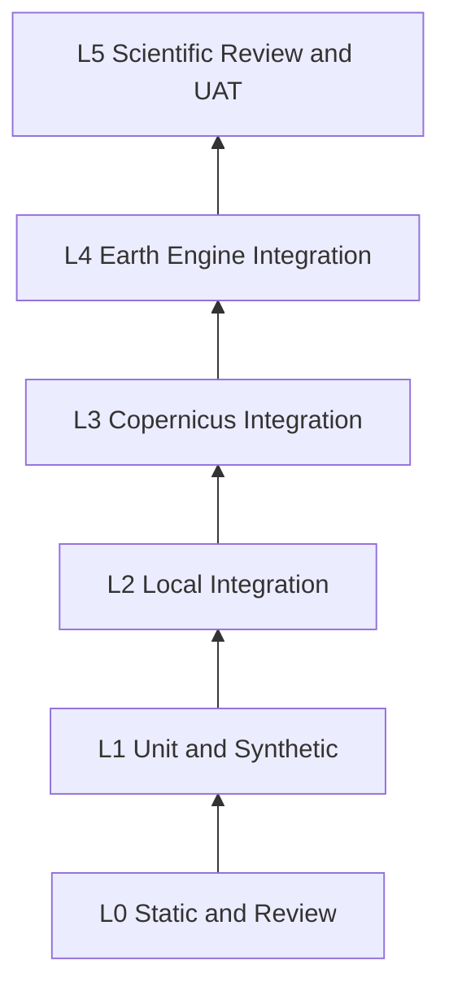
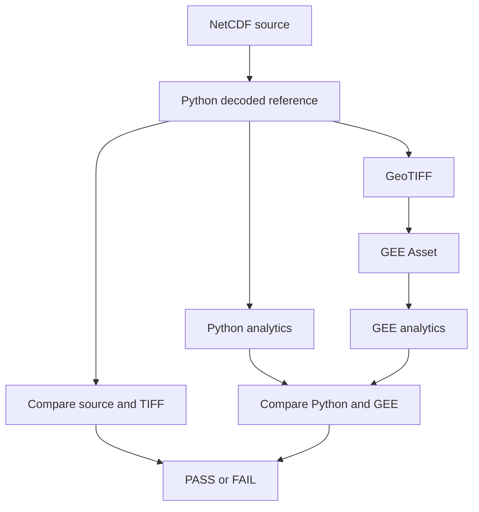
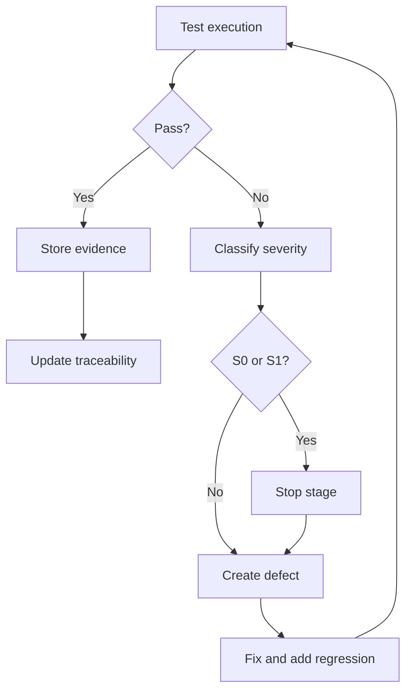

# TEST_AND_VALIDATION_PLAN.md

# RENCANA PENGUJIAN DAN VALIDASI  
## GLORYS12V1 Current Research & Teaching System

**Status:** Dokumen pengujian normatif  
**Versi:** 1.0  
**Tanggal:** 31 Juli 2026  
**Ruang penggunaan:** Pendidikan dan penelitian nonkomersial  
**Dataset utama:** Copernicus Marine GLORYS12V1  
**Arsitektur:** Hibrida Python/xarray–Google Earth Engine  
**Requirement yang dipetakan:** 78  
**Test case terdaftar:** 182  
**Dokumen induk:** PRD, `AGENTS.md`, dan `IMPLEMENTATION_PLAN_AND_BACKLOG.md`

---

## 1. Tujuan

Dokumen ini menetapkan cara membuktikan bahwa sistem:

- menggunakan sumber data yang benar;
- mempertahankan nilai, waktu, mask, grid, dan metadata;
- menghitung statistik arus secara benar;
- tidak mencampur mean speed dengan resultant speed;
- menggunakan konvensi arah menuju;
- dapat dilanjutkan setelah kegagalan;
- aman dari kebocoran credential;
- tidak memaksakan komputasi berat ke GEE interaktif;
- konsisten antara NetCDF, Python, GeoTIFF, dan GEE;
- layak digunakan untuk pendidikan dan penelitian;
- tidak mengklaim fungsi operasional, keselamatan, atau desain teknik.

`PASS` hanya boleh diberikan jika expected result dan evidence terpenuhi.

---

## 2. Hubungan dengan dokumen lain

```text
PRD
  ↓ requirement
IMPLEMENTATION_PLAN_AND_BACKLOG.md
  ↓ task
TEST_AND_VALIDATION_PLAN.md
  ↓ test ID dan expected result
Kode + fixture + execution
  ↓
Evidence + defect + acceptance
```

Dokumen ini tidak menyatakan pengujian telah dijalankan. Status awal seluruh test adalah `NOT_RUN`, kecuali review dokumen yang secara eksplisit memiliki bukti.

---

## 3. Prinsip pengujian

1. Test sintetis sebelum data asli.
2. Test lokal sebelum network/cloud.
3. Pilot sebelum batch.
4. Nilai dibandingkan numerik, bukan hanya visual.
5. Mask dibandingkan secara exact.
6. Waktu dan dimensi dibandingkan secara exact.
7. Toleransi tidak boleh dilonggarkan untuk menyembunyikan bug sistematik.
8. Komputasi berat diklasifikasikan sebagai interactive, batch, atau Python-only berdasarkan evidence.
9. Error kritis harus fail closed.
10. Test tidak boleh membaca atau mencetak secret.
11. Setiap bug menambah regression test.
12. Hasil negatif juga menjadi evidence.
13. Open scientific decisions tetap `BLOCKED`.
14. Reproducibility mencakup config hash, dependency version, dan source checksum.

---

## 4. Level pengujian

| Level | Nama | Lingkungan | Contoh |
|---|---|---|---|
| L0 | Static/review | Offline | schema, source scan, dokumentasi |
| L1 | Unit/synthetic | Python lokal | formula, config, state machine |
| L2 | Integration lokal | Python + synthetic/real local files | NetCDF, GeoTIFF, analytics |
| L3 | External data integration | Copernicus Marine | describe, subset, batch download |
| L4 | Earth Engine/cloud integration | GEE project | assets, reducers, export, benchmark |
| L5 | Scientific/UAT | Pengguna + reviewer | interpretasi, usability, governance |

Network, install, upload, delete, IAM, dan operasi cloud mengikuti approval pada `AGENTS.md`.

---

## 5. Jenis test

- unit;
- property/invariant;
- synthetic regression;
- integration;
- contract/schema;
- numerical comparison;
- metadata comparison;
- performance/benchmark;
- security;
- governance;
- usability;
- accessibility;
- end-to-end;
- release acceptance.

---

## 6. Lingkungan uji

### 6.1 Local synthetic

Tidak membutuhkan credentials atau network.

Digunakan untuk:

- formula;
- calendar;
- config;
- inventory;
- NetCDF validation;
- conversion;
- security redaction.

### 6.2 Local real-data

Menggunakan file pilot yang telah diunduh, tetapi dapat dijalankan offline.

### 6.3 Copernicus integration

Membutuhkan:

- login pengguna;
- approval network;
- metadata aktif;
- AOI yang disetujui.

### 6.4 Earth Engine integration

Membutuhkan:

- OAuth pengguna;
- Project ID khusus;
- project nonkomersial;
- approval upload/export;
- asset namespace test terpisah.

### 6.5 Namespace test

Gunakan root terpisah:

```text
projects/<PROJECT_ID>/assets/glorys12v1/validation/test_runs/<RUN_ID>
```

Test tidak boleh mengubah aset release tanpa approval.

---

## 7. Data dan fixture

### 7.1 `SYN-NC-NOMINAL`

NetCDF sintetis:

```text
time      = 29 hari, 2020-02-01 sampai 2020-02-29
depth     = [0.494025]
latitude  = [-0.10, -0.18, -0.26]
longitude = [130.70, 130.78, 130.86, 130.94]
variables = uo, vo
units     = m s-1
calendar  = gregorian
```

Formula valid cell:

```text
uo[t,y,x] = 0.100 + 0.002*t + 0.010*x
vo[t,y,x] = -0.050 + 0.001*t + 0.005*y
```

Cell `y=2, x=0` dimask sepanjang waktu.

Reference points:

```text
t=0,y=0,x=0:
uo=0.100
vo=-0.050
speed=0.1118033988749895

t=28,y=1,x=2:
uo=0.176
vo=-0.017
speed=0.17681911661356076
```

### 7.2 Fixture negatif

| Fixture | Perubahan |
|---|---|
| `SYN-NC-MISSING-VO` | band `vo` dihapus |
| `SYN-NC-BAD-UNIT` | unit diubah menjadi knots |
| `SYN-NC-BAD-DEPTH` | depth menjadi 1,0 m |
| `SYN-NC-MISSING-DAY` | satu tanggal dihapus |
| `SYN-NC-DUP-TIME` | satu timestamp diduplikasi |
| `SYN-NC-LAT-BROKEN` | latitude tidak monoton |
| `SYN-NC-SCALED` | raw integer + scale/offset + FillValue |
| `SYN-NC-ALLNAN` | seluruh nilai invalid |
| `SYN-NC-SENTINEL` | sentinel lolos sebagai nilai |
| `SYN-NC-OUTLIER` | outlier untuk flag QC |
| `SYN-TIFF-SWAPPED` | urutan band ditukar |
| `SYN-TIFF-DOUBLE-SCALED` | scale/offset diterapkan dua kali |
| `SYN-TIFF-BAD-TIME` | metadata tanggal salah |

### 7.3 Fixture vektor

| Fixture | `u` | `v` | Expected |
|---|---:|---:|---|
| `VEC-NORTH` | 0 | 1 | 0° |
| `VEC-EAST` | 1 | 0 | 90° |
| `VEC-SOUTH` | 0 | -1 | 180° |
| `VEC-WEST` | -1 | 0 | 270° |
| `VEC-ZERO` | 0 | 0 | speed 0; arah undefined/masked |
| `VEC-U3-V4` | 3 | 4 | speed 5 |

### 7.4 Data asli pilot

Periode:

```text
2020-02-01T00:00:00
sampai
2020-02-29T23:59:59
```

Variabel:

```text
uo
vo
```

Depth:

```text
0.494025 m
```

AOI regional aktif sudah ditetapkan sebagai user-provided bbox; polygon batas
perairan dan water mask tetap `OPEN`. T2 pilot menggunakan konfigurasi
`pilot_001` terpisah.

---

## 8. Toleransi dan aturan perbandingan

### 8.1 Exact comparison

Harus exact:

- nama band;
- dimensi;
- count timestep;
- timestamp;
- kalender;
- depth count;
- mask;
- Project ID;
- Dataset ID;
- checksum;
- state transition;
- metadata wajib yang bersifat identifier.

### 8.2 Floating point baseline

Baseline awal:

```text
absolute tolerance u/v        = 1e-6 m/s
absolute tolerance speed      = 1e-6 m/s
absolute tolerance direction  = 1e-6 degree untuk fixture kardinal
relative tolerance            = 1e-6 bila nilai tidak mendekati nol
```

Toleransi final harus dikonfirmasi dari pilot float32.

Aturan:

- mask dibandingkan sebelum nilai;
- NaN dan NoData tidak diubah menjadi nol;
- error sistematik sekecil apa pun tidak diterima hanya karena berada dekat tolerance;
- perubahan tolerance memerlukan change control;
- report memuat max absolute error, mean absolute error, percentile error, dan lokasi error maksimum.

### 8.3 Statistik

Test statistik harus menyebut:

- denominator valid;
- quantile method;
- variance/standard deviation `ddof`;
- weighting;
- reference period;
- temporal/spatial/zonal context.

### 8.4 Performa

Tidak ada target detik final yang ditebak sebelum benchmark.

Hard failure:

```text
User memory limit exceeded
Computation timed out
Too many concurrent aggregations
Computed value too large
task FAILED tanpa diagnosis
```

Setiap benchmark mencatat:

```text
duration
task state
error
tileScale
parallelScale
scale
AOI area
image count
output size
EECU if available
```

Regression lebih lambat >25% dari baseline disetujui harus direview; angka ini adalah trigger review, bukan otomatis `FAIL`.

---

## 9. Status dan severity

### 9.1 Status test

```text
NOT_RUN
RUNNING
PASS
PASS_WITH_NOTES
BLOCKED
FAIL
SKIPPED_APPROVED
```

### 9.2 Severity defect

| Severity | Makna |
|---|---|
| S0 | Security incident/credential exposure |
| S1 | Kesalahan ilmiah, data corruption, wrong dataset/time/depth/mask |
| S2 | Fungsi utama gagal atau memory error pada fitur supported |
| S3 | Fungsi sekunder/UX bermasalah |
| S4 | Dokumentasi/cosmetic tanpa dampak ilmiah |

S0/S1 menghentikan tahap.

---

## 10. Evidence

Setiap eksekusi menghasilkan:

```text
outputs/evidence/<stage>/<test_id>/<run_id>/
├── command.txt
├── environment.txt
├── input_manifest.json
├── config_hash.txt
├── result.json
├── summary.md
├── logs/
└── artifacts_manifest.json
```

Evidence tidak boleh memuat:

- password;
- token;
- OAuth response;
- credentials file;
- full environment dump;
- private key.

---

## 11. Entry dan exit criteria

### Entry

- task Definition of Ready;
- dependency lulus;
- fixture tersedia;
- expected result ditentukan;
- approval tersedia;
- environment dicatat;
- tidak ada security blocker.

### Exit

- seluruh test P0/P1 terkait dijalankan;
- failure ditutup atau stage `FAIL`;
- evidence lengkap;
- regression suite lulus;
- traceability diperbarui;
- reviewer menerima hasil.

---

## 12. Prosedur kritis

### 12.1 Validasi silang NetCDF–GeoTIFF

1. pilih seluruh valid cell pada pilot;
2. decode NetCDF melalui jalur resmi;
3. baca GeoTIFF tanpa resampling;
4. sejajarkan coordinate/pixel;
5. bandingkan mask exact;
6. bandingkan `uo`;
7. bandingkan `vo`;
8. hitung error summary;
9. simpan lokasi error maksimum;
10. gagal jika tolerance atau mask tidak terpenuhi.

### 12.2 Validasi silang Python–GEE

1. pilih titik referensi yang berasal dari valid pixel;
2. simpan longitude, latitude, timestamp, depth;
3. hitung Python reference;
4. ambil nilai GEE pada native projection/scale;
5. bandingkan `uo`, `vo`, speed, mean, resultan, arah, persistence;
6. jangan menggunakan visual color sebagai pembanding;
7. simpan CSV dan metadata asset.

### 12.3 Uji arah

1. jalankan fixture cardinal di Python;
2. jalankan fixture sama di GEE;
3. uji zero vector;
4. uji 359°/1°;
5. uji empat kuadran;
6. periksa legend menyatakan arah menuju;
7. periksa panah secara visual setelah test numerik lulus.

### 12.4 Uji retry/resume

1. buat inventory job sintetis;
2. paksa transient failure pada attempt awal;
3. verifikasi backoff;
4. biarkan job sukses;
5. hentikan proses setelah sebagian job;
6. restart;
7. verifikasi job lengkap tidak diulang;
8. verifikasi file rusak dikarantina;
9. verifikasi checksum.

### 12.5 Uji GEE memory guardrail

1. catat AOI, count, scale;
2. jalankan fungsi supported;
3. uji `tileScale`;
4. uji `parallelScale` jika relevan;
5. verifikasi tidak ada pola array/band/list besar;
6. verifikasi periode 11 tahun membaca produk prahitung;
7. simpan execution graph/code evidence dan benchmark.

---

## 13. Katalog test

## Foundation dan repository

| Test ID | Level | Requirement | Test | Data/fixture | Prosedur ringkas | Expected result | Bukti | Eksekusi |
|---|---|---|---|---|---|---|---|---|
| TST-FND-001 | L0 | — | Struktur repository | Repository kosong/baseline | Bandingkan struktur aktual dengan struktur normatif PRD dan AGENTS.md. | Direktori wajib tersedia; data besar dan credentials tidak tracked. | tree.txt; git ls-files | Otomatis |
| TST-FND-002 | L0 | — | AGENTS.md berada di root | Repository | Cari AGENTS.md pada root dan verifikasi ukuran dapat dibaca Codex. | AGENTS.md ditemukan dan tidak kosong. | file check | Otomatis |
| TST-FND-003 | L1 | — | Dependency dapat diimpor | Environment locked | Import seluruh dependency inti. | Semua import berhasil dengan interpreter yang dicatat. | pytest/log environment | Otomatis |
| TST-FND-004 | L1 | — | Command quality tersedia | Repository configured | Jalankan formatter check, lint, type check, dan unit-test command resmi. | Seluruh command tersedia; status dan versi tercatat. | CI/local logs | Otomatis |
| TST-FND-005 | L0 | — | Traceability tidak kosong | PRD dan traceability file | Bandingkan seluruh requirement ID PRD dengan traceability. | Seluruh ID muncul minimal sekali. | coverage report | Otomatis |

## Konfigurasi

| Test ID | Level | Requirement | Test | Data/fixture | Prosedur ringkas | Expected result | Bukti | Eksekusi |
|---|---|---|---|---|---|---|---|---|
| TST-CONF-001 | L1 | FR-CONF-01 | AOI valid | CFG-AOI-VALID | Load config west<east dan south<north. | Config diterima; geometri/bbox terbentuk. | pytest JSON | Otomatis |
| TST-CONF-002 | L1 | FR-CONF-01 | AOI null ditolak | CFG-AOI-NULL | Load config dengan satu/lebih nilai null pada mode eksekusi. | Fail closed dengan pesan field yang belum diisi. | pytest exception | Otomatis |
| TST-CONF-003 | L1 | FR-CONF-01 | AOI terbalik ditolak | CFG-AOI-REVERSED | Set west>=east atau south>=north. | Config ditolak; tidak ada request dibuat. | pytest | Otomatis |
| TST-CONF-004 | L1 | FR-CONF-02 | Periode utama tepat | CFG-PERIOD-MAIN | Load 2015-01-01 sampai end-exclusive 2026-01-01. | 11 tahun, 132 bulan, 4.018 hari dihitung benar. | pytest | Otomatis |
| TST-CONF-005 | L1 | FR-CONF-02 | JFM dan tahun kabisat | CFG-PERIOD-JFM | Bangun JFM 2015–2025. | 33 paket dan 993 hari; 2016/2020/2024 memiliki 91 hari. | pytest | Otomatis |
| TST-CONF-006 | L1 | FR-CONF-03 | Depth target valid | CFG-DEPTH-VALID | Load depth 0.494025 dan tolerance 1e-6. | Diterima dan label top_model_layer tersedia. | pytest | Otomatis |
| TST-CONF-007 | L1 | FR-CONF-03 | Depth berbeda ditolak | CFG-DEPTH-MISMATCH | Gunakan depth di luar tolerance. | Fail closed atau status mismatch eksplisit. | pytest | Otomatis |
| TST-CONF-008 | L1 | FR-CONF-04 | Threshold dapat kosong | CFG-THRESHOLD-TBD | Load threshold list kosong. | Pipeline fungsi non-threshold tetap berjalan; fungsi exceedance berstatus BLOCKED/TBD. | pytest | Otomatis |
| TST-CONF-009 | L1 | FR-CONF-04 | Threshold monoton | CFG-THRESHOLD-BAD | Load bins tidak naik atau negatif tanpa izin. | Config ditolak dengan pesan jelas. | pytest | Otomatis |
| TST-CONF-010 | L1 | FR-CONF-05 | Project dan asset root konsisten | CFG-GEE-VALID | Load Project ID dan asset root yang berasal dari project sama. | Diterima; root mengikuti projects/<id>/assets/... | pytest | Otomatis |
| TST-CONF-011 | L1 | FR-CONF-05 | Project mismatch ditolak | CFG-GEE-MISMATCH | Project ID berbeda dari prefix asset root. | Fail closed sebelum operasi GEE. | pytest | Otomatis |
| TST-CONF-012 | L1 | FR-CONF-06 | Secret field ditolak | CFG-WITH-SECRET | Tambahkan password/token/private_key pada config. | Validation/security scan gagal tanpa mencetak nilainya. | pytest/security report | Otomatis |

## Metadata aktif

| Test ID | Level | Requirement | Test | Data/fixture | Prosedur ringkas | Expected result | Bukti | Eksekusi |
|---|---|---|---|---|---|---|---|---|
| TST-META-001 | L3 | FR-META-01 | Describe produk | Akun Copernicus valid | Jalankan describe Product ID. | Response sukses dan Product ID tepat. | raw JSON + command | Semiotomatis |
| TST-META-002 | L3 | FR-META-01 | Describe dataset harian | Akun dan network approved | Jalankan describe Dataset ID harian. | Dataset ditemukan; uo/vo tersedia. | raw JSON | Semiotomatis |
| TST-META-003 | L3 | FR-META-01 | Describe dataset bulanan | Akun dan network approved | Jalankan describe Dataset ID bulanan. | Dataset ditemukan; uo/vo tersedia. | raw JSON | Semiotomatis |
| TST-META-004 | L2 | FR-META-02 | Snapshot immutable | Metadata response | Simpan snapshot timestamped lalu ulang proses. | Snapshot lama tidak tertimpa; checksum berbeda/identik dicatat. | files + hashes | Otomatis |
| TST-META-005 | L2 | FR-META-03 | Toolbox version tercatat | Environment | Baca versi CLI/library dan masukkan evidence. | Versi tidak kosong dan sesuai lock. | environment.txt | Otomatis |
| TST-META-006 | L2 | FR-META-04 | Dataset version/part terurai | Metadata snapshot | Parse default version dan part. | Nilai eksplisit atau status unavailable terdokumentasi; tidak diasumsikan. | summary JSON | Otomatis |
| TST-META-007 | L2 | FR-META-05 | Perubahan material terdeteksi | META-CHANGED-DATASET-ID | Bandingkan snapshot baseline dengan Dataset ID berbeda. | Status material_change; pipeline berhenti. | pytest/report | Otomatis |
| TST-META-008 | L2 | FR-META-05 | Perubahan unit terdeteksi | META-CHANGED-UNIT | Ubah unit uo pada fixture metadata. | Fail closed. | pytest | Otomatis |
| TST-META-009 | L2 | FR-META-05 | Perubahan nonmaterial dicatat | META-NONMATERIAL | Ubah field deskriptif yang tidak memengaruhi pipeline. | Warning/audit note; keputusan sesuai rule. | pytest | Otomatis |
| TST-META-010 | L3 | FR-META-04 | Depth list aktif | Metadata/dataset active | Ekstrak seluruh depth coordinate. | Count 50; top 0.494025 m; urutan dan positive-down tercatat. | depth CSV | Semiotomatis |

## Unduhan, retry, resume, dan inventory

| Test ID | Level | Requirement | Test | Data/fixture | Prosedur ringkas | Expected result | Bukti | Eksekusi |
|---|---|---|---|---|---|---|---|---|
| TST-DL-001 | L1 | FR-DL-01 | Plan bulanan 132 | CFG-PERIOD-MAIN | Bangun monthly_all plan. | 132 job unik dari 201501 sampai 202512. | plan CSV + pytest | Otomatis |
| TST-DL-002 | L3 | FR-DL-01 | Batch bulanan lengkap | AOI dan pilot PASS | Jalankan seluruh monthly plan dengan approval. | 132 file lolos basic integrity; 132 timestep. | inventory/report | Semiotomatis |
| TST-DL-003 | L1 | FR-DL-02 | Plan JFM 33 | CFG-PERIOD-JFM | Bangun daily_jfm plan. | 33 job unik dan expected_timesteps total 993. | plan CSV + pytest | Otomatis |
| TST-DL-004 | L3 | FR-DL-02 | Batch JFM lengkap | AOI dan pilot PASS | Jalankan 33 job. | 33 file; 993 timestep; leap years benar. | inventory/report | Semiotomatis |
| TST-DL-005 | L1 | FR-DL-03 | Retry transient | DL-TRANSIENT-ERROR | Simulasikan timeout/HTTP 5xx lalu sukses. | Retry mengikuti max attempt/backoff; akhirnya PASS. | pytest/log | Otomatis |
| TST-DL-006 | L1 | FR-DL-03 | Tidak retry error permanen | DL-PERMANENT-ERROR | Simulasikan Dataset ID/variable invalid. | Status failed_permanent tanpa loop. | pytest | Otomatis |
| TST-DL-007 | L1 | FR-DL-04 | Resume setelah interupsi | DL-PARTIAL-INVENTORY | Tandai sebagian job ready dan sebagian pending; restart. | Job ready tidak diulang; pending dilanjutkan. | pytest/integration log | Otomatis |
| TST-DL-008 | L1 | FR-DL-04 | File ada tanpa checksum | DL-FILE-NO-HASH | Tempatkan file valid tanpa inventory checksum. | Basic check dan hash dijalankan sebelum skip. | pytest | Otomatis |
| TST-DL-009 | L1 | FR-DL-05 | SQLite dan CSV konsisten | DL-INVENTORY | Update status transaksi lalu ekspor CSV. | Jumlah dan field status identik. | pytest | Otomatis |
| TST-DL-010 | L1 | FR-DL-05 | Transisi status ilegal ditolak | DL-STATE-INVALID | Coba downloaded→ready tanpa check. | Exception; state tidak berubah. | pytest | Otomatis |
| TST-DL-011 | L1 | FR-DL-06 | SHA-256 stabil | DL-HASH-FILE | Hash file dua kali. | Hash identik dan 64 hex. | pytest | Otomatis |
| TST-DL-012 | L1 | FR-DL-06 | Perubahan file terdeteksi | DL-HASH-MUTATED | Ubah satu byte. | Checksum mismatch dan file tidak dianggap valid. | pytest | Otomatis |
| TST-DL-013 | L1 | FR-DL-07 | Karantina file rusak | DL-CORRUPT-NC | Basic check file rusak. | File dipindah atomik ke quarantine; reason JSON tersedia. | pytest | Otomatis |
| TST-DL-014 | L1 | FR-DL-08 | Dry run tidak mengunduh | Valid plan | Jalankan --dry-run. | Request ditampilkan/disimpan; tidak ada NetCDF baru. | pytest/filesystem diff | Otomatis |
| TST-DL-015 | L1 | FR-DL-09 | Daily full disabled | Config default | Coba menjalankan daily_full tanpa gate. | Command ditolak dan tidak membuat plan/job. | pytest | Otomatis |
| TST-DL-016 | L1 | Pipeline | Rekonsiliasi filesystem-inventory | 165 active NetCDF + SQLite | Jalankan `python/05_reconcile_inventory.py` read-only. | 165 job/file, 1125 timestep, checksum cocok, partial kosong, quarantine dicatat sebagai note. | evidence/report | Semiotomatis |
| TST-DL-017 | L1 | Stage gate | Laporan Tahap 3 | T3-014..T3-016 evidence | Jalankan `python/06_generate_stage3_report.py`. | Laporan memuat counts, checksum, version/part, AOI/depth, limitations, dan gate decision. | evidence/report | Semiotomatis |

## Validasi NetCDF

| Test ID | Level | Requirement | Test | Data/fixture | Prosedur ringkas | Expected result | Bukti | Eksekusi |
|---|---|---|---|---|---|---|---|---|
| TST-VAL-001 | L1 | FR-VAL-01 | uo dan vo tersedia | SYN-NC-NOMINAL | Jalankan validator variabel. | PASS; nama dan dims sesuai. | pytest/report | Otomatis |
| TST-VAL-002 | L1 | FR-VAL-01 | Band hilang | SYN-NC-MISSING-VO | Validasi dataset tanpa vo. | FAIL dan file tidak masuk manifest validated. | pytest | Otomatis |
| TST-VAL-003 | L1 | FR-VAL-02 | Unit m/s | SYN-NC-NOMINAL | Baca attrs units. | uo/vo m s-1 atau bentuk ekuivalen yang dinormalisasi. | pytest | Otomatis |
| TST-VAL-004 | L1 | FR-VAL-02 | Unit salah | SYN-NC-BAD-UNIT | Set knots. | FAIL; tidak dikonversi diam-diam. | pytest | Otomatis |
| TST-VAL-005 | L1 | FR-VAL-03 | Depth tepat | SYN-NC-NOMINAL | Baca coordinate depth. | 0.494025 dalam abs tolerance 1e-6. | pytest | Otomatis |
| TST-VAL-006 | L1 | FR-VAL-03 | Depth mismatch | SYN-NC-BAD-DEPTH | Set 1.0 m. | FAIL dan downstream diblokir. | pytest | Otomatis |
| TST-VAL-007 | L1 | FR-VAL-04 | 29 timestamp Februari 2020 | SYN-NC-NOMINAL | Decode time. | Exact daily dates 2020-02-01..29; Gregorian. | pytest | Otomatis |
| TST-VAL-008 | L1 | FR-VAL-04 | Missing timestep | SYN-NC-MISSING-DAY | Hapus 2020-02-15. | FAIL count/date continuity. | pytest | Otomatis |
| TST-VAL-009 | L1 | FR-VAL-04 | Timestamp duplikat | SYN-NC-DUP-TIME | Duplikasi satu hari. | FAIL uniqueness. | pytest | Otomatis |
| TST-VAL-010 | L1 | FR-VAL-05 | Mask dipertahankan | SYN-NC-NOMINAL | Periksa satu land cell masked semua waktu. | Mask true dan tidak menjadi 0. | pytest | Otomatis |
| TST-VAL-011 | L1 | FR-VAL-05 | Valid zero tidak dimask | SYN-NC-ZERO | Sisipkan u=v=0 pada ocean cell. | Nilai valid tetap 0; speed=0. | pytest | Otomatis |
| TST-VAL-012 | L1 | FR-VAL-06 | Latitude descending dipahami | SYN-NC-LAT-DESC | Validasi coords dan rencana transform. | Tidak dianggap error; transform GeoTIFF akan north-up. | pytest | Otomatis |
| TST-VAL-013 | L1 | FR-VAL-06 | Latitude reversed anomaly | SYN-NC-LAT-BROKEN | Coords tidak monoton. | FAIL. | pytest | Otomatis |
| TST-VAL-014 | L1 | FR-VAL-07 | Raw scale/offset decode sekali | SYN-NC-SCALED | Bandingkan raw int dan xarray decoded. | decoded=raw*scale+offset; tidak ganda. | pytest | Otomatis |
| TST-VAL-015 | L1 | FR-VAL-07 | FillValue tidak lolos | SYN-NC-SCALED | Decode raw FillValue. | Menjadi NaN/mask, bukan nilai arus ekstrem. | pytest | Otomatis |
| TST-VAL-016 | L1 | FR-VAL-08 | All-NaN file ditolak | SYN-NC-ALLNAN | Validasi. | FAIL no valid pixels. | pytest | Otomatis |
| TST-VAL-017 | L1 | FR-VAL-08 | Sentinel ekstrem ditolak | SYN-NC-SENTINEL | Sisipkan -32767 setelah decoding manual salah. | FAIL plausibility/sentinel check. | pytest | Otomatis |
| TST-VAL-018 | L2 | FR-VAL-08 | Distribusi perubahan terflag | SYN-NC-OUTLIER | Sisipkan outlier numerik tanpa mengoreksi. | Flag warning/fail sesuai rule; nilai tidak diperbaiki diam-diam. | pytest/report | Otomatis |
| TST-VAL-019 | L2 | FR-VAL-09 | Laporan PASS lengkap | SYN-NC-NOMINAL | Jalankan validator scope full. | Report memuat test, count, checksum, config hash, coverage/distribution, dan status PASS. | report schema test, T4-013 | Otomatis |
| TST-VAL-020 | L2 | FR-VAL-09 | Laporan FAIL lengkap | SYN-NC-BAD-DEPTH | Jalankan validator dengan fixture gagal. | Report FAIL memuat reason dan gate tidak lulus. | report schema test, T4-014 | Otomatis |

Kontrak output T4 sebelum implementasi:

- `outputs/manifests/stage_4_validated_manifest.json` hanya boleh berisi file
  yang lulus seluruh validasi T4;
- `outputs/evidence/stage_4/T4-013_validation_report.result.txt` mencakup
  hasil PASS/FAIL per file dan alasan kegagalan;
- `outputs/evidence/stage_4/T4-014_stage4_gate.result.txt` mencatat keputusan
  gate serta limitation;
- seluruh validasi T4 berjalan lokal/offline dan tidak mengakses GEE.
- scope `full` harus menghasilkan 165 file tercakup, coverage per variabel,
  perbandingan mask/time/grid `uo`–`vo`, statistik distribusi per file/periode,
  dan hanya file PASS yang masuk manifest.

## Konversi NetCDF–GeoTIFF

| Test ID | Level | Requirement | Test | Data/fixture | Prosedur ringkas | Expected result | Bukti | Eksekusi |
|---|---|---|---|---|---|---|---|---|
| TST-CONV-001 | L2 | FR-CONV-01 | Output float32 | SYN-NC-NOMINAL | Konversi satu timestep. | Raster dtype float32 untuk dua band. | rasterio report | Otomatis |
| TST-CONV-002 | L2 | FR-CONV-02 | Urutan/nama band | SYN-NC-NOMINAL | Buka TIFF output. | Band 1=uo, band 2=vo; description/metadata tepat. | pytest | Otomatis |
| TST-CONV-003 | L2 | FR-CONV-02 | Band swap terdeteksi | SYN-TIFF-SWAPPED | Jalankan comparator. | FAIL dan menyebut band mismatch. | pytest | Otomatis |
| TST-CONV-004 | L2 | FR-CONV-03 | Mask equality | SYN-NC-NOMINAL | Bandingkan mask NetCDF dan TIFF. | Exact equality pada seluruh sel. | array comparison | Otomatis |
| TST-CONV-005 | L2 | FR-CONV-03 | NoData tidak menjadi zero | SYN-NC-NOMINAL | Periksa land cell output. | Tetap NoData/masked. | pytest | Otomatis |
| TST-CONV-006 | L2 | FR-CONV-04 | CRS benar | SYN-NC-NOMINAL | Baca CRS output. | CRS geografis yang disetujui dan konsisten dengan sumber. | rasterio metadata | Otomatis |
| TST-CONV-007 | L2 | FR-CONV-04 | Transform north-up | SYN-NC-LAT-DESC | Bandingkan center coordinate pixel. | Lokasi cocok; tidak mirror vertikal. | coordinate comparison | Otomatis |
| TST-CONV-008 | L2 | FR-CONV-05 | Ukuran grid tidak berubah | SYN-NC-NOMINAL | Bandingkan rows/cols/resolution. | Identik dengan subset source; tidak resampling. | pytest | Otomatis |
| TST-CONV-009 | L0 | FR-CONV-05 | Tidak ada warp/resample tersembunyi | Source code | Static review converter. | Tidak ada resampling selain keputusan terdokumentasi. | static review | Otomatis+review |
| TST-CONV-010 | L2 | FR-CONV-06 | Metadata timestep | SYN-NC-NOMINAL | Baca tags/sidecar. | Tanggal, depth, dataset, checksum, pipeline version tersedia. | metadata report | Otomatis |
| TST-CONV-011 | L2 | FR-CONV-06 | Timestamp salah ditolak | SYN-TIFF-BAD-TIME | Jalankan metadata validator. | FAIL. | pytest | Otomatis |
| TST-CONV-012 | L2 | FR-CONV-07 | Nilai u/v sama | SYN-NC-NOMINAL | Bandingkan seluruh valid pixel. | abs_error≤1e-6 m/s dan mask exact. | CSV comparison | Otomatis |
| TST-CONV-013 | L2 | FR-CONV-07 | Error sistematik terdeteksi | SYN-TIFF-DOUBLE-SCALED | Comparator seluruh nilai. | FAIL meski sebagian nilai tampak masuk akal. | pytest | Otomatis |
| TST-CONV-014 | L2 | FR-CONV-07 | 29/29 pilot cocok | Pilot asli | Bandingkan semua GeoTIFF pilot. | Seluruh timestep PASS; tidak hanya sampel visual. | comparison report | Semiotomatis |

## Analytics Python

| Test ID | Level | Requirement | Test | Data/fixture | Prosedur ringkas | Expected result | Bukti | Eksekusi |
|---|---|---|---|---|---|---|---|---|
| TST-PY-001 | L1 | FR-PY-01 | Speed 3-4-5 | VEC-U3-V4 | Hitung speed. | 5 m/s. | pytest | Otomatis |
| TST-PY-002 | L1 | FR-PY-01 | Speed zero | VEC-ZERO | Hitung speed. | 0 dan valid bila input valid. | pytest | Otomatis |
| TST-PY-003 | L1 | FR-PY-02 | Mean speed tanpa pembatalan | SERIES-EAST-WEST | Gunakan u=[1,-1], v=[0,0]. | Mean speed=1. | pytest | Otomatis |
| TST-PY-004 | L1 | FR-PY-03 | Mean u/v | SERIES-KNOWN | Bandingkan dengan arithmetic mean valid-only. | Sama dengan referensi NumPy. | pytest | Otomatis |
| TST-PY-005 | L1 | FR-PY-04 | Resultant pembatalan | SERIES-EAST-WEST | Hitung resultan. | 0, berbeda dari mean speed=1. | pytest | Otomatis |
| TST-PY-006 | L1 | FR-PY-05 | Arah utara | VEC-NORTH | u=0,v=1. | 0°. | pytest | Otomatis |
| TST-PY-007 | L1 | FR-PY-05 | Empat cardinal | VEC-CARDINAL | Uji empat pasangan. | 0°,90°,180°,270° dalam 1e-10° sintetis. | pytest | Otomatis |
| TST-PY-008 | L1 | FR-PY-05 | Circular wrap | VEC-359-1 | Bangun dua vektor arah 359° dan 1° lalu mean komponen. | Arah resultan mendekati 0°, bukan 180°. | pytest | Otomatis |
| TST-PY-009 | L1 | FR-PY-06 | Persistence konsisten | SERIES-EAST | Semua u=1,v=0. | P=1. | pytest | Otomatis |
| TST-PY-010 | L1 | FR-PY-06 | Persistence pembatalan | SERIES-EAST-WEST | u=[1,-1]. | P=0. | pytest | Otomatis |
| TST-PY-011 | L1 | FR-PY-06 | Pembagi nol | SERIES-ZERO | Semua speed=0. | P dimask/NaN sesuai spesifikasi, tanpa inf. | pytest | Otomatis |
| TST-PY-012 | L1 | FR-PY-07 | Statistik dasar | SERIES-1-2-3-4 | Hitung min/max/median/SD/variance. | Cocok referensi dengan ddof terdokumentasi. | pytest | Otomatis |
| TST-PY-013 | L1 | FR-PY-07 | Valid-only statistics | SERIES-WITH-NAN | Hitung statistik. | NaN dikecualikan; valid_count benar. | pytest | Otomatis |
| TST-PY-014 | L1 | FR-PY-08 | Persentil P10–P99 | SERIES-ORDERED | Bandingkan dengan metode quantile yang dikunci. | Semua quantile cocok referensi; method metadata tersedia. | pytest | Otomatis |
| TST-PY-015 | L1 | FR-PY-09 | Threshold exceedance | SERIES-THRESHOLD | Gunakan threshold yang telah disetujui fixture. | Count/persen menggunakan denominator valid. | pytest | Otomatis |
| TST-PY-016 | L1 | FR-PY-09 | Threshold belum ditetapkan | CFG-THRESHOLD-TBD | Panggil fungsi production. | Status blocked/config error; tidak memilih nilai sendiri. | pytest | Otomatis |
| TST-PY-017 | L1 | FR-PY-10 | 16 sektor arah | VEC-SECTOR-BOUNDARIES | Uji center dan batas sektor. | Seluruh arah masuk sektor yang ditentukan; wrap N benar. | pytest | Otomatis |
| TST-PY-018 | L1 | FR-PY-11 | Current rose frequency | ROSE-KNOWN | Gunakan kombinasi arah/kelas terkontrol. | Total frekuensi=100% valid; matriks sesuai referensi. | pytest | Otomatis |
| TST-PY-019 | L1 | FR-PY-11 | Current rose low-resultant caveat | ROSE-BIMODAL | Gunakan timur/barat sama banyak. | Output distribusi benar dan warning arah resultan tidak stabil. | pytest/report | Otomatis |
| TST-PY-020 | L2 | FR-PY-12 | Klimatologi bulanan | SYN-11Y-MONTHLY | Agregasi per bulan kalender. | 12 output; setiap bulan memakai tahun tersedia dan valid_count. | pytest | Otomatis |
| TST-PY-021 | L2 | FR-PY-13 | Klimatologi JFM semua hari | SYN-11Y-DAILY-JFM | Gabungkan 993 hari. | Hasil dan weighting label benar. | pytest | Otomatis |
| TST-PY-022 | L2 | FR-PY-13 | JFM equal-year weighting | SYN-11Y-DAILY-JFM | Hitung annual-JFM lalu mean 11 tahun. | Setiap tahun bobot sama; metode dibedakan dari all-days. | pytest | Otomatis |
| TST-PY-023 | L1 | FR-PY-14 | Anomali nol pada climatology | SYN-ANOMALY | Input sama dengan referensi. | Anomali=0. | pytest | Otomatis |
| TST-PY-024 | L2 | FR-PY-14 | Anomali mencantumkan referensi | SYN-ANOMALY | Baca output metadata. | Reference period 2015–2025 dan variable definition tersedia. | metadata test | Otomatis |
| TST-PY-025 | L2 | FR-PY-15 | Trend slope synthetic | SERIES-LINEAR | Gunakan y=2x+1. | Slope=2; method dan uncertainty tercatat. | pytest | Otomatis |
| TST-PY-026 | L0 | FR-PY-15 | Label tren terbatas | Trend report | Review teks output. | Menggunakan istilah kecenderungan 2015–2025, bukan perubahan iklim jangka panjang. | content test/review | Semiotomatis |
| TST-PY-027 | L2 | FR-PY-16 | Zonal mean area-weighted | GRID-ZONES | Bandingkan dengan perhitungan referensi. | Cocok; area, pixel count, valid count tercatat. | pytest | Otomatis |
| TST-PY-028 | L2 | FR-PY-16 | Zona tanpa data | GRID-EMPTY-ZONE | Hitung zonal stats. | Status no_data; tidak menghasilkan zero palsu. | pytest | Otomatis |
| TST-PY-029 | L2 | FR-PY-17 | Precomputed raster schema | Derived fixture | Validasi band dan metadata. | Band wajib dan provenance lengkap. | schema test | Otomatis |
| TST-PY-030 | L2 | FR-PY-17 | Deterministic rebuild | Input/config sama | Bangun produk dua kali. | Nilai/checksum deterministik atau perbedaan metadata waktu dikecualikan secara terdokumentasi. | hash comparison | Otomatis |

## Earth Engine core

| Test ID | Level | Requirement | Test | Data/fixture | Prosedur ringkas | Expected result | Bukti | Eksekusi |
|---|---|---|---|---|---|---|---|---|
| TST-GEE-001 | L4 | FR-GEE-01 | Read source collection | GEE sample assets | Load collection dan inspect schema. | Jumlah aset/band/properties sesuai inventory. | GEE report | Semiotomatis |
| TST-GEE-002 | L4 | FR-GEE-01 | Missing band fails | GEE bad fixture | Load asset tanpa vo. | Validator/module menolak. | GEE test result | Semiotomatis |
| TST-GEE-003 | L4 | FR-GEE-02 | Filter exclusive end | 29-day collection | Filter 2020-02-01 sampai 2020-03-01. | Count=29. | GEE console/export | Semiotomatis |
| TST-GEE-004 | L4 | FR-GEE-02 | AOI filter | Assets inside/outside AOI | FilterBounds. | Hanya aset relevan; AOI statistik memakai geometri tepat. | GEE report | Semiotomatis |
| TST-GEE-005 | L4 | FR-GEE-03 | Speed GEE | GEE cardinal/sample | Hitung sqrt(u²+v²). | Cocok Python dalam tolerance. | comparison CSV | Semiotomatis |
| TST-GEE-006 | L4 | FR-GEE-04 | Mean u/v/speed | Pilot assets | Reduce collection. | Cocok Python; mean speed terpisah dari resultan. | comparison | Semiotomatis |
| TST-GEE-007 | L4 | FR-GEE-05 | Resultant/persistence | Pilot assets | Hitung dari mean components. | Cocok Python; zero denominator aman. | comparison | Semiotomatis |
| TST-GEE-008 | L4 | FR-GEE-06 | AOI stats supported | Pilot AOI | Jalankan combined reducer. | Tidak memory error; value cocok reference. | benchmark/evidence | Semiotomatis |
| TST-GEE-009 | L4 | FR-GEE-06 | AOI limit guard | AOI melampaui batas approved | Jalankan fungsi. | Ditolak/diarahkan batch; tidak memulai request berat. | GEE UI/test | Semiotomatis |
| TST-GEE-010 | L4 | FR-GEE-07 | Read precomputed 11-year product | Derived asset | Load tanpa source reduction. | Layer/stats tersedia; operation graph tidak memuat reduce 993 images. | code review/benchmark | Semiotomatis |
| TST-GEE-011 | L4 | FR-GEE-08 | GeoTIFF export | Pilot derived image | Start export dengan scale/projection yang disetujui. | Task success; file metadata dan values benar. | task + downloaded check | Manual+otomatis |
| TST-GEE-012 | L4 | FR-GEE-09 | CSV export | Pilot AOI table | Start table export. | Task success; columns/unit/period lengkap. | task + CSV test | Manual+otomatis |
| TST-GEE-013 | L4 | FR-GEE-10 | Metadata panel data | Source dan derived assets | Pilih masing-masing layer. | Panel menampilkan product, dataset, depth, period, source/derived, units. | UI evidence | Manual |
| TST-GEE-014 | L5 | FR-GEE-11 | Limitations selalu tersedia | App modes | Navigasi kedua mode. | Peringatan reanalysis, resolusi, pasut, non-operasional dapat diakses. | UAT screenshot/checklist | Manual |
| TST-GEE-015 | L0 | FR-GEE-03 | Tidak ada toArray seri besar | GEE source | Static scan/review. | Pola dilarang tidak ada pada production path. | static report | Otomatis+review |
| TST-GEE-016 | L0 | FR-GEE-06 | Reducer digabung | GEE source | Review repeated reduceRegion. | Shared-input reducer digunakan bila statistik sama-input. | review | Semiotomatis |
| TST-GEE-017 | L4 | FR-GEE-08 | Export mask | Pilot masked image | Export lalu baca lokal. | Mask/NoData konsisten. | comparison | Semiotomatis |
| TST-GEE-018 | L4 | FR-GEE-09 | Large table routed batch | 993-day table | Request export. | Tidak mencoba getInfo/print besar; task batch dibuat. | task evidence | Manual |
| TST-GEE-019 | L4 | FR-GEE-07 | Derived version selection | Dua version fixtures | Pilih approved version. | Versi yang dipilih tercatat; tidak mencampur. | GEE metadata | Semiotomatis |
| TST-GEE-020 | L4 | FR-GEE-10 | Timestamp source | Pilot sample | Baca system:time_start/end. | Cocok NetCDF dan exclusive semantics. | comparison | Semiotomatis |

## Arah dan visualisasi vektor

| Test ID | Level | Requirement | Test | Data/fixture | Prosedur ringkas | Expected result | Bukti | Eksekusi |
|---|---|---|---|---|---|---|---|---|
| TST-VEC-001 | L1 | FR-VEC-01 | Cardinal Python | VEC-CARDINAL | Run tests. | Exact expected. | pytest | Otomatis |
| TST-VEC-002 | L4 | FR-VEC-01 | Cardinal GEE | GEE cardinal asset | Run GEE test. | 0/90/180/270. | GEE result | Semiotomatis |
| TST-VEC-003 | L1 | FR-VEC-02 | Toward convention | VEC-EAST | u=1,v=0. | Label Timur/90°, bukan arah datang Barat. | pytest | Otomatis |
| TST-VEC-004 | L5 | FR-VEC-02 | Legend convention wording | App | Review legend. | Tertulis ke mana arus bergerak. | UAT | Manual |
| TST-VEC-005 | L4 | FR-VEC-03 | Sampling density | Vector layer | Ubah density config. | Jumlah panah berubah deterministik tanpa mengubah data source. | GEE count/visual | Semiotomatis |
| TST-VEC-006 | L4 | FR-VEC-03 | Grid alignment | Vector layer | Bandingkan titik sampling dengan grid. | Tidak bergeser/menciptakan resolusi data baru. | coordinate evidence | Semiotomatis |
| TST-VEC-007 | L4 | FR-VEC-04 | Normalized arrows | Known magnitudes same direction | Render normalized mode. | Panjang setara; arah benar; label mode jelas. | visual QA | Manual |
| TST-VEC-008 | L4 | FR-VEC-04 | Zero vector hidden | Zero fixture | Render. | Tidak ada panah acak; zero ditangani. | visual/test | Semiotomatis |
| TST-VEC-009 | L4 | FR-VEC-05 | Speed-scaled arrows | Known speeds | Render scaled mode. | Panjang monoton dengan speed dan dibatasi agar tidak ekstrem. | visual/numeric check | Semiotomatis |
| TST-VEC-010 | L4 | FR-VEC-05 | Scale cap | Outlier speed fixture | Render. | Panah tidak melampaui cap; outlier tetap tercatat. | visual/test | Semiotomatis |
| TST-VEC-011 | L5 | FR-VEC-06 | Legend complete | App | Review. | Arah, unit, normalized/scaled, reference length tersedia. | UAT | Manual |
| TST-VEC-012 | L5 | FR-VEC-07 | Native resolution warning | App/map | Zoom tinggi. | Disclaimer tetap terlihat/tersedia; tidak mengklaim detail lokal. | UAT | Manual |
| TST-VEC-013 | L4 | FR-VEC-07 | No interpolation-as-accuracy | Layer style | Review rendering. | Interpolation hanya visual dan dijelaskan bila digunakan. | review | Manual |
| TST-VEC-014 | L4 | FR-VEC-01 | Four-quadrant arrows | Quadrant fixture | Render. | Semua kuadran arah benar. | visual QA | Manual |
| TST-VEC-015 | L4 | FR-VEC-03 | Performance density | Pilot AOI | Benchmark beberapa density. | Default approved tidak timeout/memory error. | benchmark | Semiotomatis |

## Performa dan memory

| Test ID | Level | Requirement | Test | Data/fixture | Prosedur ringkas | Expected result | Bukti | Eksekusi |
|---|---|---|---|---|---|---|---|---|
| TST-PERF-001 | L4 | — | B1 29 hari interaktif | Pilot assets | Jalankan skenario approved dan catat seluruh parameter. | Tidak ada memory/timeout; classification dan duration tercatat. | benchmark row | Semiotomatis |
| TST-PERF-002 | L4 | — | B2 satu JFM | 90/91 images | Jalankan fungsi supported. | Diklasifikasikan secara bukti. | benchmark row | Semiotomatis |
| TST-PERF-003 | L2/L4 | — | B3 993 hari | Core JFM | Jalankan Python/batch, bukan dipaksa interaktif. | PASS_BATCH atau PASS_PYTHON_ONLY dengan output benar. | benchmark row | Semiotomatis |
| TST-PERF-004 | L4 | — | B4 produk 11 tahun | Derived assets | Load map/stats. | Tidak menghitung ulang source 11 tahun; tidak memory error. | benchmark/code review | Semiotomatis |
| TST-PERF-005 | L4 | — | B5 combined reducer | Pilot AOI | Bandingkan repeated vs combined. | Nilai identik dalam tolerance; biaya/durasi dicatat. | benchmark | Semiotomatis |
| TST-PERF-006 | L4 | — | B6 batch table export | 993-day table | Start task. | Task sukses atau failure terdiagnosis; tidak menggunakan getInfo besar. | task report | Manual |
| TST-PERF-007 | L4 | — | tileScale matrix | Pilot AOI | Uji 1,2,4. | Hasil numerik sama; memory/duration dicatat. | benchmark | Semiotomatis |
| TST-PERF-008 | L4 | — | parallelScale matrix | Collection reducer | Uji nilai yang relevan. | Hasil sama; default dipilih berdasarkan bukti. | benchmark | Semiotomatis |
| TST-PERF-009 | L4 | — | Regression performance | Approved baseline | Ulang benchmark setelah perubahan. | Tidak ada error baru; degradasi >25% ditinjau, bukan otomatis diterima. | comparison | Semiotomatis |
| TST-PERF-010 | L4 | — | Restricted mode behavior | Jika tier quota membatasi | Uji fungsi baca produk prahitung. | Aplikasi tetap gagal secara informatif atau berfungsi terbatas; tidak loop. | report | Manual |

## Keamanan

| Test ID | Level | Requirement | Test | Data/fixture | Prosedur ringkas | Expected result | Bukti | Eksekusi |
|---|---|---|---|---|---|---|---|---|
| TST-SEC-001 | L0 | SEC-001 | No tracked secrets | Repository | Jalankan secret scan + review staged files. | Tidak ada secret aktif. | security report | Otomatis+review |
| TST-SEC-002 | L0 | SEC-003 | Codex tidak membaca credentials | Logs/config | Review command dan access. | Tidak ada Get-Content/open terhadap credential store. | audit | Manual |
| TST-SEC-003 | L1 | SEC-009 | Log redaction | Synthetic secret-bearing exception | Jalankan logger. | Output hanya <REDACTED>, nilai tidak muncul. | pytest | Otomatis |
| TST-SEC-004 | L0 | SEC-010 | gitignore credential fixtures | Temp files | Buat nama fixture credential/key. | git status tidak menampilkan sebagai track candidate sesuai policy. | test script | Otomatis |
| TST-SEC-005 | L3 | SEC-006 | IAM least privilege | Cloud project | Review roles. | Tidak ada Owner/Admin rutin; roles sesuai kebutuhan. | IAM report | Manual |
| TST-SEC-006 | L4 | SEC-015 | Assets private default | GEE assets | Review ACL. | Private kecuali approval tertulis. | ACL report | Manual |
| TST-SEC-007 | L0 | SEC-007 | Tidak ada service-account key | Repository/project review | Cari key/file dan service accounts. | Tidak ada key pada Tahap 0–8. | security report | Manual |
| TST-SEC-008 | L0 | SEC-004 | Network approval tercatat | Codex config/session | Review operasi eksternal. | Setiap operasi network memiliki approval/evidence. | session report | Manual |
| TST-SEC-009 | L0 | SEC-005 | Delete approval | Delete simulation/plan | Coba command tanpa approval. | Tidak dijalankan. | audit | Manual |
| TST-SEC-010 | L0 | SEC-017 | Dependency lock | Environment | Compare installed vs lock. | Tidak ada dependency tak tercatat untuk release. | report | Otomatis |

## Governance nonkomersial

| Test ID | Level | Requirement | Test | Data/fixture | Prosedur ringkas | Expected result | Bukti | Eksekusi |
|---|---|---|---|---|---|---|---|---|
| TST-GOV-001 | L0 | GOV-01 | Tujuan nonkomersial tercatat | Governance record | Review purpose statement. | Pendidikan/penelitian; tidak komersial/operasional. | record/review | Manual |
| TST-GOV-002 | L3 | GOV-02 | Project ID khusus | Cloud project | Bandingkan project config dan penggunaan. | Project khusus; tidak memakai project produksi lain. | setup report | Manual |
| TST-GOV-003 | L3 | GOV-03 | Tier terverifikasi | Earth Engine registration | Catat tier aktif dan tanggal. | Nilai aktual tersedia; tidak diasumsikan. | governance record | Manual |
| TST-GOV-004 | L4 | GOV-04 | EECU tercatat | Benchmark/task | Kumpulkan EECU bila tersedia dan period usage. | Data/ketidaktersediaan dicatat; monitoring plan aktif. | usage report | Manual |
| TST-GOV-005 | L3 | GOV-05 | Layanan Cloud diaudit | Cloud project | Daftar API/resource/billing. | Tidak ada layanan berbiaya tanpa approval. | audit report | Manual |
| TST-GOV-006 | L5 | GOV-06 | Tidak ada mode operasional | App/docs | Review fitur dan copy. | Hanya Teaching/Research; disclaimer non-operasional. | UAT/review | Manual |
| TST-GOV-007 | L0 | GOV-07 | Kebijakan diperiksa ulang | Deployment checklist | Catat tanggal/source review saat deployment. | Review terbaru tersedia sebelum release. | policy record | Manual |

## GEE App, usability, dan accessibility

| Test ID | Level | Requirement | Test | Data/fixture | Prosedur ringkas | Expected result | Bukti | Eksekusi |
|---|---|---|---|---|---|---|---|---|
| TST-APP-001 | L5 | — | Teaching Mode tersedia | App | Buka mode. | Mode berfungsi dan istilah dijelaskan. | UAT | Manual |
| TST-APP-002 | L5 | — | Research Mode tersedia | App | Buka mode. | Statistik rinci dan metadata tersedia. | UAT | Manual |
| TST-APP-003 | L5 | — | Tidak ada mode operasional | App | Review selector/copy. | Tidak ada fitur/label operasional. | UAT | Manual |
| TST-APP-004 | L5 | — | Reset state | App state modified | Klik reset. | Kembali ke default aman tanpa task residual. | UAT | Manual |
| TST-APP-005 | L5 | — | Accessibility keyboard | App | Navigasi controls. | Fungsi utama dapat diakses sesuai kemampuan UI; hasil dicatat. | accessibility report | Manual |
| TST-APP-006 | L5 | — | Warna bukan satu-satunya pembeda | Map/panels | Review layer/legend. | Label/simbol/teks mendukung warna. | accessibility report | Manual |
| TST-APP-007 | L5 | — | Error informatif | Input invalid/network failure | Picu error terkontrol. | Pesan menjelaskan tindakan; tidak membocorkan secret. | UAT | Manual |
| TST-APP-008 | L5 | — | Export guidance | App | Pilih analisis ringan/berat. | Guidance membedakan direct/batch/Python. | UAT | Manual |

## End-to-end dan acceptance

| Test ID | Level | Requirement | Test | Data/fixture | Prosedur ringkas | Expected result | Bukti | Eksekusi |
|---|---|---|---|---|---|---|---|---|
| TST-E2E-001 | L3/L4 | — | Pilot end-to-end asli | Februari 2020 | Metadata→download→validate→convert→upload→compare. | Semua gate P0 PASS. | stage report | Manual+otomatis |
| TST-E2E-002 | L3 | — | Batch core data | 2015–2025 plans | Unduh dan validasi 165 NetCDF. | 132 monthly + 33 JFM; 1.125 timesteps. | stage reports | Manual+otomatis |
| TST-E2E-003 | L2 | — | Python product pipeline | Validated manifest | Build all approved products. | Manifest/checksum/metadata complete. | stage report | Otomatis |
| TST-E2E-004 | L4 | — | GEE publication reconciliation | Selected manifest | Upload dan compare inventory. | Local/GEE counts and metadata match. | stage report | Manual+otomatis |
| TST-E2E-005 | L4/L5 | — | App scenario complete | Approved assets | Select period/AOI/layer→stats→chart→export. | Scenario completes without unsupported heavy compute. | UAT | Manual |
| TST-E2E-006 | L0-L5 | — | Final release audit | All stages | Run acceptance suite. | All P0/P1 required tests PASS; residual risks accepted. | release report | Manual+otomatis |


---

## 14. Traceability requirement–test

| Requirement | Test ID | Jumlah |
|---|---|---|
| FR-CONF-01 | TST-CONF-001, TST-CONF-002, TST-CONF-003 | 3 |
| FR-CONF-02 | TST-CONF-004, TST-CONF-005 | 2 |
| FR-CONF-03 | TST-CONF-006, TST-CONF-007 | 2 |
| FR-CONF-04 | TST-CONF-008, TST-CONF-009 | 2 |
| FR-CONF-05 | TST-CONF-010, TST-CONF-011 | 2 |
| FR-CONF-06 | TST-CONF-012 | 1 |
| FR-CONV-01 | TST-CONV-001 | 1 |
| FR-CONV-02 | TST-CONV-002, TST-CONV-003 | 2 |
| FR-CONV-03 | TST-CONV-004, TST-CONV-005 | 2 |
| FR-CONV-04 | TST-CONV-006, TST-CONV-007 | 2 |
| FR-CONV-05 | TST-CONV-008, TST-CONV-009 | 2 |
| FR-CONV-06 | TST-CONV-010, TST-CONV-011 | 2 |
| FR-CONV-07 | TST-CONV-012, TST-CONV-013, TST-CONV-014 | 3 |
| FR-DL-01 | TST-DL-001, TST-DL-002 | 2 |
| FR-DL-02 | TST-DL-003, TST-DL-004 | 2 |
| FR-DL-03 | TST-DL-005, TST-DL-006 | 2 |
| FR-DL-04 | TST-DL-007, TST-DL-008 | 2 |
| FR-DL-05 | TST-DL-009, TST-DL-010 | 2 |
| FR-DL-06 | TST-DL-011, TST-DL-012 | 2 |
| FR-DL-07 | TST-DL-013 | 1 |
| FR-DL-08 | TST-DL-014 | 1 |
| FR-DL-09 | TST-DL-015 | 1 |
| FR-GEE-01 | TST-GEE-001, TST-GEE-002 | 2 |
| FR-GEE-02 | TST-GEE-003, TST-GEE-004 | 2 |
| FR-GEE-03 | TST-GEE-005, TST-GEE-015 | 2 |
| FR-GEE-04 | TST-GEE-006 | 1 |
| FR-GEE-05 | TST-GEE-007 | 1 |
| FR-GEE-06 | TST-GEE-008, TST-GEE-009, TST-GEE-016 | 3 |
| FR-GEE-07 | TST-GEE-010, TST-GEE-019 | 2 |
| FR-GEE-08 | TST-GEE-011, TST-GEE-017 | 2 |
| FR-GEE-09 | TST-GEE-012, TST-GEE-018 | 2 |
| FR-GEE-10 | TST-GEE-013, TST-GEE-020 | 2 |
| FR-GEE-11 | TST-GEE-014 | 1 |
| FR-META-01 | TST-META-001, TST-META-002, TST-META-003 | 3 |
| FR-META-02 | TST-META-004 | 1 |
| FR-META-03 | TST-META-005 | 1 |
| FR-META-04 | TST-META-006, TST-META-010 | 2 |
| FR-META-05 | TST-META-007, TST-META-008, TST-META-009 | 3 |
| FR-PY-01 | TST-PY-001, TST-PY-002 | 2 |
| FR-PY-02 | TST-PY-003 | 1 |
| FR-PY-03 | TST-PY-004 | 1 |
| FR-PY-04 | TST-PY-005 | 1 |
| FR-PY-05 | TST-PY-006, TST-PY-007, TST-PY-008 | 3 |
| FR-PY-06 | TST-PY-009, TST-PY-010, TST-PY-011 | 3 |
| FR-PY-07 | TST-PY-012, TST-PY-013 | 2 |
| FR-PY-08 | TST-PY-014 | 1 |
| FR-PY-09 | TST-PY-015, TST-PY-016 | 2 |
| FR-PY-10 | TST-PY-017 | 1 |
| FR-PY-11 | TST-PY-018, TST-PY-019 | 2 |
| FR-PY-12 | TST-PY-020 | 1 |
| FR-PY-13 | TST-PY-021, TST-PY-022 | 2 |
| FR-PY-14 | TST-PY-023, TST-PY-024 | 2 |
| FR-PY-15 | TST-PY-025, TST-PY-026 | 2 |
| FR-PY-16 | TST-PY-027, TST-PY-028 | 2 |
| FR-PY-17 | TST-PY-029, TST-PY-030 | 2 |
| FR-VAL-01 | TST-VAL-001, TST-VAL-002 | 2 |
| FR-VAL-02 | TST-VAL-003, TST-VAL-004 | 2 |
| FR-VAL-03 | TST-VAL-005, TST-VAL-006 | 2 |
| FR-VAL-04 | TST-VAL-007, TST-VAL-008, TST-VAL-009 | 3 |
| FR-VAL-05 | TST-VAL-010, TST-VAL-011 | 2 |
| FR-VAL-06 | TST-VAL-012, TST-VAL-013 | 2 |
| FR-VAL-07 | TST-VAL-014, TST-VAL-015 | 2 |
| FR-VAL-08 | TST-VAL-016, TST-VAL-017, TST-VAL-018 | 3 |
| FR-VAL-09 | TST-VAL-019, TST-VAL-020 | 2 |
| FR-VEC-01 | TST-VEC-001, TST-VEC-002, TST-VEC-014 | 3 |
| FR-VEC-02 | TST-VEC-003, TST-VEC-004 | 2 |
| FR-VEC-03 | TST-VEC-005, TST-VEC-006, TST-VEC-015 | 3 |
| FR-VEC-04 | TST-VEC-007, TST-VEC-008 | 2 |
| FR-VEC-05 | TST-VEC-009, TST-VEC-010 | 2 |
| FR-VEC-06 | TST-VEC-011 | 1 |
| FR-VEC-07 | TST-VEC-012, TST-VEC-013 | 2 |
| GOV-01 | TST-GOV-001 | 1 |
| GOV-02 | TST-GOV-002 | 1 |
| GOV-03 | TST-GOV-003 | 1 |
| GOV-04 | TST-GOV-004 | 1 |
| GOV-05 | TST-GOV-005 | 1 |
| GOV-06 | TST-GOV-006 | 1 |
| GOV-07 | TST-GOV-007 | 1 |


---

## 15. Urutan eksekusi per tahap

### Foundation

```text
TST-FND
TST-SEC baseline
TST-GOV-001..003
```

### Tahap 0

```text
TST-META
```

### Tahap 1

```text
TST-CONF
```

### Tahap 2

```text
TST-VAL pilot
TST-CONV pilot
TST-PY formula
TST-GEE sample
TST-VEC
TST-PERF
TST-E2E-001
```

### Tahap 3

```text
TST-DL
TST-E2E-002 bagian download
```

### Tahap 4

```text
Seluruh TST-VAL pada 165 file
```

### Tahap 5

```text
Seluruh TST-CONV
Seluruh TST-PY
TST-E2E-003
```

### Tahap 6

```text
TST-GEE asset/schema
TST-SEC asset ACL
TST-E2E-004
```

### Tahap 7–8

```text
TST-GEE core
TST-VEC
TST-PERF regression
```

### Tahap 9

```text
TST-APP
TST-GOV-006
TST-E2E-005
```

### Tahap 10

```text
Seluruh regression
TST-GOV
TST-SEC final
TST-E2E-006
```

---

## 16. Otomasi dan CI

### 16.1 CI tanpa credentials

CI default menjalankan:

- static checks;
- config tests;
- synthetic NetCDF;
- analytics;
- converter;
- security baseline;
- documentation/traceability coverage.

CI default tidak menjalankan:

- Copernicus download;
- Earth Engine upload;
- OAuth;
- IAM;
- delete;
- batch cloud.

### 16.2 Network tests

Gunakan tag:

```text
network
copernicus
earthengine
manual_approval
destructive
```

Network test tidak aktif secara default.

### 16.3 Suggested markers

```python
@pytest.mark.unit
@pytest.mark.synthetic
@pytest.mark.integration
@pytest.mark.network
@pytest.mark.earthengine
@pytest.mark.security
@pytest.mark.performance
@pytest.mark.slow
```

---

## 17. Defect management

Setiap defect memuat:

```text
defect_id
test_id
requirement_id
severity
environment
input checksum
steps
actual
expected
evidence
root cause
fix commit
regression test
status
```

Tidak boleh menutup defect S1 dengan hanya mengubah tolerance atau disclaimer.

---

## 18. Stop dan resume criteria

Hentikan suite jika:

- secret terdeteksi;
- Product/Dataset ID berubah;
- depth salah;
- unit salah;
- timestamp count salah;
- mask berubah menjadi zero;
- checksum mismatch tanpa penjelasan;
- band tertukar;
- arah cardinal gagal;
- Python–GEE mismatch sistematik;
- wrong Cloud Project;
- asset public tanpa approval;
- biaya/service tidak disetujui.

Resume setelah:

- penyebab diketahui;
- corrective action diterapkan;
- regression test tersedia;
- security incident ditutup bila relevan;
- pengguna menyetujui.

---

## 19. Acceptance release

MVP dapat diterima jika:

1. seluruh requirement 78 memiliki test coverage;
2. seluruh test P0/P1 wajib `PASS`;
3. test yang `BLOCKED` memiliki keputusan dan bukan requirement inti release;
4. seluruh stage gate lulus;
5. no open S0/S1/S2 pada fitur supported;
6. Python–NetCDF–GeoTIFF–GEE konsisten;
7. fitur GEE supported tidak memory error;
8. 11-year analysis menggunakan precomputed products;
9. security dan governance lulus;
10. UAT Teaching dan Research lulus;
11. limitations dan provenance tersedia;
12. pengguna menyetujui release.

---

## 20. Template laporan test

```markdown
# TEST EXECUTION REPORT

- Test ID:
- Requirement:
- Stage:
- Run ID:
- Date UTC:
- Operator:
- Commit:
- Environment:
- Config SHA-256:
- Input checksum:

## Procedure
...

## Expected
...

## Actual
...

## Numerical comparison
- valid count:
- mask mismatch:
- max absolute error:
- mean absolute error:
- relative error:
- error location:

## Performance
- duration:
- image count:
- AOI area:
- scale:
- tileScale:
- parallelScale:
- task state:
- EECU:

## Security
- secret exposure:
- approval evidence:

## Decision
- PASS / PASS_WITH_NOTES / BLOCKED / FAIL
- Defect ID:
- Notes:
```

---

## 21. Diagram Mermaid

### 21.1 Piramida pengujian



### 21.2 Traceability


### 21.3 Numerical validation



### 21.4 Failure handling



---

## 22. Checklist konsistensi

- [x] Semua 78 requirement PRD memiliki test.
- [x] Tidak ada duplicate Test ID.
- [x] Formula mean speed dan resultant dipisahkan.
- [x] Konvensi arah menuju diuji.
- [x] Zero vector ditangani.
- [x] Leap year dan 993 hari diuji.
- [x] Mask dibandingkan exact.
- [x] Raw dan decoded encoding diuji.
- [x] GeoTIFF tidak resampling.
- [x] Python–GEE comparison diwajibkan.
- [x] Memory/performance benchmark tersedia.
- [x] Security dan governance tersedia.
- [x] Threshold/speed bins tidak ditebak.
- [x] AOI regional bbox user-provided dicatat; polygon/water mask tetap open.
- [x] Test network membutuhkan approval.
- [x] CI tidak membutuhkan secret.
- [x] Release criteria tersedia.

---

## 23. Catatan perubahan

| Versi | Tanggal | Perubahan |
|---|---|---|
| 1.0 | 31 Juli 2026 | Rencana test lengkap dengan 182 test case, coverage 78 requirement, fixture sintetis, tolerance, evidence, performance, security, governance, UAT, traceability, dan release acceptance |

---

## Pernyataan penutup

Sistem tidak dinyatakan benar karena peta terlihat masuk akal.

Sistem dinyatakan benar hanya setelah:

- identitas data terbukti;
- nilai sumber dipertahankan;
- rumus diuji;
- mask dan waktu cocok;
- Python dan GEE memberikan hasil konsisten;
- beban komputasi ditempatkan pada lingkungan yang tepat;
- keamanan dan governance lulus;
- pengguna dapat memahami hasil beserta keterbatasannya.

Test yang gagal adalah informasi ilmiah dan teknis yang harus dipertahankan. Kegagalan tidak boleh disembunyikan melalui tolerance yang terlalu longgar, resampling, pengisian nilai, atau perubahan label.
