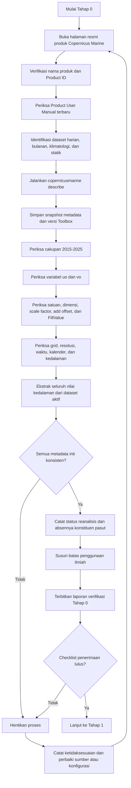
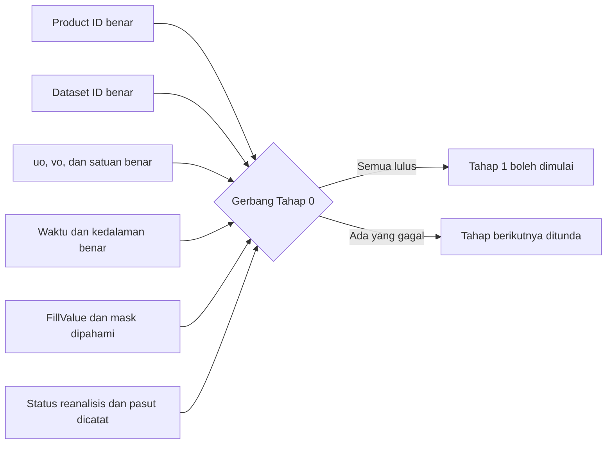

# TAHAP 0 — VERIFIKASI SUMBER DATA GLORYS12V1 UNTUK ANALISIS ARUS LAUT

**Proyek:** Pengembangan Analisis Arus Laut GLORYS12V1–Google Earth Engine  
**Wilayah awal:** Perairan Sorong dan sekitarnya  
**Periode kajian:** 1 Januari 2015–31 Desember 2025  
**Tanggal verifikasi dokumen:** 29 Juli 2026  
**Status dokumen:** Panduan verifikasi sumber data sebelum desain metodologi, otomasi unduhan, konversi, dan pengembangan Google Earth Engine  
**Ruang lingkup:** Arus laut saja  
**Klasifikasi penggunaan:** Pendidikan dan penelitian nonkomersial  
**Batas penggunaan:** Bukan layanan operasional pemerintah, komersial, keselamatan, atau keputusan teknik  
**Versi dokumen:** 1.1

---

## Daftar isi

0. [Klasifikasi penggunaan dan status Earth Engine](#0-klasifikasi-penggunaan-dan-status-earth-engine)
1. [Tujuan Tahap 0](#1-tujuan-tahap-0)
2. [Prinsip pengendalian mutu](#2-prinsip-pengendalian-mutu)
3. [Ringkasan hasil verifikasi](#3-ringkasan-hasil-verifikasi)
4. [Identitas produk](#4-identitas-produk)
5. [Dataset yang relevan](#5-dataset-yang-relevan)
6. [Cakupan waktu dan periode kajian](#6-cakupan-waktu-dan-periode-kajian)
7. [Resolusi spasial dan struktur grid](#7-resolusi-spasial-dan-struktur-grid)
8. [Variabel arus](#8-variabel-arus)
9. [Struktur vertikal dan kedalaman](#9-struktur-vertikal-dan-kedalaman)
10. [Resolusi temporal dan definisi waktu](#10-resolusi-temporal-dan-definisi-waktu)
11. [Format, skala, offset, nilai hilang, dan mask](#11-format-skala-offset-nilai-hilang-dan-mask)
12. [Status GLORYS12V1 sebagai reanalisis](#12-status-glorys12v1-sebagai-reanalisis)
13. [Konsekuensi ilmiah untuk Perairan Sorong](#13-konsekuensi-ilmiah-untuk-perairan-sorong)
14. [Prosedur verifikasi metadata menggunakan Copernicus Marine Toolbox](#14-prosedur-verifikasi-metadata-menggunakan-copernicus-marine-toolbox)
15. [Pemeriksaan awal NetCDF menggunakan Python](#15-pemeriksaan-awal-netcdf-menggunakan-python)
16. [Diagram alur Tahap 0](#16-diagram-alur-tahap-0)
17. [Risiko dan mitigasi Tahap 0](#17-risiko-dan-mitigasi-tahap-0)
18. [Artefak yang wajib dihasilkan](#18-artefak-yang-wajib-dihasilkan)
19. [Checklist dan gerbang kelulusan](#19-checklist-dan-gerbang-kelulusan)
20. [Keputusan akhir Tahap 0](#20-keputusan-akhir-tahap-0)
21. [Sumber resmi](#21-sumber-resmi)
22. [Catatan perubahan](#22-catatan-perubahan)

---


## 0. Klasifikasi penggunaan dan status Earth Engine

### 0.1 Keputusan penggunaan

Proyek ini ditetapkan hanya untuk:

- pendidikan;
- pelatihan dosen dan mahasiswa;
- penelitian nonkomersial;
- publikasi ilmiah;
- demonstrasi metode;
- pengembangan kapasitas analisis oseanografi.

Proyek ini tidak dirancang sebagai:

- sistem operasional pemerintah;
- layanan perizinan atau pengawasan;
- layanan komersial;
- sistem keselamatan navigasi;
- dasar tunggal desain teknik;
- sistem pengambilan keputusan berisiko tinggi.

### 0.2 Konsekuensi terhadap Google Earth Engine

Earth Engine dapat digunakan tanpa biaya untuk proyek nonkomersial yang telah diverifikasi dan memenuhi persyaratan Google. Sejak 2026, proyek nonkomersial menggunakan sistem tier dan kuota komputasi. Tier, kuota, dan persyaratan dapat berubah sehingga harus diperiksa kembali pada awal implementasi.

Keputusan proyek:

1. gunakan Google Cloud Project yang khusus untuk pendidikan dan penelitian;
2. pilih tier nonkomersial yang tersedia dan sesuai;
3. jangan mengubah tujuan proyek menjadi operasional tanpa peninjauan kebijakan;
4. pisahkan layanan Google Cloud lain yang dapat menimbulkan biaya;
5. catat Project ID, tier, pemilik, dan tanggal verifikasi;
6. pantau penggunaan komputasi Earth Engine;
7. jangan menganggap tier lebih tinggi menghapus batas memori per permintaan.

### 0.3 Arsitektur komputasi yang berlaku

Tahap 0 hanya memverifikasi data, tetapi seluruh tahap berikutnya wajib memakai prinsip:

> **Python/xarray untuk validasi dan komputasi berat; Earth Engine untuk penyimpanan aset terpilih, visualisasi, analisis ringan, dan aplikasi interaktif terbatas.**

Klasifikasi penggunaan dan arsitektur ini tidak mengubah identitas ilmiah GLORYS12V1, tetapi mengubah desain implementasi pada Tahap 1 dan Tahap 2.

### 0.4 Bukti administratif minimum

Simpan:

```text
outputs/governance/
├── earth_engine_project_id.txt
├── noncommercial_tier.txt
├── purpose_statement.md
├── policy_verification_date.txt
└── cloud_cost_controls.md
```

Pernyataan tujuan minimum:

```text
Proyek digunakan hanya untuk pendidikan dan penelitian nonkomersial
mengenai analisis arus laut GLORYS12V1. Proyek bukan layanan
operasional pemerintah, komersial, keselamatan, atau desain teknik.
```


## 1. Tujuan Tahap 0

Tahap 0 bertujuan memastikan bahwa seluruh keputusan pengembangan selanjutnya menggunakan produk, dataset, variabel, satuan, dimensi, waktu, kedalaman, dan metadata yang benar.

Tahap ini dilakukan sebelum:

- menyusun metodologi analisis terperinci;
- mengunduh data skala penuh;
- mengonversi NetCDF menjadi GeoTIFF;
- mengunggah data ke Earth Engine Assets;
- menghitung statistik arus;
- membuat visualisasi vektor;
- membangun antarmuka Google Earth Engine.

Tahap 0 harus menjawab pertanyaan berikut:

1. Apakah produk yang digunakan benar-benar GLORYS12V1?
2. Apakah Product ID dan Dataset ID telah diverifikasi dari sumber resmi?
3. Apakah periode 1 Januari 2015–31 Desember 2025 tersedia secara konsisten?
4. Apakah data harian dan bulanan tersedia?
5. Apakah komponen arus zonal dan meridional tersedia?
6. Apa nama variabel dan satuannya?
7. Berapa resolusi spasial dan jumlah tingkat kedalamannya?
8. Berapa kedalaman lapisan model teratas?
9. Bagaimana waktu, kalender, nilai hilang, skala, dan offset disimpan?
10. Apakah pasang surut dimasukkan dalam sistem model?
11. Apa konsekuensi ilmiah penggunaan data reanalisis di Perairan Sorong?

> **Aturan penghentian:** pekerjaan tidak boleh diteruskan ke skala penuh apabila Product ID, Dataset ID, variabel, satuan, kedalaman, nilai hilang, atau definisi waktu belum tervalidasi.

---

## 2. Prinsip pengendalian mutu

Tahap 0 menggunakan prinsip berikut:

1. **Sumber resmi sebagai rujukan utama.**  
   Metadata diperiksa melalui halaman produk Copernicus Marine, Product User Manual, dan Copernicus Marine Toolbox.

2. **Tidak mengandalkan ingatan.**  
   Product ID, Dataset ID, nama variabel, sintaks CLI, waktu, dan kedalaman dapat berubah antarversi.

3. **Metadata hidup tetap harus diperiksa.**  
   Dokumen manual menjadi rujukan, tetapi metadata dataset aktif tetap harus diekstrak dengan `copernicusmarine describe`.

4. **Ketidakpastian dinyatakan terbuka.**  
   Hal yang belum dapat diverifikasi tidak boleh ditulis sebagai fakta final.

5. **Tidak menciptakan ketelitian semu.**  
   Resolusi tampilan atau hasil resampling tidak boleh diklaim sebagai peningkatan ketelitian oseanografi.

6. **Reproduksibilitas.**  
   Tanggal akses, versi toolbox, keluaran metadata, dan dokumen rujukan harus disimpan.

---

## 3. Ringkasan hasil verifikasi

| Unsur | Hasil verifikasi | Status |
|---|---|---|
| Nama produk | Global Ocean Physics Reanalysis | Terverifikasi |
| Nama sistem reanalisis | GLORYS12V1 | Terverifikasi |
| Product ID | `GLOBAL_MULTIYEAR_PHY_001_030` | Terverifikasi |
| Dataset harian | `cmems_mod_glo_phy_my_0.083deg_P1D-m` | Terverifikasi |
| Dataset bulanan | `cmems_mod_glo_phy_my_0.083deg_P1M-m` | Terverifikasi |
| Dataset klimatologi bawaan | `cmems_mod_glo_phy_my_0.083deg-climatology_P1M-m` | Terverifikasi |
| Dataset statik | `cmems_mod_glo_phy_my_0.083deg_static` | Terverifikasi |
| Jenis produk | Reanalisis model oseanografi global | Terverifikasi |
| Format distribusi | NetCDF, mengikuti CF-1.4 menurut PUM | Terverifikasi |
| Resolusi horizontal | 1/12° atau 0,083°; sekitar 8 km | Terverifikasi |
| Struktur grid keluaran | Grid reguler equirectangular; variabel ditempatkan pada grid reguler yang sama | Terverifikasi |
| Tingkat vertikal | 50 tingkat | Terverifikasi |
| Kedalaman lapisan teratas | 0,494025 m | Terverifikasi |
| Kedalaman terdalam | sekitar 5.727,917 m | Terverifikasi |
| Arah koordinat kedalaman | Positif ke bawah | Terverifikasi |
| Variabel arus zonal | `uo` | Terverifikasi |
| Variabel arus meridional | `vo` | Terverifikasi |
| Satuan `uo` dan `vo` | m/s | Terverifikasi |
| Resolusi temporal | Rata-rata harian dan rata-rata bulanan | Terverifikasi |
| Kalender | Gregorian | Terverifikasi |
| Satuan koordinat waktu contoh PUM | Jam sejak `1950-01-01 00:00:00` | Terverifikasi |
| Definisi rata-rata harian | Tengah malam hingga tengah malam, timestamp dipusatkan pada tengah hari | Terverifikasi |
| Definisi rata-rata bulanan | Hari pertama hingga hari terakhir bulan kalender | Terverifikasi |
| Nilai hilang menurut PUM | `_FillValue = -32767` pada data terkompresi | Terverifikasi |
| Pasang surut | Konstituen pasang surut tidak diperhitungkan | Terverifikasi |
| Ketersediaan 2015–2025 | Seluruh periode tersedia dalam produk yang konsisten | Terverifikasi |
| Jumlah tahun 2015–2025 | 11 tahun secara inklusif | Terverifikasi secara kalender |
| Daftar lengkap 50 kedalaman | Harus diekstrak dari dataset aktif | Belum ditutup |
| Zona waktu eksplisit produk | Tidak ditemukan pernyataan eksplisit bahwa hari produk adalah WIT | Tidak boleh diasumsikan |
| Batas resmi Perairan Sorong | Belum diberikan | Di luar penetapan Tahap 0 |

---

## 4. Identitas produk

### 4.1 Nama dan Product ID

Produk yang digunakan adalah:

```text
Nama produk : Global Ocean Physics Reanalysis
Nama sistem : GLORYS12V1
Product ID  : GLOBAL_MULTIYEAR_PHY_001_030
DOI         : 10.48670/moi-00021
```

Halaman resmi Copernicus Marine mengidentifikasi GLORYS12V1 sebagai reanalisis laut global beresolusi 1/12° dengan 50 tingkat vertikal dan cakupan era altimetri sejak 1993.

### 4.2 Tipe data

GLORYS12V1 adalah:

- hasil model numerik oseanografi;
- reanalisis;
- dikendalikan oleh dinamika model;
- dikoreksi melalui asimilasi observasi;
- bukan pengukuran langsung arus laut.

### 4.3 Komponen sistem

Dokumentasi produk menjelaskan bahwa:

- komponen model menggunakan platform NEMO;
- observasi diasimilasikan melalui skema asimilasi;
- observasi yang digunakan mencakup tinggi muka laut dari altimetri, suhu permukaan laut, konsentrasi es laut, serta profil suhu dan salinitas;
- koreksi bias skala besar suhu dan salinitas diterapkan melalui skema 3D-VAR;
- keluaran disajikan pada grid reguler standar.

Informasi ini penting karena nilai `uo` dan `vo` adalah hasil rekonstruksi model yang dibatasi oleh observasi, bukan hasil pengukuran current meter pada setiap piksel.

---

## 5. Dataset yang relevan

Produk `GLOBAL_MULTIYEAR_PHY_001_030` diorganisasikan ke dalam dataset berikut.

### 5.1 Dataset harian

```text
cmems_mod_glo_phy_my_0.083deg_P1D-m
```

Dataset ini memuat rata-rata harian variabel tiga dimensi, termasuk arus dari lapisan atas hingga dasar.

Dataset ini menjadi pilihan untuk:

- analisis harian;
- statistik Januari–Maret;
- minimum dan maksimum kecepatan arus rata-rata harian;
- median dan persentil harian;
- frekuensi hari di atas ambang;
- variasi arah harian;
- current rose;
- perbandingan antartahun pada resolusi harian.

### 5.2 Dataset bulanan

```text
cmems_mod_glo_phy_my_0.083deg_P1M-m
```

Dataset ini memuat rata-rata bulanan kalender.

Dataset ini menjadi pilihan untuk:

- klimatologi bulanan;
- pola musiman;
- perbandingan bulanan antartahun;
- analisis anomali bulanan;
- analisis perubahan jangka menengah dan panjang.

> **Peringatan metodologis:** besar vektor yang dihitung dari `uo` dan `vo` bulanan adalah besar arus resultan bulanan. Nilai tersebut tidak sama dengan rata-rata besar kecepatan harian dalam bulan yang sama.

### 5.3 Dataset klimatologi bawaan

```text
cmems_mod_glo_phy_my_0.083deg-climatology_P1M-m
```

Menurut PUM, dataset ini berisi klimatologi bulanan periode 1993–2016.

Dataset tersebut **tidak otomatis digunakan** sebagai klimatologi utama proyek 2015–2025 karena periode acuannya berbeda dari kebutuhan penelitian. Klimatologi 2015–2025 harus dihitung sendiri apabila periode acuan penelitian ditetapkan sebagai 2015–2025.

### 5.4 Dataset statik

```text
cmems_mod_glo_phy_my_0.083deg_static
```

Dataset statik menyediakan informasi seperti:

- koordinat;
- mask darat–laut;
- batimetri;
- dimensi grid;
- mean dynamic topography.

Dataset statik berguna untuk pemeriksaan mask, geometri grid, dan interpretasi wilayah pesisir.

---

## 6. Cakupan waktu dan periode kajian

### 6.1 Cakupan produk

Dokumentasi resmi menyatakan produk mencakup periode sejak awal 1993 dan terus diperbarui sebagai produk multiyear. Halaman produk yang diperiksa pada 29 Juli 2026 menampilkan cakupan temporal yang telah melewati 31 Desember 2025.

Dengan demikian:

> Periode 1 Januari 2015–31 Desember 2025 tersedia seluruhnya dalam satu produk GLORYS12V1 yang konsisten.

### 6.2 Lama periode kajian

Periode:

```text
1 Januari 2015–31 Desember 2025
```

mencakup **11 tahun secara inklusif**, yaitu:

```text
2015, 2016, 2017, 2018, 2019, 2020,
2021, 2022, 2023, 2024, dan 2025
```

Periode tersebut tidak boleh disebut sebagai periode 10 tahun.

Apabila diperlukan tepat 10 tahun, pilihan yang konsisten adalah:

- 2015–2024; atau
- 2016–2025.

### 6.3 Filter tanggal

Untuk sistem yang menggunakan batas akhir eksklusif:

```text
Tanggal awal : 2015-01-01
Tanggal akhir: 2026-01-01
```

Untuk periode Januari–Maret setiap tahun:

```text
Tanggal awal : 1 Januari
Batas akhir  : 1 April, eksklusif
```

---

## 7. Resolusi spasial dan struktur grid

### 7.1 Resolusi horizontal

Resolusi yang terverifikasi adalah:

```text
0,083° × 0,083°
```

atau secara nominal:

```text
1/12°
```

Dokumentasi menyebut nilai ini setara kira-kira dengan 8 km.

Jarak aktual satu derajat bujur berubah menurut lintang. Karena wilayah Sorong berada dekat ekuator, ukuran grid dalam arah bujur relatif mendekati nilai nominal ekuatorial, tetapi tetap tidak boleh dianggap identik pada semua lokasi.

### 7.2 Grid keluaran

Produk disajikan pada:

- grid reguler;
- proyeksi/geometri equirectangular berbasis lintang–bujur;
- variabel keluaran yang telah diinterpolasi dari grid asli Arakawa C ke grid reguler bersama.

Konsekuensinya:

- `uo` dan `vo` pada produk keluaran dapat dianalisis pada titik grid yang sama;
- transformasi spasial tetap harus diperiksa ketika dikonversi ke GeoTIFF;
- orientasi lintang tidak boleh diasumsikan tanpa inspeksi nilai koordinat.

### 7.3 Resolusi bukan ketelitian lokal

Resolusi sekitar 8 km tidak berarti produk dapat menggambarkan secara tepat:

- kanal selebar ratusan meter;
- posisi arus di sisi tertentu sebuah pulau kecil;
- arus tepat pada lokasi dermaga;
- aliran rinci di celah terumbu;
- pusaran kecil di teluk sempit.

Resampling ke 100 m atau 1 km hanya mengubah representasi raster, bukan menambah informasi oseanografi.

---

## 8. Variabel arus

Variabel utama yang digunakan adalah:

| Nama variabel | Nama standar | Makna | Tanda positif | Satuan |
|---|---|---|---|---|
| `uo` | `eastward_sea_water_velocity` | Komponen arus zonal | Ke timur | m/s |
| `vo` | `northward_sea_water_velocity` | Komponen arus meridional | Ke utara | m/s |

### 8.1 Interpretasi tanda

Untuk `uo`:

- `uo > 0`: komponen bergerak ke timur;
- `uo < 0`: komponen bergerak ke barat.

Untuk `vo`:

- `vo > 0`: komponen bergerak ke utara;
- `vo < 0`: komponen bergerak ke selatan.

### 8.2 Pemeriksaan wajib

Sebelum data dipakai, periksa:

- nama variabel persis;
- nama standar CF;
- satuan;
- tipe data;
- dimensi;
- nilai minimum dan maksimum;
- `_FillValue`;
- `scale_factor`;
- `add_offset`;
- urutan dimensi;
- kesesuaian koordinat `uo` dan `vo`.

### 8.3 Larangan

Jangan:

- menukar `uo` dan `vo`;
- menganggap `uo` sebagai arah;
- menganggap `vo` sebagai kecepatan total;
- menghitung kecepatan sebelum data terdekompresi dengan benar;
- mengubah nilai hilang menjadi nol;
- mengubah satuan tanpa dokumentasi.

---

## 9. Struktur vertikal dan kedalaman

### 9.1 Jumlah tingkat

Produk memiliki:

```text
50 tingkat kedalaman
```

### 9.2 Lapisan model teratas

Koordinat kedalaman minimum yang tercantum dalam PUM adalah:

```text
0.494025 m
```

Oleh karena itu, istilah yang benar adalah:

> **arus dekat permukaan pada lapisan model teratas, dengan pusat lapisan sekitar kedalaman 0,494 m**

Istilah berikut tidak boleh digunakan:

> arus pada kedalaman 0 m

kecuali dataset yang diperiksa memang memiliki koordinat 0 m, yang bukan kondisi GLORYS12V1 ini.

### 9.3 Lapisan terdalam

Koordinat kedalaman maksimum yang tercantum adalah:

```text
5727.917 m
```

### 9.4 Arah koordinat

Atribut koordinat kedalaman menyatakan:

```text
positive = down
```

Artinya, nilai kedalaman meningkat ke bawah.

### 9.5 Status daftar lengkap 50 kedalaman

PUM memverifikasi:

- jumlah tingkat;
- kedalaman minimum;
- kedalaman maksimum;
- unit;
- arah positif.

Namun, daftar lengkap seluruh 50 nilai kedalaman belum ditampilkan sebagai daftar eksplisit dalam bagian yang digunakan sebagai rujukan.

Karena itu, daftar lengkap wajib diekstrak dari metadata dataset aktif atau NetCDF pilot, kemudian disimpan sebagai artefak:

```python
print(ds["depth"].values)
```

> **Gerbang wajib:** proses unduhan skala penuh tidak boleh dimulai sebelum nilai kedalaman target diverifikasi secara persis dari dataset aktif.

### 9.6 Pemilihan lapisan

Pada tahap awal, target yang direncanakan adalah lapisan model teratas. Pemilihan sebaiknya menggunakan nilai koordinat yang telah diverifikasi, bukan hanya metode `nearest` tanpa pemeriksaan.

Risiko penggunaan `nearest` tanpa validasi adalah terpilihnya lapisan yang berbeda apabila struktur atau metadata dataset berubah.

---

## 10. Resolusi temporal dan definisi waktu

### 10.1 Data harian

Dokumentasi PUM menyatakan:

- data harian adalah rata-rata selama satu hari;
- periode rata-rata berlangsung dari tengah malam hingga tengah malam;
- timestamp dipusatkan pada tengah hari.

Karena itu, keluaran statistik harus diberi istilah:

- minimum kecepatan arus rata-rata harian;
- maksimum kecepatan arus rata-rata harian;
- median kecepatan arus rata-rata harian.

Jangan menyebut maksimum harian sebagai:

- kecepatan sesaat maksimum;
- maksimum arus pasang;
- puncak arus dalam satu hari.

### 10.2 Data bulanan

Data bulanan merupakan rata-rata selama bulan kalender, dari hari pertama sampai hari terakhir.

### 10.3 Kalender dan satuan waktu

Contoh header NetCDF dalam PUM mencantumkan:

```text
calendar = gregorian
units    = hours since 1950-01-01 00:00:00
```

Atribut tersebut harus diperiksa kembali pada NetCDF hasil unduhan karena metadata aktif adalah sumber operasional yang dipakai dalam pemrosesan.

### 10.4 Zona waktu dan WIT

Dokumentasi yang diperiksa tidak cukup untuk menyatakan bahwa periode harian produk adalah hari lokal WIT.

Oleh karena itu:

- jangan menggeser timestamp secara otomatis menjadi UTC+9;
- jangan menganggap tanggal produk identik dengan hari lokal Sorong tanpa pemeriksaan;
- pertahankan waktu hasil decoding NetCDF sebagai metadata sumber;
- WIT dapat digunakan sebagai informasi tampilan apabila perbedaannya dijelaskan;
- simpan zona waktu tampilan secara terpisah dari definisi waktu produk.

Struktur metadata yang disarankan pada tahap berikutnya:

```text
source_time
product_date
system:time_start
display_timezone = Asia/Jayapura
```

Konversi zona waktu untuk pelabelan tidak boleh mengubah definisi rata-rata harian model.

---

## 11. Format, skala, offset, nilai hilang, dan mask

### 11.1 Format

PUM menyatakan keluaran tersedia dalam:

```text
NetCDF
```

dan mengikuti:

```text
CF-1.4
```

### 11.2 Data terkompresi

Variabel dapat disimpan sebagai bilangan integer terkompresi dengan atribut:

- `scale_factor`;
- `add_offset`;
- `_FillValue`.

Formula rekonstruksi nilai riil adalah:

\[
\text{Real Value}
=
(\text{Stored Value} \times \text{scale factor})
+
\text{add offset}
\]

### 11.3 Nilai hilang

PUM mencantumkan nilai hilang:

```text
-32767
```

pada data terkompresi dan menyatakan daratan direpresentasikan sebagai `_FillValue`.

Konsekuensinya:

- `-32767` bukan kecepatan arus;
- daratan tidak boleh berubah menjadi nilai nol;
- nol adalah nilai arus yang mungkin valid;
- mask harus dipertahankan selama pembacaan dan konversi.

### 11.4 Decoding dengan xarray

`xarray.open_dataset()` umumnya dapat menerapkan decoding CF secara otomatis. Akan tetapi, pipeline tetap harus memastikan apakah:

- data telah didekode;
- `scale_factor` dan `add_offset` telah diterapkan;
- `_FillValue` telah berubah menjadi `NaN` atau mask;
- skala tidak diterapkan dua kali.

Kesalahan yang harus dihindari:

1. membuka data dengan decoding otomatis;
2. mengalikan kembali dengan `scale_factor`;
3. menghasilkan nilai arus yang salah.

### 11.5 Tipe data keluaran

Untuk konversi ke GeoTIFF pada tahap berikutnya, nilai arus disarankan dipertahankan sebagai:

```text
float32
```

dengan mask atau `NoData` yang jelas dan konsisten.

---

## 12. Status GLORYS12V1 sebagai reanalisis

### 12.1 Pengertian operasional

Reanalisis adalah rekonstruksi kondisi laut yang menggabungkan:

- model numerik;
- gaya atmosfer;
- kondisi awal dan batas;
- asimilasi observasi;
- skema koreksi bias.

Reanalisis berusaha menghasilkan representasi ruang–waktu yang konsisten dan realistis, tetapi tidak identik dengan observasi langsung.

### 12.2 Penggunaan yang tepat

GLORYS12V1 terutama tepat untuk:

- pola arus regional;
- klimatologi;
- perubahan musiman;
- perbandingan antartahun;
- anomali;
- arah arus resultan;
- persistensi;
- statistik spasial-temporal;
- kajian eksploratif oseanografi regional.

### 12.3 Penggunaan yang tidak dapat didasarkan hanya pada GLORYS12V1

Produk tidak boleh menjadi satu-satunya dasar untuk:

- desain struktur laut;
- perhitungan beban arus bangunan;
- keselamatan navigasi lokal;
- penetapan lokasi tepat dermaga;
- operasi berisiko tinggi;
- penilaian kanal atau selat sangat sempit;
- keputusan teknik rinci tanpa validasi lapangan.

### 12.4 Asimilasi observasi tidak mengubah statusnya

Walaupun observasi diasimilasikan, setiap piksel dan timestep tetap bukan pengukuran langsung di lokasi tersebut. Asimilasi membantu membatasi model, tetapi tidak membuat seluruh grid menjadi observasi.

---

## 13. Konsekuensi ilmiah untuk Perairan Sorong

### 13.1 Geometri kompleks

Perairan Sorong dan Raja Ampat memiliki:

- pulau-pulau kecil;
- garis pantai kompleks;
- teluk;
- selat dan kanal sempit;
- terumbu karang;
- batimetri yang kompleks;
- perairan pesisir dan laut terbuka dalam jarak berdekatan.

Grid sekitar 8 km dapat mencakup lebih dari satu unsur tersebut dalam satu sel.

### 13.2 Piksel campuran

Piksel di sekitar garis pantai dapat dipengaruhi oleh:

- interpolasi dari grid model;
- mask darat–laut;
- garis pantai model yang lebih sederhana daripada kondisi nyata;
- percampuran karakter perairan terbuka dan terlindung.

Piksel tepi harus diperiksa secara visual dan numerik.

### 13.3 Pasang surut

PUM menyatakan:

```text
Tidal constituents: not taken into account
```

Konstituen pasang surut tidak dimasukkan dalam sistem model GLORYS12V1.

Hal ini sangat penting karena arus lokal di:

- Selat Sele;
- Selat Dampier;
- kanal sempit Raja Ampat;
- mulut teluk;
- celah antarpulau;
- pesisir Sorong;

dapat sangat dipengaruhi oleh pasang surut dan geometri lokal.

Konsekuensinya:

- perubahan arus dalam skala jam tidak direpresentasikan sebagai arus pasut rinci;
- rata-rata harian dapat menghaluskan arus bolak-balik;
- maksimum data harian bukan maksimum arus aktual dalam satu hari;
- arah resultan dapat rendah apabila arus berganti arah;
- validasi dengan ADCP, current meter, drifter, data pasang surut, atau model lokal tetap diperlukan.

### 13.4 Interpretasi hasil

Hasil GLORYS12V1 di wilayah ini harus dilabeli sebagai:

> representasi arus regional dari reanalisis model pada resolusi sekitar 1/12°

dan bukan sebagai:

> kondisi arus lokal beresolusi tinggi di setiap selat dan lokasi pesisir.

---

## 14. Prosedur verifikasi metadata menggunakan Copernicus Marine Toolbox

### 14.1 Catat versi toolbox

Jalankan:

```bash
copernicusmarine --version
```

Simpan hasilnya dalam log, misalnya:

```text
outputs/logs/copernicusmarine_version.txt
```

### 14.2 Verifikasi Product ID

```bash
copernicusmarine describe \
  --product-id GLOBAL_MULTIYEAR_PHY_001_030 \
  --return-fields all \
  > outputs/logs/product_GLOBAL_MULTIYEAR_PHY_001_030.json
```

### 14.3 Verifikasi dataset harian

```bash
copernicusmarine describe \
  --dataset-id cmems_mod_glo_phy_my_0.083deg_P1D-m \
  --return-fields all \
  > outputs/logs/dataset_daily_metadata.json
```

### 14.4 Verifikasi dataset bulanan

```bash
copernicusmarine describe \
  --dataset-id cmems_mod_glo_phy_my_0.083deg_P1M-m \
  --return-fields all \
  > outputs/logs/dataset_monthly_metadata.json
```

### 14.5 Verifikasi dataset statik

```bash
copernicusmarine describe \
  --dataset-id cmems_mod_glo_phy_my_0.083deg_static \
  --return-fields all \
  > outputs/logs/dataset_static_metadata.json
```

### 14.6 Hal yang diperiksa dalam keluaran JSON

Periksa dan dokumentasikan:

- Product ID;
- Dataset ID;
- versi dataset;
- bagian dataset apabila ada;
- daftar variabel;
- nama standar;
- satuan;
- dimensi;
- rentang waktu;
- resolusi temporal;
- rentang bujur;
- rentang lintang;
- rentang kedalaman;
- nilai koordinat kedalaman;
- format subset yang tersedia;
- status dataset aktif;
- tanggal pembaruan metadata.

### 14.7 Kredensial

Dokumentasi Toolbox menyatakan bahwa autentikasi dapat dicari dari:

- environment variable;
- berkas kredensial resmi;
- input interaktif.

Jangan menulis username atau password langsung dalam source code atau dokumen proyek.

Variabel lingkungan yang didokumentasikan adalah:

```text
COPERNICUSMARINE_SERVICE_USERNAME
COPERNICUSMARINE_SERVICE_PASSWORD
```

### 14.8 Simpan snapshot metadata

Metadata hidup dapat berubah. Karena itu, simpan:

```text
outputs/logs/
├── copernicusmarine_version.txt
├── product_GLOBAL_MULTIYEAR_PHY_001_030.json
├── dataset_daily_metadata.json
├── dataset_monthly_metadata.json
├── dataset_static_metadata.json
└── verification_timestamp.txt
```

Isi `verification_timestamp.txt` minimal:

```text
Verification date : 2026-07-29
Product ID        : GLOBAL_MULTIYEAR_PHY_001_030
Daily dataset     : cmems_mod_glo_phy_my_0.083deg_P1D-m
Monthly dataset   : cmems_mod_glo_phy_my_0.083deg_P1M-m
```

---

## 15. Pemeriksaan awal NetCDF menggunakan Python

Bagian ini bukan pengolahan skala penuh. Tujuannya hanya memeriksa struktur NetCDF pilot dan mengonfirmasi metadata yang akan menjadi dasar tahap berikutnya.

```python
from pathlib import Path

import numpy as np
import xarray as xr


def inspect_glorys_netcdf(netcdf_path: str) -> None:
    """Memeriksa metadata dasar NetCDF GLORYS12V1 tanpa mengubah data."""
    path = Path(netcdf_path)

    if not path.exists():
        raise FileNotFoundError(f"File tidak ditemukan: {path}")

    with xr.open_dataset(path, decode_cf=True, mask_and_scale=True) as ds:
        required_coordinates = {"longitude", "latitude", "depth", "time"}
        required_variables = {"uo", "vo"}

        missing_coordinates = required_coordinates.difference(ds.coords)
        missing_variables = required_variables.difference(ds.data_vars)

        if missing_coordinates:
            raise ValueError(
                f"Koordinat wajib tidak ditemukan: {sorted(missing_coordinates)}"
            )

        if missing_variables:
            raise ValueError(
                f"Variabel wajib tidak ditemukan: {sorted(missing_variables)}"
            )

        print("=== DIMENSI ===")
        print(ds.sizes)

        print("\n=== KOORDINAT KEDALAMAN ===")
        depth_values = ds["depth"].values
        print(depth_values)
        print(f"Jumlah tingkat : {depth_values.size}")
        print(f"Lapisan teratas: {float(np.nanmin(depth_values)):.6f} m")
        print(f"Lapisan terdalam: {float(np.nanmax(depth_values)):.6f} m")

        print("\n=== WAKTU ===")
        print(ds["time"].values)
        print(ds["time"].attrs)

        print("\n=== ORIENTASI KOORDINAT ===")
        longitude = ds["longitude"].values
        latitude = ds["latitude"].values

        print(
            "Bujur meningkat:",
            bool(np.all(np.diff(longitude) > 0))
        )
        print(
            "Lintang meningkat:",
            bool(np.all(np.diff(latitude) > 0))
        )

        print("\n=== VARIABEL ARUS ===")
        for variable_name in ("uo", "vo"):
            variable = ds[variable_name]
            values = variable.values

            print(f"\nVariabel: {variable_name}")
            print(f"Dimensi : {variable.dims}")
            print(f"Satuan  : {variable.attrs.get('units')}")
            print(f"Standard name: {variable.attrs.get('standard_name')}")
            print(f"Minimum valid: {float(np.nanmin(values))}")
            print(f"Maksimum valid: {float(np.nanmax(values))}")
            print(f"Jumlah NaN: {int(np.isnan(values).sum())}")

        print("\n=== ATRIBUT GLOBAL ===")
        for key, value in ds.attrs.items():
            print(f"{key}: {value}")


if __name__ == "__main__":
    inspect_glorys_netcdf(
        "data/pilot/glorys12v1_daily_pilot.nc"
    )
```

### 15.1 Kriteria keberhasilan pemeriksaan

Pemeriksaan dinyatakan berhasil apabila:

- `uo` tersedia;
- `vo` tersedia;
- satuan keduanya `m/s` atau bentuk ekuivalen yang terdokumentasi;
- dimensi waktu tersedia;
- dimensi kedalaman tersedia;
- jumlah tingkat sesuai subset yang diminta;
- lapisan teratas sesuai koordinat dataset;
- nilai darat menjadi mask/`NaN`, bukan nol buatan;
- lintang dan bujur dapat diinterpretasikan dengan benar;
- nilai `uo` dan `vo` masuk akal;
- tidak ada penerapan skala ganda.

### 15.2 Berkas keluaran tambahan

Daftar lengkap kedalaman harus disimpan, misalnya:

```python
np.savetxt(
    "outputs/tables/glorys12v1_depth_levels.csv",
    depth_values,
    delimiter=",",
    header="depth_m",
    comments=""
)
```

---

## 16. Diagram alur Tahap 0

### 16.1 Alur verifikasi sumber data



### 16.2 Gerbang keputusan



---

## 17. Risiko dan mitigasi Tahap 0

| Risiko | Dampak | Mitigasi |
|---|---|---|
| Product ID hanya diambil dari catatan lama | Produk yang digunakan dapat salah atau berubah | Periksa halaman produk dan `describe` pada tanggal pelaksanaan |
| Dataset ID salah | Unduhan gagal atau mengambil data yang tidak sesuai | Simpan JSON metadata harian dan bulanan |
| Versi dataset tidak dicatat | Hasil sulit direproduksi | Catat versi Toolbox, versi dataset, dan tanggal akses |
| Menganggap periode 2015–2025 sebagai 10 tahun | Kesalahan desain statistik dan dokumentasi | Tetapkan 11 tahun inklusif |
| Variabel `uo` dan `vo` tertukar | Arah arus menjadi salah | Periksa nama standar dan tanda positif |
| Satuan tidak diperiksa | Kecepatan salah skala | Validasi atribut `units` pada dataset aktif |
| Skala diterapkan dua kali | Nilai arus rusak | Audit `decode_cf` dan `mask_and_scale` |
| `_FillValue` diubah menjadi nol | Daratan dianggap arus tenang | Pertahankan mask dan hitung jumlah nilai hilang |
| Lapisan teratas disebut 0 m | Deskripsi ilmiah salah | Gunakan koordinat 0,494025 m setelah verifikasi |
| Pemilihan depth memakai `nearest` tanpa pemeriksaan | Lapisan yang dipakai dapat berbeda | Cocokkan nilai depth secara eksplisit |
| Zona waktu diasumsikan WIT | Tanggal dapat bergeser salah | Pertahankan waktu produk dan pisahkan zona tampilan |
| Data harian dianggap data sesaat | Maksimum ditafsirkan berlebihan | Gunakan istilah rata-rata harian |
| Konstituen pasut dianggap tersedia | Arus lokal selat disalahartikan | Cantumkan bahwa pasut tidak diperhitungkan |
| Resolusi 8 km dianggap cukup untuk lokasi proyek | Ketelitian semu | Batasi interpretasi pada skala regional |
| Daftar 50 kedalaman tidak disimpan | Pemilihan lapisan tidak reproduktif | Ekspor daftar depth dari NetCDF atau metadata aktif |
| Metadata aktif tidak cocok dengan PUM | Pipeline dibangun di atas asumsi lama | Hentikan proses dan dokumentasikan perubahan |

---

## 18. Artefak yang wajib dihasilkan

Tahap 0 harus menghasilkan artefak berikut:

```text
docs/
└── tahap_0_verifikasi_sumber_data_glorys12v1.md

outputs/
├── logs/
│   ├── copernicusmarine_version.txt
│   ├── product_GLOBAL_MULTIYEAR_PHY_001_030.json
│   ├── dataset_daily_metadata.json
│   ├── dataset_monthly_metadata.json
│   ├── dataset_static_metadata.json
│   ├── verification_timestamp.txt
│   └── tahap_0_validation.log
└── tables/
    └── glorys12v1_depth_levels.csv
```

Dokumen log harus mencatat:

- tanggal pemeriksaan;
- pelaksana;
- versi dependency;
- Product ID;
- Dataset ID;
- hasil setiap pemeriksaan;
- masalah yang ditemukan;
- tindakan koreksi;
- keputusan lulus atau tidak lulus.

---

## 19. Checklist dan gerbang kelulusan

### 19.1 Checklist identitas produk

- [x] Nama produk telah diverifikasi.
- [x] Product ID `GLOBAL_MULTIYEAR_PHY_001_030` telah diverifikasi.
- [x] Status produk sebagai GLORYS12V1 telah diverifikasi.
- [x] Status produk sebagai reanalisis telah diverifikasi.
- [x] DOI produk telah dicatat.

### 19.2 Checklist dataset

- [x] Dataset harian telah diidentifikasi.
- [x] Dataset bulanan telah diidentifikasi.
- [x] Dataset klimatologi bawaan telah diidentifikasi.
- [x] Dataset statik telah diidentifikasi.
- [ ] Snapshot metadata hidup telah dihasilkan pada lingkungan pengguna.
- [ ] Versi dataset aktif telah disimpan.

### 19.3 Checklist waktu

- [x] Cakupan 2015–2025 tersedia.
- [x] Periode 2015–2025 ditetapkan sebagai 11 tahun.
- [x] Resolusi harian dan bulanan telah diverifikasi.
- [x] Definisi rata-rata harian telah diverifikasi.
- [x] Definisi rata-rata bulanan telah diverifikasi.
- [x] Kalender Gregorian telah diidentifikasi dari contoh header PUM.
- [ ] Atribut waktu NetCDF pilot telah diperiksa.
- [ ] Zona waktu dan timestamp operasional telah dicatat tanpa asumsi WIT.

### 19.4 Checklist variabel

- [x] `uo` telah diverifikasi sebagai komponen ke timur.
- [x] `vo` telah diverifikasi sebagai komponen ke utara.
- [x] Satuan m/s telah diverifikasi dari PUM.
- [ ] Satuan pada NetCDF pilot telah diperiksa.
- [ ] Dimensi `uo` dan `vo` pada NetCDF pilot telah diperiksa.
- [ ] Rentang nilai aktual pada wilayah pilot telah diperiksa.

### 19.5 Checklist spasial dan vertikal

- [x] Resolusi 1/12° telah diverifikasi.
- [x] Grid reguler telah diidentifikasi.
- [x] Jumlah 50 tingkat kedalaman telah diverifikasi.
- [x] Kedalaman lapisan teratas 0,494025 m telah diverifikasi.
- [x] Kedalaman maksimum 5.727,917 m telah diverifikasi.
- [x] Arah positif kedalaman ke bawah telah diverifikasi.
- [ ] Seluruh 50 nilai kedalaman telah diekspor.
- [ ] Orientasi lintang NetCDF pilot telah diperiksa.
- [ ] Mask statik dan mask variabel telah dibandingkan.

### 19.6 Checklist encoding

- [x] Keberadaan `scale_factor` dan `add_offset` telah diidentifikasi.
- [x] `_FillValue = -32767` telah dicatat dari PUM.
- [x] Daratan diketahui menggunakan `_FillValue`.
- [ ] Perilaku decoding xarray telah diuji.
- [ ] Tidak ada penerapan skala dua kali.
- [ ] Nilai hilang tidak berubah menjadi nol.

### 19.7 Checklist batas ilmiah

- [x] Produk dicatat sebagai reanalisis.
- [x] Produk tidak diperlakukan sebagai pengukuran langsung.
- [x] Konstituen pasut dicatat tidak diperhitungkan.
- [x] Risiko selat sempit dan garis pantai kompleks telah dicatat.
- [x] Larangan ketelitian semu telah dicatat.
- [x] Kebutuhan validasi lokal telah dicatat.

### 19.8 Checklist penggunaan platform

- [x] Tujuan pendidikan dan penelitian nonkomersial telah ditetapkan.
- [x] Penggunaan operasional pemerintah dinyatakan di luar ruang lingkup.
- [ ] Google Cloud Project khusus telah dibuat.
- [ ] Tier nonkomersial telah dipilih dan diverifikasi.
- [ ] Pemantauan EECU dan biaya layanan Cloud lain telah disiapkan.
- [ ] Pernyataan tujuan proyek telah disimpan.
- [ ] Kebijakan Earth Engine telah diperiksa kembali pada tanggal implementasi.


### 19.9 Keputusan gerbang

Tahap 0 dinyatakan **lulus penuh** hanya apabila butir yang masih kosong telah diselesaikan menggunakan metadata aktif dan NetCDF pilot.

Sebelum itu, statusnya adalah:

> **Lulus secara dokumenter, tetapi masih bersyarat pada verifikasi operasional dataset aktif dan NetCDF pilot.**

---

## 20. Keputusan akhir Tahap 0

Berdasarkan dokumentasi resmi yang diperiksa, keputusan dasar berikut dapat digunakan:

1. Produk utama adalah `GLOBAL_MULTIYEAR_PHY_001_030`.
2. Sistem reanalisis yang digunakan adalah GLORYS12V1.
3. Dataset harian adalah `cmems_mod_glo_phy_my_0.083deg_P1D-m`.
4. Dataset bulanan adalah `cmems_mod_glo_phy_my_0.083deg_P1M-m`.
5. Variabel arus adalah `uo` dan `vo`.
6. Satuan keduanya adalah m/s.
7. Resolusi horizontal adalah 1/12° atau sekitar 8 km.
8. Produk memiliki 50 tingkat kedalaman.
9. Lapisan model teratas berada pada sekitar 0,494025 m.
10. Periode 1 Januari 2015–31 Desember 2025 tersedia dan terdiri atas 11 tahun.
11. Data harian merupakan rata-rata harian, bukan data sesaat.
12. Konstituen pasang surut tidak diperhitungkan dalam GLORYS12V1.
13. Produk tepat untuk analisis regional, klimatologi, variasi musiman, anomali, dan perbandingan antartahun.
14. Produk tidak cukup sebagai satu-satunya dasar analisis teknik lokal atau arus di selat sangat sempit.
15. Tahap berikutnya belum boleh menggunakan skala penuh sebelum:
    - metadata aktif disimpan;
    - seluruh tingkat kedalaman diekspor;
    - NetCDF pilot diperiksa;
    - mask, waktu, skala, dan offset dinyatakan lulus.
16. Penggunaan dibatasi pada pendidikan dan penelitian nonkomersial.
17. Arsitektur implementasi berikutnya harus hibrida Python–GEE.
18. Perubahan menjadi penggunaan operasional atau komersial memerlukan peninjauan ulang kebijakan, biaya, keamanan, dan arsitektur.

---

## 21. Sumber resmi

### 21.1 Copernicus Marine

1. **Global Ocean Physics Reanalysis — halaman produk**  
   https://data.marine.copernicus.eu/product/GLOBAL_MULTIYEAR_PHY_001_030/description

2. **Global Ocean Physics Reanalysis — data access/services**  
   https://data.marine.copernicus.eu/product/GLOBAL_MULTIYEAR_PHY_001_030/services

3. **Product User Manual — CMEMS-GLO-PUM-001-030**  
   Issue 1.7, November 2025  
   https://documentation.marine.copernicus.eu/PUM/CMEMS-GLO-PUM-001-030.pdf

4. **Quality Information Document — CMEMS-GLO-QUID-001-030**  
   https://documentation.marine.copernicus.eu/QUID/CMEMS-GLO-QUID-001-030.pdf

5. **Copernicus Marine Toolbox — Command Line Interface**  
   https://toolbox-docs.marine.copernicus.eu/en/stable/command-line-interface.html

6. **Copernicus Marine Toolbox — subset usage**  
   https://toolbox-docs.marine.copernicus.eu/en/stable/usage/subset-usage.html

### 21.2 Ketentuan penggunaan sumber

- Periksa halaman produk dan metadata aktif sebelum setiap unduhan skala besar.
- Catat tanggal akses.
- Simpan versi PUM dan QUID yang digunakan.
- Simpan versi Copernicus Marine Toolbox.
- Jangan mengandalkan salinan metadata lama apabila dataset aktif menunjukkan perubahan.

---

## 22. Catatan perubahan

| Versi | Tanggal | Perubahan |
|---|---|---|
| 1.0 | 29 Juli 2026 | Penyusunan panduan Tahap 0; verifikasi identitas produk, dataset, variabel, waktu, grid, kedalaman, encoding, status reanalisis, pasang surut, risiko Sorong, prosedur CLI, pemeriksaan Python, diagram Mermaid, artefak, dan checklist penerimaan |
| 1.1 | 31 Juli 2026 | Menetapkan penggunaan pendidikan dan penelitian nonkomersial, batas nonoperasional, tata kelola Earth Engine, serta prinsip arsitektur hibrida Python–GEE. |

---

## Pernyataan penutup

Dokumen ini menetapkan dasar data yang harus dipenuhi sebelum analisis arus GLORYS12V1 dikembangkan lebih lanjut. Keberhasilan Tahap 0 tidak hanya ditentukan oleh ditemukannya Product ID dan Dataset ID, tetapi juga oleh bukti bahwa metadata aktif, NetCDF pilot, nilai kedalaman, waktu, mask, satuan, skala, dan offset telah diperiksa serta dapat direproduksi.
