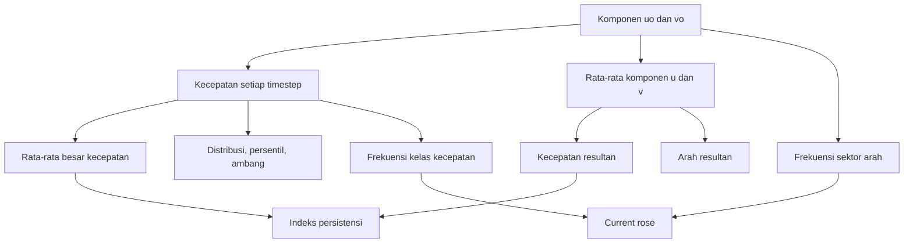
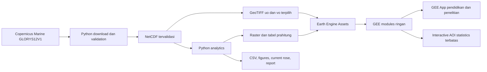
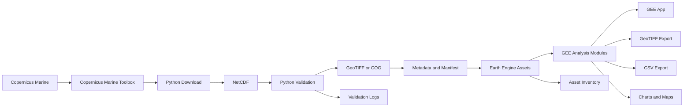
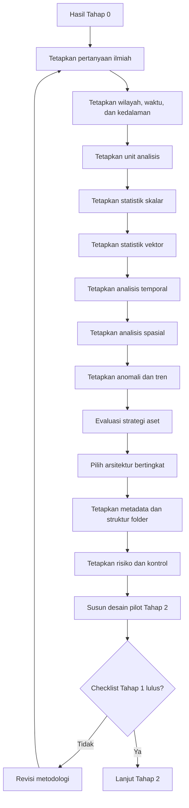
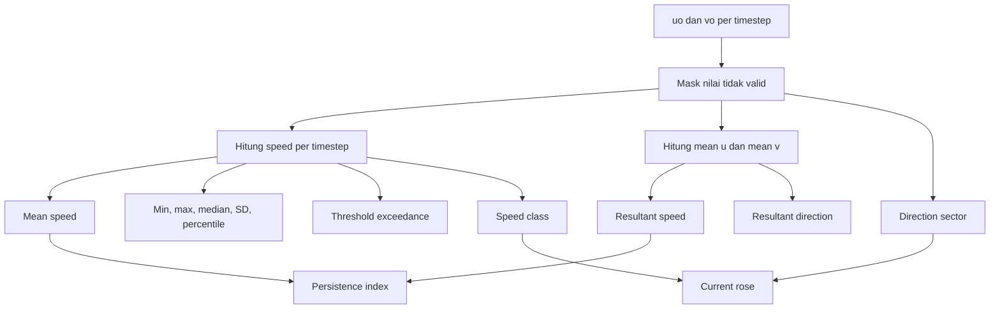
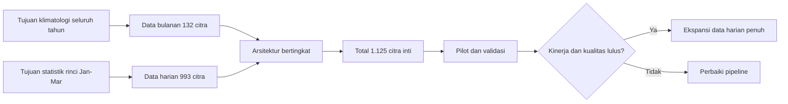

# TAHAP 1 — DESAIN METODOLOGI DAN ARSITEKTUR ANALISIS ARUS LAUT GLORYS12V1–GOOGLE EARTH ENGINE

**Proyek:** Pengembangan Analisis Arus Laut GLORYS12V1–Google Earth Engine  
**Wilayah awal:** Perairan Sorong dan sekitarnya  
**Periode kajian utama:** 1 Januari 2015–31 Desember 2025  
**Periode analisis khusus:** 1 Januari–31 Maret setiap tahun 2015–2025  
**Tanggal penyusunan:** 29 Juli 2026  
**Status dokumen:** Panduan desain metodologi dan arsitektur sebelum pilot end-to-end  
**Ruang lingkup:** Arus laut saja  
**Dataset utama:** Copernicus Marine GLORYS12V1  
**Ketergantungan:** Tahap 0 — Verifikasi Sumber Data GLORYS12V1  
**Klasifikasi penggunaan:** Pendidikan dan penelitian nonkomersial  
**Arsitektur komputasi:** Hibrida Python/xarray–Google Earth Engine  
**Versi dokumen:** 1.1

---

## Daftar isi

1. [Kedudukan Tahap 1](#1-kedudukan-tahap-1)
2. [Hubungan dengan Tahap 0](#2-hubungan-dengan-tahap-0)
3. [Tujuan Tahap 1](#3-tujuan-tahap-1)
4. [Prasyarat sebelum Tahap 1 ditutup](#4-prasyarat-sebelum-tahap-1-ditutup)
5. [Ruang lingkup dan batasan](#5-ruang-lingkup-dan-batasan)
6. [Pertanyaan ilmiah](#6-pertanyaan-ilmiah)
7. [Kerangka konseptual analisis](#7-kerangka-konseptual-analisis)
8. [Unit analisis](#8-unit-analisis)
9. [Desain wilayah kajian](#9-desain-wilayah-kajian)
10. [Desain kedalaman](#10-desain-kedalaman)
11. [Desain waktu](#11-desain-waktu)
12. [Konvensi komponen dan arah arus](#12-konvensi-komponen-dan-arah-arus)
13. [Perhitungan kecepatan dan statistik vektor](#13-perhitungan-kecepatan-dan-statistik-vektor)
14. [Rencana statistik kecepatan](#14-rencana-statistik-kecepatan)
15. [Rencana statistik arah dan current rose](#15-rencana-statistik-arah-dan-current-rose)
16. [Rencana analisis temporal](#16-rencana-analisis-temporal)
17. [Rencana analisis spasial](#17-rencana-analisis-spasial)
18. [Rencana anomali](#18-rencana-anomali)
19. [Rencana analisis tren](#19-rencana-analisis-tren)
20. [Pengendalian data hilang dan kualitas sampel](#20-pengendalian-data-hilang-dan-kualitas-sampel)
21. [Evaluasi strategi data dan aset](#21-evaluasi-strategi-data-dan-aset)
22. [Arsitektur yang direkomendasikan](#22-arsitektur-yang-direkomendasikan)
23. [Struktur Earth Engine Assets](#23-struktur-earth-engine-assets)
24. [Standar nama berkas dan aset](#24-standar-nama-berkas-dan-aset)
25. [Standar metadata](#25-standar-metadata)
26. [Arsitektur komponen sistem](#26-arsitektur-komponen-sistem)
27. [Diagram alur kerja](#27-diagram-alur-kerja)
28. [Strategi komputasi dan efisiensi](#28-strategi-komputasi-dan-efisiensi)
29. [Rencana keluaran analisis](#29-rencana-keluaran-analisis)
30. [Klasifikasi penggunaan ilmiah](#30-klasifikasi-penggunaan-ilmiah)
31. [Risiko dan mitigasi Tahap 1](#31-risiko-dan-mitigasi-tahap-1)
32. [Rancangan pilot untuk Tahap 2](#32-rancangan-pilot-untuk-tahap-2)
33. [Rencana pengembangan Tahap 2–10](#33-rencana-pengembangan-tahap-210)
34. [Artefak yang wajib dihasilkan](#34-artefak-yang-wajib-dihasilkan)
35. [Checklist penerimaan Tahap 1](#35-checklist-penerimaan-tahap-1)
36. [Keputusan metodologis final](#36-keputusan-metodologis-final)
37. [Hal yang belum boleh dilakukan](#37-hal-yang-belum-boleh-dilakukan)
38. [Sumber acuan](#38-sumber-acuan)
39. [Catatan perubahan](#39-catatan-perubahan)
40. [Keputusan penyesuaian arsitektur nonkomersial](#40-keputusan-penyesuaian-arsitektur-nonkomersial)

---

## 1. Kedudukan Tahap 1

Tahap 1 menerjemahkan hasil verifikasi sumber data pada Tahap 0 menjadi rancangan ilmiah dan teknis yang dapat diimplementasikan.

Tahap ini tidak melakukan:

- unduhan skala penuh;
- konversi seluruh NetCDF;
- pengunggahan seluruh aset;
- pembuatan aplikasi akhir;
- penarikan kesimpulan oseanografi final.

Tahap 1 menetapkan:

- pertanyaan ilmiah;
- unit analisis;
- rumus;
- definisi statistik;
- periode dan kedalaman;
- struktur data;
- arsitektur penyimpanan;
- struktur metadata;
- batas interpretasi;
- risiko;
- kriteria keberhasilan;
- desain pilot yang akan diuji pada Tahap 2.

> **Prinsip:** kode penuh tidak boleh dikembangkan sebelum metode dan arsitektur disepakati.

---

## 2. Hubungan dengan Tahap 0

Dokumen Tahap 0 dan Tahap 1 harus dipertahankan sebagai dua dokumen terpisah.

### 2.1 Fungsi Tahap 0

Tahap 0 menjawab:

- produk apa yang benar;
- Dataset ID mana yang benar;
- variabel apa yang tersedia;
- satuan, waktu, grid, dan kedalaman;
- bagaimana data dikodekan;
- apakah data merupakan reanalisis;
- apakah konstituen pasang surut dimasukkan;
- apakah periode kajian tersedia.

### 2.2 Fungsi Tahap 1

Tahap 1 menjawab:

- analisis ilmiah apa yang akan dilakukan;
- bagaimana kecepatan dan arah dihitung;
- bagaimana rata-rata kecepatan dibedakan dari resultan;
- bagaimana statistik temporal dan spasial dipisahkan;
- struktur koleksi apa yang paling realistis;
- berapa jumlah timestep dan aset;
- metadata apa yang wajib disimpan;
- bagaimana data mengalir dari Copernicus Marine ke GEE;
- risiko apa yang harus dikendalikan;
- apa yang harus diuji pada pilot.

### 2.3 Batas tumpang tindih

Tahap 0 dapat menyebut kebutuhan untuk Tahap 1, tetapi tidak menggantikannya. Misalnya, Tahap 0 telah mencatat:

- penggunaan `uo` dan `vo`;
- lapisan teratas 0,494025 m;
- data harian dan bulanan;
- pentingnya mask dan waktu.

Namun, Tahap 0 belum menetapkan keseluruhan:

- skema statistik;
- struktur analisis;
- pembagian koleksi;
- metadata aset;
- diagram arsitektur;
- keluaran akhir;
- kriteria penerimaan metodologis.

---

## 3. Tujuan Tahap 1

Tahap 1 bertujuan menghasilkan desain yang:

1. ilmiah;
2. dapat direproduksi;
3. konsisten dengan karakter GLORYS12V1;
4. realistis untuk diproses menggunakan Python dan Google Earth Engine;
5. dapat dipelajari oleh dosen Kelautan dan Perikanan;
6. dapat dikembangkan bertahap;
7. tidak menciptakan ketelitian semu;
8. membedakan statistik skalar, vektor, temporal, dan spasial;
9. memiliki jalur validasi yang jelas;
10. memiliki gerbang keputusan sebelum skala penuh.

---

## 4. Prasyarat sebelum Tahap 1 ditutup

Tahap 1 boleh disusun berdasarkan dokumentasi Tahap 0, tetapi dinyatakan lulus penuh hanya apabila hal berikut telah atau akan dijadikan gerbang Tahap 2:

- Product ID telah terverifikasi;
- Dataset ID harian telah terverifikasi;
- Dataset ID bulanan telah terverifikasi;
- `uo` dan `vo` telah terverifikasi;
- satuan telah terverifikasi;
- lapisan model teratas telah terverifikasi;
- cakupan 2015–2025 telah terverifikasi;
- daftar lengkap kedalaman akan diekstrak dari dataset aktif;
- NetCDF pilot akan diperiksa;
- definisi waktu tidak diasumsikan sebagai WIT;
- `_FillValue`, mask, skala, dan offset akan diuji secara operasional.

---

## 5. Ruang lingkup dan batasan

### 5.1 Ruang lingkup

Analisis difokuskan pada:

- arus laut GLORYS12V1;
- komponen `uo` dan `vo`;
- lapisan model teratas;
- wilayah Sorong dan sekitarnya;
- periode 2015–2025;
- analisis rinci Januari–Maret setiap tahun;
- statistik regional;
- klimatologi;
- anomali;
- persistensi;
- visualisasi vektor;
- ekspor tabel dan raster;
- pengembangan GEE App pada tahap akhir.

### 5.2 Di luar ruang lingkup

Tahap ini tidak mencakup:

- gelombang;
- arus pasut eksplisit;
- pemodelan hidrodinamika lokal;
- desain struktur laut;
- prakiraan operasional;
- pemodelan dispersi;
- transport sedimen;
- pencampuran GLORYS12V1 dan HYCOM menjadi satu seri;
- downscaling dinamik;
- interpolasi yang diklaim meningkatkan ketelitian.

### 5.3 Dataset pembanding

Dataset lain hanya boleh digunakan sebagai:

- pembanding;
- validasi;
- bahan diskusi keterbatasan;
- demonstrasi pembelajaran;
- alternatif sementara jika kendala teknis utama tidak dapat diatasi.

Dataset lain tidak menggantikan GLORYS12V1 sebagai sumber utama proyek ini.

---

## 6. Pertanyaan ilmiah

### 6.1 Pertanyaan utama seluruh periode

1. Bagaimana pola rata-rata besar kecepatan arus dekat permukaan selama 2015–2025?
2. Bagaimana komponen rata-rata `uo` dan `vo`?
3. Bagaimana kecepatan dan arah arus resultan?
4. Seberapa persisten arah arus?
5. Bagaimana pola musiman berdasarkan klimatologi bulanan?
6. Bagaimana variasi antartahun?
7. Di wilayah mana arus rata-rata lebih kuat atau lebih lemah?
8. Di wilayah mana resultan rendah meskipun rata-rata besar kecepatan relatif tinggi?
9. Bagaimana distribusi kecepatan pada setiap zona kajian?
10. Bagaimana keterbatasan model memengaruhi interpretasi di pesisir dan selat sempit?

### 6.2 Pertanyaan khusus Januari–Maret

1. Bagaimana kondisi arus Januari–Maret pada setiap tahun 2015–2025?
2. Tahun mana yang memiliki rata-rata kecepatan tertinggi?
3. Tahun mana yang memiliki resultan dan persistensi tertinggi?
4. Bagaimana Januari, Februari, dan Maret berbeda?
5. Bagaimana anomali setiap tahun terhadap klimatologi Januari–Maret?
6. Berapa frekuensi kejadian di atas ambang kecepatan tertentu?
7. Bagaimana distribusi sektor arah?
8. Apakah arah dominan stabil atau hanya muncul akibat pembatalan vektor?
9. Apakah perbedaan antartahun lebih besar daripada variasi dalam satu musim?
10. Apakah data valid cukup untuk mendukung perbandingan?

### 6.3 Pertanyaan validasi

1. Apakah nilai `uo` dan `vo` di GEE identik atau sangat dekat dengan NetCDF sumber?
2. Apakah kecepatan hasil perhitungan GEE sesuai dengan Python?
3. Apakah arah lolos empat pengujian kardinal?
4. Apakah mask darat–laut dipertahankan?
5. Apakah jumlah observasi sesuai jumlah timestep yang diharapkan?
6. Apakah metadata waktu setiap citra benar?
7. Apakah statistik wilayah di GEE sesuai perhitungan referensi?

---

## 7. Kerangka konseptual analisis

Analisis harus membedakan empat unsur:

1. **komponen arus**  
   `uo` dan `vo`;

2. **besar kecepatan**  
   nilai skalar hasil kombinasi `uo` dan `vo`;

3. **arus resultan**  
   besar dan arah dari komponen rata-rata;

4. **variabilitas**  
   perubahan besar dan arah dalam ruang dan waktu.

Hubungan konsep:



---

## 8. Unit analisis

Analisis tidak boleh menggabungkan semua skala tanpa label.

### 8.1 Timestep

Satu observasi waktu pada satu piksel.

Contoh:

- satu rata-rata harian;
- satu rata-rata bulanan.

### 8.2 Piksel

Sel grid GLORYS12V1 pada resolusi asli.

### 8.3 Wilayah

Poligon kajian atau zona analisis yang berisi sejumlah piksel.

### 8.4 Kedalaman

Lapisan model dengan koordinat kedalaman tertentu.

### 8.5 Periode agregasi

Contoh:

- harian;
- bulanan;
- Januari–Maret;
- tahunan;
- seluruh 2015–2025.

### 8.6 Jenis statistik

Empat jenis statistik harus dibedakan:

| Jenis | Pertanyaan |
|---|---|
| Temporal per piksel | Bagaimana perubahan pada satu piksel selama periode tertentu? |
| Spasial per waktu | Bagaimana distribusi seluruh piksel pada satu tanggal atau komposit? |
| Gabungan ruang–waktu | Bagaimana distribusi seluruh nilai valid dari seluruh piksel dan timestep? |
| Zonal | Bagaimana statistik dalam subwilayah yang telah ditetapkan? |

Label keluaran harus menyatakan jenis statistik tersebut.

---

## 9. Desain wilayah kajian

### 9.1 Sumber wilayah

Sistem harus mendukung:

- poligon yang digambar di GEE;
- GeoJSON;
- shapefile yang telah dikonversi;
- Earth Engine FeatureCollection Asset;
- batas kajian resmi yang diberikan pengguna;
- bounding box sementara untuk pilot.

### 9.2 Placeholder awal

Sebelum batas resmi diberikan, konfigurasi menggunakan:

```json
{
  "west": null,
  "east": null,
  "south": null,
  "north": null
}
```

Nilai tersebut tidak boleh diisi berdasarkan perkiraan yang tidak terdokumentasi.

### 9.3 Pembagian zona

Wilayah dapat dibagi menjadi:

- zona pesisir;
- zona laut terbuka;
- zona selat;
- zona pulau;
- zona administratif;
- zona kajian khusus.

Pembagian hanya dilakukan jika:

- batasnya dapat dipertanggungjawabkan;
- jumlah piksel memadai;
- tujuan analisis jelas;
- label zona tidak menyesatkan.

### 9.4 Mask dan piksel tepi

Strategi yang direncanakan:

1. gunakan mask laut dari data;
2. bandingkan dengan dataset statik;
3. identifikasi piksel tepi;
4. periksa jumlah piksel valid per zona;
5. hindari statistik zona yang hanya berisi sangat sedikit piksel;
6. jangan mengisi piksel darat dengan nol.

---

## 10. Desain kedalaman

### 10.1 Kedalaman tahap awal

Tahap awal menggunakan:

```text
depth = 0.494025 m
```

Istilah yang digunakan:

> arus dekat permukaan pada lapisan model teratas.

### 10.2 Alasan pemilihan

- paling relevan untuk pengenalan pola permukaan;
- volume data paling kecil;
- paling mudah divisualisasikan;
- sesuai tujuan pembelajaran awal;
- menjadi dasar validasi pipeline.

### 10.3 Pengembangan multi-kedalaman

Dukungan kedalaman tambahan dapat dikembangkan setelah pipeline permukaan lulus.

Setiap kedalaman sebaiknya:

- memiliki koleksi terpisah; atau
- memiliki struktur aset yang dapat dibedakan secara jelas;
- menyimpan `depth_m`;
- tidak dicampur dalam statistik tanpa dimensi kedalaman eksplisit.

### 10.4 Larangan

Jangan:

- menyebut lapisan teratas sebagai 0 m;
- memilih kedalaman dengan `nearest` tanpa mencatat hasil aktual;
- mencampur kedalaman dalam satu statistik regional;
- mengasumsikan arus permukaan mewakili seluruh kolom air.

---

## 11. Desain waktu

### 11.1 Seluruh periode

```text
Mulai             : 2015-01-01
Akhir inklusif    : 2025-12-31
Batas eksklusif   : 2026-01-01
Jumlah tahun      : 11
Jumlah hari       : 4.018
Jumlah bulan      : 132
```

Tahun kabisat:

- 2016;
- 2020;
- 2024.

### 11.2 Januari–Maret

Jumlah hari:

- tahun biasa: 90;
- tahun kabisat: 91.

Total 2015–2025:

\[
8 \times 90 + 3 \times 91 = 993
\]

### 11.3 Agregasi

Agregasi yang direncanakan:

- harian;
- bulanan;
- Januari;
- Februari;
- Maret;
- Januari–Maret;
- tahunan;
- seluruh periode.

### 11.4 Kalender dan zona waktu

- waktu sumber dipertahankan;
- WIT hanya digunakan untuk tampilan dan penjelasan jika diperlukan;
- filter tanggal menggunakan timestamp produk;
- tanggal akhir eksklusif harus diterapkan secara konsisten;
- jumlah timestep harus diverifikasi setelah filter.

---

## 12. Konvensi komponen dan arah arus

### 12.1 Komponen

- `u`: positif ke timur;
- `v`: positif ke utara.

### 12.2 Konvensi arah

Arah arus menyatakan:

> ke mana arus bergerak.

Konvensi:

| Sudut | Arah tujuan |
|---:|---|
| 0° | Utara |
| 90° | Timur |
| 180° | Selatan |
| 270° | Barat |

### 12.3 Pengujian kardinal

Implementasi arah wajib menghasilkan:

| `u` | `v` | Arah |
|---:|---:|---:|
| 0 | 1 | 0° |
| 1 | 0 | 90° |
| 0 | -1 | 180° |
| -1 | 0 | 270° |

### 12.4 Formula konseptual

\[
\theta =
\left[
\operatorname{atan2}(u,v)\times\frac{180}{\pi}
+360
\right]\bmod 360
\]

Urutan argumen harus diuji pada setiap platform karena implementasi `atan2` berbeda menurut bahasa dan library.

### 12.5 Arah resultan

Arah resultan dihitung dari:

\[
\overline{u}
\quad \text{dan} \quad
\overline{v}
\]

Arah tidak boleh dihitung dengan rata-rata aritmetika sudut.

Contoh kesalahan:

\[
\frac{359^\circ + 1^\circ}{2}=180^\circ
\]

Hasil tersebut salah secara sirkular.

---

## 13. Perhitungan kecepatan dan statistik vektor

### 13.1 Kecepatan setiap observasi

\[
S_i=\sqrt{u_i^2+v_i^2}
\]

### 13.2 Rata-rata besar kecepatan

\[
\overline{S}
=
\frac{1}{n}
\sum_{i=1}^{n}
\sqrt{u_i^2+v_i^2}
\]

Makna:

> seberapa kuat arus bergerak secara rata-rata tanpa memperhatikan pembatalan arah.

### 13.3 Komponen rata-rata

\[
\overline{u}
=
\frac{1}{n}\sum_{i=1}^{n}u_i
\]

\[
\overline{v}
=
\frac{1}{n}\sum_{i=1}^{n}v_i
\]

### 13.4 Kecepatan resultan

\[
S_R
=
\sqrt{\overline{u}^2+\overline{v}^2}
\]

Makna:

> kekuatan arus bersih atau komponen yang persisten.

### 13.5 Arah resultan

\[
\theta_R
=
\operatorname{bearing}(\overline{u},\overline{v})
\]

### 13.6 Indeks persistensi

\[
P=\frac{S_R}{\overline{S}}
\]

Rentang teoritis:

\[
0 \le P \le 1
\]

Interpretasi umum:

| Nilai | Interpretasi |
|---:|---|
| mendekati 1 | arah relatif konsisten |
| menengah | terdapat arah dominan tetapi variabilitas tetap nyata |
| mendekati 0 | arah sering berubah atau saling meniadakan |

### 13.7 Perlindungan pembagian nol

Jika:

\[
\overline{S}=0
\]

maka persistensi harus:

- diberi `NoData`; atau
- diberi nilai khusus yang terdokumentasi;

bukan dihitung sebagai pembagian biasa.

### 13.8 Interpretasi gabungan

| Kondisi | Interpretasi |
|---|---|
| \(\overline{S}\) tinggi, \(S_R\) tinggi, \(P\) tinggi | arus kuat dan konsisten |
| \(\overline{S}\) tinggi, \(S_R\) rendah, \(P\) rendah | arus kuat tetapi sering berubah arah |
| \(\overline{S}\) rendah, \(S_R\) rendah | arus lemah atau berubah |
| \(S_R\) sangat rendah | arah resultan tidak boleh ditafsirkan secara kuat |

---

## 14. Rencana statistik kecepatan

### 14.1 Statistik wajib

Untuk setiap unit analisis yang tepat:

- jumlah observasi valid;
- rata-rata;
- minimum;
- maksimum;
- median;
- simpangan baku;
- varians;
- P10;
- P25;
- P50;
- P75;
- P90;
- P95;
- P99;
- koefisien variasi jika memenuhi syarat;
- jumlah kejadian di atas ambang;
- persentase kejadian di atas ambang.

### 14.2 Definisi minimum dan maksimum

Jika sumber harian digunakan:

- minimum kecepatan arus rata-rata harian;
- maksimum kecepatan arus rata-rata harian.

Jika sumber bulanan digunakan:

- minimum besar arus resultan bulanan;
- maksimum besar arus resultan bulanan;

atau label lain yang secara eksplisit menjelaskan asal komponen bulanan.

### 14.3 Koefisien variasi

\[
CV=\frac{\sigma}{\mu}
\]

Penggunaan CV hanya tepat jika:

- nilai rata-rata positif;
- nilai rata-rata tidak mendekati nol;
- skala rasio bermakna;
- interpretasi tidak membandingkan kelompok dengan rata-rata hampir nol.

### 14.4 Ambang kecepatan

Ambang tidak boleh ditetapkan sebagai kriteria keselamatan atau teknik tanpa dasar.

Sistem menyediakan konfigurasi:

```json
{
  "speed_thresholds_mps": []
}
```

Ambang dapat berasal dari:

- tujuan pembelajaran;
- literatur;
- kebutuhan kajian;
- standar teknis yang relevan;
- distribusi data, misalnya persentil.

Sumber ambang harus dicatat.

### 14.5 Persentase kejadian

\[
\text{Persentase}
=
\frac{\text{jumlah observasi di atas ambang}}
{\text{jumlah observasi valid}}
\times 100
\]

Penyebut harus menggunakan observasi valid, bukan jumlah timestep teoritis jika terdapat data hilang.

---

## 15. Rencana statistik arah dan current rose

### 15.1 Statistik vektor wajib

- rata-rata `u`;
- rata-rata `v`;
- kecepatan resultan;
- arah resultan;
- rata-rata besar kecepatan;
- indeks persistensi;
- jumlah observasi valid;
- frekuensi sektor arah;
- frekuensi kelas kecepatan.

### 15.2 Sektor arah

Default yang direkomendasikan adalah 16 sektor:

- N;
- NNE;
- NE;
- ENE;
- E;
- ESE;
- SE;
- SSE;
- S;
- SSW;
- SW;
- WSW;
- W;
- WNW;
- NW;
- NNW.

Lebar sektor:

\[
22.5^\circ
\]

Sektor N harus menangani pembungkus 348,75°–360° dan 0°–11,25°.

### 15.3 Kelas kecepatan

Kelas harus dapat dikonfigurasi. Kelas tidak boleh ditetapkan sebagai kategori bahaya tanpa rujukan.

Contoh struktur:

```json
{
  "speed_bins_mps": [
    0.00,
    0.05,
    0.10,
    0.20,
    0.40,
    0.60,
    1.00
  ]
}
```

Angka tersebut hanya contoh konfigurasi awal dan harus dievaluasi terhadap distribusi pilot.

### 15.4 Current rose

Current rose harus:

- menggunakan arah ke mana arus bergerak;
- menyatakan konvensi pada legenda;
- menggabungkan frekuensi sektor arah dan kelas kecepatan;
- menggunakan observasi valid;
- menyatakan periode dan wilayah;
- tidak menginterpretasikan satu piksel sebagai seluruh kawasan;
- tidak dibuat dari rata-rata sudut aritmetika.

### 15.5 Kondisi arah tidak stabil

Arah dominan tidak boleh dinyatakan kuat jika:

- kecepatan resultan sangat kecil;
- persistensi sangat rendah;
- jumlah observasi valid tidak memadai;
- frekuensi sektor tersebar merata;
- distribusi bersifat multimodal.

---

## 16. Rencana analisis temporal

### 16.1 Seluruh periode

Output:

- rata-rata besar kecepatan 2015–2025;
- komponen rata-rata `u` dan `v`;
- resultan;
- arah resultan;
- persistensi;
- simpangan baku;
- persentil;
- jumlah observasi valid.

### 16.2 Statistik tahunan

Untuk setiap tahun 2015–2025:

- statistik kecepatan;
- statistik vektor;
- arah resultan;
- persistensi;
- jumlah observasi;
- kelengkapan data.

### 16.3 Klimatologi bulanan

Untuk setiap bulan kalender:

- rata-rata `u`;
- rata-rata `v`;
- rata-rata besar kecepatan jika dihitung dari data harian;
- resultan bulanan klimatologis;
- arah resultan;
- persistensi;
- statistik variasi antartahun.

### 16.4 Januari, Februari, dan Maret

Hitung secara terpisah:

- klimatologi Januari;
- klimatologi Februari;
- klimatologi Maret;
- statistik setiap bulan per tahun.

### 16.5 Januari–Maret per tahun

Untuk setiap tahun:

- jumlah hari valid;
- rata-rata besar kecepatan;
- minimum dan maksimum harian;
- median;
- simpangan baku;
- persentil;
- rata-rata `u`;
- rata-rata `v`;
- resultan;
- arah resultan;
- persistensi;
- frekuensi sektor;
- frekuensi kelas kecepatan.

### 16.6 Klimatologi Januari–Maret 2015–2025

Klimatologi harus dihitung dari periode yang didefinisikan, bukan memakai klimatologi bawaan 1993–2016.

Dua pendekatan harus dibedakan:

1. **semua hari digabungkan**  
   setiap hari menjadi observasi;

2. **rata-rata per tahun lebih dahulu**  
   setiap tahun memiliki bobot sama.

Keduanya dapat menghasilkan nilai berbeda.

### 16.7 Rekomendasi pembobotan

Untuk klimatologi Januari–Maret antartahun:

- statistik distribusi harian menggunakan seluruh hari valid;
- perbandingan antartahun menggunakan satu statistik per tahun;
- ringkasan klimatologi tahunan sebaiknya memberi bobot yang sama pada setiap tahun;
- perbedaan jumlah hari tahun kabisat harus didokumentasikan.

---

## 17. Rencana analisis spasial

### 17.1 Statistik temporal per piksel

Setiap piksel menghasilkan:

- rata-rata temporal;
- minimum temporal;
- maksimum temporal;
- median temporal;
- simpangan baku temporal;
- persentil temporal;
- resultan temporal;
- persistensi temporal.

### 17.2 Statistik spasial pada komposit

Untuk satu komposit:

- distribusi nilai seluruh piksel valid;
- rata-rata spasial;
- median spasial;
- minimum spasial;
- maksimum spasial;
- persentil spasial;
- jumlah piksel valid.

### 17.3 Statistik wilayah per timestep

Untuk setiap hari atau bulan:

- rata-rata spasial `u`;
- rata-rata spasial `v`;
- rata-rata spasial kecepatan;
- jumlah piksel valid;
- persentase wilayah valid.

Hasil membentuk deret waktu regional.

### 17.4 Statistik gabungan ruang–waktu

Statistik gabungan hanya digunakan jika tujuan jelas.

Kelemahan:

- piksel dan waktu diperlakukan sebagai sampel setara;
- ketergantungan spasial dan temporal diabaikan;
- wilayah besar memberi bobot lebih besar;
- sulit membedakan penyebab variasi.

Label wajib:

> statistik gabungan seluruh piksel valid dan seluruh timestep.

### 17.5 Statistik zonal

Setiap zona harus menyimpan:

- nama zona;
- luas geometri;
- jumlah piksel valid;
- skala analisis;
- metode pembobotan;
- periode;
- kedalaman.

### 17.6 Pembobotan spasial

Karena grid berbasis derajat, luas piksel sedikit berubah menurut lintang.

Untuk wilayah relatif kecil dekat ekuator, perbedaannya mungkin kecil, tetapi metodologi harus memilih:

- rata-rata piksel sederhana; atau
- rata-rata berbobot luas.

Untuk konsistensi ilmiah, rata-rata spasial berbobot luas lebih disukai jika implementasinya stabil.

---

## 18. Rencana anomali

### 18.1 Anomali komponen

\[
u'_{y,m}
=
u_{y,m}
-
\overline{u}_{m}
\]

\[
v'_{y,m}
=
v_{y,m}
-
\overline{v}_{m}
\]

### 18.2 Anomali kecepatan

\[
S'_{y,m}
=
S_{y,m}
-
\overline{S}_{m}
\]

Definisi \(S\) harus konsisten:

- rata-rata besar kecepatan; atau
- besar resultan.

Keduanya tidak boleh memakai label yang sama.

### 18.3 Anomali Januari–Maret

Untuk setiap tahun:

\[
X'_y
=
X_{y,\mathrm{JFM}}
-
\overline{X}_{\mathrm{JFM},2015-2025}
\]

### 18.4 Standardized anomaly

Opsional:

\[
Z_y
=
\frac{X_y-\mu}{\sigma}
\]

Hanya digunakan jika:

- simpangan baku bukan nol;
- jumlah sampel memadai;
- interpretasi tidak berlebihan.

### 18.5 Periode acuan

Setiap anomali wajib menyebut periode acuan:

```text
Referensi: klimatologi 2015–2025
```

---

## 19. Rencana analisis tren

### 19.1 Batas seri 11 tahun

Periode 2015–2025 hanya menghasilkan 11 nilai tahunan.

Seri ini:

- dapat digunakan untuk eksplorasi perubahan dalam periode kajian;
- terlalu pendek untuk klaim kuat tentang tren iklim jangka panjang;
- rentan terhadap pengaruh tahun awal dan akhir;
- dapat dipengaruhi variabilitas antartahun.

### 19.2 Pemeriksaan wajib

Sebelum tren dilaporkan:

- kelengkapan data;
- konsistensi definisi statistik;
- pencilan;
- autokorelasi;
- ketidakpastian model;
- perubahan versi produk;
- signifikansi statistik;
- relevansi ukuran efek.

### 19.3 Metode yang dapat dipertimbangkan

- regresi linear sebagai eksplorasi;
- Mann–Kendall jika asumsi dan panjang seri dibahas;
- Sen's slope;
- interval kepercayaan;
- analisis sensitivitas terhadap tahun awal dan akhir.

### 19.4 Larangan interpretasi

Jangan menyatakan:

> arus mengalami perubahan iklim jangka panjang

hanya berdasarkan 11 titik tahunan tanpa analisis tambahan.

Istilah yang lebih tepat:

> kecenderungan selama periode 2015–2025.

---

## 20. Pengendalian data hilang dan kualitas sampel

### 20.1 Jumlah observasi valid

Setiap statistik harus menyimpan:

```text
valid_count
expected_count
valid_percentage
```

### 20.2 Kelengkapan

\[
\text{Kelengkapan}
=
\frac{n_\text{valid}}{n_\text{expected}}
\times 100
\]

### 20.3 Aturan minimum

Nilai minimum kelengkapan belum ditetapkan secara final sebelum pilot.

Konfigurasi:

```json
{
  "minimum_valid_percentage": null
}
```

Pilot harus digunakan untuk menentukan apakah 90%, 95%, atau nilai lain relevan.

### 20.4 Perlakuan data hilang

- tidak diisi nol;
- tidak diinterpolasi tanpa alasan;
- dikeluarkan dari penyebut statistik;
- jumlahnya dilaporkan;
- pola spasialnya diperiksa.

---

## 21. Evaluasi strategi data dan aset

### 21.1 Pilihan A — Satu citra bulanan

Jumlah:

\[
11 \times 12 = 132
\]

Band:

- `uo`;
- `vo`.

Kelebihan:

- sangat ringan;
- cocok untuk klimatologi;
- mudah dikelola;
- cukup untuk pola musiman;
- unggahan relatif sederhana.

Keterbatasan:

- variasi harian hilang;
- maksimum harian tidak dapat dihitung;
- persentil harian tidak tersedia;
- current rose harian tidak dapat dibuat;
- frekuensi hari di atas ambang tidak tersedia.

### 21.2 Pilihan B — Satu citra harian Januari–Maret

Jumlah:

\[
993
\]

Kelebihan:

- memenuhi analisis khusus;
- statistik harian lengkap;
- current rose dapat dibuat;
- masih realistis untuk pilot dan pengajaran.

Keterbatasan:

- tidak menggambarkan variabilitas harian April–Desember;
- tidak cukup untuk statistik harian seluruh tahun.

### 21.3 Pilihan C — Satu citra harian seluruh periode

Jumlah:

\[
4.018
\]

Kelebihan:

- statistik paling lengkap;
- mendukung semua bulan;
- mendukung kejadian harian;
- fleksibel untuk penelitian lanjutan.

Keterbatasan:

- lebih banyak berkas;
- lebih banyak tugas konversi;
- lebih banyak tugas unggah;
- metadata dan inventory lebih kompleks;
- waktu validasi lebih panjang.

### 21.4 Pilihan D — Arsitektur bertingkat

Komponen:

| Koleksi | Jumlah |
|---|---:|
| Bulanan 2015–2025 | 132 |
| Harian Januari–Maret 2015–2025 | 993 |
| Total inti | 1.125 |

Kelebihan:

- konteks musiman seluruh periode tersedia;
- analisis khusus memiliki data harian;
- jumlah aset masih realistis;
- cocok untuk pembelajaran;
- dapat diperluas;
- memisahkan fungsi data.

Keterbatasan:

- dua koleksi harus dikelola;
- pengguna harus memahami perbedaan statistik bulanan dan harian;
- April–Desember tidak memiliki detail harian pada MVP.

---

## 22. Arsitektur yang direkomendasikan

### 22.0 Dua lapis keputusan arsitektur

Arsitektur proyek terdiri atas dua keputusan yang berbeda:

1. **arsitektur data**  
   bulanan 2015–2025 ditambah harian Januari–Maret;

2. **arsitektur komputasi**  
   Python/xarray untuk validasi dan komputasi berat, sedangkan Earth Engine untuk penyajian dan komputasi ringan.

Arsitektur data bertingkat tetap dipertahankan. Penyesuaian dilakukan pada pembagian beban komputasi.

### 22.0.1 Tanggung jawab Python/xarray

Python menangani:

- pembacaan dan validasi NetCDF;
- pemeriksaan encoding, mask, waktu, dan kedalaman;
- statistik persentil skala besar;
- current rose;
- klimatologi;
- anomali;
- tren eksploratif;
- tabel per tahun, bulan, dan zona;
- pembuatan produk turunan;
- benchmark referensi;
- audit reproduksibilitas.

### 22.0.2 Tanggung jawab Earth Engine

Earth Engine menangani:

- penyimpanan aset `uo` dan `vo` terpilih;
- visualisasi raster dan vektor;
- filter waktu;
- statistik dasar pada AOI;
- grafik interaktif ringan;
- tampilan produk prahitung;
- ekspor pengguna;
- GEE App untuk pembelajaran dan penelitian.

### 22.0.3 Tugas yang tidak boleh dihitung ulang secara interaktif

Analisis berikut harus diprahitungkan dengan Python atau dijalankan sebagai batch:

- seluruh 993 hari untuk banyak zona;
- P95 dan P99 pada banyak wilayah;
- current rose seluruh periode;
- statistik gabungan ruang–waktu yang besar;
- seluruh 11 tahun setiap kali pengguna menggambar AOI;
- tren;
- tabel panjang;
- analisis banyak kedalaman.


### 22.1 Keputusan

Arsitektur inti yang direkomendasikan adalah:

> **Arsitektur bertingkat: data bulanan seluruh 2015–2025 dan data harian Januari–Maret setiap tahun.**

### 22.2 Alasan ilmiah

- data harian digunakan ketika statistik harian diperlukan;
- data bulanan digunakan untuk konteks musiman dan antartahun;
- definisi statistik tetap dapat dibedakan;
- tidak memaksakan agregasi yang salah;
- periode penelitian tetap konsisten.

### 22.3 Alasan teknis

- 1.125 aset lebih mudah dikelola daripada 4.018 aset;
- pilot lebih cepat;
- risiko unggah lebih rendah;
- validasi lebih terarah;
- dapat diperluas tanpa mengubah struktur inti.

### 22.4 Ekspansi

Setelah sistem lulus:

1. tambah data harian April–Desember per tahun;
2. tambah kedalaman tertentu;
3. tambah zona kajian;
4. tambah koleksi agregat terverifikasi;
5. tambah validasi lapangan.

---

## 23. Struktur Earth Engine Assets

Struktur yang direkomendasikan:

```text
projects/<project-id>/assets/glorys12v1/
├── boundaries/
│   ├── study_area
│   └── analysis_zones
├── surface_0p494025m/
│   ├── monthly_2015_2025/
│   │   ├── glorys12v1_m_201501
│   │   ├── glorys12v1_m_201502
│   │   └── ...
│   └── daily_jfm_2015_2025/
│       ├── glorys12v1_d_20150101
│       ├── glorys12v1_d_20150102
│       └── ...
├── derived/
│   ├── monthly_climatology
│   ├── jfm_climatology
│   └── annual_summary
└── validation/
    ├── reference_points
    ├── reference_zones
    └── asset_inventory
```

### 23.1 Koleksi turunan

Koleksi turunan tidak dibuat sebelum koleksi sumber lulus validasi.

Turunan dapat mencakup:

- kecepatan;
- komposit;
- klimatologi;
- anomali;
- statistik tahunan.

Keputusan apakah turunan disimpan atau dihitung saat digunakan harus diuji dari sisi:

- waktu komputasi;
- ukuran aset;
- reproduksibilitas;
- kebutuhan aplikasi.

---

## 24. Standar nama berkas dan aset

### 24.1 Nama NetCDF

```text
glorys12v1_<temporal>_<depth>_<start>_<end>_<aoi>.nc
```

Contoh:

```text
glorys12v1_daily_surface_20200201_20200229_sorong_pilot.nc
```

### 24.2 Nama GeoTIFF harian

```text
glorys12v1_d_YYYYMMDD_d0p494025m.tif
```

### 24.3 Nama GeoTIFF bulanan

```text
glorys12v1_m_YYYYMM_d0p494025m.tif
```

### 24.4 Nama aset

Nama aset:

- huruf kecil;
- tanpa spasi;
- tanpa karakter ambigu;
- menyimpan temporalitas;
- menyimpan tanggal;
- tidak menggunakan istilah `surface_0m`.

---

## 25. Standar metadata

Setiap citra minimal memiliki:

| Properti | Isi |
|---|---|
| `system:time_start` | timestamp awal yang ditetapkan secara konsisten |
| `system:time_end` | akhir periode |
| `product_id` | `GLOBAL_MULTIYEAR_PHY_001_030` |
| `dataset_id` | Dataset ID sumber |
| `source_model` | `GLORYS12V1` |
| `processing_type` | `reanalysis` |
| `temporal_resolution` | `daily_mean` atau `monthly_mean` |
| `period_start` | tanggal awal |
| `period_end` | tanggal akhir |
| `depth_m` | `0.494025` |
| `depth_label` | `top_model_layer` |
| `uo_units` | `m s-1` |
| `vo_units` | `m s-1` |
| `direction_convention` | `towards_clockwise_from_north` |
| `source_crs` | CRS sumber |
| `conversion_version` | versi skrip |
| `source_filename` | nama NetCDF |
| `source_checksum` | checksum |
| `is_reanalysis` | `true` |
| `tides_included` | `false` |
| `data_status` | `validated` atau status lain |
| `aoi_id` | ID wilayah |
| `created_utc` | waktu pemrosesan |

### 25.1 Metadata koleksi

Koleksi harus menyimpan:

- deskripsi;
- periode;
- jumlah citra;
- kedalaman;
- band;
- satuan;
- sumber;
- versi pipeline;
- batas penggunaan;
- tanggal validasi.

### 25.2 Band

Band disarankan:

```text
uo
vo
```

Band kecepatan dapat:

- dihitung saat analisis; atau
- disimpan sebagai turunan jika terbukti lebih efisien.

Pada tahap awal, sumber dua band lebih disukai agar formula dapat diaudit.

---

## 26. Arsitektur komponen sistem

### 26.1 Arsitektur hibrida yang ditetapkan




Komponen:

1. **Copernicus Marine Data Store**  
   sumber data;

2. **Copernicus Marine Toolbox**  
   metadata dan subset;

3. **Python**  
   konfigurasi, unduhan, validasi, konversi, metadata, inventory;

4. **NetCDF**  
   format sumber subset;

5. **GeoTIFF/COG**  
   format raster untuk GEE;

6. **Earth Engine Assets**  
   penyimpanan koleksi;

7. **GEE JavaScript**  
   analisis dan visualisasi;

8. **GEE App**  
   antarmuka pengguna;

9. **Output**  
   GeoTIFF, CSV, grafik, tabel, log, dan dokumentasi.



---

## 27. Diagram alur kerja

### 27.1 Alur metodologi



### 27.2 Alur statistik



### 27.3 Alur keputusan arsitektur



---

## 28. Strategi komputasi dan efisiensi

### 28.1 Prinsip

- subset wilayah sebelum unduhan;
- pilih hanya `uo` dan `vo`;
- pilih kedalaman yang diperlukan;
- bagi unduhan per bulan atau tahun;
- validasi sebelum konversi;
- unggah secara batch terkendali;
- simpan inventory;
- jangan memulai ribuan tugas tanpa kontrol;
- hitung pada resolusi sumber.

### 28.2 Data bulanan

Data bulanan dapat diunduh:

- per tahun; atau
- seluruh periode jika ukuran wilayah kecil dan layanan stabil.

### 28.3 Data harian

Data harian Januari–Maret disarankan dibagi:

- per tahun; atau
- per bulan.

Keputusan final ditentukan dari pilot berdasarkan:

- ukuran file;
- waktu unduh;
- kestabilan;
- kemudahan restart;
- penggunaan memori.

### 28.4 Pemrosesan di GEE

- filter koleksi sebelum map/reduce;
- batasi wilayah;
- gunakan skala yang sesuai;
- hindari `reproject()` tanpa kebutuhan;
- gunakan agregat prahitung untuk aplikasi jika diperlukan;
- pisahkan analisis berat dari antarmuka interaktif.

### 28.5 Kuota

Kuota dan batas Earth Engine dapat berubah. Nilai kuota harus diverifikasi dari dokumentasi resmi dan konsol proyek pada saat implementasi.

Arsitektur tidak boleh bergantung pada asumsi kuota lama.

---


### 28.6 Guardrail komputasi Earth Engine

Desain aplikasi wajib menerapkan guardrail berikut:

| Komponen | Keputusan awal |
|---|---|
| Tujuan akun | Pendidikan dan penelitian nonkomersial |
| Kedalaman interaktif | Satu lapisan |
| Skala analisis | Resolusi native aset |
| Periode harian interaktif | Maksimum satu tahun atau satu JFM |
| Analisis 2015–2025 | Gunakan produk prahitung |
| AOI aktif | Satu AOI per analisis |
| Statistik berat | Python atau batch export |
| Current rose panjang | Python/prahitung |
| Banyak zona | Pecah atau gunakan tabel prahitung |
| `toArray()` seluruh koleksi | Dilarang |
| `toBands()` seluruh koleksi | Dilarang |
| `toList()` besar | Dihindari |
| `clip()` setiap citra | Dihindari |
| `tileScale` | Diuji 1, 2, dan 4 |
| `parallelScale` | Diuji untuk reducer koleksi |
| Reducer | Digabung dengan `sharedInputs` jika tepat |
| Filter | Dilakukan sedini mungkin |

### 28.7 Produk prahitung minimum

Produk yang direkomendasikan untuk GEE:

```text
derived/
├── monthly_climatology/
├── annual_summary/
├── jfm_summary/
├── jfm_climatology/
├── anomalies/
└── regional_tables/
```

Setiap produk raster turunan minimal dapat memiliki:

```text
mean_speed
mean_u
mean_v
resultant_speed
resultant_direction
persistence
speed_stddev
valid_count
```

Produk tersebut harus dibandingkan dengan keluaran Python sebelum dipublikasikan.

### 28.8 Pengendalian kuota

- simpan Project ID dan tier nonkomersial;
- pantau EECU-time;
- pantau batch task;
- batasi komputasi berulang;
- jangan mengandalkan tier untuk mengatasi algoritma boros memori;
- periksa kebijakan dan kuota resmi sebelum implementasi.


## 29. Rencana keluaran analisis

### 29.1 Raster

- rata-rata besar kecepatan;
- minimum harian;
- maksimum harian;
- median;
- simpangan baku;
- persentil;
- mean `u`;
- mean `v`;
- resultant speed;
- resultant direction;
- persistence index;
- anomaly.

### 29.2 Tabel

- statistik per tahun;
- statistik per bulan;
- statistik Januari–Maret;
- statistik per zona;
- jumlah observasi valid;
- frekuensi sektor arah;
- frekuensi kelas kecepatan;
- kejadian di atas ambang.

### 29.3 Grafik

- deret waktu;
- perbandingan tahunan;
- siklus klimatologi bulanan;
- boxplot;
- current rose;
- grafik anomali;
- grafik kelengkapan data;
- grafik tren eksploratif.

### 29.4 Peta

- kecepatan;
- resultan;
- persistensi;
- anomali;
- panah arus;
- mask validitas;
- jumlah observasi valid.

### 29.5 Metadata keluaran

Setiap keluaran menyebut:

- dataset;
- periode;
- kedalaman;
- wilayah;
- metode;
- resolusi;
- jenis statistik;
- satuan;
- batas interpretasi.

---

## 30. Klasifikasi penggunaan ilmiah

Setiap keluaran dapat diberi label:

### 30.1 Layak untuk analisis regional

Contoh:

- klimatologi;
- pola musiman;
- variasi antartahun;
- anomali regional;
- resultan regional.

### 30.2 Perlu validasi untuk analisis lokal

Contoh:

- teluk;
- selat;
- pesisir kompleks;
- sekitar pulau kecil;
- lokasi kegiatan pemanfaatan ruang laut.

### 30.3 Tidak boleh menjadi satu-satunya dasar

Contoh:

- desain struktur;
- keselamatan navigasi;
- penentuan lokasi tepat;
- beban arus;
- operasi berisiko tinggi.

---

## 31. Risiko dan mitigasi Tahap 1

| Risiko | Dampak | Mitigasi |
|---|---|---|
| Pertanyaan ilmiah terlalu luas | Sistem tidak fokus | Pisahkan keluaran inti dan pengembangan |
| Mean speed disamakan dengan resultant speed | Interpretasi kekuatan arus salah | Simpan nama, formula, dan layer terpisah |
| Arah dirata-ratakan secara aritmetika | Arah dominan salah | Hitung dari mean `u` dan `v` |
| Persistensi dihitung saat mean speed nol | Pembagian tidak valid | Mask pembagi nol |
| Arah ditafsirkan saat resultan rendah | Klaim arah palsu | Gunakan ambang interpretasi dan tampilkan persistensi |
| Statistik temporal dan spasial tercampur | Label menyesatkan | Gunakan skema nama eksplisit |
| Data bulanan dipakai untuk maksimum harian | Statistik tidak sah | Gunakan data harian |
| Klimatologi bawaan 1993–2016 dipakai sebagai 2015–2025 | Periode referensi salah | Hitung klimatologi proyek sendiri |
| Tahun kabisat diabaikan | Jumlah timestep salah | Hitung 993 hari JFM |
| Rata-rata semua hari memberi bobot berbeda pada tahun kabisat | Bias kecil dalam klimatologi | Sediakan analisis berbobot sama per tahun |
| Piksel darat diberi nol | Rata-rata bias rendah | Pertahankan mask |
| Zona terlalu kecil | Statistik tidak stabil | Laporkan jumlah piksel dan batasi interpretasi |
| Resampling dianggap peningkatan akurasi | Ketelitian semu | Analisis pada grid asli |
| Data harian penuh diunggah terlalu awal | Beban teknis tinggi | Mulai arsitektur bertingkat |
| Metadata aset tidak lengkap | Koleksi tidak reproduktif | Gunakan schema metadata wajib |
| `system:time_start` salah | Filter waktu gagal | Validasi terhadap NetCDF |
| Tren 11 tahun dibesar-besarkan | Kesimpulan ilmiah lemah | Nyatakan sebagai kecenderungan periode terbatas |
| Current rose memakai arah datang | Konvensi terbalik | Tetapkan arah menuju dan uji legenda |
| Ambang kecepatan tanpa dasar | Kategori menyesatkan | Simpan sumber dan tujuan ambang |
| Aplikasi melakukan komputasi terlalu berat | Timeout | Prahitung agregat dan batasi permintaan |
| Batas Sorong diasumsikan | Analisis wilayah salah | Gunakan geometri resmi atau placeholder |

---

### 31.1 Risiko khusus Earth Engine nonkomersial

| Risiko | Dampak | Mitigasi |
|---|---|---|
| Kuota EECU habis | pemrosesan melambat atau terbatas | prahitung, monitoring, batching |
| Memori per request habis | `User memory limit exceeded` | hindari array besar, tileScale, batch/Python |
| Terlalu banyak agregasi | kegagalan server | gabungkan reducer, pecah zona/periode |
| Hasil agregasi terlalu besar | `Computed value too large` | ekspor tabel, ringkas output |
| Analisis 11 tahun dihitung per klik | aplikasi lambat | tampilkan produk prahitung |
| Project berubah menjadi operasional | status nonkomersial tidak sesuai | review governance dan billing |


## 32. Rancangan pilot untuk Tahap 2

### 32.1 Periode pilot

Rekomendasi:

```text
1 Februari 2020–29 Februari 2020
```

Alasan:

- tahun kabisat;
- 29 timestep;
- cukup kecil;
- berada dalam Januari–Maret;
- menguji pengelolaan tanggal;
- memungkinkan pemeriksaan manual.

### 32.2 Kedalaman

```text
0.494025 m
```

setelah dikonfirmasi dari dataset aktif.

### 32.3 Variabel

```text
uo
vo
```

### 32.4 Wilayah

Gunakan bounding box sementara atau poligon pilot yang didokumentasikan.

### 32.5 Tahapan pilot

1. verifikasi metadata aktif;
2. unduh subset;
3. buka NetCDF;
4. periksa dimensi;
5. periksa nilai kedalaman;
6. periksa waktu;
7. periksa mask;
8. konversi satu timestep;
9. bandingkan nilai;
10. konversi seluruh bulan;
11. unggah beberapa aset;
12. periksa `system:time_start`;
13. hitung speed;
14. hitung arah;
15. uji vektor kardinal;
16. hitung statistik;
17. ekspor hasil;
18. bandingkan GEE dengan Python.

### 32.6 Benchmark komputasi wajib

Pilot Tahap 2 harus menguji:

1. 29 hari Februari 2020 secara interaktif;
2. 90 atau 91 hari satu periode JFM;
3. produk ringkasan 11 tahun yang telah diprahitungkan;
4. `tileScale` 1, 2, dan 4 untuk reducer wilayah;
5. `parallelScale` untuk reducer koleksi jika diperlukan;
6. ekspor batch untuk statistik berat;
7. pencatatan durasi, task status, error, dan EECU-time jika tersedia.

Analisis raw 993 hari tidak menjadi persyaratan interaktif. Jika gagal secara interaktif tetapi berhasil sebagai batch atau Python, arsitektur hibrida dianggap bekerja sesuai desain.


### 32.7 Kriteria lulus pilot

- 29 timestep tersedia;
- `uo` dan `vo` benar;
- mask benar;
- tidak ada lintang terbalik;
- waktu benar;
- speed cocok;
- arah kardinal benar;
- statistik sesuai;
- aset dapat difilter;
- proses dapat diulang.

---

## 33. Rencana pengembangan Tahap 2–10

| Tahap | Fokus | Output utama |
|---|---|---|
| 2 | Pilot end-to-end | Dataset pilot dan laporan validasi |
| 3 | Otomasi unduhan | Skrip unduh, retry, log, resume |
| 4 | Validasi NetCDF | Laporan dimensi, waktu, mask, nilai |
| 5 | Konversi ke format GEE | GeoTIFF/COG dan metadata |
| 6 | Pengunggahan | Koleksi aset tervalidasi |
| 7 | Source code GEE inti | Modul statistik dan ekspor |
| 8 | Visualisasi vektor | Panah, sampling, legenda, uji arah |
| 9 | GEE App | Antarmuka pembelajaran dan penelitian |
| 10 | Validasi ilmiah | Perbandingan NetCDF, GEE, dan data eksternal |

### 33.1 Gerbang antar-tahap

Setiap tahap harus memiliki:

- input;
- proses;
- output;
- log;
- checklist;
- keputusan lulus;
- catatan masalah;
- mitigasi.

Tidak boleh melanjutkan apabila kesalahan kritis belum diselesaikan.

---

## 34. Artefak yang wajib dihasilkan

```text
docs/
├── tahap_0_verifikasi_sumber_data_glorys12v1.md
├── tahap_1_desain_metodologi_dan_arsitektur.md
├── methodology.md
├── data_dictionary.md
├── architecture.md
├── risk_register.md
└── acceptance_criteria.md

config/
├── study_area.json
├── analysis_period.json
├── depth_selection.json
├── statistics.json
└── asset_naming.json
```

### 34.1 Isi `analysis_period.json`

```json
{
  "full_period": {
    "start": "2015-01-01",
    "end_exclusive": "2026-01-01"
  },
  "january_march": {
    "start_month": 1,
    "start_day": 1,
    "end_month_exclusive": 4,
    "end_day": 1
  },
  "years": [
    2015, 2016, 2017, 2018, 2019, 2020,
    2021, 2022, 2023, 2024, 2025
  ]
}
```

### 34.2 Isi `depth_selection.json`

```json
{
  "analysis_depth_m": 0.494025,
  "label": "top_model_layer",
  "selection_method": "exact_after_verification"
}
```

### 34.3 Isi `statistics.json`

```json
{
  "speed_statistics": [
    "count",
    "mean",
    "min",
    "max",
    "median",
    "standard_deviation",
    "variance",
    "p10",
    "p25",
    "p50",
    "p75",
    "p90",
    "p95",
    "p99"
  ],
  "vector_statistics": [
    "mean_u",
    "mean_v",
    "resultant_speed",
    "resultant_direction",
    "persistence_index"
  ],
  "direction_convention": "towards_clockwise_from_north",
  "speed_thresholds_mps": [],
  "minimum_valid_percentage": null
}
```

---

## 35. Checklist penerimaan Tahap 1

### 35.1 Tujuan dan pertanyaan

- [x] Tujuan analisis telah ditetapkan.
- [x] Pertanyaan seluruh periode telah ditetapkan.
- [x] Pertanyaan Januari–Maret telah ditetapkan.
- [x] Pertanyaan validasi telah ditetapkan.

### 35.2 Unit analisis

- [x] Timestep telah didefinisikan.
- [x] Piksel telah didefinisikan.
- [x] Wilayah telah didefinisikan.
- [x] Kedalaman telah didefinisikan.
- [x] Statistik temporal dan spasial dipisahkan.
- [x] Statistik gabungan diberi batasan.

### 35.3 Metode vektor

- [x] Formula speed telah ditetapkan.
- [x] Mean speed telah dibedakan dari resultant speed.
- [x] Mean `u` dan `v` telah ditetapkan.
- [x] Arah resultan dihitung dari komponen.
- [x] Persistensi telah ditetapkan.
- [x] Pembagian nol telah ditangani.
- [x] Pengujian kardinal telah ditetapkan.

### 35.4 Statistik

- [x] Statistik kecepatan telah ditetapkan.
- [x] Persentil telah ditetapkan.
- [x] Ambang dibuat configurable.
- [x] Statistik vektor telah ditetapkan.
- [x] Sektor arah telah dirancang.
- [x] Current rose telah diberi konvensi.
- [x] Kelengkapan data wajib dilaporkan.

### 35.5 Temporal

- [x] Periode 2015–2025 ditetapkan sebagai 11 tahun.
- [x] Jumlah hari penuh 4.018 telah dihitung.
- [x] Jumlah bulan 132 telah dihitung.
- [x] Jumlah hari Januari–Maret 993 telah dihitung.
- [x] Tahun kabisat telah diperhitungkan.
- [x] Klimatologi proyek dipisahkan dari klimatologi bawaan.
- [x] Anomali memiliki periode acuan.

### 35.6 Arsitektur

- [x] Pilihan bulanan telah dievaluasi.
- [x] Pilihan harian Januari–Maret telah dievaluasi.
- [x] Pilihan harian penuh telah dievaluasi.
- [x] Arsitektur bertingkat telah dipilih.
- [x] Total 1.125 citra inti telah dihitung.
- [x] Struktur aset telah dirancang.
- [x] Metadata aset telah dirancang.
- [x] Konvensi nama telah dirancang.
- [x] Diagram arsitektur telah dibuat.

### 35.7 Risiko

- [x] Risiko metodologis telah dicatat.
- [x] Risiko teknis telah dicatat.
- [x] Risiko interpretasi telah dicatat.
- [x] Mitigasi telah ditetapkan.
- [x] Larangan ketelitian semu telah dicatat.
- [x] Keterbatasan pasang surut telah dicatat.

### 35.8 Kesiapan pilot

- [x] Februari 2020 ditetapkan sebagai periode pilot.
- [x] Variabel pilot telah ditetapkan.
- [x] Kedalaman pilot telah ditetapkan bersyarat verifikasi aktif.
- [x] Kriteria lulus pilot telah ditetapkan.
- [ ] Batas wilayah pilot harus diisi.
- [ ] Metadata aktif harus disimpan.
- [ ] NetCDF pilot harus diunduh pada Tahap 2.

### 35.9 Checklist arsitektur komputasi

- [x] Penggunaan ditetapkan sebagai pendidikan dan penelitian nonkomersial.
- [x] Python ditetapkan untuk komputasi berat.
- [x] GEE ditetapkan untuk visualisasi dan komputasi ringan.
- [x] Produk prahitung diwajibkan untuk analisis 11 tahun.
- [x] Batas periode interaktif ditetapkan.
- [x] Operasi array/band besar dilarang.
- [x] Benchmark `tileScale` dan `parallelScale` direncanakan.
- [ ] Project dan tier nonkomersial harus diverifikasi saat implementasi.
- [ ] Benchmark aktual harus diselesaikan pada Tahap 2.


### 35.10 Status

Tahap 1 dapat dinyatakan:

> **Lulus sebagai desain metodologi dan arsitektur, dengan pelaksanaan teknis menunggu penyelesaian butir operasional pada Tahap 2.**

---

## 36. Keputusan metodologis final

1. Dataset utama tetap GLORYS12V1.
2. Fokus tetap hanya arus laut.
3. Analisis awal menggunakan lapisan model teratas 0,494025 m.
4. Periode utama adalah 2015–2025 atau 11 tahun.
5. Periode khusus adalah Januari–Maret setiap tahun.
6. Data bulanan digunakan untuk konteks seluruh periode.
7. Data harian digunakan untuk analisis rinci Januari–Maret.
8. Arsitektur inti terdiri atas 1.125 citra.
9. `uo` dan `vo` disimpan sebagai band sumber.
10. Speed dihitung dari `uo` dan `vo`.
11. Mean speed dan resultant speed dipisahkan.
12. Arah dihitung sebagai arah menuju.
13. Arah resultan dihitung dari mean `u` dan `v`.
14. Persistensi digunakan untuk mengukur konsistensi arah.
15. Statistik temporal, spasial, gabungan, dan zonal diberi label berbeda.
16. Maksimum harian tidak disebut maksimum sesaat.
17. Current rose menggunakan data harian dan konvensi arah menuju.
18. Tren 11 tahun diperlakukan sebagai kecenderungan periode terbatas.
19. Piksel darat tidak boleh diubah menjadi nol.
20. Semua hasil menyertakan metadata dan keterbatasan.
21. Penggunaan hanya untuk pendidikan dan penelitian nonkomersial.
22. Python/xarray menjadi mesin validasi dan analitik berat.
23. GEE menjadi mesin penyajian, eksplorasi, dan analitik ringan.
24. Analisis 11 tahun di aplikasi menggunakan produk prahitung.
25. Analisis harian interaktif dibatasi maksimum satu tahun atau satu periode JFM.
26. Penggunaan operasional pemerintah dan komersial berada di luar ruang lingkup.

---

## 37. Hal yang belum boleh dilakukan

Sebelum Tahap 2 lulus, jangan:

- mengunduh seluruh data 2015–2025;
- mengunggah 1.125 atau 4.018 aset;
- membangun aplikasi akhir;
- mengklaim arah telah benar;
- mengklaim mask telah benar;
- mengklaim timestamp telah benar;
- mengklaim statistik GEE sesuai NetCDF;
- mengembangkan multi-kedalaman;
- menetapkan ambang keselamatan;
- menarik kesimpulan arus Sorong;
- menggunakan hasil untuk desain teknik.

---

## 38. Sumber acuan

### 38.1 Dokumen internal proyek

1. **Tahap 0 — Verifikasi Sumber Data GLORYS12V1 untuk Analisis Arus Laut.**
2. **Spesifikasi Pengembangan Analisis Arus Laut GLORYS12V1–Google Earth Engine.**
3. **Kesimpulan pemilihan dataset arus dan gelombang**, dengan ruang lingkup Tahap 1 dibatasi hanya pada arus.

### 38.2 Sumber resmi eksternal

1. **Copernicus Marine — Global Ocean Physics Reanalysis**  
   https://data.marine.copernicus.eu/product/GLOBAL_MULTIYEAR_PHY_001_030/description

2. **Copernicus Marine — Data access/services**  
   https://data.marine.copernicus.eu/product/GLOBAL_MULTIYEAR_PHY_001_030/services

3. **Product User Manual CMEMS-GLO-PUM-001-030**  
   https://documentation.marine.copernicus.eu/PUM/CMEMS-GLO-PUM-001-030.pdf

4. **Quality Information Document CMEMS-GLO-QUID-001-030**  
   https://documentation.marine.copernicus.eu/QUID/CMEMS-GLO-QUID-001-030.pdf

5. **Copernicus Marine Toolbox Documentation**  
   https://toolbox-docs.marine.copernicus.eu/

6. **Google Earth Engine Documentation**  
   https://developers.google.com/earth-engine

7. **xarray Documentation**  
   https://docs.xarray.dev/

8. **NumPy Documentation**  
   https://numpy.org/doc/

### 38.3 Ketentuan pembaruan

Informasi teknis yang dapat berubah harus diverifikasi kembali sebelum implementasi, terutama:

- Dataset ID;
- versi dataset;
- sintaks Copernicus Marine Toolbox;
- format metadata;
- kuota Earth Engine;
- prosedur unggah aset;
- dukungan format eksternal.

---

## 39. Catatan perubahan

| Versi | Tanggal | Perubahan |
|---|---|---|
| 1.0 | 29 Juli 2026 | Penyusunan desain metodologi dan arsitektur lengkap: pertanyaan ilmiah, unit analisis, formula, statistik, waktu, ruang, kedalaman, anomali, tren, strategi aset, metadata, diagram Mermaid, risiko, pilot, dan checklist penerimaan |
| 1.1 | 31 Juli 2026 | Menetapkan arsitektur hibrida Python–GEE, penggunaan nonkomersial, produk prahitung, guardrail interaktif, benchmark memori, dan pengendalian kuota. |

---


## 40. Keputusan penyesuaian arsitektur nonkomersial

Penyesuaian versi 1.1 tidak mengubah:

- dataset utama;
- variabel;
- kedalaman;
- periode;
- formula statistik;
- arsitektur data 132 + 993 timestep.

Penyesuaian mengubah:

1. pembagian komputasi;
2. desain pilot;
3. kriteria performa;
4. batas aplikasi interaktif;
5. tata kelola akun Earth Engine;
6. strategi produk turunan.

Keputusan final:

> Sistem dibangun sebagai perangkat pendidikan dan penelitian nonkomersial dengan arsitektur hibrida. Python/xarray menghasilkan bukti ilmiah dan produk berat; Earth Engine menyajikan data serta menjalankan analisis interaktif yang dibatasi.


## Pernyataan penutup

Tahap 1 menetapkan bagaimana GLORYS12V1 akan dianalisis secara ilmiah dan dikelola secara teknis. Dokumen ini tidak membuktikan bahwa pipeline telah bekerja. Bukti operasional baru diperoleh melalui pilot Tahap 2.

Arsitektur bertingkat dipilih karena paling seimbang antara kebutuhan ilmiah, beban teknis, pembelajaran, dan kemungkinan ekspansi. Seluruh implementasi berikutnya harus tetap mematuhi perbedaan antara rata-rata besar kecepatan, kecepatan resultan, arah resultan, persistensi, serta statistik temporal dan spasial.
