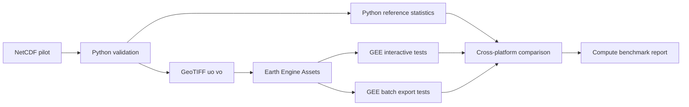
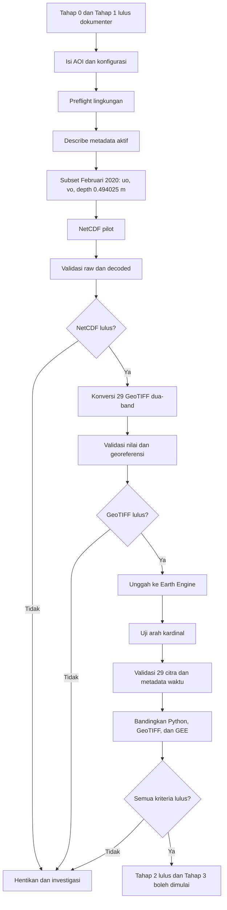
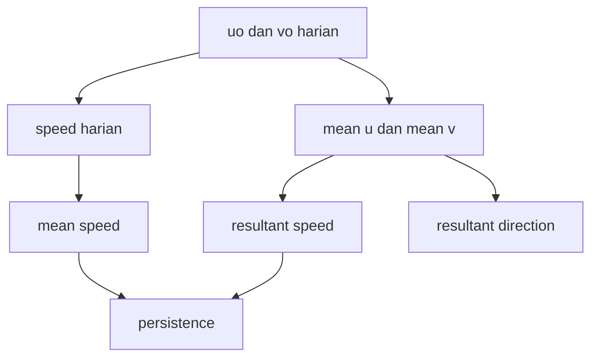

# TAHAP 2 — PANDUAN PILOT END-TO-END GLORYS12V1–GOOGLE EARTH ENGINE

**Proyek:** Pengembangan Analisis Arus Laut GLORYS12V1–Google Earth Engine  
**Wilayah awal:** Perairan Sorong dan sekitarnya  
**Periode pilot:** 1–29 Februari 2020  
**Jumlah timestep yang diharapkan:** 29 rata-rata harian  
**Kedalaman target:** lapisan model teratas, sekitar 0,494025 m  
**Variabel:** `uo` dan `vo`  
**Tanggal penyusunan:** 29 Juli 2026  
**Status dokumen:** Panduan implementasi dan paket uji; pilot pada data asli belum dijalankan  
**Ketergantungan:** Tahap 0 dan Tahap 1  
**Ruang lingkup:** Arus laut saja  
**Klasifikasi penggunaan:** Pendidikan dan penelitian nonkomersial  
**Arsitektur komputasi:** Hibrida Python/xarray–Google Earth Engine  
**Versi dokumen:** 1.1

---

## Daftar isi

1. [Kedudukan Tahap 2](#1-kedudukan-tahap-2)
2. [Status yang harus dipahami](#2-status-yang-harus-dipahami)
3. [Tujuan dan hasil yang diharapkan](#3-tujuan-dan-hasil-yang-diharapkan)
4. [Mengapa Februari 2020 dipilih](#4-mengapa-februari-2020-dipilih)
5. [Prasyarat dan input yang belum tersedia](#5-prasyarat-dan-input-yang-belum-tersedia)
6. [Kriteria penghentian](#6-kriteria-penghentian)
7. [Arsitektur pilot](#7-arsitektur-pilot)
8. [Struktur direktori](#8-struktur-direktori)
9. [Persiapan lingkungan](#9-persiapan-lingkungan)
10. [Pengamanan kredensial](#10-pengamanan-kredensial)
11. [Konfigurasi wilayah pilot](#11-konfigurasi-wilayah-pilot)
12. [Urutan eksekusi](#12-urutan-eksekusi)
13. [Langkah 0 — Preflight](#13-langkah-0--preflight)
14. [Langkah 1 — Verifikasi metadata aktif](#14-langkah-1--verifikasi-metadata-aktif)
15. [Langkah 2 — Unduh NetCDF pilot](#15-langkah-2--unduh-netcdf-pilot)
16. [Langkah 3 — Validasi NetCDF](#16-langkah-3--validasi-netcdf)
17. [Langkah 4 — Konversi menjadi 29 GeoTIFF](#17-langkah-4--konversi-menjadi-29-geotiff)
18. [Langkah 5 — Validasi GeoTIFF](#18-langkah-5--validasi-geotiff)
19. [Langkah 6 — Buat titik referensi](#19-langkah-6--buat-titik-referensi)
20. [Langkah 7 — Unggah ke Earth Engine](#20-langkah-7--unggah-ke-earth-engine)
21. [Langkah 8 — Uji arah kardinal di GEE](#21-langkah-8--uji-arah-kardinal-di-gee)
22. [Langkah 9 — Validasi koleksi pilot di GEE](#22-langkah-9--validasi-koleksi-pilot-di-gee)
23. [Langkah 10 — Validasi silang Python–GeoTIFF–GEE](#23-langkah-10--validasi-silang-pythongeotiffgee)
24. [Perhitungan yang diuji](#24-perhitungan-yang-diuji)
25. [Standar metadata pilot](#25-standar-metadata-pilot)
26. [Artefak dan bukti yang wajib disimpan](#26-artefak-dan-bukti-yang-wajib-disimpan)
27. [Matriks penerimaan](#27-matriks-penerimaan)
28. [Troubleshooting](#28-troubleshooting)
29. [Risiko dan mitigasi](#29-risiko-dan-mitigasi)
30. [Batas interpretasi hasil pilot](#30-batas-interpretasi-hasil-pilot)
31. [Runbook ringkas](#31-runbook-ringkas)
32. [Formulir pencatatan hasil](#32-formulir-pencatatan-hasil)
33. [Gerbang menuju Tahap 3](#33-gerbang-menuju-tahap-3)
34. [Hasil uji internal paket](#34-hasil-uji-internal-paket)
35. [Sumber resmi](#35-sumber-resmi)
36. [Lampiran kode](#36-lampiran-kode)
37. [Benchmark komputasi dan memori GEE](#37-benchmark-komputasi-dan-memori-gee)
38. [Keputusan penyesuaian pilot](#38-keputusan-penyesuaian-pilot)
39. [Catatan perubahan](#39-catatan-perubahan)

---

## 1. Kedudukan Tahap 2

Tahap 2 adalah pembuktian pertama bahwa rancangan Tahap 0–1 dapat dijalankan secara utuh pada data kecil sebelum diperluas ke 2015–2025.

Alur yang harus dibuktikan:

1. metadata produk aktif dapat dibaca;
2. subset `uo` dan `vo` dapat diunduh;
3. NetCDF dapat didekode dengan benar;
4. tepat 29 timestep Februari 2020 tersedia;
5. kedalaman aktual cocok dengan lapisan target;
6. mask dan nilai hilang tidak berubah menjadi nol;
7. data dapat diubah menjadi GeoTIFF dua-band;
8. nilai GeoTIFF cocok dengan NetCDF;
9. aset dapat dibaca di GEE;
10. `system:time_start` dapat digunakan untuk filter tanggal;
11. kecepatan dan arah dapat dihitung;
12. empat arah kardinal benar;
13. statistik GEE dapat dibandingkan dengan Python.

Tahap 2 bukan tahap otomasi skala penuh. Retry, resume, pembagian unduhan per tahun, dan batch besar dikembangkan lebih lanjut pada Tahap 3–6.

---

## 2. Status yang harus dipahami

Dokumen dan paket kode telah disiapkan, tetapi pilot data asli belum dijalankan karena percakapan ini belum menyediakan:

- batas atau bounding box pilot yang disahkan;
- kredensial Copernicus Marine;
- project Google Cloud/Earth Engine;
- tujuan Earth Engine Asset;
- bucket Google Cloud Storage apabila memakai upload manifest.

Karena itu, statusnya adalah:

> **Panduan siap dijalankan dan logika lokal telah diuji menggunakan NetCDF sintetis, tetapi kelulusan Tahap 2 hanya dapat diberikan setelah seluruh pemeriksaan dijalankan pada GLORYS12V1 asli.**

Tidak ada klaim bahwa data Sorong telah diunduh, diunggah, atau tervalidasi.

---

## 3. Tujuan dan hasil yang diharapkan

### 3.1 Tujuan ilmiah

- memastikan `uo` dan `vo` terbaca sebagai m/s;
- memastikan lapisan yang dipilih benar;
- memastikan kecepatan dihitung dari komponen yang sama;
- memastikan arah menunjukkan ke mana arus bergerak;
- memastikan resultan berbeda dari rata-rata besar kecepatan;
- memastikan mask darat–laut terjaga.

### 3.2 Tujuan teknis

- membuktikan CLI Copernicus Marine berjalan;
- membuktikan NetCDF dapat dibaca xarray;
- membuktikan konversi raster tidak membalik lintang;
- membuktikan GeoTIFF memiliki CRS dan transform yang benar;
- membuktikan dua band tidak tertukar;
- membuktikan koleksi GEE dapat difilter berdasarkan tanggal;
- membuktikan nilai lintas platform konsisten.

### 3.3 Hasil wajib

- satu NetCDF pilot;
- laporan metadata aktif;
- laporan validasi NetCDF;
- 29 GeoTIFF dua-band;
- inventory dan checksum;
- laporan validasi GeoTIFF;
- CSV titik referensi;
- 29 Earth Engine Image Assets untuk kelulusan penuh;
- laporan validasi koleksi;
- bukti pengujian arah kardinal;
- matriks PASS/FAIL.

---


### 3.4 Tujuan performa dan arsitektur hibrida

Pilot tidak hanya membuktikan kesesuaian nilai. Pilot juga harus membuktikan bahwa pembagian komputasi sesuai dengan batas Earth Engine.

Pilot harus menjawab:

1. analisis apa yang aman dijalankan secara interaktif;
2. analisis apa yang harus dijalankan sebagai batch;
3. analisis apa yang harus diprahitungkan dengan Python;
4. apakah penggunaan skala native sudah diterapkan;
5. apakah `tileScale` atau `parallelScale` diperlukan;
6. apakah operasi memicu memory limit, timeout, terlalu banyak agregasi, atau hasil agregasi terlalu besar;
7. apakah aplikasi tetap responsif untuk tujuan pembelajaran.

Hasil benchmark tidak boleh digunakan untuk menjamin performa semua AOI. Benchmark berlaku untuk AOI, periode, skala, dan konfigurasi yang diuji.


## 4. Mengapa Februari 2020 dipilih

Februari 2020 dipilih karena:

- tahun 2020 adalah tahun kabisat;
- Februari memiliki 29 hari;
- periode termasuk dalam fokus Januari–Maret;
- ukuran cukup kecil untuk diperiksa manual;
- kesalahan batas tanggal mudah terdeteksi;
- jika hanya 28 atau 30 timestep ditemukan, filter atau metadata waktu bermasalah.

Konfigurasi waktu:

```text
Mulai              : 2020-02-01T00:00:00
Akhir permintaan   : 2020-02-29T23:59:59
Jumlah wajib       : 29 timestep
Filter GEE          : 2020-02-01 hingga 2020-03-01 eksklusif
```

Jumlah 29 tetap harus dibuktikan dari NetCDF, bukan diasumsikan dari kalender.

---

## 5. Prasyarat dan input yang belum tersedia

### 5.1 Input wajib pengguna

Isi `config/pilot_config.json` dengan:

- `west`;
- `east`;
- `south`;
- `north`;
- ID wilayah;
- project ID GEE;
- collection/path aset;
- nama bucket GCS jika menggunakan manifest.

### 5.2 Batas wilayah

Jangan mengarang batas Perairan Sorong. Untuk pilot dapat digunakan:

- bounding box yang disepakati dan diberi label `pilot`;
- poligon resmi yang diubah menjadi bounding box subset;
- wilayah kecil yang tetap mengandung piksel laut valid.

Bounding box hanya membatasi unduhan. Mask poligon yang lebih rinci diterapkan setelah data tersedia.

### 5.3 Akun

Diperlukan:

- akun Copernicus Marine yang dapat mengakses data;
- project Earth Engine yang telah terdaftar;
- izin menulis aset;
- Cloud Storage jika upload menggunakan manifest.

---

## 6. Kriteria penghentian

Hentikan alur jika:

- metadata aktif tidak menunjukkan Dataset ID yang benar;
- variabel `uo` atau `vo` tidak ditemukan;
- satuan bukan m/s dan belum dijelaskan;
- jumlah timestep bukan 29;
- kedalaman aktual tidak cocok dengan 0,494025 m dalam toleransi;
- nilai hilang berubah menjadi nol;
- lintang atau geotransform salah;
- GeoTIFF dan NetCDF berbeda di luar toleransi;
- dua band tertukar;
- arah kardinal gagal;
- timestamp GEE salah;
- koleksi GEE tidak memiliki 29 citra;
- statistik GEE tidak cocok dengan referensi.

Jangan “memperbaiki” kegagalan dengan mengabaikan validasi.

---

## 7. Arsitektur pilot

### 7.1 Pembagian beban pilot



Python menjadi sumber referensi untuk:

- nilai `uo` dan `vo`;
- speed;
- resultan;
- persentil;
- statistik regional;
- current rose jika diuji.

GEE diuji untuk:

- visualisasi;
- reducer koleksi;
- reducer AOI;
- grafik ringan;
- ekspor batch;
- produk prahitung.




---

## 8. Struktur direktori

```text
GLORYS12V1_Tahap_2_Pilot/
├── README.md
├── requirements.txt
├── config/
│   ├── pilot_config.example.json
│   └── pilot_config.json
├── python/
│   ├── common.py
│   ├── 00_preflight.py
│   ├── 01_verify_metadata.py
│   ├── 02_download_pilot.py
│   ├── 03_validate_netcdf.py
│   ├── 04_convert_daily_geotiff.py
│   ├── 05_validate_geotiff.py
│   ├── 06_create_reference_points.py
│   └── 07_create_gee_manifest_templates.py
├── gee/
│   ├── 01_cardinal_direction_test.js
│   └── 02_validate_pilot_collection.js
├── data/
│   ├── raw/
│   └── geotiff/
└── outputs/
    ├── logs/
    ├── tables/
    ├── reference/
    └── manifests/
```

Direktori `data/` tidak sebaiknya dimasukkan ke Git apabila berisi data besar. Kredensial tidak boleh disimpan di direktori proyek.

---

## 9. Persiapan lingkungan

### 9.1 Rekomendasi Conda pada Windows

```powershell
conda create -n glorys-gee-pilot python=3.13 -y
conda activate glorys-gee-pilot
python -m pip install --upgrade pip
pip install -r requirements.txt
pip freeze > requirements-lock.txt
```

Jika `rasterio`, `netCDF4`, atau GDAL gagal dibangun melalui pip, gunakan conda-forge:

```powershell
conda install -c conda-forge rasterio netcdf4 xarray numpy pandas pyproj -y
pip install --upgrade copernicusmarine earthengine-api
pip freeze > requirements-lock.txt
```

### 9.2 Pemeriksaan versi

```powershell
python --version
copernicusmarine --version
earthengine --help
```

Simpan versinya. Jangan hanya mencatat “versi terbaru”.

### 9.3 Instalasi yang digunakan paket

```text
copernicusmarine>=2.4,<3
xarray>=2025.1
netCDF4>=1.7
numpy>=2.0
pandas>=2.2
rasterio>=1.4
pyproj>=3.7
earthengine-api>=1.5
```

Versi terkunci dibuat setelah instalasi:

```powershell
pip freeze > requirements-lock.txt
```

---

## 10. Pengamanan kredensial

### 10.1 Copernicus Marine

Metode yang disarankan:

```powershell
copernicusmarine login --check-credentials-valid
```

Atau gunakan environment variable pada sesi lokal:

```powershell
$env:COPERNICUSMARINE_SERVICE_USERNAME="ISI_DI_TERMINAL"
$env:COPERNICUSMARINE_SERVICE_PASSWORD="ISI_DI_TERMINAL"
```

Jangan menulis kredensial ke:

- source code;
- `pilot_config.json`;
- Git;
- tangkapan layar;
- laporan.

### 10.2 Earth Engine

```powershell
earthengine authenticate
earthengine set_project YOUR_GCP_PROJECT_ID
```

Project harus memiliki akses Earth Engine dan izin aset yang sesuai.

---

## 11. Konfigurasi wilayah pilot

Salin contoh:

```powershell
Copy-Item config/pilot_config.example.json config/pilot_config.json
```

Isi AOI. Konfigurasi awal:

```json
{
  "project": {
    "name": "GLORYS12V1\u2013GEE",
    "stage": 2,
    "pilot_id": "february_2020"
  },
  "copernicus": {
    "product_id": "GLOBAL_MULTIYEAR_PHY_001_030",
    "dataset_id": "cmems_mod_glo_phy_my_0.083deg_P1D-m",
    "variables": [
      "uo",
      "vo"
    ]
  },
  "pilot": {
    "start_datetime": "2020-02-01T00:00:00",
    "end_datetime": "2020-02-29T23:59:59",
    "expected_time_steps": 29,
    "depth_m": 0.494025,
    "coordinates_selection_method": "nearest"
  },
  "aoi": {
    "id": "REPLACE_WITH_DOCUMENTED_PILOT_AOI",
    "west": null,
    "east": null,
    "south": null,
    "north": null
  },
  "paths": {
    "raw_netcdf": "data/raw/glorys12v1_daily_surface_20200201_20200229_pilot.nc",
    "geotiff_directory": "data/geotiff",
    "logs_directory": "outputs/logs",
    "tables_directory": "outputs/tables",
    "reference_directory": "outputs/reference",
    "manifests_directory": "outputs/manifests"
  },
  "geotiff": {
    "nodata": -9999.0,
    "compression": "DEFLATE",
    "dtype": "float32"
  },
  "earth_engine": {
    "project_id": null,
    "asset_collection": null,
    "gcs_bucket": null
  },
  "validation": {
    "depth_tolerance_m": 1e-06,
    "numeric_absolute_tolerance": 1e-06,
    "minimum_valid_pixels": 1
  }
}
```

### 11.1 Validasi AOI

Kriteria:

- `west < east`;
- `south < north`;
- berada dalam rentang koordinat yang wajar;
- berisi piksel laut valid;
- sumber batas didokumentasikan;
- bukan batas resmi jika hanya demonstrasi.

### 11.2 Kedalaman dan metode seleksi

Pilot meminta nilai tunggal dengan metode `nearest`, lalu validator wajib membuktikan bahwa nilai yang dipilih benar-benar 0,494025 m. Metode `nearest` tidak memberi izin untuk menerima kedalaman berbeda tanpa pemeriksaan.

---

## 12. Urutan eksekusi

```mermaid
flowchart LR
    A[00_preflight] --> B[01_verify_metadata]
    B --> C[02_download_pilot]
    C --> D[03_validate_netcdf]
    D --> E[04_convert_daily_geotiff]
    E --> F[05_validate_geotiff]
    F --> G[06_create_reference_points]
    G --> H[Upload GEE]
    H --> I[01_cardinal_direction_test.js]
    I --> J[02_validate_pilot_collection.js]
    J --> K[Validasi silang]
```



Perintah dijalankan dari root paket:

```powershell
python python/00_preflight.py
python python/01_verify_metadata.py
python python/02_download_pilot.py
python python/03_validate_netcdf.py
python python/04_convert_daily_geotiff.py
python python/05_validate_geotiff.py
python python/06_create_reference_points.py
```

Jangan menjalankan langkah berikutnya jika langkah sebelumnya berstatus `FAIL`.

---

## 13. Langkah 0 — Preflight

### Tujuan

- memeriksa dependency;
- memeriksa CLI;
- memeriksa AOI;
- memeriksa keputusan dataset;
- menolak konfigurasi kosong.

### Jalankan

```powershell
python python/00_preflight.py
```

### Output

```text
outputs/logs/preflight_report.json
```

### Kriteria lulus

- status `PASS`;
- semua modul tersedia;
- `copernicusmarine` tersedia;
- AOI terisi;
- dataset benar;
- jumlah timestep target 29.

Earth Engine CLI dapat belum tersedia pada fase unduh, tetapi wajib sebelum upload.

---

## 14. Langkah 1 — Verifikasi metadata aktif

### Tujuan

Menutup butir Tahap 0 yang memerlukan metadata hidup.

### Jalankan

```powershell
python python/01_verify_metadata.py
```

Skrip menjalankan `copernicusmarine describe` untuk Product ID dan Dataset ID, lalu menyimpan keluaran mentah.

### Output

```text
outputs/logs/product_metadata.json
outputs/logs/daily_dataset_metadata.json
outputs/logs/metadata_verification_summary.json
```

### Pemeriksaan manual

Cari:

- `GLOBAL_MULTIYEAR_PHY_001_030`;
- `cmems_mod_glo_phy_my_0.083deg_P1D-m`;
- `uo`;
- `vo`;
- rentang waktu yang mencakup Februari 2020;
- koordinat depth;
- versi dataset aktif;
- layanan yang dipilih.

Jika metadata aktif berbeda dari Tahap 0, hentikan dan revisi dokumentasi.

---

## 15. Langkah 2 — Unduh NetCDF pilot

### Tujuan

Mengambil hanya:

- wilayah pilot;
- 1–29 Februari 2020;
- `uo` dan `vo`;
- lapisan teratas.

### Jalankan

```powershell
python python/02_download_pilot.py
```

### Bentuk perintah

```text
copernicusmarine subset
  --dataset-id cmems_mod_glo_phy_my_0.083deg_P1D-m
  --variable uo
  --variable vo
  --start-datetime 2020-02-01T00:00:00
  --end-datetime 2020-02-29T23:59:59
  --minimum-longitude <west>
  --maximum-longitude <east>
  --minimum-latitude <south>
  --maximum-latitude <north>
  --minimum-depth 0.494025
  --maximum-depth 0.494025
  --coordinates-selection-method nearest
  --file-format netcdf
  --skip-existing
```

### Output

```text
data/raw/glorys12v1_daily_surface_20200201_20200229_pilot.nc
outputs/logs/download_pilot.json
```

### Kriteria lulus awal

- perintah selesai tanpa error;
- file ada;
- ukuran file lebih besar dari nol;
- response metadata disimpan;
- file tidak bernama duplikat dengan indeks tidak disengaja.

`--skip-existing` dipakai agar pengujian ulang tidak mengunduh ulang file yang sudah ada. File yang ada tetap harus lolos checksum dan validasi.

---

## 16. Langkah 3 — Validasi NetCDF

### Tujuan

Memeriksa dua lapisan:

1. **raw encoding**, dengan CF decoding dimatikan;
2. **decoded data**, dengan mask dan skala diterapkan.

### Jalankan

```powershell
python python/03_validate_netcdf.py
```

### Pemeriksaan raw

- tipe data tersimpan;
- `_FillValue`;
- `scale_factor`;
- `add_offset`;
- satuan.

### Pemeriksaan decoded

- dimensi;
- nama koordinat;
- 29 timestamp unik;
- kedalaman;
- orientasi bujur dan lintang;
- unit;
- nilai minimum, maksimum, dan rata-rata;
- jumlah `NaN`;
- jumlah nilai valid;
- uji arah Python.

xarray dengan `decode_cf=True` dan `mask_and_scale=True` dapat mengganti `_FillValue` menjadi NA dan menerapkan `scale_factor`/`add_offset`. Karena itu, pipeline tidak boleh menerapkan skala untuk kedua kalinya.

### Output

```text
outputs/logs/netcdf_validation_report.json
outputs/tables/netcdf_variable_summary.csv
outputs/tables/pilot_depth_levels.csv
outputs/tables/pilot_times.csv
```

### Kriteria lulus

- `status = PASS`;
- `time_count.actual = 29`;
- 29 waktu unik;
- kedalaman target ditemukan;
- `uo` dan `vo` memiliki nilai valid;
- arah kardinal Python lulus.

### Pemeriksaan kewajaran

Tidak ada ambang absolut universal untuk menyatakan nilai arus “masuk akal”. Pemeriksaan harus mencari:

- nilai ekstrem yang muncul karena encoding salah;
- nilai fill yang lolos menjadi angka;
- semua nilai sama dengan nol;
- seluruh wilayah menjadi `NaN`;
- satuan yang tidak sesuai.

---

## 17. Langkah 4 — Konversi menjadi 29 GeoTIFF

### Tujuan

Mengubah setiap timestep menjadi satu GeoTIFF dengan:

- band 1: `uo`;
- band 2: `vo`;
- `float32`;
- EPSG:4326;
- NoData `-9999.0`;
- kompresi lossless;
- transform dari pusat grid;
- metadata sumber.

### Jalankan

```powershell
python python/04_convert_daily_geotiff.py
```

### Penanganan lintang

Jika koordinat lintang NetCDF meningkat dari selatan ke utara, array dibalik secara vertikal sebelum ditulis karena baris pertama GeoTIFF mewakili bagian utara raster. Transform dibuat dari tepi luar pusat piksel, bukan dari koordinat pusat langsung.

### Nama file

```text
glorys12v1_d_20200201_d0p494025m.tif
...
glorys12v1_d_20200229_d0p494025m.tif
```

### Output

```text
data/geotiff/*.tif
outputs/tables/geotiff_inventory.csv
outputs/logs/geotiff_conversion_summary.json
```

### Kriteria lulus

- tepat 29 file;
- setiap file dua-band;
- checksum tersedia;
- valid pixel count tersedia;
- tidak ada tanggal yang hilang atau ganda.

---

## 18. Langkah 5 — Validasi GeoTIFF

### Tujuan

Membandingkan setiap GeoTIFF terhadap NetCDF sumber setelah mempertimbangkan orientasi baris.

### Jalankan

```powershell
python python/05_validate_geotiff.py
```

### Pemeriksaan

- dua band;
- EPSG:4326;
- NoData benar;
- perbedaan maksimum `uo`;
- perbedaan maksimum `vo`;
- seluruh 29 file lulus toleransi.

### Output

```text
outputs/tables/geotiff_validation.csv
outputs/logs/geotiff_validation_summary.json
```

### Kriteria lulus

```text
file_count   = 29
passed_count = 29
status       = PASS
```

Toleransi default paket adalah `1e-6 m/s`. Toleransi dapat direvisi hanya jika ada alasan numerik yang didokumentasikan, bukan untuk menyembunyikan kesalahan.

---

## 19. Langkah 6 — Buat titik referensi

### Tujuan

Membuat nilai pembanding untuk tiga tanggal:

- 1 Februari 2020;
- 15 Februari 2020;
- 29 Februari 2020.

### Jalankan

```powershell
python python/06_create_reference_points.py
```

### Output

```text
outputs/reference/reference_points.csv
```

Kolom:

- tanggal;
- bujur;
- lintang;
- `uo_expected`;
- `vo_expected`;
- `speed_expected`;
- `direction_expected_deg`;
- `depth_m`.

Titik referensi dipilih dari piksel valid. Untuk validasi ilmiah akhir, lokasi dapat ditambah dengan titik yang bermakna dan data lapangan.

---

## 20. Langkah 7 — Unggah ke Earth Engine

Earth Engine menerima GeoTIFF melalui Asset Manager atau CLI. Properti `system:time_start` digunakan oleh filter tanggal ImageCollection. NoData harus didefinisikan agar nilai tersebut dimask, dan pyramiding `MEAN` sesuai untuk komponen arus kontinu.

### 20.1 Jalur A — Upload manual untuk tiga sampel

Gunakan lebih dahulu untuk:

- 1 Februari;
- 15 Februari;
- 29 Februari.

Di Code Editor:

1. buka tab **Assets**;
2. pilih **Image upload**;
3. unggah satu GeoTIFF;
4. tetapkan asset ID;
5. pilih NoData `-9999`;
6. pilih pyramiding `Mean`;
7. isi `system:time_start` sesuai tanggal;
8. setelah ingestion selesai, periksa band dan proyeksi.

Jalur A adalah gerbang awal. Jangan langsung batch 29 jika tiga sampel gagal.

### 20.2 Jalur B — Manifest untuk 29 citra

Upload manifest Earth Engine memerlukan sumber file di Google Cloud Storage. Isi konfigurasi:

```json
"earth_engine": {
  "project_id": "YOUR_PROJECT",
  "asset_collection": "glorys12v1/pilot_feb2020",
  "gcs_bucket": "YOUR_BUCKET"
}
```

Unggah GeoTIFF ke GCS, misalnya:

```powershell
gsutil -m cp data/geotiff/*.tif gs://YOUR_BUCKET/february_2020/
```

Buat manifest:

```powershell
python python/07_create_gee_manifest_templates.py
```

Jalankan perintah dalam:

```text
outputs/manifests/upload_commands.txt
```

### 20.3 Pemeriksaan task

```powershell
earthengine task list
```

Kriteria:

- 29 ingestion selesai;
- tidak ada asset duplikat;
- band bernama `uo` dan `vo`;
- tanggal benar;
- NoData dimask.

### 20.4 Catatan biaya

Manifest memerlukan Google Cloud Storage. Penyimpanan dan transfer GCS dapat menimbulkan biaya kecil sesuai konfigurasi akun. Catat bucket, lokasi, lifecycle, dan pihak yang menanggung biaya.

---

## 21. Langkah 8 — Uji arah kardinal di GEE

Jalankan `gee/01_cardinal_direction_test.js` sebelum memakai data arus.

Formula GEE:

```javascript
var direction = v.atan2(u)
  .multiply(180 / Math.PI)
  .add(360)
  .mod(360);
```

Earth Engine mendefinisikan `atan2` sebagai sudut vektor `[x,y]`. Dengan `x=v` dan `y=u`, sudut diukur dari utara menuju timur secara searah jarum jam.

### Hasil wajib

| `u` | `v` | Arah |
|---:|---:|---:|
| 0 | 1 | 0° |
| 1 | 0 | 90° |
| 0 | -1 | 180° |
| -1 | 0 | 270° |

Semua output `PASS` harus bernilai `true`.

---

## 22. Langkah 9 — Validasi koleksi pilot di GEE

Edit:

```javascript
var COLLECTION_ID = 'projects/REPLACE_PROJECT/assets/REPLACE_COLLECTION';
var STUDY_AREA = ee.Geometry.Rectangle([west, south, east, north]);
```

Jalankan `gee/02_validate_pilot_collection.js`.

### Pemeriksaan wajib

- ukuran koleksi 29;
- filter 1 Februari–1 Maret eksklusif;
- band `uo`, `vo`, `speed`, `direction_towards_deg`;
- proyeksi benar;
- timestamp lengkap;
- speed tidak negatif;
- persistensi berada pada rentang wajar 0–1 dengan toleransi numerik;
- peta tidak terbalik;
- daratan dimask.

### Perhitungan



---

## 23. Langkah 10 — Validasi silang Python–GeoTIFF–GEE

### 23.1 Tingkat 1 — NetCDF vs GeoTIFF

Dilaksanakan otomatis oleh `05_validate_geotiff.py`.

### 23.2 Tingkat 2 — GeoTIFF vs aset GEE

Untuk tiga tanggal:

- sample pada koordinat pusat piksel yang sama;
- gunakan proyeksi sumber;
- hindari resampling;
- bandingkan `uo` dan `vo`.

### 23.3 Tingkat 3 — Formula

Hitung di Python dan GEE:

- speed;
- direction;
- mean `u`;
- mean `v`;
- mean speed;
- resultant speed;
- resultant direction;
- persistence.

### 23.4 Tabel pembandingan

| Tanggal/lokasi | Variabel | Python | GEE | Selisih | Toleransi | Status |
|---|---|---:|---:|---:|---:|---|
| ... | `uo` | | | | 1e-6 | |
| ... | `vo` | | | | 1e-6 | |
| ... | speed | | | | 1e-6 | |
| ... | direction | | | | sesuai aturan circular | |

Untuk arah dekat 0°/360°, selisih dihitung secara sirkular:

\[
\Delta\theta = \min(|a-b|, 360-|a-b|)
\]

---

## 24. Perhitungan yang diuji

### 24.1 Kecepatan

\[
S=\sqrt{u^2+v^2}
\]

### 24.2 Arah menuju

\[
\theta = [\operatorname{atan2}(u,v)\,180/\pi+360]\bmod 360
\]

Catatan: formula matematis di atas mengikuti susunan NumPy `atan2(y,x)`. Implementasi GEE menggunakan `v.atan2(u)` karena semantik method GEE menyatakan pasangan `[x,y]`.

### 24.3 Rata-rata besar kecepatan

\[
\overline{S}=\frac1n\sum_i\sqrt{u_i^2+v_i^2}
\]

### 24.4 Resultan

\[
S_R=\sqrt{\overline{u}^2+\overline{v}^2}
\]

### 24.5 Persistensi

\[
P=\frac{S_R}{\overline{S}}
\]

Jika `mean speed = 0`, persistensi dimask.

---

## 25. Standar metadata pilot

Setiap aset minimal memiliki:

```text
system:time_start
system:time_end
product_id
 dataset_id
source_model
processing_type
temporal_resolution
depth_m
uo_units
vo_units
is_reanalysis
tides_included
source_sha256
```

Nilai inti:

```text
product_id         = GLOBAL_MULTIYEAR_PHY_001_030
dataset_id         = cmems_mod_glo_phy_my_0.083deg_P1D-m
source_model       = GLORYS12V1
processing_type    = reanalysis
temporal_resolution= daily_mean
depth_m            = 0.494025
uo_units           = m s-1
vo_units           = m s-1
is_reanalysis      = true
tides_included     = false
```

Jangan menulis `surface_0m`.

---

## 26. Artefak dan bukti yang wajib disimpan

```text
requirements-lock.txt
outputs/logs/preflight_report.json
outputs/logs/product_metadata.json
outputs/logs/daily_dataset_metadata.json
outputs/logs/download_pilot.json
outputs/logs/netcdf_validation_report.json
outputs/logs/geotiff_conversion_summary.json
outputs/logs/geotiff_validation_summary.json
outputs/tables/pilot_times.csv
outputs/tables/pilot_depth_levels.csv
outputs/tables/netcdf_variable_summary.csv
outputs/tables/geotiff_inventory.csv
outputs/tables/geotiff_validation.csv
outputs/reference/reference_points.csv
outputs/manifests/*.json
screenshots/gee_cardinal_test.png
screenshots/gee_collection_validation.png
reports/stage2_acceptance.md
```

Tangkapan layar tidak menggantikan log, tetapi menjadi bukti pendamping.

---

## 27. Matriks penerimaan

| ID | Pemeriksaan | Kriteria | Bukti | Status awal |
|---|---|---|---|---|
| P2-01 | Metadata produk | Product ID benar | JSON describe | Belum dijalankan |
| P2-02 | Dataset | Dataset ID benar | JSON describe | Belum dijalankan |
| P2-03 | Variabel | `uo`,`vo` tersedia | validation report | Belum dijalankan |
| P2-04 | Waktu | 29 timestep unik | pilot_times.csv | Belum dijalankan |
| P2-05 | Kedalaman | 0,494025 m | depth CSV | Belum dijalankan |
| P2-06 | Encoding | fill/mask/scale benar | raw report | Belum dijalankan |
| P2-07 | Orientasi | GeoTIFF tidak terbalik | map + transform | Belum dijalankan |
| P2-08 | File | 29 GeoTIFF | inventory | Belum dijalankan |
| P2-09 | Nilai | 29/29 sesuai toleransi | validation CSV | Belum dijalankan |
| P2-10 | Band | `uo`,`vo` tidak tertukar | GEE asset | Belum dijalankan |
| P2-11 | Timestamp | 29 tanggal benar | aggregate array | Belum dijalankan |
| P2-12 | Arah | 4 kardinal lulus | GEE console | Belum dijalankan |
| P2-13 | Speed | Python = GEE | comparison | Belum dijalankan |
| P2-14 | Resultan | Python = GEE | comparison | Belum dijalankan |
| P2-15 | Mask | darat tetap masked | map/sample | Belum dijalankan |
| P2-16 | Reproduksi | run kedua konsisten | checksum/log | Belum dijalankan |

Tahap 2 lulus hanya jika seluruh pemeriksaan kritis berstatus PASS.

---


### 27.1 Kriteria penerimaan komputasi

- [ ] Project digunakan untuk pendidikan dan penelitian nonkomersial.
- [ ] Project ID dan tier tercatat.
- [ ] B1 berhasil tanpa memory error.
- [ ] B2 diuji dan batasnya dicatat.
- [ ] B3 diarahkan ke batch atau Python.
- [ ] B4 berhasil menggunakan produk prahitung.
- [ ] `tileScale` 1, 2, dan 4 diuji jika relevan.
- [ ] `parallelScale` diuji jika reducer koleksi memerlukan.
- [ ] Tidak ada `toArray()` atau `toBands()` pada seri besar.
- [ ] Analisis menggunakan skala native.
- [ ] EECU-time dicatat jika tersedia.
- [ ] Keputusan interaktif/batch/Python terdokumentasi.


## 28. Troubleshooting

### 28.1 `copernicusmarine` tidak ditemukan

```powershell
pip install --upgrade copernicusmarine
copernicusmarine --version
```

Pastikan environment Conda aktif.

### 28.2 Kredensial gagal

```powershell
copernicusmarine login --check-credentials-valid
```

Hapus environment variable lama yang salah dan login ulang.

### 28.3 File menghasilkan 28 atau 30 timestep

Periksa:

- start/end datetime;
- metode seleksi koordinat;
- timestamp sumber;
- timezone yang tidak sengaja diterapkan;
- duplikasi waktu.

Jangan menambah atau menghapus timestep manual.

### 28.4 Kedalaman tidak 0,494025 m

- lihat `pilot_depth_levels.csv`;
- periksa metadata aktif;
- periksa metode `nearest`;
- hentikan jika dataset berubah;
- revisi Tahap 0–1 sebelum lanjut.

### 28.5 Semua nilai nol

Kemungkinan:

- fill value berubah menjadi nol;
- skala salah;
- AOI hanya daratan;
- band salah;
- data dibaca sebelum decoding.

### 28.6 Nilai terlalu besar

Kemungkinan skala/offset belum diterapkan atau diterapkan dua kali.

Bandingkan raw encoding dan decoded summary.

### 28.7 Peta terbalik utara–selatan

Periksa:

- urutan latitude;
- penggunaan `flipud`;
- origin GeoTIFF;
- transform raster.

### 28.8 GEE menampilkan `b1` dan `b2`

Upload manual mungkin tidak mempertahankan deskripsi band. Untuk uji sementara:

```javascript
image = image.select(['b1', 'b2'], ['uo', 'vo']);
```

Untuk koleksi final gunakan manifest dengan band ID eksplisit.

### 28.9 NoData terlihat sebagai -9999

Mask upload belum dikonfigurasi. Tetapkan missing data pada manifest atau NoData pada Asset Manager.

### 28.10 Arah barat menghasilkan -90°

Normalisasi:

```javascript
angle.add(360).mod(360)
```

### 28.11 GEE collection size bukan 29

Periksa:

- asset gagal ingestion;
- timestamp kosong;
- filterDate;
- folder bukan ImageCollection;
- aset tertulis ke lokasi berbeda.

---

## 29. Risiko dan mitigasi

| Risiko | Dampak | Mitigasi |
|---|---|---|
| AOI belum disahkan | Pilot tidak representatif | Labeli sebagai pilot dan dokumentasikan sumber |
| `nearest` memilih titik di luar batas | Extent sedikit berubah | Catat koordinat aktual hasil subset |
| Depth berubah | Analisis lapisan salah | Verifikasi nilai aktual |
| End datetime salah | Jumlah timestep salah | Wajib 29 dan unik |
| Decoding ganda | Kecepatan salah | Bandingkan raw dan decoded |
| NaN menjadi nol | Statistik bias | Gunakan NoData dan mask |
| Float diturunkan presisinya | Selisih nilai | Gunakan float32 dan toleransi terdokumentasi |
| Lintang dibalik salah | Peta terbalik | Validasi transform dan sampel |
| Band tertukar | Arah salah | Nama band dan referensi titik |
| Metadata waktu kosong | filterDate gagal | startTime/endTime manifest |
| Manifest membutuhkan GCS | Tambahan konfigurasi dan biaya | Uji manual dahulu; dokumentasikan bucket |
| Pyramiding salah | Tampilan zoom bias | Gunakan MEAN untuk komponen kontinu |
| GEE melakukan reproyeksi | Perbandingan titik berubah | Sampel pada proyeksi sumber |
| Arah resultan saat speed rendah | Interpretasi menyesatkan | Tampilkan persistensi dan mask speed nol |
| Pilot berjalan tetapi tidak valid ilmiah | Kepercayaan palsu | Validasi lintas platform dan batas penggunaan |

---

### 29.1 Risiko komputasi Earth Engine

| Risiko | Dampak | Mitigasi |
|---|---|---|
| `User memory limit exceeded` | permintaan gagal | tileScale, pecah periode, batch/Python |
| `Too many concurrent aggregations` | agregasi gagal | combined reducer, kurangi zona |
| `Computed value too large` | hasil gagal dikembalikan | export tabel, ringkas hasil |
| Interactive timeout | aplikasi lambat | produk prahitung |
| Skala terlalu halus | beban dan ketelitian semu | gunakan skala native |
| EECU cepat habis | restricted throughput | monitoring dan cache |
| Benchmark hanya satu AOI | generalisasi salah | nyatakan domain benchmark |


## 30. Batas interpretasi hasil pilot

Pilot hanya membuktikan pipeline pada satu bulan dan satu wilayah.

Pilot tidak membuktikan:

- kualitas model di seluruh Sorong;
- validitas arus lokal selat sempit;
- validitas 2015–2025;
- ketepatan arus pasut;
- kesiapan desain teknik;
- kestabilan batch ribuan aset;
- performa GEE App akhir.

GLORYS12V1 tetap reanalisis sekitar 1/12° dan konstituen pasut tidak dimasukkan. Hasil pilot tidak boleh dipakai untuk klaim operasi atau keselamatan.

---

## 31. Runbook ringkas

```powershell
# 1. Siapkan environment
conda activate glorys-gee-pilot
pip install -r requirements.txt
pip freeze > requirements-lock.txt

# 2. Isi konfigurasi
Copy-Item config/pilot_config.example.json config/pilot_config.json
# Edit AOI dan GEE config

# 3. Validasi dan unduh
python python/00_preflight.py
python python/01_verify_metadata.py
python python/02_download_pilot.py
python python/03_validate_netcdf.py

# 4. Konversi dan validasi
python python/04_convert_daily_geotiff.py
python python/05_validate_geotiff.py
python python/06_create_reference_points.py

# 5. Earth Engine
# Upload 3 sampel manual
# Jalankan gee/01_cardinal_direction_test.js
# Jika lulus, upload 29 citra
python python/07_create_gee_manifest_templates.py
# Jalankan upload commands
# Jalankan gee/02_validate_pilot_collection.js

# 6. Isi matriks penerimaan
```

---

## 32. Formulir pencatatan hasil

```markdown
# Laporan Pelaksanaan Tahap 2

## Identitas
- Tanggal:
- Pelaksana:
- Sistem operasi:
- Python:
- Copernicus Marine Toolbox:
- Earth Engine API/CLI:
- Product ID:
- Dataset ID:
- Dataset version:
- AOI ID dan sumber:
- Kedalaman aktual:

## Ringkasan
- NetCDF file:
- SHA-256:
- Jumlah timestep:
- Jumlah depth:
- Jumlah GeoTIFF:
- Jumlah asset GEE:
- Status arah kardinal:
- Status validasi silang:

## Penyimpangan
- Masalah:
- Penyebab:
- Perbaikan:
- Dampak terhadap metodologi:

## Keputusan
- [ ] PASS
- [ ] FAIL
- [ ] PASS BERSYARAT

## Persetujuan melanjutkan Tahap 3
- Nama:
- Tanggal:
- Catatan:
```

---

## 33. Gerbang menuju Tahap 3

Tahap 3 baru boleh dimulai jika:

1. metadata hidup tersimpan;
2. NetCDF pilot lulus;
3. 29 GeoTIFF lulus;
4. 29 aset GEE lulus;
5. arah kardinal lulus;
6. nilai Python–GeoTIFF–GEE cocok;
7. mask dan waktu benar;
8. masalah pilot terdokumentasi;
9. konfigurasi dan versi dependency dibekukan;
10. keputusan PASS ditandatangani atau dicatat.

Tahap 3 akan mengembangkan otomasi unduhan per bulan/tahun, retry, logging, resume, checksum, dan pencegahan unduhan ulang.

---

## 34. Hasil uji internal paket

Paket pendamping diuji menggunakan NetCDF sintetis dengan karakteristik:

- 29 timestep harian;
- satu kedalaman 0,494025 m;
- lintang menaik dari selatan ke utara;
- dua band `uo` dan `vo`;
- satu piksel `NaN`;
- nilai float32.

Hasil:

| Pemeriksaan | Hasil |
|---|---|
| Sintaks seluruh skrip Python | PASS |
| Validator 29 timestep | PASS |
| Uji arah Python 0/90/180/270 | PASS |
| Konversi 29 GeoTIFF | PASS |
| Perbandingan NetCDF–GeoTIFF | 29/29 PASS |
| Pembuatan referensi titik | PASS |

Uji ini membuktikan logika lokal paket, bukan validitas dataset asli, autentikasi, layanan Copernicus, upload GEE, atau hasil oseanografi.

---

## 35. Sumber resmi

1. **Copernicus Marine — Global Ocean Physics Reanalysis**  
   https://data.marine.copernicus.eu/product/GLOBAL_MULTIYEAR_PHY_001_030/description

2. **Product User Manual CMEMS-GLO-PUM-001-030, Issue 1.7, November 2025**  
   https://documentation.marine.copernicus.eu/PUM/CMEMS-GLO-PUM-001-030.pdf

3. **Copernicus Marine Toolbox — Command Line Interface**  
   https://toolbox-docs.marine.copernicus.eu/en/stable/command-line-interface.html

4. **Copernicus Marine Toolbox — subset**  
   https://toolbox-docs.marine.copernicus.eu/en/stable/usage/subset-usage.html

5. **Google Earth Engine — Importing Raster Data**  
   https://developers.google.com/earth-engine/guides/image_upload

6. **Google Earth Engine — Image Manifest Upload**  
   https://developers.google.com/earth-engine/guides/image_manifest

7. **Google Earth Engine — Command Line Tool**  
   https://developers.google.com/earth-engine/guides/command_line

8. **Google Earth Engine — `ee.Image.atan2`**  
   https://developers.google.com/earth-engine/apidocs/ee-image-atan2

9. **xarray — `open_dataset`**  
   https://docs.xarray.dev/en/stable/generated/xarray.open_dataset.html

Semua sintaks dan batas layanan harus diperiksa ulang sebelum eksekusi karena dokumentasi dan API dapat berubah.

---

## 36. Lampiran kode

### Lampiran A — `python/common.py`

```python
from __future__ import annotations

import hashlib
import json
from pathlib import Path
from typing import Any

ROOT = Path(__file__).resolve().parents[1]
DEFAULT_CONFIG = ROOT / "config" / "pilot_config.json"


def load_config(path: str | Path | None = None) -> dict[str, Any]:
    config_path = Path(path) if path else DEFAULT_CONFIG
    if not config_path.is_absolute():
        config_path = ROOT / config_path
    if not config_path.exists():
        raise FileNotFoundError(
            f"Konfigurasi tidak ditemukan: {config_path}. "
            "Salin pilot_config.example.json menjadi pilot_config.json lalu isi AOI."
        )
    with config_path.open("r", encoding="utf-8") as handle:
        return json.load(handle)


def root_path(relative_path: str | Path) -> Path:
    path = Path(relative_path)
    return path if path.is_absolute() else ROOT / path


def ensure_directories(config: dict[str, Any]) -> None:
    for key, value in config["paths"].items():
        path = root_path(value)
        if key.endswith("directory"):
            path.mkdir(parents=True, exist_ok=True)
        else:
            path.parent.mkdir(parents=True, exist_ok=True)


def sha256_file(path: Path, chunk_size: int = 1024 * 1024) -> str:
    digest = hashlib.sha256()
    with path.open("rb") as handle:
        while chunk := handle.read(chunk_size):
            digest.update(chunk)
    return digest.hexdigest()
```

### Lampiran B — `python/00_preflight.py`

```python
from __future__ import annotations

import importlib
import json
import platform
import shutil
import subprocess
import sys
from datetime import datetime, timezone

from common import ensure_directories, load_config, root_path

REQUIRED_MODULES = ["numpy", "pandas", "xarray", "rasterio", "netCDF4"]


def validate_bbox(aoi: dict) -> list[str]:
    errors: list[str] = []
    values = [aoi.get(k) for k in ("west", "east", "south", "north")]
    if any(v is None for v in values):
        return ["AOI belum diisi: west, east, south, dan north wajib berupa angka."]
    west, east, south, north = map(float, values)
    if not west < east:
        errors.append("AOI tidak valid: west harus lebih kecil daripada east.")
    if not south < north:
        errors.append("AOI tidak valid: south harus lebih kecil daripada north.")
    if not (-180 <= west <= 360 and -180 <= east <= 360):
        errors.append("Bujur berada di luar rentang yang wajar.")
    if not (-90 <= south <= 90 and -90 <= north <= 90):
        errors.append("Lintang berada di luar rentang -90 sampai 90.")
    return errors


def command_version(command: list[str]) -> dict:
    executable = shutil.which(command[0])
    if not executable:
        return {"available": False, "command": command[0], "output": None}
    result = subprocess.run(command, capture_output=True, text=True, check=False)
    output = (result.stdout or result.stderr).strip()
    return {"available": result.returncode == 0, "command": command[0], "output": output}


def main() -> int:
    config = load_config()
    ensure_directories(config)
    errors: list[str] = []
    modules: dict[str, dict] = {}

    for module_name in REQUIRED_MODULES:
        try:
            module = importlib.import_module(module_name)
            modules[module_name] = {"available": True, "version": getattr(module, "__version__", "unknown")}
        except Exception as exc:
            modules[module_name] = {"available": False, "error": str(exc)}
            errors.append(f"Modul Python tidak tersedia: {module_name}")

    errors.extend(validate_bbox(config["aoi"]))
    if config["pilot"].get("expected_time_steps") != 29:
        errors.append("Pilot Februari 2020 harus mengharapkan 29 timestep harian.")
    if config["copernicus"].get("dataset_id") != "cmems_mod_glo_phy_my_0.083deg_P1D-m":
        errors.append("Dataset ID tidak sesuai keputusan Tahap 0–1.")
    if config["copernicus"].get("variables") != ["uo", "vo"]:
        errors.append("Variabel harus berurutan uo dan vo untuk paket pilot ini.")

    commands = {
        "copernicusmarine": command_version(["copernicusmarine", "--version"]),
        "earthengine": command_version(["earthengine", "--help"]),
    }
    if not commands["copernicusmarine"]["available"]:
        errors.append("CLI copernicusmarine belum tersedia.")

    report = {
        "checked_at_utc": datetime.now(timezone.utc).isoformat(),
        "python": sys.version,
        "platform": platform.platform(),
        "modules": modules,
        "commands": commands,
        "aoi": config["aoi"],
        "status": "PASS" if not errors else "FAIL",
        "errors": errors,
    }
    report_path = root_path(config["paths"]["logs_directory"]) / "preflight_report.json"
    report_path.write_text(json.dumps(report, indent=2), encoding="utf-8")
    print(json.dumps(report, indent=2))
    return 0 if not errors else 1


if __name__ == "__main__":
    raise SystemExit(main())
```

### Lampiran C — `python/01_verify_metadata.py`

```python
from __future__ import annotations

import json
import subprocess
from datetime import datetime, timezone

from common import ensure_directories, load_config, root_path


def run_describe(args: list[str], output_name: str, logs_dir) -> dict:
    command = ["copernicusmarine", "describe", *args, "--return-fields", "all", "--log-level", "ERROR"]
    result = subprocess.run(command, capture_output=True, text=True, check=False)
    (logs_dir / output_name).write_text(result.stdout, encoding="utf-8")
    (logs_dir / f"{output_name}.stderr.txt").write_text(result.stderr, encoding="utf-8")
    if result.returncode != 0:
        raise RuntimeError(f"Perintah gagal ({result.returncode}): {' '.join(command)}\n{result.stderr}")
    return {"command": command, "returncode": result.returncode, "output": str(logs_dir / output_name)}


def main() -> None:
    config = load_config()
    ensure_directories(config)
    logs_dir = root_path(config["paths"]["logs_directory"])
    records = []
    records.append(run_describe(["--product-id", config["copernicus"]["product_id"]], "product_metadata.json", logs_dir))
    records.append(run_describe(["--dataset-id", config["copernicus"]["dataset_id"]], "daily_dataset_metadata.json", logs_dir))
    summary = {"verified_at_utc": datetime.now(timezone.utc).isoformat(), "records": records}
    (logs_dir / "metadata_verification_summary.json").write_text(json.dumps(summary, indent=2), encoding="utf-8")
    print(json.dumps(summary, indent=2))


if __name__ == "__main__":
    main()
```

### Lampiran D — `python/02_download_pilot.py`

```python
from __future__ import annotations

import json
import subprocess
from datetime import datetime, timezone

from common import ensure_directories, load_config, root_path


def main() -> None:
    config = load_config()
    ensure_directories(config)
    aoi = config["aoi"]
    if any(aoi.get(key) is None for key in ("west", "east", "south", "north")):
        raise ValueError("AOI belum diisi. Jalankan 00_preflight.py dan perbaiki pilot_config.json.")

    output_path = root_path(config["paths"]["raw_netcdf"])
    output_path.parent.mkdir(parents=True, exist_ok=True)
    pilot = config["pilot"]
    command = [
        "copernicusmarine", "subset",
        "--dataset-id", config["copernicus"]["dataset_id"],
        "--variable", "uo",
        "--variable", "vo",
        "--start-datetime", pilot["start_datetime"],
        "--end-datetime", pilot["end_datetime"],
        "--minimum-longitude", str(aoi["west"]),
        "--maximum-longitude", str(aoi["east"]),
        "--minimum-latitude", str(aoi["south"]),
        "--maximum-latitude", str(aoi["north"]),
        "--minimum-depth", str(pilot["depth_m"]),
        "--maximum-depth", str(pilot["depth_m"]),
        "--coordinates-selection-method", pilot["coordinates_selection_method"],
        "--file-format", "netcdf",
        "--output-directory", str(output_path.parent),
        "--output-filename", output_path.name,
        "--netcdf-compression-level", "1",
        "--skip-existing",
        "--response-fields", "all",
        "--log-level", "INFO",
    ]
    result = subprocess.run(command, capture_output=True, text=True, check=False)
    logs_dir = root_path(config["paths"]["logs_directory"])
    logs_dir.mkdir(parents=True, exist_ok=True)
    log = {
        "run_at_utc": datetime.now(timezone.utc).isoformat(),
        "command": command,
        "returncode": result.returncode,
        "stdout": result.stdout,
        "stderr": result.stderr,
        "output_path": str(output_path),
    }
    (logs_dir / "download_pilot.json").write_text(json.dumps(log, indent=2), encoding="utf-8")
    if result.returncode != 0:
        raise RuntimeError(f"Unduhan gagal. Periksa {logs_dir / 'download_pilot.json'}")
    if not output_path.exists():
        raise FileNotFoundError(f"Perintah selesai tetapi file tidak ditemukan: {output_path}")
    print(f"NetCDF pilot tersedia: {output_path}")


if __name__ == "__main__":
    main()
```

### Lampiran E — `python/03_validate_netcdf.py`

```python
from __future__ import annotations

import json
import math
from datetime import datetime, timezone

import numpy as np
import pandas as pd
import xarray as xr

from common import ensure_directories, load_config, root_path, sha256_file


def cardinal_direction(u: float, v: float) -> float:
    return float((np.degrees(np.arctan2(u, v)) + 360.0) % 360.0)


def coord_name(ds: xr.Dataset, candidates: tuple[str, ...]) -> str:
    for name in candidates:
        if name in ds.coords:
            return name
    raise KeyError(f"Koordinat tidak ditemukan. Kandidat: {candidates}")


def main() -> None:
    config = load_config()
    ensure_directories(config)
    path = root_path(config["paths"]["raw_netcdf"])
    if not path.exists():
        raise FileNotFoundError(path)

    report: dict = {
        "validated_at_utc": datetime.now(timezone.utc).isoformat(),
        "file": str(path),
        "sha256": sha256_file(path),
        "checks": {},
        "errors": [],
        "warnings": [],
    }

    with xr.open_dataset(path, decode_cf=False, mask_and_scale=False) as raw:
        report["raw_dimensions"] = dict(raw.sizes)
        report["raw_variable_encodings"] = {
            name: {
                "dtype": str(raw[name].dtype),
                "_FillValue": raw[name].attrs.get("_FillValue"),
                "scale_factor": raw[name].attrs.get("scale_factor"),
                "add_offset": raw[name].attrs.get("add_offset"),
                "units": raw[name].attrs.get("units"),
            }
            for name in ("uo", "vo") if name in raw
        }

    with xr.open_dataset(path, decode_cf=True, mask_and_scale=True) as ds:
        lon_name = coord_name(ds, ("longitude", "lon"))
        lat_name = coord_name(ds, ("latitude", "lat"))
        depth_name = coord_name(ds, ("depth",))
        time_name = coord_name(ds, ("time",))
        required = {"uo", "vo"}
        missing = sorted(required.difference(ds.data_vars))
        if missing:
            report["errors"].append(f"Variabel hilang: {missing}")

        times = pd.to_datetime(ds[time_name].values)
        depth_values = np.asarray(ds[depth_name].values, dtype=float)
        lon = np.asarray(ds[lon_name].values, dtype=float)
        lat = np.asarray(ds[lat_name].values, dtype=float)
        expected = int(config["pilot"]["expected_time_steps"])
        target_depth = float(config["pilot"]["depth_m"])
        depth_tol = float(config["validation"]["depth_tolerance_m"])

        report["decoded_dimensions"] = dict(ds.sizes)
        report["coordinates"] = {
            "longitude_name": lon_name,
            "latitude_name": lat_name,
            "depth_name": depth_name,
            "time_name": time_name,
            "longitude_min": float(np.nanmin(lon)),
            "longitude_max": float(np.nanmax(lon)),
            "latitude_min": float(np.nanmin(lat)),
            "latitude_max": float(np.nanmax(lat)),
            "longitude_ascending": bool(np.all(np.diff(lon) > 0)),
            "latitude_ascending": bool(np.all(np.diff(lat) > 0)),
            "depth_values_m": depth_values.tolist(),
            "time_values": [t.isoformat() for t in times],
        }

        report["checks"]["time_count"] = {"expected": expected, "actual": len(times), "pass": len(times) == expected}
        report["checks"]["unique_times"] = {"actual": int(len(pd.Index(times).unique())), "pass": len(pd.Index(times).unique()) == len(times)}
        report["checks"]["target_depth"] = {
            "target_m": target_depth,
            "actual_values_m": depth_values.tolist(),
            "pass": bool(np.any(np.isclose(depth_values, target_depth, atol=depth_tol, rtol=0))),
        }

        variable_rows = []
        for name in ("uo", "vo"):
            if name not in ds:
                continue
            da = ds[name]
            values = np.asarray(da.values, dtype=float)
            finite = np.isfinite(values)
            valid_count = int(finite.sum())
            row = {
                "variable": name,
                "units": da.attrs.get("units"),
                "standard_name": da.attrs.get("standard_name"),
                "dimensions": list(da.dims),
                "dtype_decoded": str(da.dtype),
                "valid_count": valid_count,
                "nan_count": int(np.isnan(values).sum()),
                "minimum": float(np.nanmin(values)) if valid_count else None,
                "maximum": float(np.nanmax(values)) if valid_count else None,
                "mean": float(np.nanmean(values)) if valid_count else None,
            }
            variable_rows.append(row)
            if valid_count < int(config["validation"]["minimum_valid_pixels"]):
                report["errors"].append(f"Tidak ada cukup nilai valid untuk {name}.")
            if da.attrs.get("units") not in {"m s-1", "m/s", "m s**-1"}:
                report["warnings"].append(f"Satuan {name} perlu ditinjau: {da.attrs.get('units')}")

        report["variables"] = variable_rows
        tables_dir = root_path(config["paths"]["tables_directory"])
        pd.DataFrame(variable_rows).to_csv(tables_dir / "netcdf_variable_summary.csv", index=False)
        pd.DataFrame({"depth_m": depth_values}).to_csv(tables_dir / "pilot_depth_levels.csv", index=False)
        pd.DataFrame({"time": times}).to_csv(tables_dir / "pilot_times.csv", index=False)

        tests = [((0, 1), 0), ((1, 0), 90), ((0, -1), 180), ((-1, 0), 270)]
        cardinal_results = []
        for (u, v), expected_angle in tests:
            actual = cardinal_direction(u, v)
            passed = math.isclose(actual, expected_angle, abs_tol=1e-12)
            cardinal_results.append({"u":u,"v":v,"expected_deg":expected_angle,"actual_deg":actual,"pass":passed})
        report["cardinal_direction_tests"] = cardinal_results

    for value in report["checks"].values():
        if not value.get("pass", False):
            report["errors"].append(f"Pemeriksaan gagal: {value}")
    if not all(item["pass"] for item in report["cardinal_direction_tests"]):
        report["errors"].append("Pengujian arah kardinal Python gagal.")
    report["status"] = "PASS" if not report["errors"] else "FAIL"

    output = root_path(config["paths"]["logs_directory"]) / "netcdf_validation_report.json"
    def _json_default(value):
        if isinstance(value, np.generic):
            return value.item()
        raise TypeError(f"Tidak dapat menserialisasi {type(value).__name__}")

    output.write_text(json.dumps(report, indent=2, default=_json_default), encoding="utf-8")
    print(json.dumps(report, indent=2, default=_json_default))
    if report["status"] != "PASS":
        raise SystemExit(1)


if __name__ == "__main__":
    main()
```

### Lampiran F — `python/04_convert_daily_geotiff.py`

```python
from __future__ import annotations

import json
from datetime import datetime, timezone

import numpy as np
import pandas as pd
import rasterio
import xarray as xr
from rasterio.transform import from_origin

from common import ensure_directories, load_config, root_path, sha256_file


def coord_name(ds: xr.Dataset, candidates: tuple[str, ...]) -> str:
    for name in candidates:
        if name in ds.coords:
            return name
    raise KeyError(f"Koordinat tidak ditemukan: {candidates}")


def regular_spacing(values: np.ndarray, name: str) -> float:
    diffs = np.diff(values.astype(float))
    if diffs.size == 0:
        raise ValueError(f"Koordinat {name} harus memiliki sedikitnya dua nilai.")
    spacing = float(np.median(np.abs(diffs)))
    if not np.allclose(np.abs(diffs), spacing, rtol=1e-6, atol=1e-10):
        raise ValueError(f"Koordinat {name} tidak reguler.")
    return spacing


def main() -> None:
    config = load_config()
    ensure_directories(config)
    source = root_path(config["paths"]["raw_netcdf"])
    out_dir = root_path(config["paths"]["geotiff_directory"])
    out_dir.mkdir(parents=True, exist_ok=True)
    nodata = float(config["geotiff"]["nodata"])
    target_depth = float(config["pilot"]["depth_m"])
    inventory = []

    with xr.open_dataset(source, decode_cf=True, mask_and_scale=True) as ds:
        lon_name = coord_name(ds, ("longitude", "lon"))
        lat_name = coord_name(ds, ("latitude", "lat"))
        depth_name = coord_name(ds, ("depth",))
        time_name = coord_name(ds, ("time",))
        lon = np.asarray(ds[lon_name].values, dtype=float)
        lat = np.asarray(ds[lat_name].values, dtype=float)
        dx = regular_spacing(lon, lon_name)
        dy = regular_spacing(lat, lat_name)
        transform = from_origin(float(lon.min() - dx / 2), float(lat.max() + dy / 2), dx, dy)

        selected = ds.sel({depth_name: target_depth}, method="nearest")
        actual_depth = float(selected[depth_name].values)
        if not np.isclose(actual_depth, target_depth, atol=float(config["validation"]["depth_tolerance_m"]), rtol=0):
            raise ValueError(f"Kedalaman aktual {actual_depth} tidak sama dengan target {target_depth}.")

        for time_value in selected[time_name].values:
            timestamp = pd.Timestamp(time_value)
            date_text = timestamp.strftime("%Y%m%d")
            filename = f"glorys12v1_d_{date_text}_d0p494025m.tif"
            destination = out_dir / filename
            frame = selected.sel({time_name: time_value})
            uo = np.asarray(frame["uo"].values, dtype=np.float32)
            vo = np.asarray(frame["vo"].values, dtype=np.float32)
            if uo.ndim != 2 or vo.ndim != 2:
                raise ValueError(f"Band harus 2D setelah seleksi waktu dan kedalaman: {uo.shape}, {vo.shape}")
            if lat[0] < lat[-1]:
                uo = np.flipud(uo)
                vo = np.flipud(vo)
            uo_out = np.where(np.isfinite(uo), uo, nodata).astype(np.float32)
            vo_out = np.where(np.isfinite(vo), vo, nodata).astype(np.float32)
            valid_mask = np.isfinite(uo) & np.isfinite(vo)

            profile = {
                "driver": "GTiff",
                "height": uo_out.shape[0],
                "width": uo_out.shape[1],
                "count": 2,
                "dtype": "float32",
                "crs": "EPSG:4326",
                "transform": transform,
                "nodata": nodata,
                "compress": config["geotiff"]["compression"],
                "predictor": 3,
            }
            with rasterio.open(destination, "w", **profile) as dst:
                dst.write(uo_out, 1)
                dst.write(vo_out, 2)
                dst.set_band_description(1, "uo")
                dst.set_band_description(2, "vo")
                dst.update_tags(
                    product_id=config["copernicus"]["product_id"],
                    dataset_id=config["copernicus"]["dataset_id"],
                    source_model="GLORYS12V1",
                    processing_type="reanalysis",
                    temporal_resolution="daily_mean",
                    product_time=timestamp.isoformat(),
                    depth_m=str(actual_depth),
                    units="m s-1",
                    tides_included="false",
                    direction_convention="towards_clockwise_from_north",
                    source_netcdf=source.name,
                )

            inventory.append({
                "date": timestamp.date().isoformat(),
                "source_time": timestamp.isoformat(),
                "filename": filename,
                "path": str(destination),
                "sha256": sha256_file(destination),
                "valid_pixel_count": int(valid_mask.sum()),
                "width": int(uo_out.shape[1]),
                "height": int(uo_out.shape[0]),
                "depth_m": actual_depth,
            })

    inventory_df = pd.DataFrame(inventory)
    tables_dir = root_path(config["paths"]["tables_directory"])
    inventory_df.to_csv(tables_dir / "geotiff_inventory.csv", index=False)
    summary = {
        "created_at_utc": datetime.now(timezone.utc).isoformat(),
        "source": str(source),
        "file_count": len(inventory),
        "expected_count": int(config["pilot"]["expected_time_steps"]),
        "status": "PASS" if len(inventory) == int(config["pilot"]["expected_time_steps"]) else "FAIL",
    }
    log_path = root_path(config["paths"]["logs_directory"]) / "geotiff_conversion_summary.json"
    log_path.write_text(json.dumps(summary, indent=2), encoding="utf-8")
    print(json.dumps(summary, indent=2))
    if summary["status"] != "PASS":
        raise SystemExit(1)


if __name__ == "__main__":
    main()
```

### Lampiran G — `python/05_validate_geotiff.py`

```python
from __future__ import annotations

import json
from datetime import datetime, timezone

import numpy as np
import pandas as pd
import rasterio
import xarray as xr

from common import ensure_directories, load_config, root_path


def main() -> None:
    config = load_config()
    ensure_directories(config)
    source = root_path(config["paths"]["raw_netcdf"])
    inventory_path = root_path(config["paths"]["tables_directory"]) / "geotiff_inventory.csv"
    inventory = pd.read_csv(inventory_path)
    tolerance = float(config["validation"]["numeric_absolute_tolerance"])
    comparisons = []

    with xr.open_dataset(source, decode_cf=True, mask_and_scale=True) as ds:
        depth_name = "depth"
        time_name = "time"
        selected = ds.sel({depth_name: float(config["pilot"]["depth_m"])}, method="nearest")
        lat = np.asarray(selected["latitude"].values)
        flip = bool(lat[0] < lat[-1])
        for row in inventory.itertuples(index=False):
            timestamp = pd.Timestamp(row.source_time)
            source_frame = selected.sel({time_name: timestamp.to_datetime64()})
            source_u = np.asarray(source_frame["uo"].values, dtype=float)
            source_v = np.asarray(source_frame["vo"].values, dtype=float)
            if flip:
                source_u = np.flipud(source_u)
                source_v = np.flipud(source_v)
            with rasterio.open(row.path) as src:
                raster_u = src.read(1, masked=True).filled(np.nan).astype(float)
                raster_v = src.read(2, masked=True).filled(np.nan).astype(float)
                metadata_ok = (
                    src.count == 2 and
                    src.crs is not None and
                    src.crs.to_epsg() == 4326 and
                    src.nodata == float(config["geotiff"]["nodata"])
                )
            diff_u = np.nanmax(np.abs(source_u - raster_u))
            diff_v = np.nanmax(np.abs(source_v - raster_v))
            comparisons.append({
                "date": row.date,
                "max_abs_diff_uo": float(diff_u),
                "max_abs_diff_vo": float(diff_v),
                "metadata_ok": metadata_ok,
                "pass": bool(metadata_ok and diff_u <= tolerance and diff_v <= tolerance),
            })

    df = pd.DataFrame(comparisons)
    df.to_csv(root_path(config["paths"]["tables_directory"]) / "geotiff_validation.csv", index=False)
    summary = {
        "validated_at_utc": datetime.now(timezone.utc).isoformat(),
        "file_count": len(df),
        "passed_count": int(df["pass"].sum()),
        "status": "PASS" if bool(df["pass"].all()) else "FAIL",
    }
    output = root_path(config["paths"]["logs_directory"]) / "geotiff_validation_summary.json"
    output.write_text(json.dumps(summary, indent=2), encoding="utf-8")
    print(json.dumps(summary, indent=2))
    if summary["status"] != "PASS":
        raise SystemExit(1)


if __name__ == "__main__":
    main()
```

### Lampiran H — `python/06_create_reference_points.py`

```python
from __future__ import annotations

import numpy as np
import pandas as pd
import xarray as xr

from common import ensure_directories, load_config, root_path


def direction_towards(u: np.ndarray, v: np.ndarray) -> np.ndarray:
    return (np.degrees(np.arctan2(u, v)) + 360.0) % 360.0


def main() -> None:
    config = load_config()
    ensure_directories(config)
    source = root_path(config["paths"]["raw_netcdf"])
    output_dir = root_path(config["paths"]["reference_directory"])
    output_dir.mkdir(parents=True, exist_ok=True)
    requested_dates = ["2020-02-01", "2020-02-15", "2020-02-29"]

    with xr.open_dataset(source, decode_cf=True, mask_and_scale=True) as ds:
        selected = ds.sel(depth=float(config["pilot"]["depth_m"]), method="nearest")
        rows = []
        for date in requested_dates:
            frame = selected.sel(time=date, method="nearest")
            u = np.asarray(frame["uo"].values, dtype=float)
            v = np.asarray(frame["vo"].values, dtype=float)
            valid = np.argwhere(np.isfinite(u) & np.isfinite(v))
            if valid.size == 0:
                raise ValueError(f"Tidak ada piksel valid pada {date}")
            chosen = valid[len(valid) // 2]
            iy, ix = map(int, chosen)
            u_value = float(u[iy, ix])
            v_value = float(v[iy, ix])
            speed = float(np.hypot(u_value, v_value))
            direction = float(direction_towards(np.array(u_value), np.array(v_value)))
            rows.append({
                "date": pd.Timestamp(frame.time.values).date().isoformat(),
                "longitude": float(frame.longitude.values[ix]),
                "latitude": float(frame.latitude.values[iy]),
                "uo_expected": u_value,
                "vo_expected": v_value,
                "speed_expected": speed,
                "direction_expected_deg": direction,
                "depth_m": float(frame.depth.values),
            })
    pd.DataFrame(rows).to_csv(output_dir / "reference_points.csv", index=False)
    print(f"Referensi dibuat: {output_dir / 'reference_points.csv'}")


if __name__ == "__main__":
    main()
```

### Lampiran I — `python/07_create_gee_manifest_templates.py`

```python
from __future__ import annotations

import json
from pathlib import Path

import pandas as pd

from common import ensure_directories, load_config, root_path


def main() -> None:
    config = load_config()
    ensure_directories(config)
    project_id = config["earth_engine"].get("project_id")
    collection = config["earth_engine"].get("asset_collection")
    bucket = config["earth_engine"].get("gcs_bucket")
    if not all((project_id, collection, bucket)):
        raise ValueError("Isi earth_engine.project_id, asset_collection, dan gcs_bucket pada konfigurasi.")
    inventory = pd.read_csv(root_path(config["paths"]["tables_directory"]) / "geotiff_inventory.csv")
    output_dir = root_path(config["paths"]["manifests_directory"])
    output_dir.mkdir(parents=True, exist_ok=True)
    commands = []

    for row in inventory.itertuples(index=False):
        stem = Path(row.filename).stem
        asset_name = f"projects/{project_id}/assets/{collection}/{stem}"
        gcs_uri = f"gs://{bucket}/{config['project']['pilot_id']}/{row.filename}"
        start_time = f"{row.date}T00:00:00Z"
        end_time = (pd.Timestamp(row.date) + pd.Timedelta(days=1)).strftime("%Y-%m-%dT00:00:00Z")
        manifest = {
            "name": asset_name,
            "tilesets": [{"id":"source","sources":[{"uris":[gcs_uri]}]}],
            "bands": [
                {"id":"uo","tilesetBandIndex":0,"pyramidingPolicy":"MEAN","missingData":{"values":[config["geotiff"]["nodata"]]}},
                {"id":"vo","tilesetBandIndex":1,"pyramidingPolicy":"MEAN","missingData":{"values":[config["geotiff"]["nodata"]]}},
            ],
            "properties": {
                "product_id": config["copernicus"]["product_id"],
                "dataset_id": config["copernicus"]["dataset_id"],
                "source_model": "GLORYS12V1",
                "processing_type": "reanalysis",
                "temporal_resolution": "daily_mean",
                "depth_m": config["pilot"]["depth_m"],
                "uo_units": "m s-1",
                "vo_units": "m s-1",
                "is_reanalysis": True,
                "tides_included": False,
                "source_sha256": row.sha256,
            },
            "startTime": start_time,
            "endTime": end_time,
        }
        manifest_path = output_dir / f"{stem}.json"
        manifest_path.write_text(json.dumps(manifest, indent=2), encoding="utf-8")
        commands.append(f"earthengine --project {project_id} upload image --manifest {manifest_path.as_posix()}")
    (output_dir / "upload_commands.txt").write_text("\n".join(commands) + "\n", encoding="utf-8")
    print(f"Manifest dibuat: {len(commands)}")


if __name__ == "__main__":
    main()
```

### Lampiran J — `gee/01_cardinal_direction_test.js`

```javascript
// Tahap 2 — uji arah kardinal sebelum analisis data.
// Konvensi: arah MENUJU, searah jarum jam dari utara.

function directionTowardsDegrees(u, v) {
  // Earth Engine atan2 membaca pasangan [x, y].
  // x = utara (v), y = timur (u) menghasilkan bearing dari utara.
  return ee.Number(v)
    .atan2(ee.Number(u))
    .multiply(180 / Math.PI)
    .add(360)
    .mod(360);
}

var tests = [
  {u: 0,  v: 1,  expected: 0,   label: 'Utara'},
  {u: 1,  v: 0,  expected: 90,  label: 'Timur'},
  {u: 0,  v: -1, expected: 180, label: 'Selatan'},
  {u: -1, v: 0,  expected: 270, label: 'Barat'}
];

tests.forEach(function(test) {
  var actual = directionTowardsDegrees(test.u, test.v);
  var passed = actual.subtract(test.expected).abs().lt(1e-9);
  print(test.label, 'expected=', test.expected, 'actual=', actual, 'PASS=', passed);
});
```

### Lampiran K — `gee/02_validate_pilot_collection.js`

```javascript
// Tahap 2 — validasi koleksi pilot Februari 2020.
// Ganti placeholder di bawah setelah aset berhasil diunggah.

var COLLECTION_ID = 'projects/REPLACE_PROJECT/assets/REPLACE_COLLECTION';
var WEST = null;
var SOUTH = null;
var EAST = null;
var NORTH = null;

if (COLLECTION_ID.indexOf('REPLACE_') !== -1 ||
    [WEST, SOUTH, EAST, NORTH].some(function(value) { return value === null; })) {
  throw new Error('Isi COLLECTION_ID dan batas WEST, SOUTH, EAST, NORTH sebelum menjalankan skrip.');
}

var STUDY_AREA = ee.Geometry.Rectangle([WEST, SOUTH, EAST, NORTH]);

var source = ee.ImageCollection(COLLECTION_ID)
  .filterDate('2020-02-01', '2020-03-01')
  .sort('system:time_start');

function addCurrentMetrics(image) {
  var u = image.select('uo').toFloat();
  var v = image.select('vo').toFloat();
  var speed = u.pow(2).add(v.pow(2)).sqrt().rename('speed');
  var direction = v.atan2(u)
    .multiply(180 / Math.PI)
    .add(360)
    .mod(360)
    .rename('direction_towards_deg')
    .updateMask(speed.gt(0));
  return image.addBands([speed, direction]);
}

var collection = source.map(addCurrentMetrics);
print('Jumlah citra, wajib 29:', collection.size());
print('Citra pertama:', collection.first());
print('Band pertama:', ee.Image(collection.first()).bandNames());
print('Rentang tanggal:', collection.aggregate_array('system:time_start'));

var meanU = collection.select('uo').mean().rename('mean_u');
var meanV = collection.select('vo').mean().rename('mean_v');
var meanSpeed = collection.select('speed').mean().rename('mean_speed');
var resultantSpeed = meanU.pow(2).add(meanV.pow(2)).sqrt().rename('resultant_speed');
var resultantDirection = meanV.atan2(meanU)
  .multiply(180 / Math.PI)
  .add(360)
  .mod(360)
  .rename('resultant_direction_towards_deg')
  .updateMask(resultantSpeed.gt(0));
var persistence = resultantSpeed.divide(meanSpeed)
  .rename('persistence_index')
  .updateMask(meanSpeed.gt(0));

var summary = ee.Image.cat([
  meanU, meanV, meanSpeed, resultantSpeed,
  resultantDirection, persistence
]);

print('Projection:', ee.Image(collection.first()).select('uo').projection());
print('Ringkasan regional:', summary.reduceRegion({
  reducer: ee.Reducer.mean(),
  geometry: STUDY_AREA,
  crs: ee.Image(collection.first()).select('uo').projection(),
  scale: ee.Image(collection.first()).select('uo').projection().nominalScale(),
  maxPixels: 1e7,
  bestEffort: false
}));

Map.centerObject(STUDY_AREA);
Map.addLayer(meanSpeed.clip(STUDY_AREA),
  {min: 0, max: 1}, 'Mean speed Feb 2020');
Map.addLayer(resultantSpeed.clip(STUDY_AREA),
  {min: 0, max: 1}, 'Resultant speed Feb 2020', false);
Map.addLayer(persistence.clip(STUDY_AREA),
  {min: 0, max: 1}, 'Persistence Feb 2020', false);
```

---


## 37. Benchmark komputasi dan memori GEE

### 37.1 Tujuan

Benchmark menentukan batas interaktif yang aman, bukan mencari volume maksimum yang dapat dipaksakan.

### 37.2 Skenario wajib

| ID | Skenario | Mode | Keputusan yang diuji |
|---|---|---|---|
| B1 | 29 hari Februari 2020 | Interaktif | fungsi dasar dan AOI |
| B2 | 90/91 hari JFM satu tahun | Interaktif | batas periode harian |
| B3 | 993 hari JFM 2015–2025 | Batch atau Python | statistik berat |
| B4 | Ringkasan 11 tahun prahitung | Interaktif | tampilan periode penuh |
| B5 | Banyak statistik satu AOI | Interaktif | combined reducer |
| B6 | Tabel panjang | Batch export | penghindaran result besar |

### 37.3 Parameter yang dicatat

```text
scenario_id
aoi_id
aoi_area_km2
image_count
band_count
scale
crs
tileScale
parallelScale
reducer
mode
start_utc
end_utc
duration_seconds
task_state
error_type
eecu_seconds_if_available
output_size
notes
```

### 37.4 Variasi `tileScale`

Uji:

```text
1
2
4
```

Nilai lebih besar hanya digunakan jika diperlukan. Hasil yang lebih lambat tetapi stabil dapat diterima untuk analisis pendidikan.

### 37.5 Variasi `parallelScale`

Untuk reducer `ImageCollection`, uji nilai yang didukung implementasi apabila default mengalami memory error.

### 37.6 Pola kode yang dilarang

Pilot harus memastikan aplikasi tidak menggunakan:

```javascript
collection.toArray()
collection.toBands()
collection.toList(collection.size())
```

pada seluruh seri besar.

Dilarang pula:

- `clip()` pada setiap citra tanpa kebutuhan;
- skala 100 m untuk data sekitar 8 km;
- agregasi banyak zona dan semua tanggal dalam satu request;
- menghitung ulang produk 11 tahun pada setiap interaksi.

### 37.7 Kriteria performa

| Skenario | Kriteria |
|---|---|
| B1 | berhasil interaktif tanpa memory error |
| B2 | berhasil atau batasnya dicatat secara objektif |
| B3 | berhasil melalui batch/Python; tidak wajib interaktif |
| B4 | berhasil interaktif karena memakai prahitung |
| B5 | combined reducer digunakan |
| B6 | diekspor, bukan dicetak penuh |

### 37.8 Status yang diterima

- `PASS_INTERACTIVE`;
- `PASS_BATCH`;
- `PASS_PYTHON_ONLY`;
- `FAIL_REDESIGN_REQUIRED`.

`PASS_PYTHON_ONLY` bukan kegagalan apabila analisis tersebut memang diklasifikasikan sebagai komputasi berat dalam arsitektur Tahap 1.

### 37.9 Artefak benchmark

```text
outputs/benchmark/
├── gee_compute_benchmark.csv
├── gee_error_catalog.json
├── interactive_limits.md
├── batch_task_results.csv
└── architecture_decision.md
```

## 38. Keputusan penyesuaian pilot

Tahap 2 versi 1.1 menetapkan:

1. pilot ilmiah dan pilot komputasi harus sama-sama lulus;
2. GEE tidak diwajibkan menghitung seluruh 993 hari secara interaktif;
3. Python menjadi sumber pembanding dan mesin statistik berat;
4. produk 11 tahun ditampilkan melalui hasil prahitung;
5. periode interaktif awal dibatasi hingga satu JFM atau satu tahun;
6. batas final ditentukan oleh benchmark, bukan asumsi;
7. Project ID, tier nonkomersial, dan penggunaan EECU dicatat;
8. penggunaan operasional pemerintah tetap di luar ruang lingkup.


## 39. Catatan perubahan

| Versi | Tanggal | Perubahan |
|---|---|---|
| 1.0 | 29 Juli 2026 | Penyusunan panduan pilot end-to-end, paket skrip, validasi sintetis, upload GEE, diagram Mermaid, matriks penerimaan, troubleshooting, dan gerbang Tahap 3 |
| 1.1 | 31 Juli 2026 | Menambahkan klasifikasi nonkomersial, benchmark memori/EECU, pembagian interaktif–batch–Python, produk prahitung, dan guardrail GEE. |

---

## Pernyataan penutup

Tahap 2 adalah gerbang teknis dan ilmiah pertama. Keberhasilan tidak ditentukan oleh munculnya peta, tetapi oleh kesesuaian nilai, mask, georeferensi, waktu, band, rumus, dan metadata antara NetCDF, GeoTIFF, dan Earth Engine. Setiap kegagalan harus diperbaiki pada sumbernya sebelum data diperluas ke 2015–2025.
