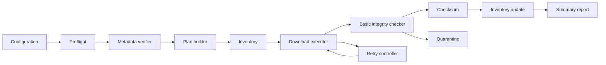
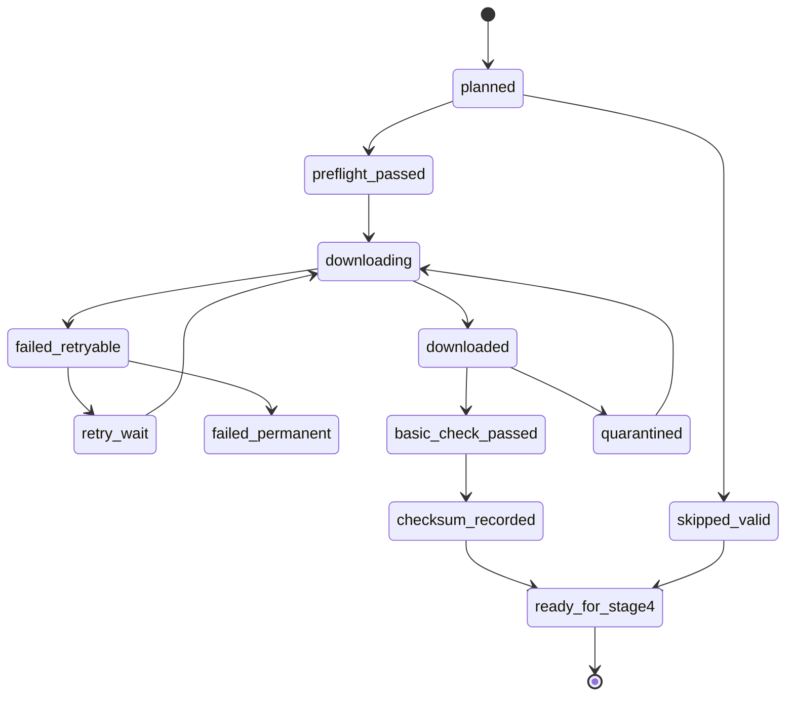
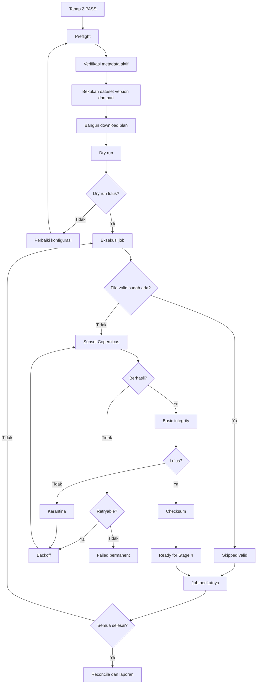
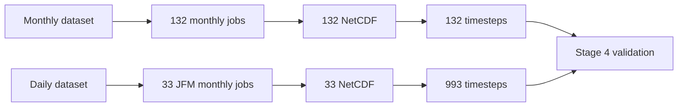
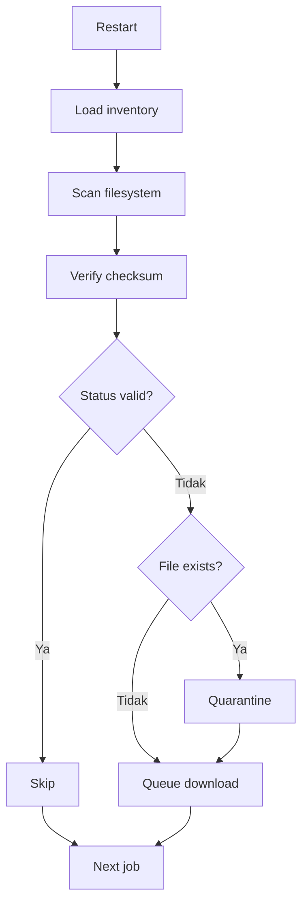
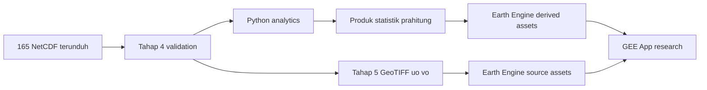

# TAHAP 3 — OTOMASI UNDUHAN DATA ARUS GLORYS12V1

**Proyek:** Pengembangan Analisis Arus Laut GLORYS12V1–Google Earth Engine  
**Wilayah awal:** Perairan Sorong dan sekitarnya  
**Periode utama:** 1 Januari 2015–31 Desember 2025  
**Periode khusus:** Januari–Maret setiap tahun 2015–2025  
**Tanggal penyusunan:** 31 Juli 2026  
**Status dokumen:** Panduan implementasi otomasi unduhan NetCDF  
**Ruang lingkup:** Arus laut saja  
**Sumber utama:** Copernicus Marine GLORYS12V1  
**Ketergantungan:** Tahap 0, Tahap 1, dan Tahap 2  
**Tahap berikutnya:** Tahap 4 — Validasi NetCDF  
**Klasifikasi penggunaan:** Pendidikan dan penelitian nonkomersial  
**Arsitektur downstream:** Python analytics–Earth Engine presentation  
**Versi dokumen:** 1.1

---

## Daftar isi

1. [Kedudukan Tahap 3](#1-kedudukan-tahap-3)
2. [Status pelaksanaan yang harus dipahami](#2-status-pelaksanaan-yang-harus-dipahami)
3. [Hubungan dengan Tahap 0–2](#3-hubungan-dengan-tahap-02)
4. [Tujuan Tahap 3](#4-tujuan-tahap-3)
5. [Hasil yang harus dicapai](#5-hasil-yang-harus-dicapai)
6. [Ruang lingkup](#6-ruang-lingkup)
7. [Hal yang tidak dikerjakan pada Tahap 3](#7-hal-yang-tidak-dikerjakan-pada-tahap-3)
8. [Prasyarat dan gerbang masuk](#8-prasyarat-dan-gerbang-masuk)
9. [Keputusan yang diwarisi dari Tahap 0–2](#9-keputusan-yang-diwarisi-dari-tahap-02)
10. [Rencana unduhan utama](#10-rencana-unduhan-utama)
11. [Perhitungan periode dan jumlah data](#11-perhitungan-periode-dan-jumlah-data)
12. [Granularitas file NetCDF](#12-granularitas-file-netcdf)
13. [Arsitektur otomasi](#13-arsitektur-otomasi)
14. [Struktur direktori](#14-struktur-direktori)
15. [Pengendalian versi lingkungan](#15-pengendalian-versi-lingkungan)
16. [Pengamanan kredensial](#16-pengamanan-kredensial)
17. [Konfigurasi utama](#17-konfigurasi-utama)
18. [Konfigurasi rencana unduhan](#18-konfigurasi-rencana-unduhan)
19. [Pembuatan download plan](#19-pembuatan-download-plan)
20. [Inventory dan state machine](#20-inventory-dan-state-machine)
21. [Preflight](#21-preflight)
22. [Verifikasi metadata aktif](#22-verifikasi-metadata-aktif)
23. [Pembekuan versi dataset](#23-pembekuan-versi-dataset)
24. [Dry run](#24-dry-run)
25. [Prosedur unduhan otomatis](#25-prosedur-unduhan-otomatis)
26. [Retry dan exponential backoff](#26-retry-dan-exponential-backoff)
27. [Resume dan skip-existing yang aman](#27-resume-dan-skip-existing-yang-aman)
28. [Karantina file bermasalah](#28-karantina-file-bermasalah)
29. [Pemeriksaan integritas dasar](#29-pemeriksaan-integritas-dasar)
30. [Checksum dan provenance](#30-checksum-dan-provenance)
31. [Logging](#31-logging)
32. [Eksekusi rencana bulanan 2015–2025](#32-eksekusi-rencana-bulanan-20152025)
33. [Eksekusi rencana harian Januari–Maret](#33-eksekusi-rencana-harian-januarimaret)
34. [Rencana harian seluruh periode sebagai ekspansi](#34-rencana-harian-seluruh-periode-sebagai-ekspansi)
35. [Perintah operasional](#35-perintah-operasional)
36. [Spesifikasi skrip](#36-spesifikasi-skrip)
37. [Klasifikasi error](#37-klasifikasi-error)
38. [Pengelolaan sumber daya](#38-pengelolaan-sumber-daya)
39. [Verifikasi jumlah hasil](#39-verifikasi-jumlah-hasil)
40. [Artefak dan bukti yang wajib disimpan](#40-artefak-dan-bukti-yang-wajib-disimpan)
41. [Diagram alur](#41-diagram-alur)
42. [Risiko dan mitigasi](#42-risiko-dan-mitigasi)
43. [Matriks penerimaan](#43-matriks-penerimaan)
44. [Runbook ringkas](#44-runbook-ringkas)
45. [Formulir pencatatan hasil](#45-formulir-pencatatan-hasil)
46. [Gerbang menuju Tahap 4](#46-gerbang-menuju-tahap-4)
47. [Hal yang belum boleh dilakukan](#47-hal-yang-belum-boleh-dilakukan)
48. [Sumber resmi](#48-sumber-resmi)
49. [Catatan perubahan](#49-catatan-perubahan)
50. [Penyesuaian untuk arsitektur hibrida](#50-penyesuaian-untuk-arsitektur-hibrida)

---

## 1. Kedudukan Tahap 3

Tahap 3 mengubah prosedur unduhan NetCDF yang telah diuji pada pilot Tahap 2 menjadi sistem batch yang:

- terencana;
- dapat diulang;
- dapat dilanjutkan setelah terputus;
- tidak mengunduh ulang file yang telah terbukti valid;
- mencatat setiap tugas;
- mengelola kegagalan;
- menyimpan checksum;
- menjaga keamanan kredensial;
- menyiapkan data mentah untuk Tahap 4.

Tahap 3 berfokus pada **otomasi pengambilan data**, bukan analisis oseanografi dan bukan konversi ke Earth Engine.

> **Prinsip utama:** data skala penuh tidak boleh diunduh sebelum pilot Tahap 2 pada data GLORYS12V1 asli dinyatakan `PASS`.

---

## 2. Status pelaksanaan yang harus dipahami

Dokumen ini adalah panduan dan spesifikasi implementasi.

Dokumen ini **tidak membuktikan** bahwa:

- AOI Sorong telah ditetapkan;
- kredensial Copernicus Marine telah tersedia;
- Tahap 2 pada data asli telah lulus;
- 132 periode bulanan telah diunduh;
- 33 paket harian Januari–Maret telah diunduh;
- 993 timestep harian telah tersedia;
- file NetCDF aktual telah lulus validasi lengkap.

Status yang benar sebelum pelaksanaan adalah:

> **Tahap 3 siap diterapkan, tetapi belum dinyatakan lulus sampai dijalankan pada lingkungan pengguna dan seluruh bukti penerimaan tersedia.**

---

### 2.1 Klasifikasi penggunaan

Seluruh unduhan dilakukan untuk:

- pendidikan;
- penelitian nonkomersial;
- pengujian metodologi;
- publikasi ilmiah.

Data dan pipeline tidak boleh diposisikan sebagai sistem operasional pemerintah, layanan komersial, atau sistem keselamatan.

Klasifikasi penggunaan harus disimpan dalam provenance setiap batch.


## 3. Hubungan dengan Tahap 0–2

### 3.1 Tahap 0

Tahap 0 menetapkan:

- Product ID;
- Dataset ID;
- variabel `uo` dan `vo`;
- satuan;
- resolusi;
- kedalaman;
- waktu;
- encoding;
- status reanalisis;
- keterbatasan pasang surut.

### 3.2 Tahap 1

Tahap 1 menetapkan:

- arsitektur bertingkat;
- data bulanan seluruh 2015–2025;
- data harian Januari–Maret;
- 132 timestep bulanan;
- 993 timestep harian Januari–Maret;
- kedalaman lapisan teratas;
- struktur aset dan metadata;
- kebutuhan pilot.

### 3.3 Tahap 2

Tahap 2 menguji satu bulan:

```text
1–29 Februari 2020
```

Tahap 2 harus membuktikan:

- subset dapat diunduh;
- NetCDF dapat dibuka;
- 29 timestep tersedia;
- `uo` dan `vo` benar;
- kedalaman benar;
- mask benar;
- waktu benar;
- konversi dan validasi silang bekerja.

### 3.4 Tahap 3

Tahap 3 memperluas proses unduhan dengan:

- download plan;
- inventory;
- retry;
- exponential backoff;
- resume;
- checksum;
- logging;
- karantina;
- laporan kelengkapan;
- pencegahan unduhan ulang.

---

## 4. Tujuan Tahap 3

Tahap 3 bertujuan membangun mekanisme unduhan yang:

1. menggunakan Copernicus Marine Toolbox resmi;
2. membaca konfigurasi terpisah;
3. tidak menyimpan kredensial dalam source code;
4. memverifikasi metadata sebelum batch;
5. membangun daftar tugas deterministik;
6. membagi unduhan ke unit yang dapat dikelola;
7. menangani gangguan jaringan;
8. dapat dilanjutkan setelah berhenti;
9. memeriksa file yang sudah ada;
10. menghindari file duplikat;
11. mencatat checksum;
12. menghasilkan inventory yang dapat diaudit;
13. memisahkan file valid, gagal, dan dikarantina;
14. menghasilkan laporan akhir;
15. menyiapkan input Tahap 4.

---

## 5. Hasil yang harus dicapai

Tahap 3 menghasilkan:

- konfigurasi unduhan;
- snapshot metadata aktif;
- download plan bulanan;
- download plan harian Januari–Maret;
- inventory tugas;
- file NetCDF mentah;
- checksum SHA-256;
- log per tugas;
- log sesi;
- daftar kegagalan;
- daftar file karantina;
- laporan kelengkapan;
- requirements lock;
- keputusan `PASS`, `PASS WITH NOTES`, atau `FAIL`.

---

### 5.1 Hasil tambahan untuk arsitektur hibrida

Tahap 3 juga harus menghasilkan manifest yang dapat digunakan oleh pipeline Python pada Tahap 4–5:

```text
outputs/manifests/
├── monthly_source_manifest.csv
├── daily_jfm_source_manifest.csv
└── downstream_processing_queue.csv
```

Kolom tambahan:

```text
research_purpose
noncommercial_only
python_processing_status
gee_publication_status
```

Nilai default:

```text
research_purpose = education_research
noncommercial_only = true
python_processing_status = pending_stage4
gee_publication_status = not_ready
```


## 6. Ruang lingkup

Tahap 3 mencakup:

- Product ID `GLOBAL_MULTIYEAR_PHY_001_030`;
- dataset bulanan `cmems_mod_glo_phy_my_0.083deg_P1M-m`;
- dataset harian `cmems_mod_glo_phy_my_0.083deg_P1D-m`;
- variabel `uo` dan `vo`;
- lapisan model teratas sekitar 0,494025 m;
- AOI yang telah disahkan;
- periode 2015–2025;
- data bulanan seluruh tahun;
- data harian Januari–Maret;
- NetCDF;
- otomasi Python;
- Copernicus Marine Toolbox;
- verifikasi integritas dasar.

---

## 7. Hal yang tidak dikerjakan pada Tahap 3

Tahap 3 tidak melakukan:

- validasi ilmiah lengkap NetCDF;
- analisis statistik arus;
- perhitungan kecepatan dan arah;
- konversi GeoTIFF skala penuh;
- upload Earth Engine;
- visualisasi GEE;
- current rose;
- klimatologi;
- anomali;
- tren;
- validasi lapangan;
- multi-kedalaman;
- gelombang.

Pembagian tanggung jawab:

| Tahap | Fokus |
|---|---|
| Tahap 3 | Unduh dan kelola NetCDF |
| Tahap 4 | Validasi NetCDF lengkap |
| Tahap 5 | Konversi ke GeoTIFF/COG |
| Tahap 6 | Unggah ke Earth Engine |
| Tahap 7+ | Analisis dan aplikasi |

---

## 8. Prasyarat dan gerbang masuk

Tahap 3 hanya boleh dimulai jika seluruh syarat berikut dipenuhi:

- [ ] Tahap 2 pada data asli berstatus `PASS`.
- [ ] Metadata aktif telah disimpan.
- [ ] Dataset harian dapat diakses.
- [ ] Dataset bulanan dapat diakses.
- [ ] AOI telah diisi dan disetujui.
- [ ] Kedalaman aktual pilot telah terverifikasi.
- [ ] `uo` dan `vo` terbaca benar.
- [ ] Waktu pilot terbaca benar.
- [ ] Mask pilot terbaca benar.
- [ ] Kredensial aman tersedia.
- [ ] Ruang penyimpanan memadai.
- [ ] Versi dependency telah dibekukan.
- [ ] Masalah Tahap 2 telah diselesaikan atau diterima secara tertulis.

Jika satu syarat kritis gagal:

> **Hentikan Tahap 3 dan kembali ke Tahap 2.**

---

## 9. Keputusan yang diwarisi dari Tahap 0–2

| Unsur | Keputusan |
|---|---|
| Product ID | `GLOBAL_MULTIYEAR_PHY_001_030` |
| Dataset bulanan | `cmems_mod_glo_phy_my_0.083deg_P1M-m` |
| Dataset harian | `cmems_mod_glo_phy_my_0.083deg_P1D-m` |
| Variabel | `uo`, `vo` |
| Satuan | m/s |
| Kedalaman awal | 0,494025 m |
| Label kedalaman | `top_model_layer` |
| Periode | 2015–2025 |
| Jumlah tahun | 11 |
| Format | NetCDF |
| Data utama | Reanalisis |
| Pasut | Tidak dimasukkan |
| Zona waktu tampilan | `Asia/Jayapura` |
| Zona waktu produk | Tidak diasumsikan WIT |
| Arsitektur | Bulanan penuh + harian Januari–Maret |

---

## 10. Rencana unduhan utama

### 10.1 Rencana A — Bulanan seluruh periode

Sumber:

```text
cmems_mod_glo_phy_my_0.083deg_P1M-m
```

Periode:

```text
Januari 2015–Desember 2025
```

Unit file:

```text
satu bulan per NetCDF
```

Jumlah:

```text
132 file NetCDF
132 timestep bulanan
```

### 10.2 Rencana B — Harian Januari–Maret

Sumber:

```text
cmems_mod_glo_phy_my_0.083deg_P1D-m
```

Periode:

```text
Januari–Maret setiap tahun 2015–2025
```

Unit file:

```text
satu bulan per NetCDF
```

Jumlah:

```text
33 file NetCDF
993 timestep harian
```

### 10.3 Total inti Tahap 3

| Rencana | File NetCDF | Timestep |
|---|---:|---:|
| Bulanan seluruh periode | 132 | 132 |
| Harian Januari–Maret | 33 | 993 |
| Total | **165** | **1.125** |

> **Penting:** 1.125 adalah jumlah timestep/citra yang direncanakan pada arsitektur GEE, bukan jumlah file NetCDF mentah. Dengan pembagian bulanan, jumlah file mentah inti adalah 165.

---

## 11. Perhitungan periode dan jumlah data

### 11.1 Bulanan

\[
11 \times 12 = 132
\]

### 11.2 Harian Januari–Maret

Tahun kabisat:

- 2016;
- 2020;
- 2024.

Jumlah:

\[
8 \times 90 + 3 \times 91 = 993
\]

### 11.3 Jumlah paket harian per bulan

\[
11 \times 3 = 33
\]

### 11.4 Jumlah harian seluruh periode sebagai ekspansi

\[
11 \times 365 + 3 = 4.018
\]

---

## 12. Granularitas file NetCDF

### 12.1 Keputusan

Gunakan:

> **satu bulan per file NetCDF**

untuk rencana bulanan dan harian Januari–Maret.

### 12.2 Alasan

- mudah dilanjutkan;
- kegagalan terisolasi;
- ukuran file terkendali;
- mudah diaudit;
- mudah dikarantina;
- selaras dengan struktur kalender;
- tidak menghasilkan 993 file mentah;
- memudahkan Tahap 4;
- mudah diulang untuk satu bulan.

### 12.3 Mengapa tidak satu file 2015–2025?

Risiko:

- kegagalan mengulang data besar;
- sulit melanjutkan sebagian;
- validasi lebih berat;
- penggunaan memori lebih besar;
- satu file rusak memengaruhi seluruh periode;
- sulit menentukan sumber masalah.

### 12.4 Mengapa tidak satu file per hari?

Risiko:

- terlalu banyak file mentah;
- overhead filesystem;
- lebih banyak operasi checksum;
- pengelolaan inventory lebih berat;
- tidak memberi keuntungan pada tahap unduhan.

Satu file per hari baru diperlukan pada Tahap 5 ketika setiap timestep diubah menjadi GeoTIFF.

---

## 13. Arsitektur otomasi

Komponen utama:

1. **Configuration loader**
2. **Preflight**
3. **Metadata verifier**
4. **Download plan builder**
5. **Inventory manager**
6. **Download executor**
7. **Retry controller**
8. **Basic integrity checker**
9. **Checksum generator**
10. **Quarantine manager**
11. **Report generator**



---

## 14. Struktur direktori

```text
GLORYS12V1_Tahap_3_Download/
├── README.md
├── requirements.txt
├── requirements-lock.txt
├── .gitignore
├── config/
│   ├── stage3_config.example.json
│   ├── stage3_config.json
│   └── schema/
│       └── stage3_config.schema.json
├── python/
│   ├── common.py
│   ├── inventory.py
│   ├── integrity.py
│   ├── 00_preflight.py
│   ├── 01_verify_metadata.py
│   ├── 02_build_download_plan.py
│   ├── 03_download_glorys.py
│   ├── 04_basic_integrity_check.py
│   ├── 05_reconcile_inventory.py
│   └── 06_generate_stage3_report.py
├── data/
│   ├── raw/
│   │   ├── monthly/
│   │   │   ├── 2015/
│   │   │   └── ...
│   │   └── daily_jfm/
│   │       ├── 2015/
│   │       └── ...
│   ├── partial/
│   └── quarantine/
├── outputs/
│   ├── metadata/
│   ├── plans/
│   ├── inventory/
│   ├── checksums/
│   ├── logs/
│   │   ├── sessions/
│   │   └── jobs/
│   └── reports/
└── tests/
    ├── test_plan_counts.py
    ├── test_inventory_transitions.py
    ├── test_integrity_checks.py
    └── test_filename_rules.py
```

### 14.1 Git

Jangan masukkan ke Git:

- `stage3_config.json` jika memuat path lokal sensitif;
- kredensial;
- file NetCDF;
- partial file;
- quarantine file;
- log yang dapat memuat data pribadi;
- checksum untuk data yang tidak boleh dipublikasikan, jika berlaku.

Contoh `.gitignore`:

```gitignore
config/stage3_config.json
data/
outputs/logs/
*.nc
*.part
.env
.copernicusmarine-credentials
```

---

## 15. Pengendalian versi lingkungan

### 15.1 Prinsip

Tahap 3 harus menggunakan lingkungan yang telah lulus Tahap 2.

Jangan mengubah dependency sebelum:

- mencatat versi lama;
- membuat environment baru;
- mengulang pilot;
- membandingkan hasil.

### 15.2 Baseline dokumentasi

Pada tanggal 31 Juli 2026, dokumentasi stabil Copernicus Marine Toolbox mencantumkan rilis seri 2.4, termasuk 2.4.1.

Namun, versi operasional proyek harus berasal dari:

```text
requirements-lock.txt
```

### 15.3 Pemeriksaan

```powershell
python --version
copernicusmarine --version
python -m pip freeze
```

Simpan:

```text
outputs/logs/environment_versions.txt
```

### 15.4 Instalasi

Jika environment Tahap 2 dipakai:

```powershell
conda activate glorys-gee-pilot
```

Jika membuat environment terpisah:

```powershell
conda create -n glorys-stage3 python=3.13 -y
conda activate glorys-stage3
python -m pip install --upgrade pip
pip install -r requirements.txt
pip freeze > requirements-lock.txt
```

### 15.5 Larangan upgrade diam-diam

Jangan menjalankan:

```powershell
pip install --upgrade copernicusmarine
```

di environment produksi Tahap 3 tanpa:

- snapshot environment;
- pembacaan changelog;
- pengujian pilot;
- persetujuan perubahan.

---

## 16. Pengamanan kredensial

### 16.1 Metode utama

Gunakan:

```powershell
copernicusmarine login
```

Toolbox menyimpan file kredensial di direktori pengguna.

Verifikasi:

```powershell
copernicusmarine login --check-credentials-valid
```

### 16.2 Alternatif environment variable

Windows PowerShell untuk sesi aktif:

```powershell
$env:COPERNICUSMARINE_SERVICE_USERNAME = "<USERNAME>"
$env:COPERNICUSMARINE_SERVICE_PASSWORD = "<PASSWORD>"
```

Environment variable resmi:

```text
COPERNICUSMARINE_SERVICE_USERNAME
COPERNICUSMARINE_SERVICE_PASSWORD
```

### 16.3 Larangan

Jangan menyimpan kredensial pada:

- Python;
- JSON konfigurasi proyek;
- GitHub;
- README;
- log;
- nama file;
- screenshot publik;
- command history yang dibagikan.

### 16.4 Pemeriksaan kebocoran

Sebelum commit:

```powershell
git diff --cached
git status --short
```

Cari:

```powershell
git grep -n "COPERNICUSMARINE_SERVICE_PASSWORD"
git grep -n "password"
git grep -n "username"
```

---

## 17. Konfigurasi utama

Contoh `config/stage3_config.example.json`:

```json
{
  "project": {
    "name": "glorys12v1-current-analysis",
    "stage": 3,
    "aoi_id": "sorong_study_area",
    "display_timezone": "Asia/Jayapura"
  },
  "product": {
    "product_id": "GLOBAL_MULTIYEAR_PHY_001_030",
    "daily_dataset_id": "cmems_mod_glo_phy_my_0.083deg_P1D-m",
    "monthly_dataset_id": "cmems_mod_glo_phy_my_0.083deg_P1M-m",
    "variables": ["uo", "vo"],
    "depth_m": 0.494025,
    "depth_tolerance_m": 0.000001,
    "coordinates_selection_method": "nearest",
    "file_format": "netcdf",
    "netcdf_compression_level": 1
  },
  "aoi": {
    "west": null,
    "east": null,
    "south": null,
    "north": null
  },
  "period": {
    "start_year": 2015,
    "end_year": 2025
  },
  "plans": {
    "monthly_all": {
      "enabled": true,
      "months": [1, 2, 3, 4, 5, 6, 7, 8, 9, 10, 11, 12]
    },
    "daily_jfm": {
      "enabled": true,
      "months": [1, 2, 3]
    },
    "daily_full": {
      "enabled": false
    }
  },
  "download": {
    "max_job_attempts": 4,
    "initial_backoff_seconds": 10,
    "backoff_multiplier": 3,
    "maximum_backoff_seconds": 300,
    "continue_on_error": true,
    "raise_if_updating": true,
    "dry_run": false,
    "minimum_file_size_bytes": 1024,
    "checksum_algorithm": "sha256"
  },
  "network": {
    "https_timeout_seconds": 120,
    "https_retries": 5,
    "use_threads": true
  },
  "paths": {
    "data_root": "data",
    "output_root": "outputs"
  }
}
```

### 17.1 Nilai yang wajib diisi

```json
"aoi": {
  "west": null,
  "east": null,
  "south": null,
  "north": null
}
```

Semua nilai `null` harus diganti dengan AOI yang sah.

### 17.2 Validasi AOI

Harus memenuhi:

\[
west < east
\]

\[
south < north
\]

dan:

```text
-180 ≤ west/east < 360
-90 ≤ south/north ≤ 90
```

### 17.3 Kedalaman

`nearest` digunakan sebagai mekanisme seleksi layanan, tetapi hasil aktual harus diperiksa.

Kriteria:

\[
|\text{depth aktual} - 0.494025|
\le \text{depth tolerance}
\]

---

## 18. Konfigurasi rencana unduhan

### 18.1 `monthly_all`

- dataset bulanan;
- bulan 1–12;
- tahun 2015–2025;
- 132 tugas;
- satu timestep per file.

### 18.2 `daily_jfm`

- dataset harian;
- bulan 1–3;
- tahun 2015–2025;
- 33 tugas;
- 90 atau 91 timestep per tahun;
- satu bulan per file.

### 18.3 `daily_full`

Tetap dinonaktifkan karena:

- arsitektur inti hanya memerlukan harian Januari–Maret;
- statistik berat diproses dengan Python;
- GEE tidak memerlukan raw harian 4.018 timestep untuk setiap fungsi;
- ekspansi hanya dilakukan berdasarkan pertanyaan penelitian yang nyata.


- dinonaktifkan;
- hanya untuk ekspansi;
- tidak dijalankan sebelum arsitektur inti lulus.

---

## 19. Pembuatan download plan

Download plan harus dibangun secara deterministik dari konfigurasi.

### 19.1 Kolom minimum

| Kolom | Isi |
|---|---|
| `job_id` | ID unik |
| `plan_name` | `monthly_all` atau `daily_jfm` |
| `dataset_id` | Dataset sumber |
| `year` | Tahun |
| `month` | Bulan |
| `start_datetime` | Awal |
| `end_datetime` | Akhir |
| `expected_timesteps` | Jumlah timestep |
| `output_directory` | Folder |
| `output_filename` | Nama file |
| `status` | Status tugas |
| `attempt_count` | Jumlah percobaan |
| `checksum` | SHA-256 |
| `dataset_version` | Versi aktif |
| `dataset_part` | Bagian aktif |
| `created_utc` | Waktu dibuat |

### 19.2 ID tugas

Bulanan:

```text
monthly_2015_01
```

Harian:

```text
daily_jfm_2015_01
```

### 19.3 Tanggal tugas

Gunakan:

```text
start = hari pertama bulan 00:00:00
end   = hari terakhir bulan 23:59:59
```

Contoh Februari 2020:

```text
2020-02-01T00:00:00
2020-02-29T23:59:59
```

Untuk request Copernicus daily JFM, executor memakai batas operasional pada
timestamp terakhir `00:00:00` berdasarkan jumlah timestep yang diharapkan.
Penyesuaian ini mencegah endpoint inklusif menarik timestamp hari pertama bulan
berikutnya; rentang plan tetap dicatat dengan format tanggal di atas.

### 19.4 Jumlah timestep yang diharapkan

Bulanan:

```text
1
```

Harian:

```text
jumlah hari kalender bulan tersebut
```

### 19.5 Uji jumlah plan

Harus menghasilkan:

```text
monthly_all = 132 job
daily_jfm   = 33 job
total       = 165 job
```

---

## 20. Inventory dan state machine

### 20.1 Fungsi inventory

Inventory menjadi sumber kebenaran operasional.

Jangan menentukan status hanya dari keberadaan nama file.

### 20.2 Status

```text
planned
preflight_passed
downloading
downloaded
basic_check_passed
checksum_recorded
skipped_valid
retry_wait
failed_retryable
failed_permanent
quarantined
ready_for_stage4
```

### 20.3 Transisi sah



### 20.4 Larangan transisi

Tidak boleh:

- `downloaded` langsung menjadi `ready_for_stage4` tanpa pemeriksaan;
- file kosong menjadi `skipped_valid`;
- file rusak ditimpa tanpa karantina;
- `failed_permanent` dicoba tanpa perubahan konfigurasi atau keputusan.

### 20.5 Format inventory

Gunakan:

```text
CSV untuk inspeksi manusia
SQLite untuk transaksi dan resume
```

Contoh:

```text
outputs/inventory/download_inventory.sqlite
outputs/inventory/download_inventory.csv
```

---

## 21. Preflight

Preflight harus memeriksa:

1. file konfigurasi tersedia;
2. JSON valid;
3. AOI terisi;
4. periode benar;
5. Product ID benar;
6. Dataset ID benar;
7. variabel hanya `uo` dan `vo`;
8. depth terisi;
9. direktori dapat ditulis;
10. ruang penyimpanan tersedia;
11. Copernicus Marine Toolbox dapat diimpor;
12. kredensial valid;
13. metadata aktif dapat diakses;
14. requirements lock tersedia;
15. Tahap 2 berstatus `PASS`.

### 21.1 Pemeriksaan kredensial

```powershell
copernicusmarine login --check-credentials-valid
```

### 21.2 Pemeriksaan Toolbox

```powershell
copernicusmarine --version
```

### 21.3 Pemeriksaan Python

```powershell
python --version
python -c "import copernicusmarine, xarray, netCDF4; print('PASS')"
```

### 21.4 Output

```text
outputs/logs/preflight_stage3.json
```

---

## 22. Verifikasi metadata aktif

Sebelum plan dieksekusi:

```powershell
copernicusmarine describe `
  --product-id GLOBAL_MULTIYEAR_PHY_001_030 `
  --return-fields all `
  > outputs/metadata/product_metadata.json
```

```powershell
copernicusmarine describe `
  --dataset-id cmems_mod_glo_phy_my_0.083deg_P1D-m `
  --show-all-versions `
  --return-fields all `
  > outputs/metadata/daily_dataset_metadata.json
```

```powershell
copernicusmarine describe `
  --dataset-id cmems_mod_glo_phy_my_0.083deg_P1M-m `
  --show-all-versions `
  --return-fields all `
  > outputs/metadata/monthly_dataset_metadata.json
```

Periksa:

- versi aktif;
- dataset part;
- variabel;
- unit;
- waktu;
- depth;
- cakupan AOI;
- status update;
- layanan yang tersedia.

Jika metadata berbeda dari Tahap 0:

> hentikan batch, dokumentasikan perbedaan, dan perbarui keputusan yang terdampak.

---

## 23. Pembekuan versi dataset

### 23.1 Tujuan

Mencegah sebagian file diunduh dari versi dataset berbeda tanpa diketahui.

### 23.2 Prosedur

1. jalankan `describe --show-all-versions`;
2. identifikasi versi default aktif;
3. catat dataset part;
4. simpan dalam snapshot;
5. masukkan ke inventory;
6. gunakan `dataset_version` dan `dataset_part` secara eksplisit jika tersedia dan telah diverifikasi;
7. jangan mengganti versi di tengah batch.

### 23.3 Jika versi berubah saat batch

Hentikan dan pilih:

- menyelesaikan dengan versi lama jika masih tersedia;
- mengulang seluruh rencana dengan versi baru;
- membandingkan kedua versi;
- mencatat penyimpangan.

Jangan mencampur versi tanpa dokumentasi.

---

## 24. Dry run

Dry run dilakukan sebelum mengunduh.

### 24.1 Tujuan

- memeriksa request;
- memeriksa dataset;
- memeriksa AOI;
- memeriksa waktu;
- memeriksa nama output;
- memperkirakan respons layanan;
- menemukan kesalahan konfigurasi.

### 24.2 Perintah aplikasi

```powershell
python python/03_download_glorys.py `
  --plan monthly_all `
  --dry-run
```

```powershell
python python/03_download_glorys.py `
  --plan daily_jfm `
  --dry-run
```

### 24.3 Sampel

Dry run minimal pada:

- Januari 2015;
- Februari 2020;
- Desember 2025;
- Januari harian 2015;
- Februari harian 2020;
- Maret harian 2025.

### 24.4 Kriteria lulus

- tidak ada request di luar cakupan;
- jumlah plan benar;
- output tidak bertabrakan;
- depth benar;
- variabel benar;
- dataset benar.

---

## 25. Prosedur unduhan otomatis

Untuk setiap tugas:

1. baca job dari inventory;
2. periksa status;
3. periksa file target;
4. jika file valid, tandai `skipped_valid`;
5. jika file ada tetapi tidak valid, karantina;
6. ubah status menjadi `downloading`;
7. panggil `copernicusmarine.subset`;
8. simpan response;
9. periksa exit/exception;
10. periksa file;
11. jalankan integritas dasar;
12. hitung checksum;
13. simpan metadata;
14. perbarui status;
15. lanjut job berikutnya.

### 25.1 Parameter inti subset

- `dataset_id`;
- `dataset_version`;
- `dataset_part`;
- `variables=["uo", "vo"]`;
- AOI;
- tanggal;
- depth;
- `coordinates_selection_method="nearest"`;
- `output_directory`;
- `output_filename`;
- `file_format="netcdf"`;
- `netcdf_compression_level`;
- `raise_if_updating=True`.

### 25.2 `overwrite` dan `skip_existing`

Keduanya tidak digunakan secara buta.

Strategi:

- inventory memutuskan apakah file valid;
- file invalid dikarantina;
- setelah target aman, unduhan dapat dijalankan;
- `skip_existing=True` boleh menjadi lapisan tambahan, bukan satu-satunya kontrol.

---

## 26. Retry dan exponential backoff

### 26.1 Dua tingkat retry

1. **Retry internal Toolbox**  
   untuk HTTP request;

2. **Retry tingkat job**  
   untuk keseluruhan subset bulanan.

### 26.2 Environment variable jaringan

```powershell
$env:COPERNICUSMARINE_HTTPS_TIMEOUT = "120"
$env:COPERNICUSMARINE_HTTPS_RETRIES = "5"
```

Jika thread bermasalah:

```powershell
$env:COPERNICUSMARINE_USE_THREADS = "False"
```

Menonaktifkan thread dapat memperlambat proses.

### 26.3 Backoff tingkat job

Contoh:

| Percobaan | Jeda |
|---:|---:|
| 1 | 10 detik |
| 2 | 30 detik |
| 3 | 90 detik |
| 4 | 270 detik |

Formula:

\[
delay_n =
\min(
initial \times multiplier^{n-1},
maximum
)
\]

### 26.4 Error yang dapat dicoba ulang

Contoh:

- timeout;
- koneksi terputus;
- HTTP 5xx;
- DNS sementara;
- layanan sementara tidak tersedia;
- file parsial;
- dataset sedang diperbarui, setelah jeda dan evaluasi.

### 26.5 Error permanen

Contoh:

- Dataset ID salah;
- variabel tidak ada;
- AOI di luar batas;
- tanggal salah;
- kredensial tidak valid;
- konfigurasi depth salah;
- format tidak didukung.

Error permanen tidak boleh diulang tanpa perubahan.

---

## 27. Resume dan skip-existing yang aman

### 27.1 Resume

Ketika proses dimulai ulang:

1. baca inventory;
2. identifikasi `ready_for_stage4`;
3. identifikasi `skipped_valid`;
4. identifikasi tugas gagal;
5. periksa target file;
6. lanjutkan hanya tugas yang belum selesai.

### 27.2 Definisi file valid dasar

File dapat dilewati hanya jika:

- ada;
- regular file;
- ukuran di atas batas;
- dapat dibuka dengan xarray/netCDF4;
- memiliki `uo`;
- memiliki `vo`;
- memiliki `time`;
- memiliki `depth`;
- waktu sesuai bulan;
- jumlah timestep sesuai;
- depth sesuai toleransi;
- checksum tersedia;
- checksum cocok dengan inventory.

### 27.3 File tanpa checksum

Jangan langsung dianggap valid.

Lakukan:

- pemeriksaan dasar;
- hitung checksum;
- perbarui inventory.

### 27.4 Perubahan file

Jika checksum berubah:

- karantina;
- tandai `checksum_mismatch`;
- unduh ulang;
- dokumentasikan.

---

## 28. Karantina file bermasalah

### 28.1 Tujuan

Mencegah file rusak ditimpa tanpa jejak.

### 28.2 Struktur

```text
data/quarantine/
├── 20260731T101500Z/
│   ├── glorys12v1_daily_202002.nc
│   └── reason.json
```

### 28.3 Metadata alasan

```json
{
  "job_id": "daily_jfm_2020_02",
  "reason": "time_count_mismatch",
  "expected": 29,
  "actual": 28,
  "quarantined_utc": "2026-07-31T01:15:00Z"
}
```

### 28.4 File parsial

Simpan sementara di:

```text
data/partial/
```

Setelah berhasil:

- pindahkan atomik ke `data/raw`;
- jangan membaca file saat masih ditulis.

---

## 29. Pemeriksaan integritas dasar

Tahap 3 melakukan pemeriksaan ringan, bukan validasi lengkap Tahap 4.

### 29.1 Pemeriksaan file

- file ada;
- ukuran > minimum;
- extension `.nc`;
- dapat dibuka;
- tidak terpotong.

### 29.2 Pemeriksaan struktur

- `uo`;
- `vo`;
- `time`;
- `depth`;
- `latitude`;
- `longitude`.

### 29.3 Pemeriksaan waktu

Bulanan:

```text
actual timestep = 1
```

Harian:

```text
actual timestep = jumlah hari bulan
```

### 29.4 Pemeriksaan depth

- hanya lapisan target;
- nilai aktual sesuai toleransi.

### 29.5 Pemeriksaan nilai

- ada nilai valid;
- tidak seluruhnya `NaN`;
- tidak seluruhnya nol;
- tidak ada `_FillValue` mentah yang lolos sebagai nilai valid setelah decoding dasar.

### 29.6 Batas Tahap 3

Tahap 3 belum memutuskan bahwa:

- rentang arus ilmiah benar;
- orientasi lintang final benar;
- encoding final benar;
- data siap dikonversi.

Keputusan itu milik Tahap 4.

---

## 30. Checksum dan provenance

### 30.1 Algoritma

Gunakan:

```text
SHA-256
```

### 30.2 File checksum

```text
outputs/checksums/sha256.csv
```

Kolom:

```text
job_id
relative_path
size_bytes
sha256
calculated_utc
```

### 30.3 Provenance

Setiap file harus dapat ditelusuri ke:

- Product ID;
- Dataset ID;
- dataset version;
- dataset part;
- AOI;
- waktu;
- depth;
- variabel;
- versi Toolbox;
- konfigurasi;
- response subset;
- checksum.

### 30.4 Hash konfigurasi

Simpan hash file konfigurasi yang digunakan.

Tujuannya:

- mendeteksi perubahan konfigurasi di tengah batch;
- menjaga reproduksibilitas.

---

## 31. Logging

### 31.1 Log sesi

```text
outputs/logs/sessions/stage3_YYYYMMDDTHHMMSSZ.log
```

Isi:

- waktu mulai;
- environment;
- config hash;
- plan;
- jumlah job;
- hasil akhir;
- waktu selesai.

### 31.2 Log job

```text
outputs/logs/jobs/<job_id>.json
```

Isi:

- request;
- attempt;
- exception;
- response;
- file;
- ukuran;
- checksum;
- status;
- durasi.

### 31.3 Keamanan log

Jangan mencatat:

- password;
- token;
- isi file kredensial;
- username jika tidak diperlukan.

### 31.4 Level

```text
DEBUG
INFO
WARNING
ERROR
CRITICAL
```

---

## 32. Eksekusi rencana bulanan 2015–2025

### 32.1 Bangun plan

```powershell
python python/02_build_download_plan.py `
  --plan monthly_all
```

### 32.2 Periksa

Harus menghasilkan:

```text
132 job
```

### 32.3 Dry run

```powershell
python python/03_download_glorys.py `
  --plan monthly_all `
  --dry-run
```

### 32.4 Eksekusi

```powershell
python python/03_download_glorys.py `
  --plan monthly_all `
  --execute
```

### 32.5 Struktur output

```text
data/raw/monthly/
├── 2015/
│   ├── glorys12v1_monthly_201501_d0p494025m.nc
│   ├── glorys12v1_monthly_201502_d0p494025m.nc
│   └── ...
└── 2025/
```

### 32.6 Kriteria awal

- 132 file;
- setiap file dapat dibuka;
- setiap file satu timestep;
- bulan dan tahun benar;
- checksum tersedia.

---

## 33. Eksekusi rencana harian Januari–Maret

### 33.1 Bangun plan

```powershell
python python/02_build_download_plan.py `
  --plan daily_jfm
```

### 33.2 Periksa

Harus menghasilkan:

```text
33 job
993 timestep
```

### 33.3 Dry run

```powershell
python python/03_download_glorys.py `
  --plan daily_jfm `
  --dry-run
```

### 33.4 Eksekusi

```powershell
python python/03_download_glorys.py `
  --plan daily_jfm `
  --execute
```

### 33.5 Struktur output

```text
data/raw/daily_jfm/
├── 2015/
│   ├── glorys12v1_daily_201501_d0p494025m.nc
│   ├── glorys12v1_daily_201502_d0p494025m.nc
│   └── glorys12v1_daily_201503_d0p494025m.nc
└── 2025/
```

### 33.6 Kriteria awal

- 33 file;
- 993 timestep total;
- tahun biasa JFM = 90;
- tahun kabisat JFM = 91;
- checksum tersedia.

---

## 34. Rencana harian seluruh periode sebagai ekspansi

Rencana ini tidak termasuk inti Tahap 3 awal.

Jika diaktifkan:

- dataset harian;
- 132 file bulanan;
- 4.018 timestep;
- periode Januari 2015–Desember 2025.

Aktivasi hanya setelah:

- rencana inti lulus;
- Tahap 4–6 stabil;
- ruang penyimpanan dinilai;
- kebutuhan ilmiah disetujui.

---

## 35. Perintah operasional

### 35.1 Preflight

```powershell
python python/00_preflight.py
```

### 35.2 Metadata

```powershell
python python/01_verify_metadata.py
```

### 35.3 Plan

```powershell
python python/02_build_download_plan.py --plan monthly_all
python python/02_build_download_plan.py --plan daily_jfm
```

### 35.4 Download

```powershell
python python/03_download_glorys.py --plan monthly_all --execute
python python/03_download_glorys.py --plan daily_jfm --execute
```

### 35.5 Integritas

```powershell
python python/04_basic_integrity_check.py --plan monthly_all
python python/04_basic_integrity_check.py --plan daily_jfm
```

### 35.6 Rekonsiliasi

```powershell
python python/05_reconcile_inventory.py
```

### 35.7 Laporan

```powershell
python python/06_generate_stage3_report.py
```

### 35.8 Ulang hanya job tertentu

```powershell
python python/03_download_glorys.py `
  --job-id daily_jfm_2020_02 `
  --force-after-quarantine
```

---

## 36. Spesifikasi skrip

### 36.1 `common.py`

Tanggung jawab:

- load config;
- validasi config;
- path;
- timestamp UTC;
- hash config;
- logging;
- nama file;
- perhitungan hari bulan.

### 36.2 `inventory.py`

Tanggung jawab:

- SQLite;
- schema;
- transaksi;
- state transition;
- ekspor CSV;
- locking;
- resume.

### 36.3 `integrity.py`

Tanggung jawab:

- membuka NetCDF;
- memeriksa variabel;
- memeriksa dimensi;
- memeriksa waktu;
- memeriksa depth;
- ukuran file;
- checksum.

### 36.4 `00_preflight.py`

Input:

- config;
- environment.

Output:

```text
preflight_stage3.json
```

### 36.5 `01_verify_metadata.py`

Input:

- Product ID;
- Dataset ID.

Output:

- snapshot metadata;
- versi dataset;
- dataset part;
- keputusan konsistensi.

### 36.6 `02_build_download_plan.py`

Input:

- config;
- nama plan.

Output:

- CSV plan;
- record inventory;
- ringkasan jumlah.

### 36.7 `03_download_glorys.py`

Input:

- plan;
- inventory;
- config.

Proses:

- pilih job;
- resume;
- retry;
- subset;
- log;
- basic check;
- checksum.

Output:

- NetCDF;
- response;
- status.

### 36.8 `04_basic_integrity_check.py`

Input:

- file NetCDF.

Output:

- status dasar;
- jumlah timestep;
- depth;
- variabel;
- checksum.

### 36.9 `05_reconcile_inventory.py`

Script ini bersifat read-only dan membandingkan:

- database;
- file sistem;
- checksum;
- status;
- file ekstra atau hilang pada `data/raw/monthly` dan `data/raw/daily_jfm`;
- file tersisa pada `data/partial`;
- artefak `data/quarantine` sebagai catatan audit tanpa menghapusnya.

Rekonsiliasi tidak mengubah SQLite, status job, file aktif, atau quarantine.
Exit `0` berarti tidak ada blocker; `PASS_WITH_NOTES` dapat muncul bila artefak
quarantine lama dipertahankan sebagai evidence.

### 36.10 `06_generate_stage3_report.py`

Menghasilkan:

- jumlah job;
- berhasil;
- gagal;
- skip valid;
- karantina;
- total ukuran;
- versi;
- daftar masalah;
- keputusan gerbang.

---

## 37. Klasifikasi error

| Kategori | Contoh | Tindakan |
|---|---|---|
| Authentication | password salah | hentikan |
| Configuration | AOI null | hentikan |
| Metadata | dataset berubah | hentikan dan evaluasi |
| Network transient | timeout | retry |
| Service transient | HTTP 5xx | retry |
| Dataset updating | interval bertabrakan update | hentikan atau tunggu |
| File partial | file tidak dapat dibuka | karantina dan retry |
| Structural | `uo` tidak ada | gagal permanen |
| Time mismatch | 28 dari 29 hari | karantina dan investigasi |
| Depth mismatch | depth berbeda | hentikan |
| Checksum mismatch | file berubah | karantina |
| Disk | ruang habis | hentikan |
| Permission | folder tidak dapat ditulis | hentikan |

---

## 38. Pengelolaan sumber daya

### 38.1 Penyimpanan

Sebelum batch:

- ukur ukuran file pilot;
- estimasikan ukuran 165 file;
- sediakan ruang tambahan;
- sisakan ruang untuk partial, quarantine, dan Tahap 5.

Formula:

\[
estimasi =
ukuran\ pilot\ per\ timestep
\times 1.125
\times faktor\ overhead
\]

Gunakan hasil aktual pilot, bukan asumsi global.

### 38.2 Parallelism

Default:

> jalankan job bulanan secara sekuensial terlebih dahulu.

Parallelism hanya ditambah setelah:

- layanan stabil;
- disk stabil;
- inventory thread-safe;
- tidak ada rate error;
- memory aman.

### 38.3 Threads Toolbox

Toolbox menggunakan thread secara default. Jika lingkungan bermasalah:

```powershell
$env:COPERNICUSMARINE_USE_THREADS = "False"
```

### 38.4 NetCDF compression

Level awal:

```text
1
```

Tujuan:

- mengurangi ukuran;
- menghindari beban kompresi tinggi.

Uji pilot diperlukan sebelum menaikkan level.

---

## 39. Verifikasi jumlah hasil

### 39.1 Bulanan

```text
expected files     = 132
expected timesteps = 132
```

### 39.2 Harian Januari–Maret

```text
expected files     = 33
expected timesteps = 993
```

### 39.3 Total

```text
expected files     = 165
expected timesteps = 1.125
```

### 39.4 Rekonsiliasi tahunan

| Tahun | JFM hari |
|---:|---:|
| 2015 | 90 |
| 2016 | 91 |
| 2017 | 90 |
| 2018 | 90 |
| 2019 | 90 |
| 2020 | 91 |
| 2021 | 90 |
| 2022 | 90 |
| 2023 | 90 |
| 2024 | 91 |
| 2025 | 90 |
| **Total** | **993** |

---

## 40. Artefak dan bukti yang wajib disimpan

```text
outputs/
├── metadata/
│   ├── product_metadata.json
│   ├── daily_dataset_metadata.json
│   └── monthly_dataset_metadata.json
├── plans/
│   ├── monthly_all_plan.csv
│   └── daily_jfm_plan.csv
├── inventory/
│   ├── download_inventory.sqlite
│   └── download_inventory.csv
├── checksums/
│   └── sha256.csv
├── logs/
│   ├── environment_versions.txt
│   ├── preflight_stage3.json
│   ├── sessions/
│   └── jobs/
└── reports/
    ├── monthly_all_summary.json
    ├── daily_jfm_summary.json
    └── stage3_final_report.md
```

Artefak tambahan:

- config yang dipakai;
- hash config;
- requirements lock;
- daftar karantina;
- daftar exception;
- keputusan kelulusan.

---

## 41. Diagram alur

### 41.1 Alur utama



### 41.2 Arsitektur data



### 41.3 Resume



---

## 42. Risiko dan mitigasi

| Risiko | Dampak | Mitigasi |
|---|---|---|
| Tahap 2 belum PASS | skala penuh mengulang kesalahan | gerbang masuk wajib |
| AOI berubah di tengah batch | data tidak konsisten | hash config dan freeze |
| Dataset version berubah | seri tidak homogen | freeze version/part |
| Kredensial bocor | keamanan akun | login resmi/env var |
| `skip_existing` menerima file rusak | data hilang | inventory + integrity + checksum |
| File parsial dianggap selesai | validasi salah | partial directory + atomic move |
| File diunduh ulang | waktu dan bandwidth terbuang | resume deterministik |
| Retry tanpa batas | loop | max attempts |
| Semua error dianggap retryable | masalah permanen tersembunyi | klasifikasi error |
| File rusak ditimpa | bukti hilang | quarantine |
| Tahun kabisat salah | timestep kurang | calendar-aware plan |
| Bulanan dan harian tertukar | struktur salah | plan_name dan dataset_id eksplisit |
| Depth terdekat salah | lapisan berbeda | validasi depth |
| Waktu bergeser | bulan salah | periksa timestamp |
| Disk penuh | file rusak | preflight dan monitoring |
| Parallelism berlebihan | kegagalan jaringan/memori | mulai sekuensial |
| Log menyimpan password | kebocoran | sanitasi log |
| Config tidak terdokumentasi | tidak reproduktif | config hash |
| Checksum tidak dicatat | perubahan tidak terdeteksi | SHA-256 wajib |
| Data bulanan disebut mean speed | interpretasi salah | Tahap 4–7 menjaga label |

---

### 42.1 Risiko terkait tujuan dan publikasi

| Risiko | Dampak | Mitigasi |
|---|---|---|
| Tujuan berubah menjadi operasional | klasifikasi akun tidak sesuai | hentikan dan review kebijakan |
| Semua data mentah diunggah tanpa kebutuhan | aset dan EECU boros | publish-on-demand |
| Statistik berat dipindahkan ke GEE | memory limit | Python precompute |
| Provenance tujuan hilang | audit lemah | manifest wajib |
| `daily_full` aktif tanpa kebutuhan | beban tidak proporsional | persetujuan penelitian |


## 43. Matriks penerimaan

| No. | Kriteria | Bukti | Status awal |
|---:|---|---|---|
| 1 | Tahap 2 data asli PASS | laporan Tahap 2 | Belum dinilai |
| 2 | Environment dibekukan | requirements-lock | Belum |
| 3 | Kredensial valid | preflight | Belum |
| 4 | Metadata aktif tersimpan | JSON | Belum |
| 5 | Version/part dibekukan | snapshot | Belum |
| 6 | AOI valid | config | Belum |
| 7 | Plan bulanan 132 | CSV | Belum |
| 8 | Plan JFM 33 | CSV | Belum |
| 9 | Dry run lulus | log | Belum |
| 10 | 132 NetCDF bulanan tersedia | inventory | Belum |
| 11 | 33 NetCDF JFM tersedia | inventory | Belum |
| 12 | 132 timestep bulanan | report | Belum |
| 13 | 993 timestep harian | report | Belum |
| 14 | Semua file basic check PASS | report | Belum |
| 15 | Semua file memiliki SHA-256 | CSV | Belum |
| 16 | Resume diuji | log | Belum |
| 17 | Retry diuji | log | Belum |
| 18 | Quarantine diuji | log | Belum |
| 19 | Tidak ada kredensial di repo | audit | Belum |
| 20 | Laporan final tersedia | Markdown | Belum |

### 43.1 Keputusan

- `PASS`: seluruh kriteria kritis lulus;
- `PASS WITH NOTES`: hanya masalah nonkritis dan terdokumentasi;
- `FAIL`: ada file hilang, salah dataset, salah depth, salah waktu, checksum bermasalah, atau kredensial bocor.

---

### 43.2 Kriteria arsitektur hibrida

- [ ] Klasifikasi pendidikan/penelitian tersimpan.
- [ ] Manifest downstream tersedia.
- [ ] Semua file berstatus `not_ready` untuk publikasi GEE sebelum Tahap 4–5 lulus.
- [ ] `daily_full` tetap nonaktif.
- [ ] Tidak ada proses analitik berat pada Tahap 3.
- [ ] Jalur Python dan jalur publikasi GEE dapat ditelusuri.


## 44. Runbook ringkas

```text
1. Pastikan Tahap 2 PASS.
2. Aktifkan environment.
3. Periksa requirements-lock.
4. Isi AOI.
5. Periksa kredensial.
6. Jalankan preflight.
7. Simpan metadata aktif.
8. Bekukan dataset version dan part.
9. Bangun monthly_all plan.
10. Bangun daily_jfm plan.
11. Periksa 132 + 33 job.
12. Jalankan dry run.
13. Unduh monthly_all.
14. Jalankan basic check.
15. Unduh daily_jfm.
16. Jalankan basic check.
17. Rekonsiliasi inventory.
18. Hitung/verifikasi checksum.
19. Periksa 132 + 993 timestep.
20. Buat laporan final.
21. Putuskan PASS/FAIL.
22. Jika PASS, lanjut Tahap 4.
```

---

## 45. Formulir pencatatan hasil

```markdown
# LAPORAN HASIL TAHAP 3

## Identitas
- Tanggal mulai:
- Tanggal selesai:
- Pelaksana:
- Komputer:
- Sistem operasi:
- Python:
- Copernicus Marine Toolbox:
- Config SHA-256:
- Dataset version harian:
- Dataset part harian:
- Dataset version bulanan:
- Dataset part bulanan:

## AOI
- West:
- East:
- South:
- North:
- Sumber batas:

## Rencana bulanan
- Job direncanakan:
- File berhasil:
- File skipped valid:
- File gagal:
- Timestep:
- Total ukuran:

## Rencana harian JFM
- Job direncanakan:
- File berhasil:
- File skipped valid:
- File gagal:
- Timestep:
- Total ukuran:

## Integritas
- File basic check PASS:
- File quarantine:
- Checksum tersedia:
- Checksum mismatch:

## Pengujian operasional
- Resume:
- Retry:
- Karantina:
- Rekonsiliasi:

## Penyimpangan
- Masalah:
- Dampak:
- Tindakan:
- Status:

## Keputusan
- PASS / PASS WITH NOTES / FAIL
- Alasan:
- Persetujuan lanjut Tahap 4:
```

---

## 46. Gerbang menuju Tahap 4

Tahap 4 baru boleh dimulai jika:

1. Tahap 2 pada data asli telah lulus;
2. semua metadata aktif tersimpan;
3. versi dataset tercatat;
4. plan bulanan berisi 132 job;
5. plan harian JFM berisi 33 job;
6. 132 file bulanan tersedia;
7. 33 file harian JFM tersedia;
8. total timestep bulanan 132;
9. total timestep harian 993;
10. seluruh file dapat dibuka;
11. variabel dan depth dasar benar;
12. checksum tersedia;
13. tidak ada file parsial;
14. file bermasalah dikarantina;
15. inventory konsisten dengan filesystem;
16. laporan final tersedia;
17. keputusan `PASS` dicatat.

Tahap 4 kemudian memeriksa secara mendalam:

- dimensi;
- koordinat;
- waktu;
- kedalaman;
- satuan;
- raw encoding;
- decoded values;
- mask;
- orientasi lintang;
- CRS;
- konsistensi `uo` dan `vo`;
- nilai tidak masuk akal;
- metadata produk.

---

## 47. Hal yang belum boleh dilakukan

Sebelum Tahap 3 `PASS`, jangan:

- mengonversi seluruh NetCDF;
- mengunggah GeoTIFF skala penuh;
- membangun koleksi 1.125 citra;
- menghapus file karantina;
- menyimpulkan kelengkapan data hanya dari nama file;
- mengklaim data ilmiah telah valid;
- mengaktifkan unduhan harian penuh;
- menambah kedalaman;
- mencampur dataset version;
- mengubah AOI di tengah batch;
- menghapus inventory.

---

## 48. Sumber resmi

1. **Copernicus Marine Toolbox — dokumentasi stabil**  
   https://toolbox-docs.marine.copernicus.eu/en/stable/

2. **Copernicus Marine Toolbox — Command Line Interface**  
   https://toolbox-docs.marine.copernicus.eu/en/stable/command-line-interface.html

3. **Copernicus Marine Toolbox — Python Interface**  
   https://toolbox-docs.marine.copernicus.eu/en/stable/python-interface.html

4. **Copernicus Marine Toolbox — subset**  
   https://toolbox-docs.marine.copernicus.eu/en/stable/usage/subset-usage.html

5. **Copernicus Marine Toolbox — login**  
   https://toolbox-docs.marine.copernicus.eu/en/stable/usage/login-usage.html

6. **Copernicus Marine Toolbox — environment variables**  
   https://toolbox-docs.marine.copernicus.eu/en/stable/usage/environment-variables.html

7. **Copernicus Marine — Global Ocean Physics Reanalysis**  
   https://data.marine.copernicus.eu/product/GLOBAL_MULTIYEAR_PHY_001_030/description

8. **Product User Manual CMEMS-GLO-PUM-001-030**  
   https://documentation.marine.copernicus.eu/PUM/CMEMS-GLO-PUM-001-030.pdf

9. **Quality Information Document CMEMS-GLO-QUID-001-030**  
   https://documentation.marine.copernicus.eu/QUID/CMEMS-GLO-QUID-001-030.pdf

### 48.1 Ketentuan pembaruan

Sebelum pelaksanaan, verifikasi kembali:

- versi Toolbox;
- sintaks API/CLI;
- Dataset ID;
- dataset version;
- dataset part;
- metadata waktu;
- ketersediaan layanan.

---

## 49. Catatan perubahan

| Versi | Tanggal | Perubahan |
|---|---|---|
| 1.0 | 31 Juli 2026 | Panduan Tahap 3 dibuat lengkap dan diselaraskan dengan Tahap 0–2: download plan, 165 file NetCDF, 1.125 timestep, inventory, state machine, retry, resume, checksum, karantina, logging, diagram Mermaid, risiko, matriks penerimaan, dan gerbang Tahap 4 |
| 1.1 | 31 Juli 2026 | Menambahkan klasifikasi nonkomersial, manifest downstream Python–GEE, publish-on-demand, provenance tujuan, dan larangan mengaktifkan data harian penuh tanpa kebutuhan riset. |

---


## 50. Penyesuaian untuk arsitektur hibrida

Penyesuaian Tahap 3 tidak mengubah jumlah data inti:

```text
132 NetCDF bulanan
33 NetCDF harian JFM
1.125 timestep total
```

Penyesuaian menetapkan jalur downstream:



Prinsip:

1. file mentah dipertahankan sebagai sumber ilmiah;
2. statistik berat tidak dijalankan langsung dari GEE jika dapat diprahitungkan;
3. hanya aset yang diperlukan yang dipublikasikan ke GEE;
4. `daily_full` tidak diaktifkan tanpa kebutuhan penelitian;
5. provenance mencatat penggunaan nonkomersial;
6. batch harus dapat diaudit dari NetCDF sampai produk GEE.


## Pernyataan penutup

Tahap 3 tidak sekadar menjalankan perintah unduhan berulang. Tahap ini membangun rantai pengambilan data yang dapat diaudit dan dipulihkan.

Keberhasilan Tahap 3 ditentukan oleh:

- konsistensi produk dan dataset;
- ketepatan AOI, waktu, variabel, dan kedalaman;
- kelengkapan 132 timestep bulanan dan 993 timestep harian;
- kemampuan resume;
- penanganan kegagalan;
- checksum;
- inventory;
- dokumentasi.

Data yang selesai diunduh pada Tahap 3 belum otomatis dinyatakan benar secara ilmiah. Seluruh NetCDF tetap harus melewati validasi lengkap pada Tahap 4.
